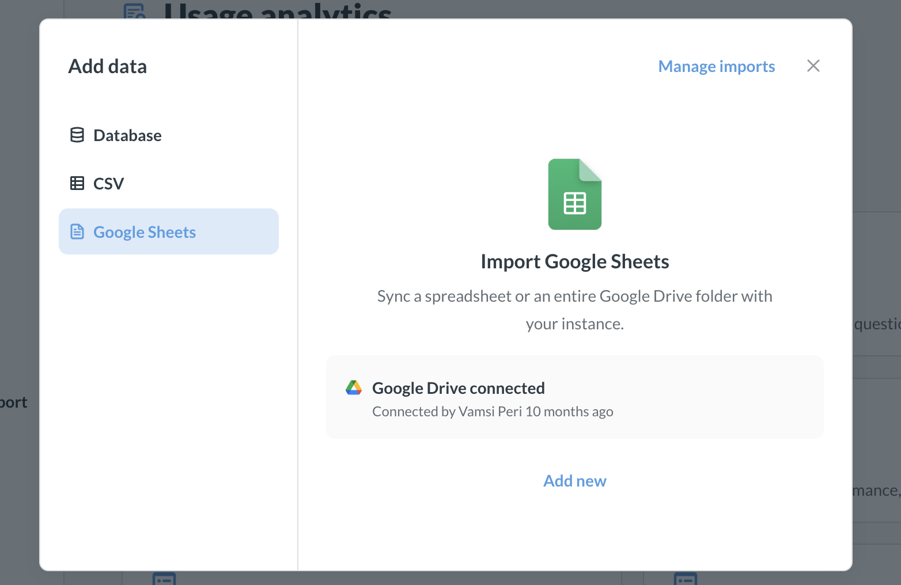

# Sync Google Sheets with Metabase

If you've set up [Metabase Cloud Storage](./storage), an admin can set up Metabase to sync with Google Sheets in a Google Drive folder.

## How to sync Google Sheets with Metabase

An admin can set up Metabase to sync with a single folder in your Google Drive. Metabase will sync all Google Sheets files saved in this folder, refreshing the data automatically every 15 minutes. Here's how to set it up:

1. In the left nav sidebar, click **Add Data** -> **Google Sheets**.
2. Metabase will ask you to share the Google Drive folder that contains your Google Sheets. You can only share a single folder with Metabase at a time, so you'll need to move any sheets you want to sync to Metabase into that folder.
3. In Google Drive, share the folder with the service account that Metabase gives you.
4. Give the service account **Viewer** permissions. Metabase will only have access to this folder; it won't have access to any other files on your Google Drive.
5. Click **Send** to share the folder with the Metabase service account.

Metabase will sync with the Google Drive folder (and its subfolders) and import all Google Sheets, creating a new table in your Metabase Cloud Storage database for each sheet. For sheets with multiple tabs, Metabase will create a table for each tab.

Metabase will _only_ sync Google Sheets; it'll ignore other file types in the folder. After the initial sync, Metabase will sync every 15 minutes.

You can find your synced Google Sheets in Metabase by clicking on **Databases** in the left nav sidebar, and navigating to the Metabase Cloud Storage database.

## Disconnecting from Google Drive folder

To disconnect your Google Drive connection:

1. Go to **Databases** in the left nav sidebar.
2. Click on Metabase Cloud Storage.
3. Click on **Disconnect**.
4. Confirm the disconnection.

Disconnecting won't delete your existing tables. An admin will need to manually delete tables in [Uploads settings](/docs/latest/databases/uploads#deleting-tables-created-by-uploads).

## Deleting sheets

Disconnecting from the Google Drive folder won't delete your imported sheets. Admins will need to delete these tables manually in [Uploads settings](/docs/latest/databases/uploads#deleting-tables-created-by-uploads).

## Changing the Google Drive folder

To change the Google Drive folder, you'll need to first [disconnect the current folder](#disconnecting-from-google-drive-folder), then [connect a new folder](#how-to-sync-google-sheets-with-metabase).

If you change the sync folder, Metabase will:

- Keep the tables from the previous folder
- Stop updating those tables
- Start syncing with the new folder

If you want to delete the tables from the old folder, admins will need to delete them manually in [Uploads settings](/docs/latest/databases/uploads#deleting-tables-created-by-uploads).

## Limitations and gotchas

Here's what you need to know when syncing Google Sheets:

- **Only Google Sheets are synced**. We can only import Google Sheets format files — other file types like CSVs or Parquet files won't work, even if they're in your Google Drive folder.
- **Column header handling**. If we run into any issues with column headers (like empty headers or duplicate names), we'll treat that row as data and use generic names like Col1, Col2 instead.
- **Special character replacement**. Some characters just don't play nice with databases (like "?"). When we find these in column names, we'll replace them with "x" to keep things running smoothly.
- **Renamed files will create new tables**. If you rename files in your folder or tabs in your sheets, we'll treat them as brand new tables and import them fresh.
- **New columns sync automatically**. Adding new columns to your sheets? No problem — they'll show up in Metabase as expected.
- **Deleted columns persist**. If you delete columns from your original files, we'll keep the old columns around in Metabase. (Just something to be aware of!)
- **Empty sheets won't import**. We won't import completely empty sheets or sheets that only have column headers. There needs to be some actual data in there.
- **Google Sheets must have unique names**. If files in the synced Google Drive folder (and its subfolders) have the same name (e.g., one sheet is in the root folder, another sheet in a subfolder), the sheets might not sync properly.

## Storage quota management

The data from your Google sheets counts toward your Storage quota. You can check how much quota you're using in Admin Settings → License and Billing. The quota numbers update every 6 hours, so there might be a bit of a delay. We start everyone off with room for 500K rows, but if you need more space, just email our support team. Once you hit your quota limit, you won't be able to upload more data until you free up some space.
