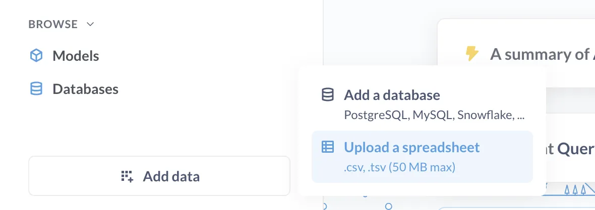

# Metabase Cloud Storage

If you have data stored in spreadsheets, and you don't have a data warehouse, Metabase Cloud Storage has you covered.

## How Metabase Cloud Storage works

Metabase Cloud Storage is a feature you can add on to your Metabase Cloud plan (and it's only available for plans on Metabase Cloud).

Once added, you'll see an **Add data** bar in the left navigation bar. Click on it and select **Upload a spreadsheet**.

You can upload a `.csv` or `.tsv` file.

Learn more about [uploads](/docs/latest/exploration-and-organization/uploads).

### Metabase Cloud Storage uses ClickHouse

Under the hood, Metabase Cloud Storage uses [ClickHouse](/data-sources/click-house) to store your data.

### Writing SQL queries on data stored in Metabase Cloud Storage

For the SQL dialect supported by ClickHouse, check out [ClickHouse's SQL reference](https://clickhouse.com/docs/en/sql-reference).

## How to get Metabase Cloud Storage

How you set up Metabase Cloud storage depends on whether you already have a Metabase Cloud instance.

### New cloud customers

New customers can sign up for a [Metabase Cloud instance with storage](https://store.metabase.com/checkout?dwh=1).

### Existing cloud customers

Current customers can [contact us](mailto:help@metabase.com) to get Metabase storage added to their Metabase.

## Metabase Cloud Storage pricing

Pricing depends on how much data you need to store. See the section on Storage on our [pricing page](/pricing/).

## Syncing Google Sheets with Metabase

If you set up Metabase Cloud Storage, you can [sync Google Sheets with your Metabase](./google-sheets).
