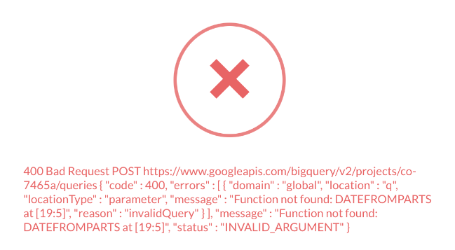

# Troubleshooting error messages

An error message can help you find the right troubleshooting guide. The exact wording depends on your database and Metabase version, so try to look for the closest match.

## SQL editor

See if your error details contain any of:

- [Table or column "not found" or "not recognized"](/learn/sql/debugging-sql/sql-syntax#column-or-table-name-is-not-found-or-not-recognized).
- [Function does not exist](/learn/sql/debugging-sql/sql-syntax#sql-function-does-not-exist).
- [Permission denied](./data-permissions#getting-a-permission-denied-error-message).

For example, this SQL error tells you that the function `DATEFROMPARTS` does not work on a BigQuery database:

## Questions and dashboards

- [Your question took too long](./timeout).
- [Still waiting...](./my-dashboard-is-slow).

## Are you still stuck?

If you can't find your error on this page:

- Search or ask the [Metabase community](https://discourse.metabase.com/).
- Search for [known bugs or limitations](./known-issues).
