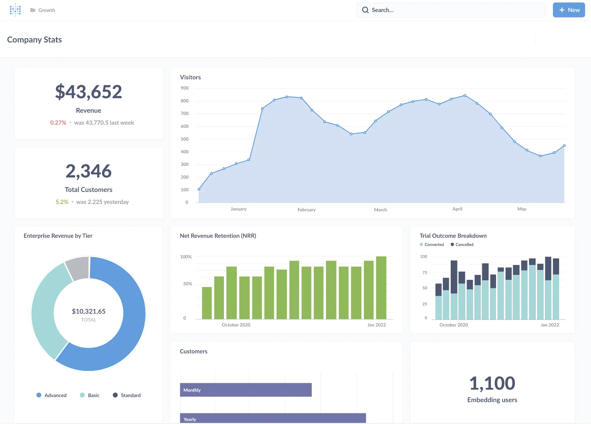

# Metabase documentation

Metabase is an open-source business intelligence platform. You can use Metabase to ask questions about your data, or embed Metabase in your app to let your customers explore their data on their own.

## First steps

### [Installing Metabase](./installation-and-operation/installing-metabase)

Run as a JAR, using Docker, or on Metabase Cloud.

### [Setting up Metabase](./configuring-metabase/setting-up-metabase)

Once installed, set up your Metabase and connect to your data.

### [Getting started](/learn/getting-started/getting-started)

With your data connected, get started asking questions, creating dashboards, and sharing your work.

### [A tour of Metabase](/learn/getting-started/tour-of-metabase)

Metabase is a deep product with a lot of tools to simplify business intelligence, from embeddable charts and interactive dashboards, to GUI and SQL editors, to auditing and data sandboxing, and more.

## Documentation topics

Metabase's reference documentation.

### Installation

- [Installation overview](./installation-and-operation/start)
- [Installing Metabase](./installation-and-operation/installing-metabase)
- [Upgrading Metabase](./installation-and-operation/upgrading-metabase)
- [Configuring the Metabase application database](./installation-and-operation/configuring-application-database)
- [Backing up Metabase](./installation-and-operation/backing-up-metabase-application-data)
- [Migrating to a production application database](./installation-and-operation/migrating-from-h2)
- [Java versions](./installation-and-operation/java-versions)
- [Monitoring your Metabase](./installation-and-operation/monitoring-metabase)
- [Serialization](./installation-and-operation/serialization)
- [Supported browsers](./installation-and-operation/supported-browsers)
- [Privacy](./installation-and-operation/privacy)

### Databases

- [Databases overview](./databases/start)
- [Adding and managing databases](./databases/connecting)
- [Database users, roles, and privileges](./databases/users-roles-privileges)
- [Syncing and scanning databases](./databases/sync-scan)
- [Encrypting your database connection](./databases/encrypting-details-at-rest)
- [SSH tunneling](./databases/ssh-tunnel)
- [SSL certificate](./databases/ssl-certificates)

### Questions

- [Questions overview](./questions/start)

#### Query builder

- [Asking questions](./questions/query-builder/introduction)
- [Visualizing data](./questions/sharing/visualizing-results)
- [Custom expressions](./questions/query-builder/expressions)
- [List of expressions](./questions/query-builder/expressions-list)
- [Joining data](./questions/query-builder/join)

#### SQL and native queries

- [The SQL editor](./questions/native-editor/writing-sql)
- [SQL parameters](./questions/native-editor/sql-parameters)
- [Referencing models and saved questions](./questions/native-editor/referencing-saved-questions-in-queries)
- [SQL snippets](./questions/native-editor/sql-snippets)
- [SQL snippet folder permissions](./permissions/snippets)

#### Sharing

- [Sharing answers](./questions/sharing/answers)
- [Alerts](./questions/sharing/alerts)
- [Public sharing](./questions/sharing/public-links)

### Dashboards

- [Dashboards overview](./dashboards/start)
- [Introduction to dashboards](./dashboards/introduction)
- [Dashboard filters](./dashboards/filters)
- [Interactive dashboards](./dashboards/interactive)
- [Charts with multiple series](./dashboards/multiple-series)
- [Dashboard subscriptions](./dashboards/subscriptions)
- [Actions on dashboards](./dashboards/actions)

### Data modeling

- [Data modeling overview](./data-modeling/start)
- [Models](./data-modeling/models)
- [Data model admin settings](./data-modeling/metadata-editing)
- [Field types](./data-modeling/field-types)
- [Formatting defaults](./data-modeling/formatting)
- [Segments and metrics](./data-modeling/segments-and-metrics)

### Actions

- [Actions overview](./actions/start)
- [Introduction to actions](./actions/introduction)
- [Basic actions](./actions/basic)
- [Custom actions](./actions/custom)

### Organization

- [Organization overview](./exploration-and-organization/start)
- [Basic exploration](./exploration-and-organization/exploration)
- [Collections](./exploration-and-organization/collections)
- [History](./exploration-and-organization/history)
- [Data reference](./exploration-and-organization/data-model-reference)
- [Events and timelines](./exploration-and-organization/events-and-timelines)
- [X-rays](./exploration-and-organization/x-rays)

### People

- [People overview](./people-and-groups/start)
- [Account settings](./people-and-groups/account-settings)
- [Managing people and groups](./people-and-groups/managing)
- [Password complexity](./people-and-groups/changing-password-complexity)
- [Session expiration](./people-and-groups/changing-session-expiration)
- [Google Sign-In or LDAP](./people-and-groups/google-and-ldap)

#### Paid SSO options

- [JWT-based authentication](./people-and-groups/authenticating-with-jwt)
- [SAML-based authentication](./people-and-groups/authenticating-with-saml)
  - [SAML with Auth0](./people-and-groups/saml-auth0)
  - [SAML with Azure AD](./people-and-groups/saml-azure)
  - [SAML with Google](./people-and-groups/saml-google)
  - [SAML with Keycloak](./people-and-groups/saml-keycloak)
  - [SAML with Okta](./people-and-groups/saml-okta)

### Permissions

- [Permissions overview](./permissions/start)
- [Permissions introduction](./permissions/introduction)
- [Data permissions](./permissions/data)
- [Collection permissions](./permissions/collections)
- [Application permissions](./permissions/application)
- [Data sandboxes](./permissions/data-sandboxes)
- [Data sandbox examples](./permissions/data-sandbox-examples)
- [SQL snippets folder permissions](./permissions/snippets)

### Embedding

- [Embedding overview](./embedding/start)
- [Embedding introduction](./embedding/introduction)
- [Full-app embedding](./embedding/full-app-embedding)
- [Signed embedding](./embedding/signed-embedding)
- [Parameters for signed embeds](./embedding/signed-embedding-parameters)

### Configuration

- [Configuration overview](./configuring-metabase/start)
- [Setting up Metabase](./configuring-metabase/setting-up-metabase)
- [General settings](./configuring-metabase/settings)
- [Email](./configuring-metabase/email)
- [Slack](./configuring-metabase/slack)
- [Environment variables](./configuring-metabase/environment-variables)
- [Configuration file](./configuring-metabase/config-file)
- [Metabase log configuration](./configuring-metabase/log-configuration)
- [Timezones](./configuring-metabase/timezones)
- [Languages and localization](./configuring-metabase/localization)
- [Appearance](./configuring-metabase/appearance)
- [Caching query results](./configuring-metabase/caching)
- [Custom maps](./configuring-metabase/custom-maps)
- [Customizing the Metabase Jetty webserver](./configuring-metabase/customizing-jetty-webserver)

### Tools

- [Tools overview](./usage-and-performance-tools/start)
- [Auditing tools](./usage-and-performance-tools/audit)
- [Admin tools](./usage-and-performance-tools/tools)

### Cloud

- [Documentation for Metabase Cloud and Store](/docs/latest/cloud/start)

### Metabase API

- [Metabase API documentation](./api-documentation)
- [API tutorial](/learn/administration/metabase-api)

### Troubleshooting

- [Troubleshooting guides](./troubleshooting-guide/index)

### Developer guide

- [Developer guide](./developers-guide/start)

### Paid features

Some Metabase plans offer [additional features](./paid-features/start).

## Getting help

### Troubleshooting

- [Troubleshooting guides](troubleshooting-guide/index)
- [Metabase forum](https://discourse.metabase.com/)
- [Configuring logging](./configuring-metabase/log-configuration)

### Tutorials and guides

[Learn Metabase](/learn) has a ton of articles on how to use Metabase, data best practices, and more.

## More resources

### [Discussion](https://discourse.metabase.com)

Share and connect with other Metabasers.

### [Metabase Cloud](/cloud/docs)

For docs specific to Metabase Cloud plans.

### [Community stories](/community)

Practical advice from our community.

### [Metabase blog](/blog)

News, updates, and ideas.

### [Customers](/case-studies)

Real companies, real data, real stories.

### [Metabase Twitter](https://twitter.com/metabase)

We tweet stuff.

### [Source code repository on GitHub](https://github.com/metabase/metabase)

Follow us on GitHub.

### [List of releases](./releases)

A list of all Metabase releases, including both the Enterprise Edition and the Open Source Edition.

### [Developers guide](./developers-guide/start)

Contribute to the Metabase open source project!

### [Data and Business Intelligence Glossary](/glossary)

Data jargon explained.

### [Metabase Experts](/partners)

If you’d like more technical resources to set up your data stack with Metabase, connect with a [Metabase Expert](/partners).

