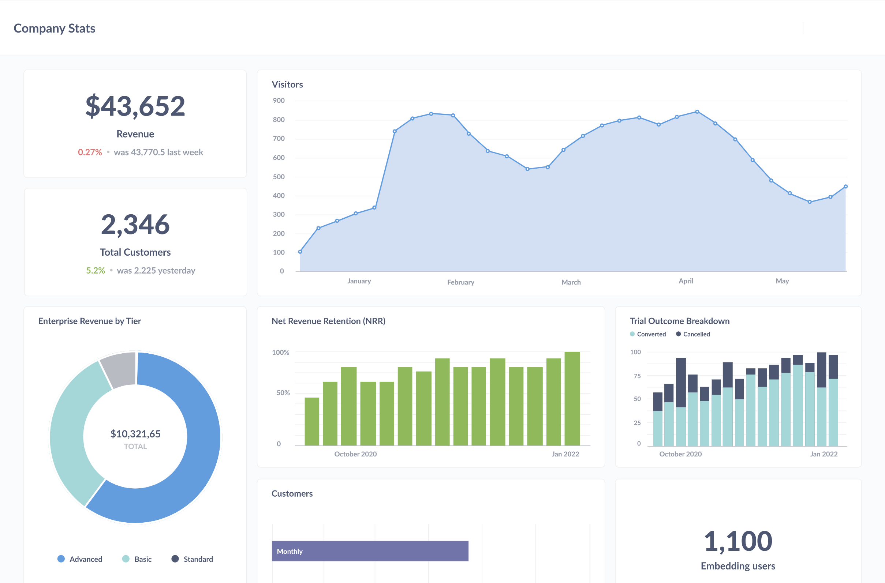

# Dashboards overview

## [Introduction to dashboards](./introduction)

Learn how to arrange tables, charts, and text cards on a dashboard.

## [Dashboard filters](./filters)

Add filters to dashboards to update tables and charts.

## [Interactive dashboards](./interactive)

Customize what happens when people click on a chart in your dashboard.

## [Charts with multiple series](./multiple-series)

Combine multiple questions on a single chart.

## [Dashboard subscriptions](./subscriptions)

Set up a dashboard to email or Slack its results on a schedule.

## [Actions on dashboards](./actions)

Add action buttons to dashboards.
