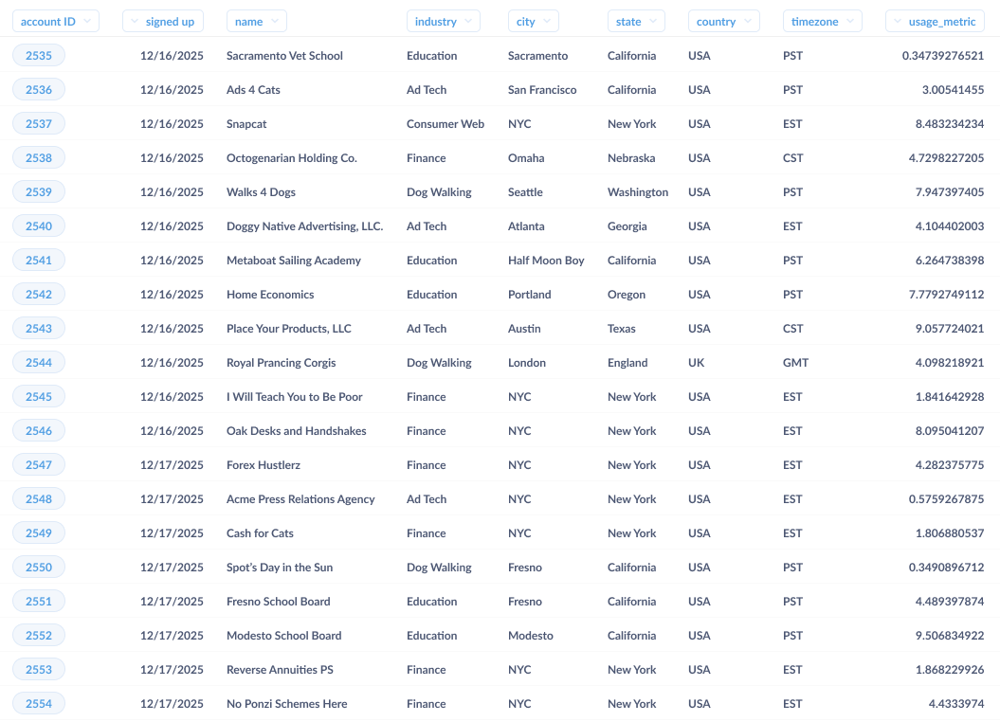
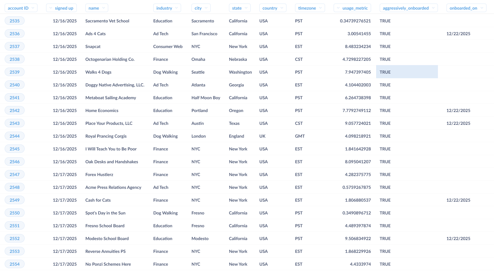
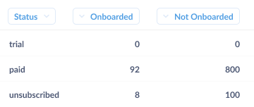
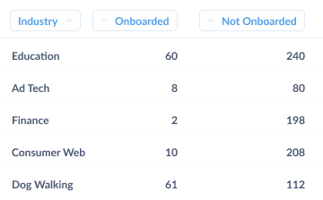
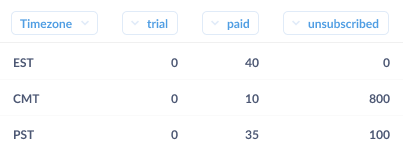
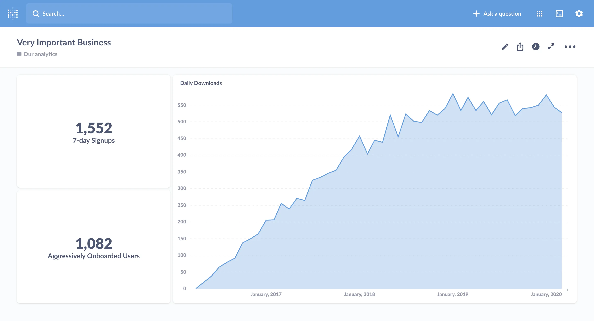
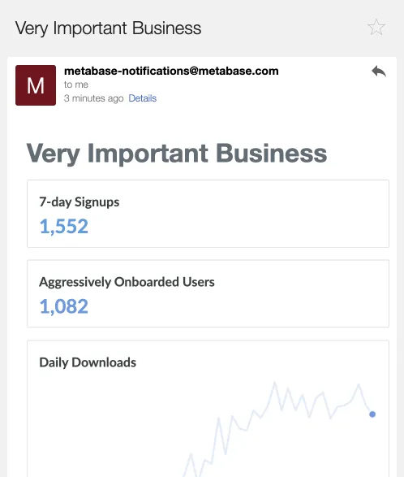

Many companies starting out on their analytics journey are unsure how to create and nurture a data-driven culture. Whether you include Metabase as part of your data stack or not, we'll discuss how you can go about fostering a culture that uses data to inform its decisions.

There are two main ways to get data into the hands of people making decisions:

- _Pushing_ important data to people.
- Or letting people choose which data (and when) to _pull_ on their own.

To make the most of the data your organization collects, you'll need to do both.

## Pulling data

For decisions localized to a team, we should allow the team responsible for making those decisions to pull information related to those decisions. Consider this example:

- _Context:_ New accounts on a SaaS product are currently being onboarded through a series of emails describing product features. However, the churn rate for new accounts is ~15% in their first month.

- _The decision:_ To reduce this churn, the customer success team decides to proactively onboard 10% of new customers rather than reach out to them when they see an account is inactive a week later.

- _The criteria for success:_ A reduction in churn rate after a month.

Given this scenario, what do we, the company, need to set up so that the customer success team can make and evaluate this decision in a data-driven fashion?

Firstly, there needs to be a way for the customer success team to pull up a list of new customers for a given time period. While this sounds obvious, unless we've anticipated this reporting need during product development, we'd need to either ask an analyst to get us the list of new customers at the start of every week, or add a new report to the set of reports available in our product's administration tools. Now our heroic team can pull up something like this list of accounts below whenever they need to:

Next, we need to pick the 10% sample to use for our high-touch, onboarding experiment. We should resist the temptation to pick the first 10, or otherwise bias the sample, and we should make it possible (and ideally friction free) to get a sample that isn't weighted towards the location, size, or other key attribute of our new accounts. If available, some help from an analyst or statistically minded person would be valuable here in generating this sampling process and populating a table for the customer success team to use. At this point, we should be able to pull a table that looks more like this:

Now we have a list of customers that can be onboarded. Let's fast-forward a few months into the future, and examine what the customer success team will require to understand how this decision played out.

First off, let's see how well the overall program did. For this, we'll need to define what churn is, then calculate the churn in the sample that was aggressively onboarded. For defining churn, we'll assume the easiest scenario, where we have a distinct "unsubscribed" status for user accounts. All we'd need to do is ask a question to tally up the number of accounts by status and onboarding type.

In an ideal world, our churn rate would plummet to 0%, but experiments rarely work out like that. Most of the time the result of experiments like this one would be something like "well…it sort of worked." Typically, onboarding will have worked really well in some cases, but not others (e.g., in the example below you'll see that aggressive onboarding worked really well for accounts from the finance industry, but not at all for ones in education). Taking a look below, you'll note that 30% of the educational account churned after being aggressively onboarded, while only 1% of finance accounts churned.

But we shouldn't stop there. As a SaaS company, net churn is a make-or-break metric, and we should strive to understand what moves that number up or down. In our fully data-driven organization, the customer success team itself would be able to dig deeper on its own, pairing its understanding of our accounts with the insights from our BI tools to drill into the core underlying dynamic.

By drilling into the accounts, our plucky team member notices that the core problem is that 90% of the education accounts were on the west coast, while 75% of the finance accounts were in New York City (and the same time zone as the company). By setting up the onboarding sessions too early in the morning (6 a.m.--9 a.m. PST), we were forcing the poor school administrators to sit through an onboarding session before their coffee had kicked in. They quickly saw the wisdom in sleeping in, and running all west coast onboarding in the late afternoon. Churn overall plummeted; the decision (and follow up revision) saved the day.

Let's take a pause here and recap what a good affordance for pulling information in a company looks like. First off, we massaged the data into a format that gave meaningful information to our customer success team. Practically, this means that we designed the underlying structure of information with the use case of analysis in mind. We might have had to trade off some transactional requirements to make this data suitable for analysis, traded off with transactional requirements, or transformed our operational data to make it easier to analyze. While it's tempting to try to get every team to understand the underlying schema or learn SQL, we'll be a lot better off if we organize our data in a way that looks good in a spreadsheet.

Second, the point of allowing for pulls is to create a culture of bottom-up, data-driven decision making. If we can set it up so that the people closest to a decision are able to ask and answer their own questions on their own operational cadence, we can build an organization that can respond quickly to changing business needs. Not only is this faster than having the questions punted to a dedicated analyst pool, but the self-serve nature allows for data to permeate all the little nooks and crannies of our company---including interactions with customers, partners, and vendors.

## Pushing Data

Let's flip back to the other end of the org chart and talk about how to push data through a company.

The goal of pushing data is to make sure that everyone in a team or company is aware of a set of core numbers or data points. While we use the term "push" here, we're not necessarily referring to the medium used to deliver the information. What we mean is that companies need to complement the decentralized "pull" system (where everyone can look up whatever data they want) by determining a set of core metrics that define how they will measure their business.

As a rule, less is more: the fewer distinct points of data that we try to push to people, the more likely people are to digest them---and the less confusion there will be about what's actually important.

In many companies, this centrally determined set of information is called Key Performance Indicators (KPIs), core metrics, or something else that sounds official. These metrics indicate the outcomes the business should be managed against. The more closely tied these metrics are to desired business outcomes, the better. Ideally, we should formulate these numbers such that they can be managed, meaning that everyone who gets the numbers can take action (or kick off action) to change these numbers. Additionally, there are often a set of metrics (internal or external) that represent the environment the company is operating in. Despite not being things the company can control, they do guide overall behavior, and are prime candidates for pushes. An example would be a financial firm getting a quick summary of overnight activity in other timezones to prepare for their day each morning.

One key for good core metrics here is to resist the temptation to include metrics that make us feel good in place of metrics that let us know how we're doing. While it's easy to get caught up in the mythology of successful companies that never hit air pockets en route to greatness, the faster we realize some facet of the business isn't working, the faster we'll be able to correct it.

As a concrete example, let's go back to our imaginary SaaS business. It would be tempting to measure the overall success of our company by the total number of accounts, but---while it's nice to see big numbers that almost always increase---this grand total makes it hard to fully understand how fast the user base is growing or shrinking. A better number would be the change in the number of accounts, or the percentage growth during the previous time period. Changes in growth that would be washed out in an overall account total suddenly become clear.

## When to push data

It's important to match the frequency of pushing a metric with the cadence of the decision-making that metric informs. If we're managing a number through actions that take a week to plan and execute, getting a ping about it every hour is more likely to distract us, or cause us to thrash, than it is to aid productive decision-making. It's also useful to take into account the natural period of the number in question.

If we're talking about churn of accounts, any actions the customer success team takes won't affect the churn rate for days or weeks. Additionally, churn has a natural periodicity: people will mainly cancel or fail to renew at the end of a 30-day trial period. In this case, it makes sense to look at churn on a weekly or even monthly basis. If we do need to take immediate action on terminated accounts, instead of pushing a metric, we should incorporate that action into the termination workflow.

## How to push data

There are three main ways to push information through an organization. The most old school, but still useful due to the gravity it imparts, is getting in front of people and reading numbers off a deck. All-hands, sales kickoffs, analyst calls: all are occasions when we can deliver a small set of information in a low bandwidth but heavy fashion.

While they're not strictly "pushes", [dashboards](/glossary/dashboard) are another place to collect metrics. They're often a good thing to check when getting up-to-speed on what happened in the previous day, week, or other time period. While dashboards can be abused, and require some amount of maintenance, they provide a key place to get the current set of numbers.

Finally, a staple of pushing is literally that: pushing information to people's inboxes, channel, etc. An email everyone can check first thing in the morning, or just one on Mondays, is super useful for getting the most important numbers out and in front of people. And we should make sure the numbers are important: it's easy to create an email that no one opens, which defeats the entire purpose of the exercise.

Here more than elsewhere it's vital to remember the golden law of pushing data: only push data that changes behavior in some way. Attention is a scarce commodity, especially in push channels, and we should focus on giving people starting points that prompt those with the ability to alter a number to take action.

## Putting it all together

Now that we've discussed them separately, let's talk about how the two means of getting data into teammates' hands fit together.

We can be much more effective with pushing data if we establish a truly open and accessible way for everyone to pull the rest of the information they need to do better work. If we can provide tooling that makes it easy for folks to drill into and dissect the metrics that arrive in their inboxes, we don't need to overload our emails with every possible sub-metric of a KPI. Similarly, for projects with a natural start and stop, if we can make it easy for a team to pull useful information---and push it to themselves for the duration of the project---the team won't need outside help to keep tabs on how their decisions are faring.
