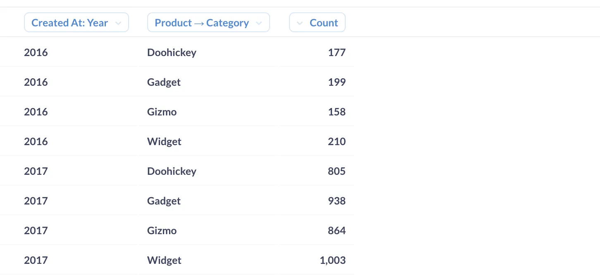
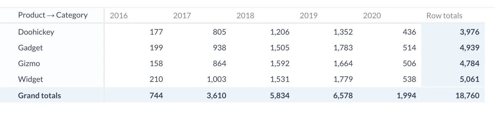

A data cube is a [schema](/glossary/schema) that's optimized for analytical queries. They consist of [metrics](/glossary/metric) (computations like a count of orders) that have one or more commonly accessed [dimensions](/learn/grow-your-data-skills/data-fundamentals/dimensions-and-measures#dimensions-the-who-what-where-and-when-of-your-data). Those metrics are precomputed, meaning some job in your database takes raw data, does these computations, and creates a new table to store the results so people can query the results instead of querying and computing them from scratch every time.

When you aggregate data according to some [measure](/learn/grow-your-data-skills/data-fundamentals/dimensions-and-measures#measures-numerical-fields-that-you-can-compute), you can imagine that you're stacking several tables on top of one another, with the result looking a bit like a cube. This cube metaphor is apt but only gets us so far — in reality, most multidimensional data has far more than three dimensions. Sometimes you'll hear this concept referred to as a **hypercube** or an **OLAP cube**, given its use in analytical queries.

Data cubes arrange relevant information together, like storing sales of specific products at different store locations over some period of time. This makes for more flexible analysis, like identifying trends about a specific product or evaluating store performance. When your data is structured in cube form, much of the legwork for complex OLAP queries is precalculated, meaning those queries can be executed much faster than if these tables were all stored separately.

## Are data cubes outdated?

Data cubes became popular in the 1990s, when computing power and memory were at a premium. At the time, executing complex analytical queries would cause major strain on systems, and aggregating and caching these frequently accessed metrics made a lot of sense.

In recent years however, the rise of data warehouses, columnar storage, and cheaper, more powerful computers has led to a paradigm shift in the analytics world: the focus on optimizing for analytics speed has given way to prioritizing the usability of a dataset, and making sure that data is formatted in a way that makes querying and exploration easier.

So yes, data cubes have fallen out of favor, but you'll probably still encounter the concept and data cube operations at some point if you're working with databases.

## Data cube operations in Metabase

To give you an overview of typical data cube operations, we'll use Metabase's [Sample Database](/glossary/sample_database) to slice, dice, pivot, drill down, and roll up on an approximation of a data cube. We'll start by asking a question of our `Orders` table, to see a count of orders grouped by product category and the year the order was created.

It's important to know that Metabase doesn't _transform_ your linked tables into a data cube, but if your data is already in cube structure, Metabase will understand those cubes no problem.

Either way, Metabase can perform similar operations as you would on a cube in your database software, like we'll demonstrate below. However, if your data wasn’t already configured in a cube when you added your data source, performing these similar operations in Metabase won't make these processes run any faster. In this sense, Metabase helps with organization and makes these operations easy to execute, but their performance still depends on your underlying database.

### Slice and dice

Taking a _slice_ of a data cube refers to separating out one table to analyze data according to a single dimension. This is basically the inverse of creating this cube, but you can take slices from any angle of your cube.

Similar to a slice, _dicing_ a data cube lets us zoom in on the values of a particular subset of our data, like carving out a smaller cube to get a closer look at more than one dimension.

In Metabase, slicing and dicing are accomplished through filters, which narrow our results according to a specific dimension. Below, we've filtered our same table from above to only include the count of orders with the product category Doohickey — an example of a slice.

A dice operation would look similar but would include multiple dimensions, like if we wanted to see orders that included Gizmos in 2016 and 2017:

### Pivot

_Pivoting_ our cube allows us to view it from a different angle and give us the chance to swap the fields that make up our rows and columns. Here the subtotals are not precalculated; Metabase does that math on the fly.

### Drill down

Performing a _drill down_ operation gives us a more granular view of any given dimension. We can drill down (also known as [drill through](/learn/metabase-basics/querying-and-dashboards/questions/drill-through)) on our data in Metabase by breaking it out by one or more dimensions, like if we wanted to see orders by product category _and_ product vendor.

### Roll up

_Rolling up_ operations provide aggregate amounts along a given dimension of a data cube. In Metabase, this is done through [summarizing](/docs/latest/questions/query-builder/summarizing-and-grouping).
