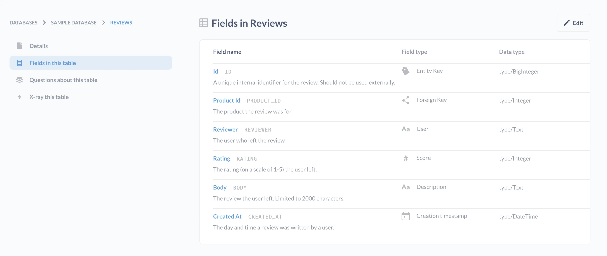

_Data types_ tell your database what kind of data it should expect in each column. Think of data types as a field's classification—each field can only have one data type, and that data type might be a kind of number, text, boolean, or timestamp.

Different databases support different sets of data types — this guide covers some of the most common.

## Examples of data types

- **String Types** (TEXT, CHAR, VCHAR, etc.) - In the world of technology, snippets of text are referred to as “strings.” (You’ve probably heard of a “string of text” before.) Strings can contain numbers and special characters in addition to letters. These fields store things like names, addresses, or anything else that is text.

- **Numerical Types** (Integer, Float, DoubleFloat, Decimal, etc.) - These fields store numbers. Integers are whole numbers; floats and decimals are ways to store numbers with decimals in them. Numerical types store things like ages, bank account balances, costs, latitudes, and longitudes.

- **Temporal Types** (Timestamp, Date, Time etc.) - These fields are a special format used to store dates and times (or both), called “timestamps.” Sometimes timestamps are stored in an integer, called an Epoch UNIX Timestamp.

- **Boolean Types** - A value in these fields can be one of two options, usually `TRUE` or `FALSE`. Not all databases support boolean types.

A field may return `null` if it lacks a value entirely. `Null` doesn't mean that a value is zero, rather that it is unknown and not listed.

In Metabase, you can view the data type of a field by navigating to the [Data Browser](/learn/metabase-basics/getting-started/data-browser), selecting the gray **book icon** next to a table to access the [Data Reference page](/learn/metabase-basics/querying-and-dashboards/data-browser#data-reference-pages), and clicking on **Fields in this table** in the left sidebar. Data types for each field are listed in the third column.

### A note about IDs

Your database most likely has one or more ID fields that act as [primary](/glossary/entity_key) or [foreign keys](/glossary/foreign_key) linking tables to each other. While these fields are important, "ID" itself is not a data type.

For example, your `PRODUCT_ID` field may be an integer or a string, as it could be made up of numbers or a combination of numbers and letters.

## Metadata

As the name suggests, _metadata_ is data that describes other data. In other words, it's information that tells you about the data found in your database. For example, we could label a column that looks like just a bunch of numbers with the label "latitude," which would give that column additional meaning and context.

In Metabase, [administrators can edit](/docs/latest/administration-guide/03-metadata-editing) field display names, descriptions, and semantic types (also known as field types) to give their users additional context about the purpose of each field and indicate to Metabase how different fields should be intepreted.

### Semantic types

While data types tell your database what kind of values to expect in a field, **semantic types** indicate the _meaning_ of a field. You may have several fields in your database with the data type `type/text`, but not all text fields have the same meaning or purpose. Semantic types are essential to building relationships between tables.

In Metabase, semantic types are known as [field types](/docs/latest/users-guide/field-types), and play an important role in telling Metabase how to interpret each column. Correctly categorizing your field types makes it possible for Metabase to determine what [chart type](/learn/metabase-basics/querying-and-dashboards/visualization/chart-guide) to show you, create [maps](/docs/latest/questions/visualizations/map#pin-map) based on location information, or display URLs as links.
