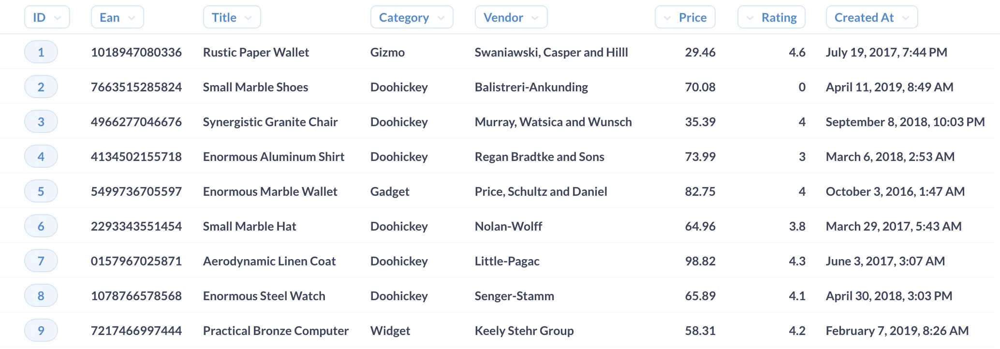
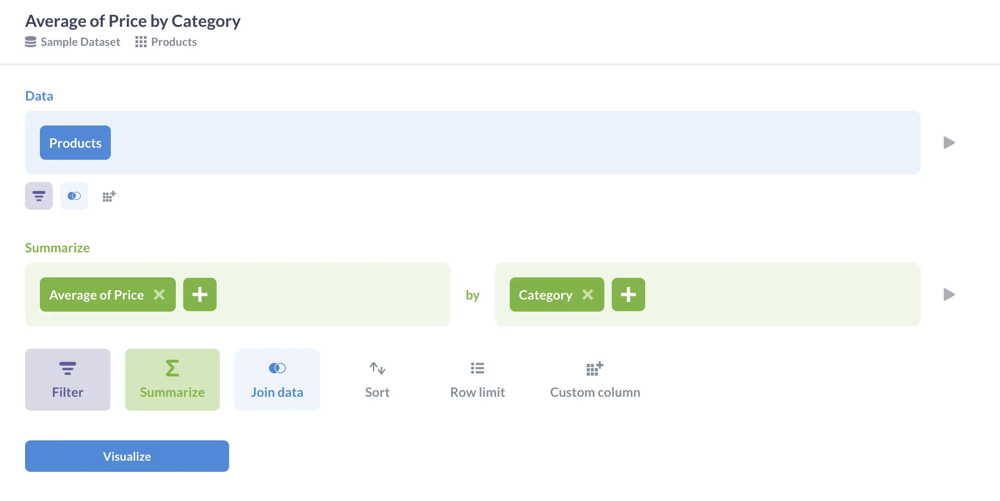
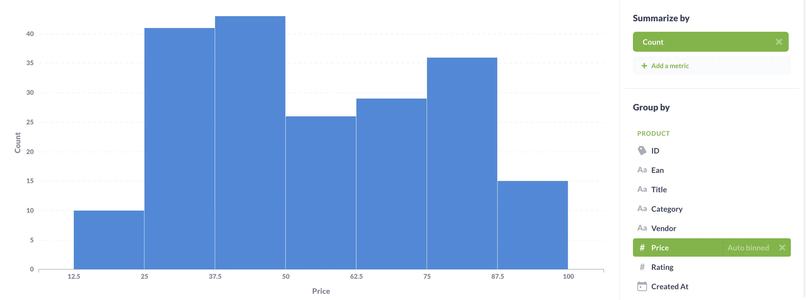
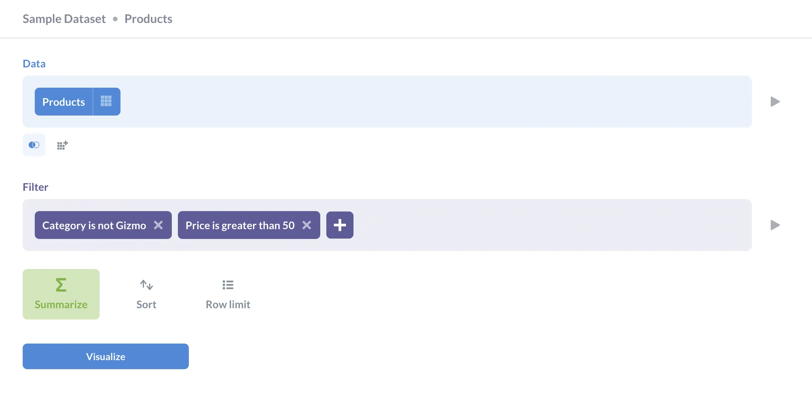

As we covered in our [overview](database-basics), a typical database is made up of tables, comprised of rows and columns. Based on their [data type](data-types-overview), those columns (or fields) contain either qualitative or quantitative information. _Dimensions_ and _measures_ are concepts that help us differentiate what sort of values are stored in a field, and in turn dictate what we can do with those fields.

Looking at your data in table form will only get you so far; at some point you'll need to run queries or execute operations that make your data more useful, like showing you patterns about the information stored in certain fields. This is where measures and dimensions come in.

## Dimensions: the who, what, where, and when of your data

Fields that contain qualitative information are **dimensions**. These are descriptive attributes, like a product category, customer address, or country. Dimensions can contain numeric characters (like an alphanumeric customer ID), but are not numeric _values_ (It wouldn't make sense to add up all the ID numbers in a column, for example).

Date fields are dimensions too, as it probably wouldn't helpful to calculate the sum of all years in which orders were placed. Instead, you'd likely want to group according to date. A date field is a dimension, but a duration field wouldn't be; there are valuable computations you can do with a duration field, like calculating the average amount of time in seconds that a person spends on your website.

Think of it this way: if you can't (or wouldn't) compute a field, it's a dimension. Numbers alone only tell part of the story, dimensions describe and add context.

Let's look at Metabase's Sample Database. If we select **Browse Data** and then the `Products` table, we're presented with information about our products in table form. This table contains eight columns.

To determine which of these fields are dimensions, consider which provide descriptive information about our products. We'll immediately notice that **Title**, **Category**, and **Vendor** are qualitative, in that they tell us something in words about our products. While they contain numbers, **ID**, **Ean**, and **Created At** are dimensions too, since those numbers aren't ones you'd want to compute.

## Measures: numerical fields that you can compute

**Measures** are quantifications — fields like order subtotal, quantity of items purchased, or duration spent on a specific page. Measures are therefore computable. Say you have a measure, quantity of items purchased: you can do things like calculate the average quantity ordered, sort by descending quantities, sum all quantities, and so on.

Let's look at the `Products` table again to determine which fields are measures. This is an easy one, as we've already figured that six of them are dimensions. That leaves us with **Price** and **Rating**, which makes sense, since calculating these fields could be valuable to our business. For example, we could compute the average rating that customers give our products.

At this point we've examined each field in this table, and determined which are dimensions and which are measures:

### Dimensions

- ID
- Ean
- Title
- Category
- Vendor
- Created At

### Measures

- Price
- Rating

## Using measures and dimensions in Metabase

When asking questons in Metabase, you can choose to [summarize](/docs/latest/questions/query-builder/summarizing-and-grouping) your data, [filter](/docs/latest/questions/query-builder/filters) it, or both.

### Summarizing by metric and group

The **summarize** function lets us ask for an encapsulation of our data according to some specific parameters, usually both a measure and dimension. Maybe we want to see the average price of products, [broken out](/glossary/breakout) by category. As we established above, the **Price** field is our measure, while **Category** is a dimension.

In short: if you're summarizing by a specific metric, the field you're choosing is a measure. If you summarize by a group, that field is usually a dimension. A _metric_, universally-speaking, refers to the type of quantitative operation you're performing on a given measure. They're the "how" of these summaries, whether that's an average, a standard deviation, or number of distinct values.

[Metrics](/docs/latest/data-modeling/metrics#creating-a-metric) in Metabase refer to saved computed numbers that you and your team want to use again and again. Admins can create and edit metrics so you don't have to recreate a calculated value like revenue every time you need to draw on revenue for a query.

Even though grouping typically involves dimension fields, you _can_ group by measure. If you do, Metabase will automatically divide those numerical values into bins that make the grouping more useful. We've grouped the `Products` table according to price (our measure), and Metabase bins those prices for us:

### Filtering measures and dimensions

You can filter your data according to either measures or dimensions in Metabase. Filters limit the results of your query according to a specific field. We've decided to filter the `Products` table, requesting that Metabase show us products that have a category other than Gizmo, with a price greater than \$50. In this query, we've filtered according to both a dimension and a measure.

In Metabase, [segments](/docs/latest/data-modeling/segments#creating-a-segment) are named filters that admins can create and save to be reused and referenced by all Metabase users within an organization. Segments encourage standardization and consistency for data analysis across teams; for example, you as an admin may create a segment that officially defines a certain group of customers or products.
