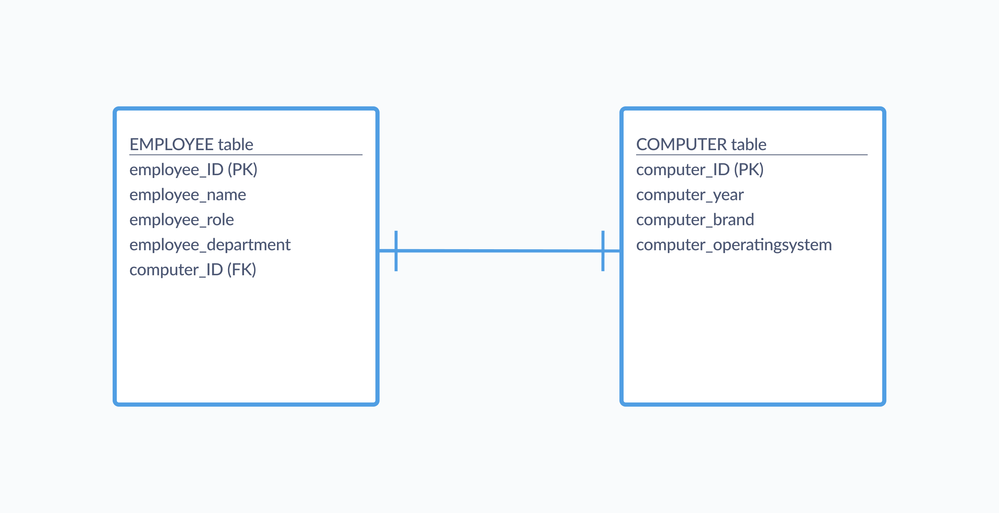
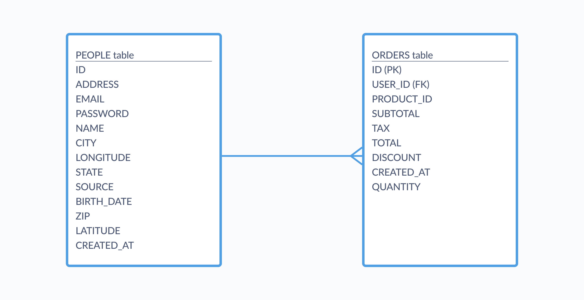
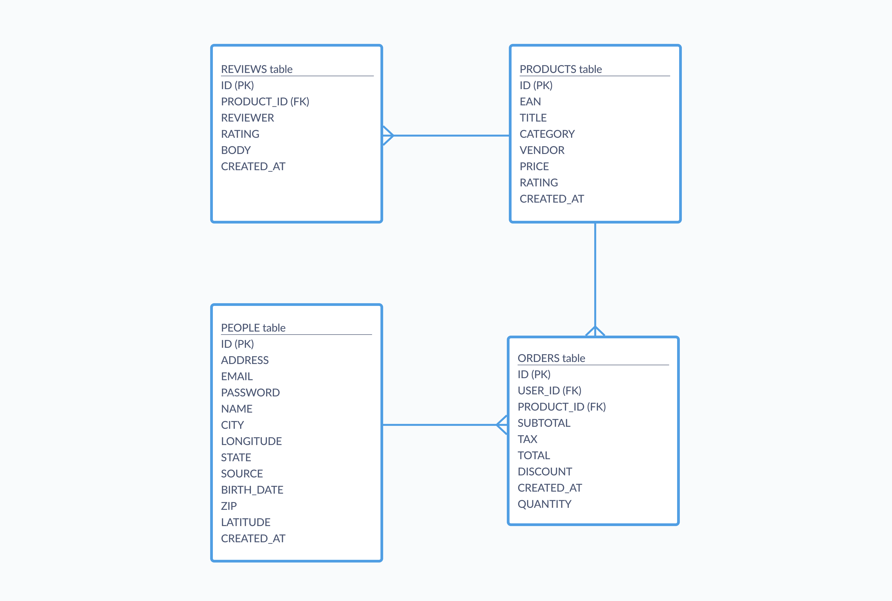

Relationships are meaningful associations between tables that contain related information — they're what make databases useful. Without some connection between tables in a database, you may as well be working with disparate spreadsheet files rather than a database system.

As we covered in our [short overview of databases](database-basics), databases are collections of tables, and those tables have fields (also known as columns). Every table contains a field known as an entity (or primary) key, which identifies the rows within that table. By telling your database that the key values in one table correspond to key values in another, you create a relationship between those tables; these relationships make it possible to run powerful queries across different tables in your database. When one table's entity key gets linked to a second table, it's known as a foreign key in that second table.

Identifying the connections you'll need between tables is part of the data modeling and schema design process — that is, the process of figuring out how your data fits together, and how exactly you should configure your tables and their fields. This process often involves creating a visual representation of tables and their relationships, known an [entity relationship diagram (ERD)](/glossary/erd), with different notations specifying the kinds of relationships. Those relationships between your tables can be:

- [One-to-one relationship](#one-to-one-relationship)
  - [Example one-to-one relationship](#example-one-to-one-relationship)
- [One-to-many relationship](#one-to-many-relationship)
  - [Example one-to-many relationship](#example-one-to-many-relationship)
- [Many-to-many relationship](#many-to-many-relationship)
- [Further reading](#further-reading)

Giving some thought to how your tables should relate to each other also helps ensure data integrity, data accuracy, and keeps redundant data to a minimum.

## One-to-one relationship

In a **one-to-one** relationship, a record in one table can correspond to only one record in another table (or in some cases, no records). One-to-one relationships aren't the most common, since in many cases you can store corresponding information in the same table. Whether you split up that information into multiple tables depends on your overall data model and design methodology; if you're keeping tables as narrowly-focused as possible (like in a [normalized database](/learn/grow-your-data-skills/data-fundamentals/normalization)), then you may find one-to-one relationships useful.

### Example one-to-one relationship

Let's say you're organizing employee information at your company, and you also want to keep track of each employee's computer. Since each employee only gets one computer and those computers are not shared between employees, you could add fields to your `Employee` table that hold information like the brand, year, and operating system of each computer. However, that can get messy from a semantic standpoint — does computer information _really_ belong in a table about employees? That's for you to decide, but another option is to create a `Computers` table with a one-to-one relationship to the `Employee` table, like in the diagram below:

In this case, the entity key from our `Employee` table serves as the foreign key for the `Computers` table. You may have computers that aren't yet assigned to employees, and this modeling ensures that you can still keep records for them the `Computer` table. And if an employee leaves the company, you'll only need to update one field, and you can easily link a computer to a new employee.

The exact formatting of the lines used to connect tables in an ERD (known as crow's foot notation) varies; sometimes you'll see plain lines indicating a one-to-one relationship, other times those lines will have crosshatches.

One-to-one relationships can be also useful for security purposes, like if you want to store sensitive customer information in a separate table, which you link to your main `Customers` table with a foreign key.

## One-to-many relationship

**One-to-many** relationships are the most common type of relationships between tables in a database. In a one-to-many (sometimes called many-to-one) relationship, a record in one table corresponds to zero, one, or many records in another table.

### Example one-to-many relationship

For example, think about tables for customers and their orders, like in Metabase's Sample Database, where one record from the `People` table can be linked to many records in the `Orders` table. In this case, one customer can place many orders, and those multiple order records will all link back to a single record in the `People` table. That connection is codified through the `User_ID` field, which is a primary key in the `People` table and a foreign key in the `Orders` table. The diagram below shows how these two tables relate to each other:

While the one person can be linked to many orders, the reverse is not true — orders are only linked to a single record in the `People` table, and don't have many customers.

## Many-to-many relationship

A **many-to-many** relationship indicates that multiple records in a table are linked to multiple records in another table. Those records may only be associated with a single record (or none at all) but the key is that they can and often are linked to more than one. Many-to-many relationships aren't very common in practical database use cases, since adhering to normalization often involves breaking up many-to-many relationships into separate, more focused tables.

In fact, your database system may not even allow for the creation of a direct many-to-many relationship, but you can get around this by creating a third table, known as a **join table**, and create one-to-many relationships between it and your two starting tables.

In this sense, the `Orders` table in Metabase's Sample Database acts as a join table, creating an intermediate link between `People` and `Products`. An ERD of the Sample Database would look something like the image below, where each relationship is specified by the type of line used to connect the tables:

Technically speaking the `Products` and `Orders` tables have a one-to-many relationship, in that one product can be associated with many orders. But according to our fake company's database, people seem to only order a single product (they'll buy like five Lightweight Wool Computers for whatever reason). A real-world (and perhaps more business-savvy) implementation of this database would probably include a join table between the two, making it so orders could contain many different products.

## Further reading

- [The Data Model page: editing metadata](/docs/latest/administration-guide/03-metadata-editing)
- [Joins in Metabase](/learn/metabase-basics/querying-and-dashboards/questions/joins-in-metabase)
