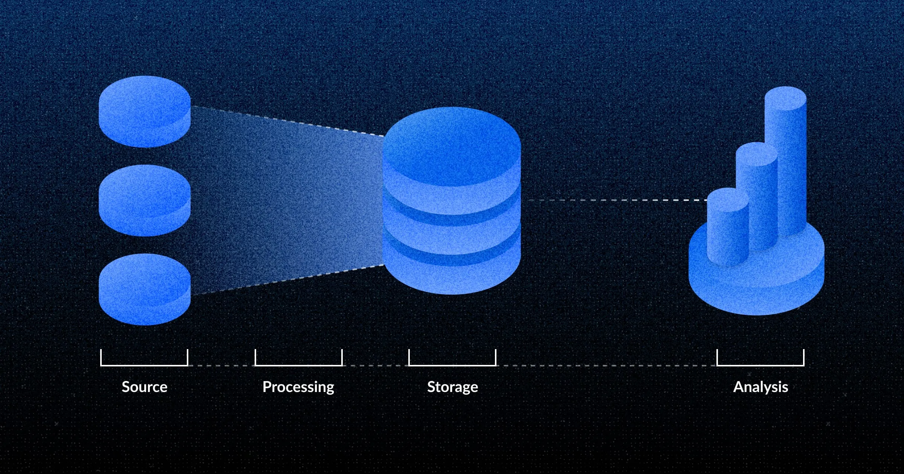

This article provides a high-level overview for people who are new to the data space and who want to get some context on all the tools that make up the data landscape. The idea here is just to give you a lay of the land so you have some basic context when people talk about this stuff. But first:

## A comically brief history of the data world

In the early days, data storage and manipulation was a complex and expensive process. Storing data required on-premise servers (like racks of blinking computers and cable salad in an air-conditioned room over by the bathrooms). And data retrieval could be really slow: querying and manipulating that data took hours, sometimes days.

But tooling has improved dramatically, especially in the last ten years, and especially with the rise of cloud infrastructure (which is just larger racks of computers in an air-conditioned environment with sane cable management that you can rent on demand). These days data is faster and cheaper to work with than ever. There are now a ton of tools for working with data, which can make the data landscape seem more complicated than it actually is.

There's a lot of talk about Business Intelligence, Big Data, and AI-driven insights, but these are just marketing terms. Most businesses don't have petabytes of information, or even terabytes, and they don't _need_ that much data. Most businesses just need to be able to query what data they _do_ collect, spot and react to trends, and think about what other data they'd like to collect to field the questions they can't answer. Many businesses also need to be able to provide data to their customers, for example by embedding charts into their application.

Nowadays, a simple data stack is all most companies need, and they're easy to scale for when your business really takes off. They're also just a good way to understand the data landscape in general, so we'll give you a brief tour of a basic data stack, starting with why you'd need a data stack in the first place.

## Data stacks centralize your data and shield your application from analytical queries that could slow your app down

"Data stack" is just a term that refers to the set of software that manages the data along its journey from source to dashboard. There is a cost to building a data stack separate from your application data, but the advantages of a data stack are essentially two-fold:

1. **A data stack doesn't slow down your application's database** with queries from curious analysts. These queries can range across large amounts of data, which can tie up your database's resources and make your app slower for innocent people using your app.
2. **A data stack centralizes your data**, including data from sources other than your application, and organizes the data in such a way that makes it easy to query.

## Overview of data stack layers

At a high level, a data stack consists of four layers:

- [Source layer](#data-source-layer). Data collection and ingestion.
- [Transformation and modeling layer(s)](#data-transformation-and-modeling-layer). Ingesting, formatting, and organizing data.
- [Storage layer](#data-storage-layer). You have to put that data somewhere, ideally in a place that makes it easy to find.
- [Analysis layer](#data-analysis-layer). Create charts and tables that help you understand what's going on.

These layers are somewhat arbitrary, and they overlap (particularly the transformation and modeling layer). And you can argue there are other layers (like data governance, or data monitoring), but these four layers are the major ones.

## Data source layer

Businesses collect data from their apps, but they also accrue a lot of data from third-party apps and services. Data can come from:

- **Production databases**. Sometimes called transactional databases, or operational or application databases (or just "Prod"). That is, the database your software uses to store all of its data while it's doing whatever it is your software does.
- **Operational apps**. Data from social media, customer relationship management, and payment provider apps and APIs.
- **External data**. Data from third parties like web analytics (e.g., Google Analytics), or demographic data, market data, geospatial data, and so on.

### Data ingestion and data integration

Your company will have to get data from all of these different sources. Wrangling all of this data on your own can be really time-consuming, as you have to grab data from each app's API. So one option is to use a service that maintains connectors to these applications. These are sometimes called integration and ingestion tools, which include tools like:

- Fivetran
- Stitch
- Zapier

## Data transformation and modeling layer

Generally, trying to analyze unmodified data from multiple sources is a nightmare: the data is scattered all over the place, and answering simple questions might involve querying multiple different tables just to get the data you need.

The transformation and modeling layer of the data stack is all about getting data into a "shape" that's easy to query and explore. The idea is to build scheduled processes called ETLs that grab a bunch of data , and then dump that data into your data warehouse. In some cases, ETLs grab the data in batches (like once a night); it can also be streamed, which means the data is sent off to the data warehouse as soon as the app records it.

A non-exhaustive list of transformations:

- Taking data from .csv or JSON format, and inserting that data into a relational database.
- Aggregating data from multiple sources into a single dataset.
- Changing data format, for example, from JSON to CSV.
- Filtering out data, or filling in gaps in the data.

### ETLs: Extract, Transform, Load

**ETLs** are scripts, sometimes called jobs, that extract data from various sources (including raw data already stored in a data warehouse), transform the data, and load the transformed data into the data warehouse

ETL stands for [**E**xtract, **T**ransform and **L**oad](/learn/analytics/etl-landscape):

- **Extract:** A set of queries or API requests that grabs the raw data.
- **Transform:** Queries or scripts that prep the data for analysis (i.e., make the data easy to query).
- **Load:** A set of queries that load transformed data into a data warehouse.

This sounds complicated, but it's really just a sequence of scripts being run. A super basic ETL job could go something like this:

- Query data from three tables that contain customer data.
- Change all the values in the Address column to use upper case.
- If there's no value in the State column, look up the state from the Zip code and insert the State in the State column.
- Insert the results to the `CUSTOMER` table in the data warehouse.

Within the past few years, **ELT (not ETL)** has become more popular (even though everyone still just says ETL). The idea with ELTs is to use data ingestion tools to load a bunch of raw data from sources into the data warehouse in whatever format it comes in, then run SQL queries that take that data, transform it into tables or columns that are easy to query, and save that data in the data warehouse.

The rationale for the ELT path is that it’s generally easier to first load the raw data into a data warehouse and then do more complex transformation with it (versus transforming the data before putting it into the data warehouse). Plus then you also have the raw data as is, if you ever need it (storage has gotten pretty cheap).

Further reading:

- [ETLs, ELTs, and reverse ETLs](/learn/analytics/etl-landscape)

### Data modeling

Data modeling is an abstract term, with slightly different definitions in different contexts, so even if you've encountered the term before, you may still not be totally sure you understand what exactly people are talking about.

Data modeling refers to deciding which data you want to collect about the real world, and how to organize the data you collect into tables in a database in a way that's useful. That's basically it. If you have a spreadsheet called Customer, your "model" of the customer is the set of headings in that spreadsheet: `Name`, `Address`, `Email`, etc that describe what your customer from the perspective of your business. How you "model" your customer depends on how your business operates. Does your customer model need to include "Food allergies"? "Average typing speed"? "Scuba certification status"?

Data modeling can also refer to how that data is stored in a database. So, not just defining the columns (sometimes called fields) and their [data types](/learn/grow-your-data-skills/data-fundamentals/data-types-overview), but how those columns are grouped in tables, and how those tables can be linked together to form a bigger picture. For example, you might want to link the Customer model to a Purchases model to figure out who's buying what.

The reason for all this transformation is that the data model used for applications is usually unsuitable for analysis. The way you model data for applications typically optimizes for creating, reading, updating, and deleting records. You'll sometimes here the acronym CRUD (Create, Read, Update, Delete). Your data has a "shape" in your application (like rows and columns), and you want to re-shape those rows and columns in your data warehouse so that the tables are easier to filter and summarize.

### Data transformation and modeling tools

- **dbt** - is an open-source tool for building, testing, and documenting data models. dbt sits on top of your data warehouse and uses SQL to transform data that is already stored in the data warehouse.
- **Apache** **Airflow** - an open-source data workflow management tool which can be used in conjunction with Fivetran or Stitch. It can be used for overseeing execution of Fivetran or Stitch tasks.
- **Metabase**. Some analytical tools (like Metabase) also let people model data themselves. This way, people can model data on the fly, refining their customer or product models as they respond to changes in their business.

Further reading:

- [Data types and metadata](/learn/grow-your-data-skills/data-fundamentals/data-types-overview)
- [Models in Metabase](/learn/data-modeling/models)
- [Common data model mistakes made by startups](/learn/analytics/data-model-mistakes)

## Data storage layer

Once you've transformed the data, you need to put it somewhere that makes it easy to retrieve when you need it.

There are different [types of databases](/learn/databases/types-of-databases), but for the purpose of a data stack we'll talk primarily about two broad categories of databases here: transactional and analytical.

### Transactional databases

**Transactional databases** are built for backing software. They use tables (relations) to group columns (attributes).

- MySQL
- Oracle
- PostgreSQL
- SQLite
- SQL Server

### Analytical databases

**Analytical databases** are structured to make analytics queries easy (e.g., what is the average price point for all products in categories a, b, and c?). They usually use columnar storage, where data is collected in columns, rather than columns in a table. Examples analytical databases include:

- BigQuery
- Hydra
- Redshift
- Snowflake
- Vertica

**Data Warehouses** are databases used to store all the data that your organization wants to analyze. Data warehouse sometimes refers to analytical databases like Snowflake or BigQuery, but transactional databases like PostgreSQL and MySQL have gotten ridiculously good, and (with proper modeling) can handle most analytical workloads no problem. So unless you're working with seriously massive datasets, a powerhouse RBDMS like PostgreSQL may be all you need for a data warehouse. In either case, data warehouses are usually run in the cloud (on Amazon Web Services, Google Cloud Platform, Microsoft Azure, and so on) so companies don't have to worry about building their own servers to run the database.

**Data Lakes** are stores of unstructured data. You can think of them like big, distributed file systems full of folder and files. You use data lakes to dump data in all kinds of formats (CSV, videos, JSON, sound files, etc). Once the data is in the data lake, you can use query engines like Presto or Athena to query data, format and model it, and load that modeled into a data warehouse for analysts to explore.

Further reading:

- [Data warehouse vs data lake vs data mart](/learn/databases/data-mart-data-warehouse-data-lake)
- [Types of databases](/learn/grow-your-data-skills/data-fundamentals/types-of-databases)
- [Which data warehouse should you use?](/learn/grow-your-data-skills/data-landscape/which-data-warehouse)

## Data analysis layer

Data analysis is the visualization layer of the data stack. Sometimes called Data Analytics or Business Intelligence. This is the layer where you make tables and charts of data to show other people that you know what you're doing, and that we're all _definitely_ not just making everything up as we go along.

Once transformed and loaded into your data warehouse, you can hook up a visualization tool like Metabase (sorry, a _business intelligence platform_) to your data warehouse to "unlock insights".

Some BI tools also include tools for modeling data and in some cases [writing back to your databases](/learn/metabase-basics/querying-and-dashboards/actions) (that is, the allow you to create, update, or delete records), which opens up all kinds of possibilities for building back-office apps to work with your data.

### Data analysis tools

Like every layer, you have a lot of options:

- Looker
- Metabase
- Mode
- Power BI
- Redash
- Superset
- Tableau

## Further reading

- Well, most of [Learn Metabase](/learn/), really.
