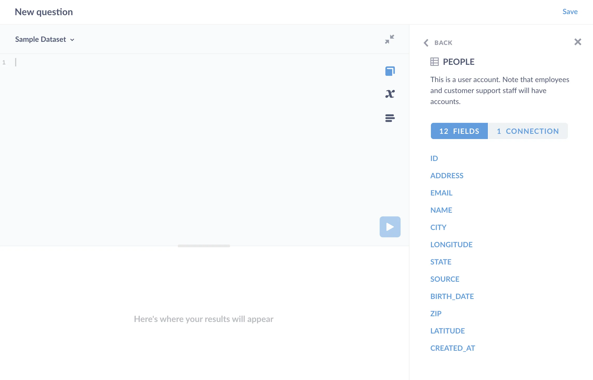
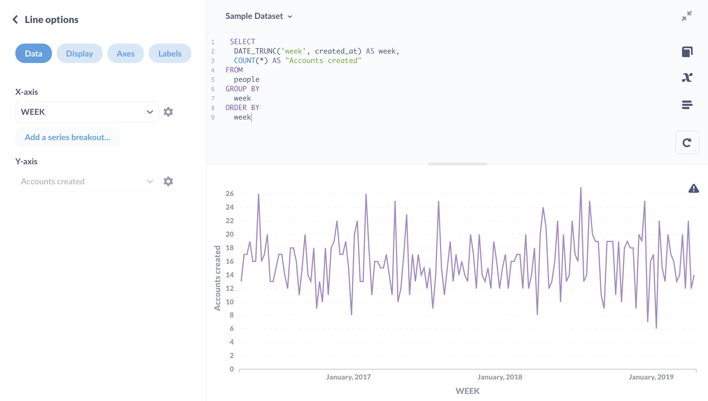

We'll walk through three common scenarios when working with dates in SQL. We'll use the [Sample Database](/glossary/sample_database) included with Metabase so you can follow along, and stick to some common SQL functions and techniques that work across many databases. We're assuming this isn't your first SQL query, and you're looking to level up. But even if you're just getting started, you should be able to pick up a few tips.

| Scenario                                                                    | Example                                                                                          |
| --------------------------------------------------------------------------- | ------------------------------------------------------------------------------------------------ |
| [Group results by a time period](#group-results-by-a-time-period)           | How many people created an account each week?                                                    |
| [Compare week over week totals](#compare-week-over-week-totals)             | How did the count of orders this week compare with last week?                                    |
| [Find the duration between two dates](#find-the-duration-between-two-dates) | How many days between when a customer created an account and when they placed their first order? |

## Group results by a time period

We often want to ask questions like: how many customers signed up each month? Or how many orders were placed each week? Here we'll go through a table of results, count the rows, and group those counts by a period of time.

### Example: how many people created an account each week?

Here we're looking to return two columns:

```plaintext
| WEEK | ACCOUNTS CREATED |
|------|------------------|
| ...  | ...              |

```

Let's take a look at our `People` table. We can `SELECT * FROM people LIMIT 1` to see the list of fields, or simply click on the **book icon** to see metadata about the tables in the database we're working with.



Since we're interested in when a customer signed up for an account, we'll need the `created_at` field, which according to our data reference is "The date the user record was created. Also referred to as the user's 'join date'".

We'll need to group these account creations, but instead of grouping them by date, we'll need to group them by week. To see which week each `created_at` date falls in, we'll use the `DATE_TRUNC` function.

`DATE_TRUNC` lets you round ("truncate") your timestamps to the granularity you care about: week, month, and so on. `DATE_TRUNC` takes two arguments: text and a timestamp, and it returns a timestamp. That first text argument is the time period, in this case 'week', but we could specify different granularities, like month, quarter, or year (check your database's documentation on `DATE_TRUNC` to see the options). For our purpose here, we'll write `DATE_TRUNC('week', created_at)`, which will return the date for the Monday of each week. By the way, SQL is case insensitive, so you can case your code however you like (`date_trunc` works too, or `DaTe_TrUnc` if you're querying sarcastically).

We'll also use aliases for the results to give the columns more specific names. For example, using the `AS` keyword, we'll change `Count(*)` to display as `accounts_created`.

```sql
SELECT
  DATE_TRUNC('week', created_at) AS week,
  COUNT(*) AS accounts_created
FROM
  people
GROUP BY
  week
ORDER BY
  week
```

Which returns:

```plaintext
| WEEK    | ACCOUNTS_CREATED |
|---------|------------------|
| 4/18/16 | 13               |
| 4/25/16 | 17               |
| 5/2/16  | 17               |
| ...     | ...              |
```

We can visualize this result as a **line chart**:



Which looks pretty much as we'd expect from a random dataset.

## Compare week-over-week totals

You'll often want to see how a count has changed from one week to the next, which you can calculate by joining a table to itself, and comparing each week to its previous week.

### Example: how did orders compare to last week?

What we're looking for here is the week, the count of orders for that week, and the week-over-week change (did orders go up, down, or stay the same?):

```plaintext
| WEEK    | COUNT_OF_ORDERS | WOW_CHANGE |
|---------|-----------------|------------|
| ...     | ...             | ...        |
```

To get this data, we'll first need to get a table that lists the count of orders per week. We'll do basically the same thing we just did for the `People` table, but this time for `Orders` table: we'll use `DATE_TRUNC` to group the count of orders by week.

```sql
SELECT
  DATE_TRUNC('week', orders.created_at) AS week,
  COUNT(*) AS order_count
FROM
  orders
GROUP BY
  week
```

Which gives us:

```plaintext
| WEEK     | ORDER_COUNT |
|----------|-------------|
| 7/1/2019 | 115         |
| 7/2/2018 | 119         |
| 7/3/2017 | 78          |
| ...      | ...         |
```

We'll use these results to build the rest of the query. What we need to do now is take the order count from each week (which we'll refer to as `w1`), and subtract it from the count for the previous week (which we'll call `w2`). The challenge here is that, in order to perform the subtraction, we need to somehow get each week's count in the same row as the previous week's count.

Here's how we'll do it:

- Wrap our results in a [Common Table Expression](/learn/grow-your-data-skills/learn-sql/working-with-sql/sql-cte) (CTE).
- Join that CTE to itself by offsetting the join by 1 week
- Subtract the previous week's order count total from each week's total to get the week-over-week change

We'll make the query above a Common Table Expression (CTE) using the `WITH` keyword. Essentially CTEs are a way to assign a variable to interim results, which we can then treat as though the results were an actual table in the database (like `Orders` or `Table`). We'll call the results table `order_count_by_week`. Then we'll use this table and join it to itself, but with an offset: its rows shifted by one week.

Here's the query with the offset join:

```sql
WITH order_count_by_week AS (
  SELECT
    DATE_TRUNC('week', orders.created_at) AS week,
    COUNT(*) AS order_count
  FROM
    orders
  GROUP BY
    week
)

SELECT
  *
FROM
  order_count_by_week w1
  LEFT JOIN order_count_by_week w2 ON w1.week = DATEADD(WEEK, 1, w2.week)
ORDER BY
  w1.week
```

This query yields:

```plaintext
| WEEK      | ORDER_COUNT | WEEK      | ORDER_COUNT |
|-----------|-------------|-----------|-------------|
| 4/25/2016 | 1           |           |             |
| 5/2/2016  | 3           | 4/25/2016 | 1           |
| 5/9/2016  | 3           | 5/2/2016  | 3           |
| ...       | ...         | ...       | ...         |
```

Let's unpack what's going on here. We aliased the `order_count_by_week` CTE as `w1`, and then again as `w2`. Next, we left-joined those two CTEs. The key here is the `DATEADD` function, which we used to add a week to each `w2.week` value to offset the joined columns:

```sql
LEFT JOIN order_count_by_week w2 ON w1.week = DATEADD(WEEK, 1, w2.week)
```

The `DATEADD` function takes a period of time (WEEK), the number of those weeks to apply (in this case 1, since we want to know the difference from one week ago), and the date column to apply the addition to (`w2.week`). (Note that some databases use `INTERVAL` instead of `DATEADD`, like `w2.week + INTERVAL '1 week'`). This "lines up" the rows, but off by one week (note the absence of values in the second group of week/order counts for that first row above).

We now have a table with everything we need to calculate the week-over-week change _in each row_. Now all we have to do is modify our select statement to return the columns we're looking for:

- Week the orders were placed
- Count of orders for that week
- Week over week change (i.e., the difference between the count this week and the previous week).

Here's the full query:

```sql
WITH order_count_by_week AS (
  SELECT
    DATE_TRUNC('week', orders.created_at) AS week,
    COUNT(*) AS order_count
  FROM
    orders
  GROUP BY
    week
)

SELECT
  w1.week,
  w1.order_count AS count_of_orders,
  w1.order_count - w2.order_count AS wow_change
FROM
  order_count_by_week w1
  LEFT JOIN order_count_by_week w2 ON w1.week = DATEADD(WEEK, 1, w2.week)
ORDER BY
  w1.week
```

Which returns:

```plaintext
| WEEK    | COUNT_OF_ORDERS | WOW_CHANGE |
|---------|-----------------|------------|
| 4/25/16 | 1               |            |
| 5/2/16  | 3               | 2          |
| 5/9/16  | 3               | 0          |
| ...     | ...             | ...        |
```

## Find the duration between two dates

You'll often want to find the amount of time between two events: number of seconds between sign up and checkout, or number of days between checkout and delivery.

### Example: how many days between when a customer created an account and when they placed their first order?

To answer this, let's return four columns:

- Customer's ID
- Date the customer created the account
- Date that customer placed their first order
- Difference between those two dates

Now, to get this information, we'll need to grab data from the `People` and `Orders` tables. But we don't want to join these two tables, as we only need the first order each customer placed.

Let's start by finding out when each customer placed their first order.

```sql
SELECT
  user_id,
  MIN(created_at) as first_order_date
FROM
  orders
GROUP BY
  user_id
```

Here we're grouping orders by customer (`GROUP BY user_id`) and using the `MIN` function to find the earliest order date. We'll store those results as `first_orders`, and proceed with our query.

```sql
WITH first_orders AS (
  SELECT
    user_id,
    MIN(created_at) as first_order_date
  FROM
    orders
  GROUP BY
    user_id
)

SELECT
  people.id,
  people.created_at AS account_creation,
  first_orders.first_order_date,
  DATEDIFF(
    'day', people.created_at, first_orders.first_order_date
  ) AS days_before_first_order
FROM
  PEOPLE
  JOIN first_orders ON first_orders.user_id = people.id
ORDER BY
  account_creation
```

Which gives us:

```plaintext
| ID   | ACCOUNT_CREATION | FIRST_ORDER_DATE | DAYS_BEFORE_FIRST_ORDER |
|------|------------------|------------------|-------------------------|
| 915  | 4/19/16 21:35    | 10/9/16 8:42     | 173                     |
| 1712 | 4/21/16 23:46    | 8/15/16 4:01     | 116                     |
| 2379 | 4/22/16 4:07     | 5/22/16 3:56     | 30                      |
| ...  | ...              | ...              | ...                     |
```

To sum up: we've grabbed the customer's `created_at` date, and joined the query to our CTE. We used the `DATEDIFF` function to find the number of days between account creation and their first order, then stored the result as `days_before_first_order`. `DATEDIFF` takes a time period (like "day," "week," "month"), and returns the number of periods between two timestamps.

(Given that the Sample Database is random, our responses don't match reality very well---how often do people wait 173 days between account setup and purchase?)

## Further reading

We hope these query walkthroughs gave you some ideas for your own questions, but keep in mind that different databases support different SQL functions, so make a habit of consulting your database's documentation when working through your queries. You can also check out [Best practices for writing SQL queries](/learn/grow-your-data-skills/learn-sql/working-with-sql/sql-best-practices). If you're a bit fuzzy on how joins work, check out [Joins in Metabase](/learn/metabase-basics/querying-and-dashboards/questions/joins-in-metabase).
