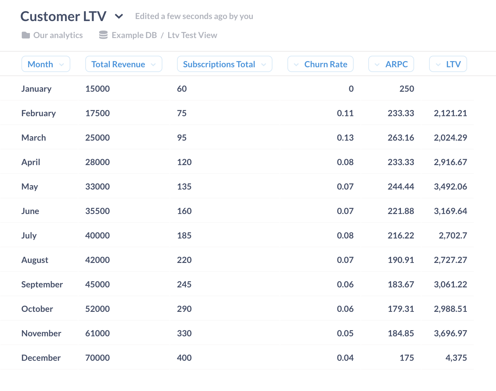
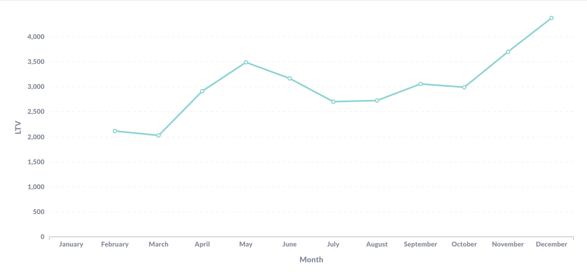

In our [primer on customer lifetime value](/blog/calculating-ltv), we discussed where some companies go wrong with the metric and offered some guidance on putting LTV to use. This guide takes a more hands-on approach: we'll tackle exactly _how_ a subscription-based company can estimate the total amount of money that a customer will spend over their lifetime as a customer, using SQL queries in Metabase.

We'll start by reviewing the formula for determining LTV and the metrics you'll need to get there, and then we'll offer an example SQL query you can run to get LTV data. If you're just looking for that example SQL query, feel free to [jump ahead](#step-2-sql-query-for-ltv).

## Basic LTV formula

This [simple formula](/blog/calculating-ltv#basic-ltv-formula-for-saas-companies) for subscription-based SaaS companies is a good starting point for calculating LTV, dividing [average revenue per customer](#average-revenue-per-customer-aprc) (APRC) by [subscription churn rate](#subscription-churn-rate):

```plaintext
Customer LTV = ARPC / Churn rate
```

Stick with a single interval throughout your calculations. If you bill quarterly, then calculating your number of subscriptions per month won't be very useful. In our example, we'll go by monthly figures.

### Build on existing Metabase questions

Drawing on existing questions or models for your LTV calculations can save a lot of effort, so it's worth checking if anyone at your org has completed any of these calculations themselves. You may even have access to those calculated metrics direct from whatever third-party payment processor you use (like revenue or churn data from Stripe) — if that's the case, modeling LTV gets a bit easier.

## What we're working toward: LTV table

Our goal is to end up with a table that includes a row for each billing cycle, with columns corresponding to specific data for that billing cycle. That resulting table will contain the following fields:

- Month of billing cycle
- Monthly recurring revenue (MRR)
- Number of subscriptions
- Average revenue per customer (ARPC)
- Subscription churn rate
- Customer lifetime value (LTV)

## What your data looks like

To simplify our example, we'll say that we have three tables to start: `Invoices`, `Subscriptions`, and `Revenue changes`:

### Invoices

```plaintext
| invoice_id | subscriber_id | month         | amount_dollars |
| ---------- | ------------- | ------------- | -------------- |
| N001       | S001          | January 2021  | 100            |
| N002       | S002          | January 2021  | 150            |
| N003       | S001          | February 2021 | 100            |
| N004       | S002          | February 2021 | 150            |
| N005       | S003          | February 2021 | 200            |
| N006       | S001          | March 2021    | 100            |
| N007       | S003          | March 2021    | 200            |
| ...        | ...           | ...           | ...            |
```

### Subscriptions

```plaintext
| subscriber_id | active | monthly_invoice | created_at    | cancelled_at |
| ------------- | ------ | --------------- | ------------- | ------------ |
| S001          | Yes    | 100             | January 2021  |              |
| S002          | No     | 150             | January 2021  | March 2021   |
| S003          | Yes    | 200             | February 2021 |              |
| ...           | ...    | ...             | ...           | ...          |
```

### Revenue changes

```plaintext
| month         | invoice_id | subscriber_id | dollar_change | change_type |
| ------------- | ---------- | ------------- | ------------- | ----------- |
| January 2021  | N001       | S001          | 100           | new         |
| January 2021  | N002       | S002          | 150           | new         |
| February 2021 | N003       | S001          | 0             | retain      |
| February 2021 | N004       | S002          | 0             | retain      |
| February 2021 | N005       | S003          | 200           | new         |
| March 2021    | N006       | S001          | 0             | retain      |
| March 2021    | N007       | S002          | -150          | removed     |
| March 2021    | N008       | S003          | 0             | retain      |
| ...           | ...        | ...           | ...           | ...         |
```

## Step 1: calculate your pre-LTV metrics

We'll first walk through queries to determine the following three baseline metrics that play a part in calculating lifetime value:

- [Monthly recurring revenue (MRR)](#monthly-recurring-revenue-mrr)
- [Average revenue per customer (ARPC)](#average-revenue-per-customer-aprc)
- [Subscription churn rate](#subscription-churn-rate)

### Monthly recurring revenue (MRR)

Total recurring revenue for each pay period (in our case, a month) gives us a sense of our predictable income stream. To get this number, we'll calculate the sum of the `amount_dollars` field in the `Invoices` table. If we just wanted to calculate this value, we'd do something like:

```sql
SELECT
    month,
    sum(amount_dollars) AS mrr
FROM
    invoices
GROUP BY month
```

Here's what that output would look like:

```plaintext
| month         | MRR |
| ------------- | --- |
| January 2021  | 250 |
| February 2021 | 450 |
| March 2021    | 300 |
```

In our final query to get LTV, we'll calculate MRR with the following subquery:

```sql
sum(amount_dollars) AS mrr,
```

### Average revenue per customer (APRC)

ARPC lets us know about how much revenue we earn from each customer. We'll first count the number of active subscriptions grouped by month, and then divide MRR by that figure.

If we wanted to calculate ARPC from our `Invoices` table, we'd do:

```sql
SELECT
    month,
    sum(amount_dollars) AS mrr,
    count(DISTINCT subscription_id) AS subscriptions,
    (mrr / subscriptions) AS arpc
FROM
    invoices
GROUP BY
    month
```

Here's our output after this step:

```plaintext
| month         | MRR | subscriptions | ARPC |
| ------------- | --- | ------------- | ---- |
| January 2021  | 250 | 2             | 125  |
| February 2021 | 450 | 3             | 150  |
| March 2021    | 300 | 2             | 150  |
```

We'll include the following subquery to calculate ARPC in our final SQL query:

```sql
(mrr / subscriptions) AS arpc
```

### Subscription churn rate

Churn rate is a ratio that indicates what portion of customers stopped paying for your service during the most recent payment period. To calculate subscription churn rate, divide the number of subscriptions carrying from last month by the total number of subscriptions last month.

We'll use two CTEs at the start of our query for calculating churn rate:

```sql
WITH total_subscriptions AS (
    SELECT
        date_trunc('month', invoices.date) AS month,
        count(DISTINCT invoices.subscription_id) AS subscriptions,
        sum(amount_dollars) AS mrr
    FROM
        invoices
    GROUP BY
        1
),
churned_subscriptions AS (
    SELECT
        s.month,
        s.subscriptions,
        s.mrr,
        lag(subscriptions) OVER (ORDER BY s.month) AS last_month_subscriptions,
        count(DISTINCT CASE WHEN revenue_changes.change_type = 'removed' THEN
                revenue_changes.subscription_id
            END) AS churned_subscriptions
    FROM
        total_subscriptions s
        LEFT JOIN revenue_changes ON s.month = revenue_changes.month
    GROUP BY
        1,
        2,
        3
)
```

Our results from these CTEs would look like:

```plaintext
| month         | churned_subscriptions | last_month_subscriptions |
| ------------- | --------------------- | ------------------------ |
| January 2021  |                       |                          |
| February 2021 | 0                     | 2                        |
| March 2021    | 1                     | 3                        |
```

## Step 2: SQL query for LTV

When we're ready to execute the full query, we'll select **+ New** > **SQL query** from Metabase's main nav bar, and enter the following code:

```sql
WITH total_subscriptions AS (
    SELECT
        date_trunc('month', invoices.date) AS month,
        count(DISTINCT invoices.subscription_id) AS subscriptions,
        sum(amount_dollars) AS mrr
    FROM
        invoices
    GROUP BY
        1
),
churned_subscriptions AS (
    SELECT
        s.month,
        s.subscriptions,
        s.mrr,
        lag(subscriptions) OVER (ORDER BY s.month) AS last_month_subscriptions,
        count(DISTINCT CASE WHEN revenue_changes.change_type = 'removed' THEN
                revenue_changes.subscription_id
            END) AS churned_subscriptions
    FROM
        total_subscriptions s
        LEFT JOIN revenue_changes ON s.month = revenue_changes.month
    GROUP BY
        1,
        2,
        3
)
SELECT
    month,
    (mrr / subscriptions) AS arpc,
    (churned_subscriptions / last_month_subscriptions::float) AS subscription_churn_rate,
    (mrr / subscriptions) / (churned_subscriptions / last_month_subscriptions::float) AS ltv
FROM
    churned_subscriptions
WHERE
    month >= '2021-01-01'
```

Once we've run our query, we'll end up a table that includes a `LTV` column — the metric we've been after:

```plaintext
| month         | MRR | subscription_total | ARPC | subscription_churn_rate | LTV   |
| ------------- | --- | ------------------ | ---- | ----------------------- | ----- |
| January 2021  | 250 | 2                  | 125  |                         |       |
| February 2021 | 450 | 3                  | 150  | 0.00                    |       |
| March 2021    | 300 | 2                  | 150  | 0.33                    | 454.5 |
```

## Step 3: Visualizing your LTV

Finally, visualizing this query as a line chart can help us better analyze how that metric has changed over time. Here are some other LTV calculations in Metabase, visualized as both a table and a line chart:





Now that we have this metric, we can use it to make decisions things like about marketing efforts, staffing needs, and feature prioritization.
