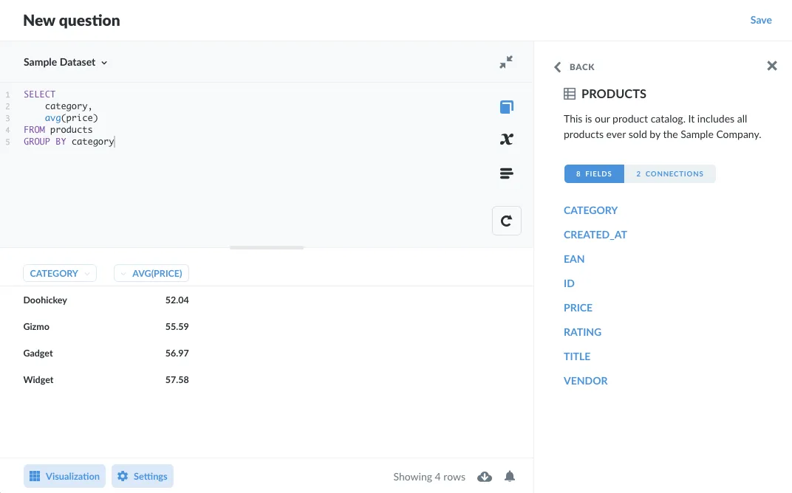
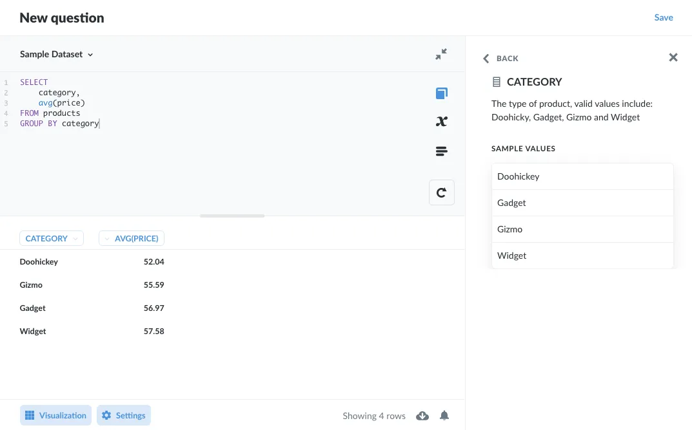
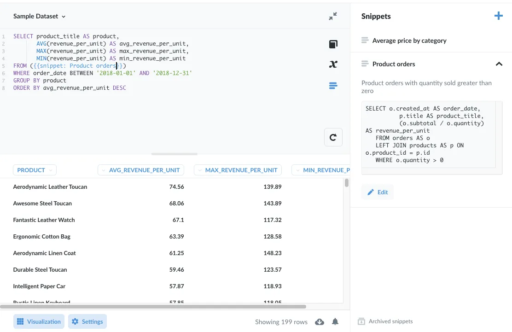

This article covers some best practices for writing SQL queries for data analysts and data scientists. Most of our discussion will concern SQL in general, but we'll include some notes on features specific to Metabase that make writing SQL a breeze.

## Correctness, readability, then optimization: in that order

The standard warning against premature optimization applies here. Avoid tuning your SQL query until you know your query returns the data you're looking for. And even then, only prioritize optimizing your query if it's run frequently (like powering a [popular dashboard](/learn/metabase-basics/administration/administration-and-operation/making-dashboards-faster)), or if the query traverses a large number of rows. In general, prioritize accuracy (does the query produce the intended results), and readability (can others easily understand and modify the code) before worrying about performance.

## Make your haystacks as small as possible before searching for your needles

Arguably, we're already getting into optimization here, but the goal should be to tell the database to scan the minimum number of values necessary to retrieve your results.

Part of SQL's beauty is its declarative nature. Instead of telling the database how to retrieve records, you need only tell the database which records you need, and the database should figure out the most efficient way to get that information. Consequently, much of the advice about improving the efficiency of queries is simply about showing people how to use the tools in SQL to articulate their needs with more precision.

We'll review the general order of query execution, and include tips along the way to reduce your search space. Then we'll talk about three essential tools to add to your utility belt: [INDEX](#sql-best-practices-for-index), [EXPLAIN](#explain), and [WITH](#with).

## First, get to know your data

Familiarize yourself with your data before your write a single line of code by studying the metadata to make sure that a column really does contain the data you expect. The [SQL editor](/docs/latest/questions/native-editor/writing-sql) in Metabase features a handy data reference tab (accessible via the **book icon**), where you can browse through the tables in your database, and view their columns and connections:



You can also view sample values for specific columns:



Metabase gives you many different ways to explore your data: you can [X-ray](/docs/latest/exploration-and-organization/x-rays) tables, [compose questions](/docs/latest/questions/introduction) using the query builder, convert a saved question to SQL code, or build from an existing SQL query. We cover this in other articles; for now, let's go through the general workflow of a query.

## Developing your query

Everyone's method will differ, but here's an example workflow to follow when developing a query.

- As above, study the column and table metadata. If you're using Metabase's native (SQL) editor, you can also search for [Snippets](/learn/metabase-basics/querying-and-dashboards/sql-in-metabase/snippets) that contain SQL code for the table and columns you're working with. Snippets allow you to see how other analysts have been querying the data. Or you can [start a query from an existing SQL question](/docs/latest/questions/native-editor/referencing-saved-questions-in-queries).
- To get a feel for a table's values, SELECT \* from the tables you're working with and LIMIT your results. Keep the LIMIT applied as you refine your columns (or add more columns via joins).
- Narrow down the columns to the minimal set required to answer your question.
- Apply any filters to those columns.
- If you need to aggregate data, aggregate a small number of rows and confirm that the aggregations are as you expect.
- Once you have a query returning the results you need, look for sections of the query to save as a Common Table Expression (CTE) to encapsulate that logic.
- With Metabase, you can also save code as a [Snippet](/learn/metabase-basics/querying-and-dashboards/sql-in-metabase/snippets) to share and reuse in other queries.

## The general order of query execution

Before we get into individual tips on writing SQL code, it's important to have a sense of how databases will carry out your query. This differs from the reading order (left to right, top to bottom) you use to compose your query. Query optimizers can change the order of the following list, but this general lifecycle of a SQL query is good to keep in mind when writing SQL. We'll use the execution order to group the tips on writing good SQL that follow.

The rule of thumb here is this: the earlier in this list you can eliminate data, the better.

1. [FROM](#sql-best-practices-for-from) (and JOIN) get(s) the tables referenced in the query. These tables represent the maximum search space specified by your query. Where possible, restrict this search space before moving forward.
2. [WHERE](#sql-best-practices-for-where) filters data.
3. [GROUP BY](#sql-best-practices-for-group-by) aggregates data.
4. [HAVING](#sql-best-practices-for-having) filters out aggregated data that doesn't meet the criteria.
5. [SELECT](#sql-best-practices-for-select) grabs the columns (then deduplicates rows if DISTINCT is invoked).
6. [UNION](#sql-best-practices-for-union) merges the selected data into a results set.
7. [ORDER BY](#sql-best-practices-for-order-by) sorts the results.

And, of course, there will always be occasions where the query optimizer for your particular database will devise a different query plan, so don't get hung up on this order.

## Some query guidelines (not rules)

The following tips are guidelines, not rules, intended to keep you out of trouble. Each database handles SQL differently, has a slightly different set of functions, and takes different approaches to optimizing queries. And that's before we even get into comparing traditional transactional databases with analytics databases that use columnar storage formats, which have vastly different performance characteristics.

### Comment your code, especially the why

Help people out (including yourself three months from now) by adding comments that explain different parts of the code. The most important thing to capture here is the "why." For example, it's obvious that the code below filters out orders with `ID` greater than 10, but the reason it's doing that is because the first 10 orders are used for testing.

```sql
SELECT
  id,
  product
FROM
  orders
-- filter out test orders
WHERE
  order.id > 10
```

The catch here is that you introduce a little maintenance overhead: if you change the code, you need to make sure that the comment is still relevant and up to date. But that's a small price to pay for readable code.

### SQL best practices for FROM

#### Join tables using the ON keyword

Although it's possible to "join" two tables using a `WHERE` clause (that is, to perform an implicit join, like `SELECT * FROM a,b WHERE a.foo = b.bar`), you should instead prefer an [explicit JOIN](/learn/metabase-basics/querying-and-dashboards/questions/joins-in-metabase):

```sql
SELECT
  o.id,
  o.total,
  p.vendor
FROM
  orders AS o
  JOIN products AS p ON o.product_id = p.id
```

Mostly for readability, as the `JOIN` + `ON` syntax distinguishes joins from `WHERE` clauses intended to filter the results.

#### Alias multiple tables

When querying multiple tables, use aliases, and employ those aliases in your select statement, so the database (and your reader) doesn't need to parse which column belongs to which table. Note that if you have columns with the same name across multiple tables, you will need to explicitly reference them with either the table name or alias.

**Avoid**

```sql
SELECT
  title,
  last_name,
  first_name
FROM fiction_books
  LEFT JOIN fiction_authors
  ON fiction_books.author_id = fiction_authors.id
```

**Prefer**

```sql
SELECT
  books.title,
  authors.last_name,
  authors.first_name
FROM fiction_books AS books
  LEFT JOIN fiction_authors AS authors
  ON books.author_id = authors.id
```

This is a trivial example, but when the number of tables and columns in your query increases, your readers won't have to track down which column is in which table. That and your queries might break if you join a table with an ambiguous column name (e.g., both tables include a field called `Created_At`.

Note that field filters are incompatible with table aliases, so you'll need to remove aliases when connecting filter widgets to your Field Filters.

### SQL best practices for WHERE

#### Filter with WHERE before HAVING

Use a `WHERE` clause to filter superfluous rows, so you don't have to compute those values in the first place. Only after removing irrelevant rows, and after aggregating those rows and grouping them, should you include a `HAVING` clause to filter out aggregates.

#### Avoid functions on columns in WHERE clauses

Using a function on a column in a `WHERE` clause can really slow down your query, as the function makes the query [non-sargable](https://en.wikipedia.org/wiki/Sargable) (i.e., it prevents the database from using an index to speed up the query). Instead of using the index to skip to the relevant rows, the function on the column forces the database to run the function on each row of the table.

And remember, the concatenation operator `||` is also a function, so don't get fancy trying to concat strings to filter multiple columns. Prefer multiple conditions instead:

**Avoid**

```sql
SELECT hero, sidekick
FROM superheros
WHERE hero || sidekick = 'BatmanRobin'
```

**Prefer**

```sql
SELECT hero, sidekick
FROM superheros
WHERE
  hero = 'Batman'
  AND
  sidekick = 'Robin'
```

#### Prefer `=` to `LIKE`

This is not always the case. It's good to know that `LIKE` compares characters, and can be paired with wildcard operators like `%`, whereas the `=` operator compares strings and numbers for exact matches. The `=` can take advantage of [indexed](#sql-best-practices-for-index) columns. This isn't the case with all databases, as `LIKE` can use indexes (if they exist for the field) as long as you avoid prefixing the search term with the wildcard operator, `%`. Which brings us to our next point:

#### Avoid bookending wildcards in WHERE statements

Using wildcards for searching can be expensive. Prefer adding wildcards to the end of strings. Prefixing a string with a wildcard can lead to a full table scan.

**Avoid**

```sql
SELECT column FROM table WHERE col LIKE "%wizar%"
```

**Prefer**

```sql
SELECT column FROM table WHERE col LIKE "wizar%"
```

#### Prefer EXISTS to IN

If you just need to verify the existence of a value in a table, prefer `EXISTS` to `IN`, as the `EXISTS` process exits as soon as it finds the search value, whereas `IN` will scan the entire table. `IN` should be used for finding values in lists.

Similarly, prefer `NOT EXISTS` to `NOT IN`.

### SQL best practices for GROUP BY

#### Order multiple groupings by descending cardinality

Where possible, `GROUP BY` columns in order of descending cardinality. That is, group by columns with more unique values first (like IDs or phone numbers) before grouping by columns with fewer distinct values (like state or gender).

### SQL best practices for HAVING

#### Only use HAVING for filtering aggregates

And before `HAVING`, filter out values using a `WHERE` clause before aggregating and grouping those values.

### SQL best practices for SELECT

#### SELECT columns, not stars

Specify the columns you'd like to include in the results (though it's fine to use `*` when first exploring tables --- just remember to `LIMIT` your results).

### SQL best practices for UNION

#### Prefer UNION All to UNION

If duplicates are not an issue, `UNION ALL` won't discard them, and since `UNION ALL` isn't tasked with removing duplicates, the query will be more efficient.

### SQL best practices for ORDER BY

#### Avoid sorting where possible, especially in subqueries

Sorting is expensive. If you must sort, make sure your subqueries are not needlessly sorting data.

## SQL best practices for INDEX

This section is for the database admins in the crowd (and a topic too large to fit in this article). One of the most common things folks run into when experiencing performance issues in database queries is a lack of adequate indexing.

Which columns you should index usually depends on the columns you're filtering by (i.e., which columns typically end up in your `WHERE` clauses). If you find that you're always filtering by a common set of columns, you should consider indexing those columns.

### Adding indexes

Indexing foreign key columns and frequently queried columns can significantly decrease query times. Here's an example statement to create an index:

```sql
CREATE INDEX product_title_index ON products (title)
```

There are different types of indexes available, the most common index type uses a [B-tree](https://en.wikipedia.org/wiki/B-tree) to speed up retrieval. Check out our article on [making dashboards faster](/learn/metabase-basics/administration/administration-and-operation/making-dashboards-faster), and consult your database's documentation on how to create an index.

### Use partial indexes

For particularly large datasets, or lopsided datasets, where certain value ranges appear more frequently, consider creating an index with a `WHERE` clause to limit the number of rows indexed. Partial indexes can also be useful for date ranges as well, for example if you want to index the past week of data only.

### Use composite indexes

For columns that typically go together in queries (such as last_name, first_name), consider creating a composite index. The syntax is similar to creating a single index. For example:

```sql
CREATE INDEX full_name_index ON customers (last_name, first_name)
```

## EXPLAIN

### Look for bottlenecks

Some databases, like PostgreSQL, offer insight into the query plan based on your SQL code. Simply prefix your code with the keywords `EXPLAIN ANALYZE`. You can use these commands to check your query plans and look for bottlenecks, or to compare plans from one version of your query to another to see which version is more efficient.

Here's an example query using the `dvdrental` sample database available for PostgreSQL.

```sql
EXPLAIN ANALYZE SELECT title, release_year
FROM film
WHERE release_year > 2000;
```

And the output:

```sql
 Seq Scan on film  (cost=0.00..66.50 rows=1000 width=19) (actual time=0.008..0.311 rows=1000 loops=1)
   Filter: ((release_year)::integer > 2000)
 Planning Time: 0.062 ms
 Execution Time: 0.416 ms
```

You'll see milliseconds required for planning time, execution time, as well as the cost, rows, width, times, loops, memory usage, and more. Reading these analyses is somewhat of an art, but you can use them to identify problem areas in your queries (such as nested loops, or columns that could benefit from indexing), as you refine them.

Here's PostreSQL's documentation on [using EXPLAIN](https://www.postgresql.org/docs/12/using-explain).

## WITH

### Organize your queries with Common Table Expressions (CTE)

Use the `WITH` clause to encapsulate logic in a [common table expression (CTE)](/learn/grow-your-data-skills/learn-sql/working-with-sql/sql-cte). Here's an example of a query that looks for the products with the highest average revenue per unit sold in 2019, as well as max and min values.

```sql
WITH product_orders AS (
  SELECT o.created_at AS order_date,
          p.title AS product_title,
          (o.subtotal / o.quantity) AS revenue_per_unit
   FROM orders AS o
   LEFT JOIN products AS p ON o.product_id = p.id
   -- Filter out orders placed by customer service for charging customers
   WHERE o.quantity > 0
)
SELECT product_title AS product,
       AVG(revenue_per_unit) AS avg_revenue_per_unit,
       MAX(revenue_per_unit) AS max_revenue_per_unit,
       MIN(revenue_per_unit) AS min_revenue_per_unit
FROM product_orders
WHERE order_date BETWEEN '2019-01-01' AND '2019-12-31'
GROUP BY product
ORDER BY avg_revenue_per_unit DESC
```

The `WITH` clause makes the code readable, as the main query (what you're actually looking for) isn't interrupted by a long sub query.

You can also use CTEs to make your SQL more readable if, for example, your database has fields that are awkwardly named, or that require a little bit of data munging to get the useful data. For example, CTEs can be useful when working with JSON fields. Here's an example of extracting and converting fields from a JSON blob of user events.

```sql
WITH source_data AS (
  SELECT events->'data'->>'name'  AS event_name,
    CAST(events->'data'->>'ts' AS timestamp) AS event_timestamp
    CAST(events->'data'->>'cust_id' AS int) AS customer_id
  FROM user_activity
)
SELECT event_name,
       event_timestamp,
       customer_id
FROM source_data
```

Alternatively, you could save a subquery as a [Snippet](/learn/metabase-basics/querying-and-dashboards/sql-in-metabase/snippets):



And yes, as you might expect, the Aerodynamic Leather Toucan fetches the highest average revenue per unit sold.

## With Metabase, you don't even have to use SQL

SQL is amazing. But so is Metabase's [Query Builder](/docs/latest/questions/introduction). You can compose queries using Metabase's graphical interface to [join tables](/learn/metabase-basics/querying-and-dashboards/questions/joins-in-metabase), filter and summarize data, create [custom columns](/glossary/custom_column), and more. And with [custom expressions](/docs/latest/questions/query-builder/expressions), you can handle the vast majority of analytical use cases, without ever needing to reach for SQL. Questions composed using the **Query Builderr** also benefit from automatic [drill-through](/learn/metabase-basics/querying-and-dashboards/questions/drill-through), which allows viewers of your charts to click through and explore the data, a feature not available to questions written in SQL.

## Glaring errors or omissions?

There are libraries of books on SQL, so we're only scratching the surface here. You can share the secrets of your SQL sorcery with other Metabase users [on our forum](https://discourse.metabase.com/).
