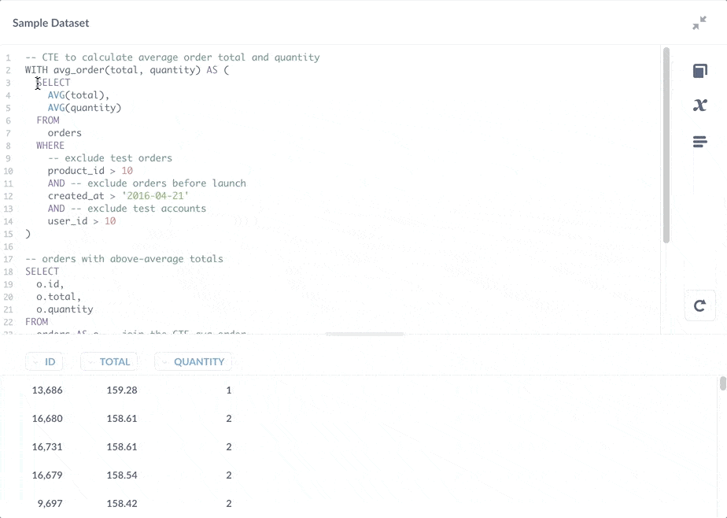
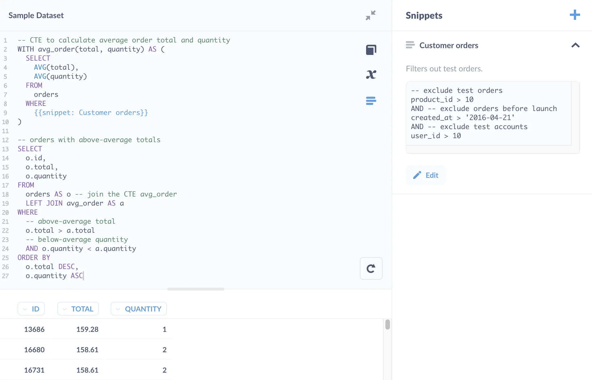
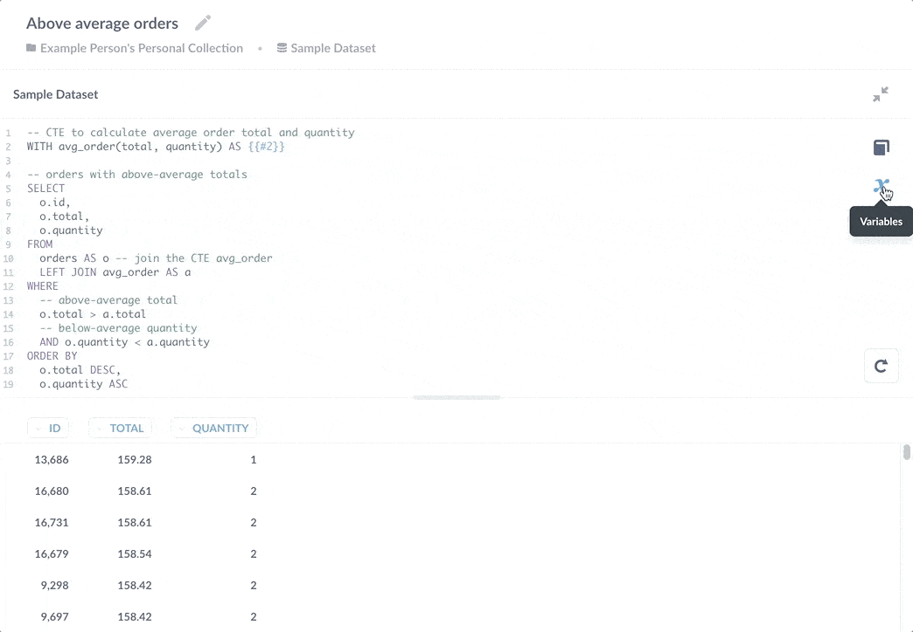
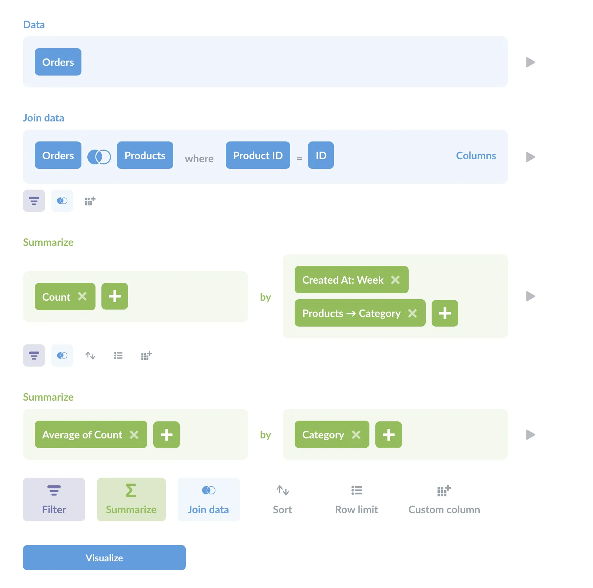

A **Common Table Expression (CTE)** is a named result set in a SQL query. CTEs help keep your code organized, and allow you to perform multi-level aggregations on your data, like finding the average of a set of counts. We'll walk through some examples to show you how CTEs work and why you would use them, using the [Sample Database](/glossary/sample_database) included with Metabase so you can follow along.

## CTE benefits

- _CTEs make code more readable._ And readability makes queries easier to debug.
- _CTEs can reference the results multiple times throughout the query._ By storing the results of the subquery, you can reuse them throughout a larger query.
- _CTEs can help you perform multi-level aggregations._ Use CTEs to store the results of aggregations, which you can then summarize in the main query.

## CTE syntax

The syntax for a CTE uses the `WITH` keyword and a variable name to create a kind of temporary table that you can reference in other parts of your query.

```sql
WITH cte_name(column1, column2, etc.) AS (SELECT ...)
```

The `AS` keyword is a bit unusual here. Normally `AS` is used to specify an alias, like `consumables_orders AS orders`, with `orders` being the alias to the right of `AS`. With CTEs, the variable `cte_name` precedes (is on the left side of) the `AS` keyword, followed by the subquery. Note that the column list `(column1, column2, etc)` is optional, provided that each column in the `SELECT` statement has a unique name.

## CTE example

Let's go through a simple example. We'd like to see a list of all orders with a `total` that's greater than the average order's total.

```sql
SELECT
  id,
  total
FROM
  orders
WHERE
-- filter for orders with above-average totals
  total > (
    SELECT
      AVG(total)
    FROM
      orders
  )
```

This query gives us:

```plaintext
|ID  |TOTAL  |
|----|-------|
|2   |117.03 |
|4   |115.22 |
|5   |134.91 |
|... |...    |
```

It seems simple enough: we have a subquery, `SELECT AVG(total) FROM orders`, nested in the `WHERE` clause that calculates the average order total. But what if grabbing the average were more involved? For example, suppose you need to filter out test orders, or exclude orders before your application launch:

```sql
SELECT
  id,
  total
FROM
  orders
WHERE
  total > (
    -- calculate average order total
    SELECT
      AVG(total)
    FROM
      orders
    WHERE
      -- exclude test orders
      product_id > 10
      AND -- exclude orders before launch
      created_at > '2016-04-21'
      AND -- exclude test accounts
      user_id > 10
  )
ORDER BY
  total DESC
```

Now the query starts losing legibility. We can rewrite the subquery as a common table expression using a `WITH` statement to encapsulate the results from that subquery:

```sql
-- CTE to calculate average order total
-- with the name for the CTE (avg_order) and column (total)
WITH avg_order(total) AS (

-- CTE query
  SELECT
    AVG(total)
  FROM
    orders
  WHERE
    -- exclude test orders
    product_id > 10
    AND -- exclude orders before launch
    created_at > '2016-04-21'
    AND -- exclude test accounts
    user_id > 10
)

-- our main query:
-- orders with above-average totals
SELECT
  o.id,
  o.total
FROM
  orders AS o
  -- join the CTE: avg_order
  LEFT JOIN avg_order AS a
WHERE
  -- total is above average
  o.total > a.total
ORDER BY
  o.total DESC
```

The CTE packages up the logic for finding the average, and separates that logic from the core query: finding the order IDs with above-average totals. Note the results of this CTE are not saved anywhere; its subquery is executed each time you run the query.

Storing this query as a CTE also makes the query easier to modify. Let's say that we also wanted to know which orders have:

- above-average totals,
- below-average quantities of items ordered.

We can easily expand the query like so:

```sql
-- CTE to calculate average order total and quantity
WITH avg_order(total, quantity) AS (
  SELECT
    AVG(total),
    AVG(quantity)
  FROM
    orders
  WHERE
    -- exclude test orders
    product_id > 10
    AND -- exclude orders before launch
    created_at > '2016-04-21'
    AND -- exclude test accounts
    user_id > 10
)

-- orders with above-average totals
SELECT
  o.id,
  o.total,
  o.quantity
FROM
  orders AS o -- join the CTE avg_order
  LEFT JOIN avg_order AS a
WHERE
  -- above-average total
  o.total > a.total
  -- below-average quantity
  AND o.quantity < a.quantity
ORDER BY
  o.total DESC,
  o.quantity ASC
```

We can also select and run only the subquery in the CTE.



As you can see in the figure above, you can also save the CTE's subquery as a [snippet](/learn/metabase-basics/querying-and-dashboards/sql-in-metabase/snippets), but you'd be better off saving a subquery as a question. The rule of thumb to decide between a snippet and a saved question is that if a block of code can return results on its own, you may want to consider saving it as a question (see [Snippets vs saved questions vs views](/learn/sql-questions/organizing-sql)).

A better case for a Snippet would be the `WHERE` clause that captures the logic for filtering for customer orders.



## CTE with a saved question

You can use the `WITH` statement to reference a saved question:

```sql
WITH avg_order(total, quantity) AS {{#2}}

-- orders with above-average totals
SELECT
  o.id,
  o.total,
  o.quantity
FROM
  orders AS o -- join the CTE avg_order
  LEFT JOIN avg_order AS a
WHERE
  -- above-average totals
  o.total > a.total
  -- below-average quantity
  AND o.quantity < a.quantity
ORDER BY
  o.total DESC,
  o.quantity ASC
```

You can see the question referenced by the variable `{{#2}}` using the **Variables sidebar**. In this case, `2` is the question's ID.



By saving that subquery as a standalone question, multiple questions would be able to reference its results. And if you need to add additional `WHERE` clauses to exclude more test orders from the calculation, each question that references that calculation would benefit from the update. The flipside of this benefit is that if you end up changing that saved question to return different columns, it would break queries that depend on its results.

## CTEs for multi-level aggregations

You can use CTEs to perform multi-level, or multi-stage, aggregations. That is, you can perform aggregations on aggregations, like taking the average of a count.

### Example: what are the average numbers of orders placed each week in each product category?

To answer this question in this section's title, we'll need to:

1. Find the count of orders per week in each product category.
2. Find the average count for each category.

You can use a CTE to find the count, then use the main query to calculate the average.

```sql
-- CTE to find orders per week by product category
WITH orders_per_week(
  order_week, order_count, category
) AS (
  SELECT
    DATE_TRUNC('week', o.created_at) as order_week,
    COUNT(*) as order_count,
    category
  FROM
    orders AS o
    left join products AS p ON o.product_id = p.id
  GROUP BY
    order_week,
    p.category
)

-- Main query to calculate average order count per week
SELECT
    category AS "Category",
    AVG(order_count) AS "Average orders per week"
FROM
  orders_per_week
GROUP BY
  category
```

Which yields:

```plaintext
|Category |Average orders per week|
|---------|-----------------------|
|Doohickey|19                     |
|Gizmo    |23                     |
|Widget   |25                     |
|Gadget   |24                     |
```

### Multi-level aggregation in the query builder

Just to provide a birds-eye view of what's going on in this query, here's what the above query would look like in Metabase's query builder:



You can clearly see the two stages of aggregation (the two **Summarize** sections). As this shows, even when you're writing SQL queries, the **Query Builder** can be a great tool for poking around the data and helping you plan your approach.

## Using multiple CTEs in a single query

You can use multiple CTEs in the same query. All you need to do is separate their names and subqueries with a comma, like so:

```sql
-- first CTE
WITH avg_order(total) AS (
  SELECT
    AVG(total)
  FROM
    orders
),
-- second CTE (note the preceding comma)
avg_product(rating) AS (
  SELECT
    AVG(rating)
  FROM
    products
)
```

## Reading

You can check out some more CTEs in action in our article on [Working with dates in SQL](/learn/grow-your-data-skills/learn-sql/working-with-sql/dates-in-sql), including a example that uses a [CTE to join to itself](/learn/grow-your-data-skills/learn-sql/working-with-sql/dates-in-sql#compare-week-over-week-totals).
