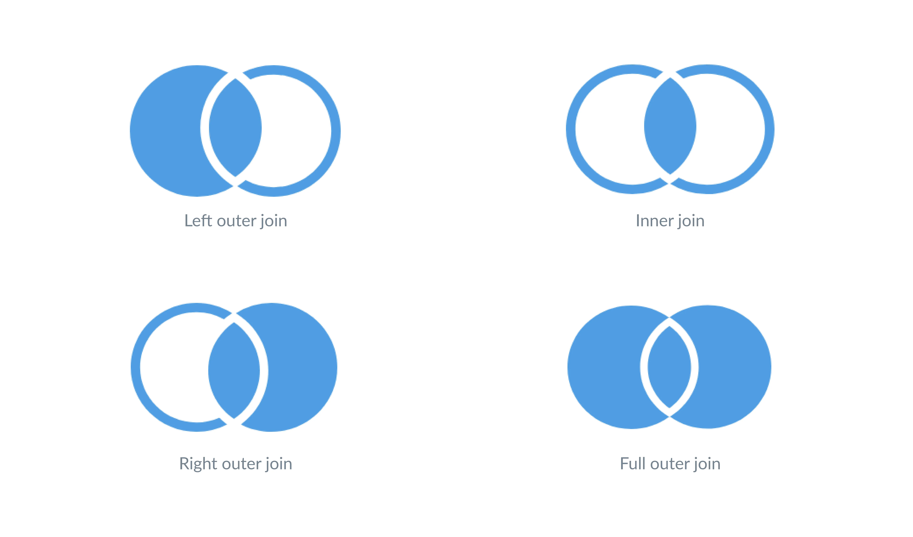

This article looks at different types of SQL joins. If you're new to the subject you may want to check out the [SQL joins article][sql-joins] as well. Please note that joins only work with relational databases.

## Quick review of SQL Join Types

A SQL join tells the database to combine columns from different tables. We normally join tables by matching the [foreign keys](/glossary/foreign_key) in one table to the [primary keys](/glossary/primary_key) in another. For example, every record in the `products` table has a unique ID in the `products.id` field: that's the primary key. To match the key, every record in `orders` has a product ID in the `orders.product_id` field: that's a foreign key. If we want to combine information about an order with information about the product that was ordered, we can do an inner join:

```sql
SELECT
  orders.total as total,
  products.title as title
FROM
  orders INNER JOIN products
ON
  orders.product_id = products.id
```

It's very important that we use `Orders.product_id` and not `Orders.id` in the join: both fields are just numbers, so some order IDs will match some product IDs, but those matches will be meaningless.

## The problem with SQL joins explained

Even if we use the correct fields, there is a trap here for the unwary. It's easy to check that every record in `Orders` contains a product ID---a count of the number of null values in `Orders.product_id` returns 0:

```sql
SELECT
  count(*)
FROM
  orders
WHERE
  orders.product_id IS NULL
```

```plaintext
| count(*) |
| -------- |
| 0        |
```

But what if things _don't_ always match? For example, suppose we're trying to find out which products lack reviews. If we look at the `reviews` table, it has 1,112 entries:

```sql
SELECT
  count(*)
FROM
  reviews
```

```plaintext
| count(*) |
| -------- |
| 1112     |
```

Every single review refers to a product:

```sql
SELECT
  count(*)
FROM
  reviews
WHERE
  reviews.product_id IS NULL
```

```plaintext
| count(*) |
| -------- |
| 0        |
```

But does every product have reviews? To find out, let's count the number of products:

```sql
SELECT
  count(*)
FROM
  products
```

```plaintext
| count(*) |
| -------- |
| 200      |
```

We can then combine the `products` and `reviews` table and count the number of distinct products in the result. (In real life we'd probably use `SELECT COUNT(DISTINCT product_id) FROM reviews` to get this number, but using `INNER JOIN` helps us illustrate the idea.)

```sql
SELECT
  count(distinct products.id)
FROM
  products INNER JOIN reviews
ON
  products.id = reviews.product_id
```

```plaintext
| count(*) |
| -------- |
| 176      |
```

Only 176 of the 200 products have any reviews. As a result, if we count the number of reviews for each product, we'll only get the counts where there were some reviews---our query won't tell us anything about products that lack reviews because the inner join won't find any matching when combining the tables. This query demonstrates the problem:

```sql
SELECT
  products.title as title, count(*) as number_of_reviews
FROM
  products INNER JOIN reviews
ON
  products.id = reviews.product_id
GROUP BY
  products.id
ORDER BY
  number_of_reviews ASC
```

```plaintext
| products.title            | number_of_reviews |
| ------------------------- | ----------------- |
| Rustic Copper Hat         |                 1 |
| Incredible Concrete Watch |                 1 |
| Practical Aluminum Coat   |                 1 |
| Awesome Aluminum Table    |                 1 |
| ...                       |               ... |
```

We've ordered the result in ascending order by count; as this shows, the lowest count is 1, when it should be 0.

## Outer SQL join types to the rescue

All right: we know how many products don't have reviews, but which ones are they? One way to answer that question is to use the type of SQL join known the left outer join, also called a "left join". This kind of join always returns at least one record from the first table we mention (i.e., the one on the left). To see how it works, imagine we have two little tables called `paint` and `fabric`. The `paint` table contains three rows:

```plaintext
| brand     | color |
| --------- | ----- |
| Premiere  | red   |
| Premiere  | blue  |
| Special   | blue  |
```

while the `fabric` table contains just two rows:

```plaintext
| kind   | shade |
| ------ | ----- |
| nylon  | green |
| cotton | blue  |
```

If we do an inner join on these two tables, matching `paint.color` to `fabric.shade`, only the `blue` records match:

```sql
SELECT
  *
FROM
  paint INNER JOIN fabric
ON
  paint.color = fabric.shade
```

```plaintext
| paint.brand | paint.color | fabric.kind | fabric.shade |
| ----------- | ----------- | ----------- | ------------ |
| Premiere    | blue        | cotton      | blue         |
| Special     | blue        | cotton      | blue         |
```

Nothing in the `fabric` table is red, so the first record from `paint` isn't included in the result. Similarly, nothing from `paint` is green, so the nylon material from `fabric` is discarded as well.

If we do a left outer join, though, the database keeps every record from the left table that lacks a match. Since there aren't matching values from the right table, SQL fills in those columns with `NULL`:

```sql
SELECT
  *
FROM
  paint LEFT JOIN fabric
ON
  paint.color = fabric.shade
```

```plaintext
| paint.brand | paint.color | fabric.kind | fabric.shade |
| ----------- | ----------- | ----------- | ------------ |
| Premiere    | red         | NULL        | NULL         |
| Premiere    | blue        | cotton      | blue         |
| Special     | blue        | cotton      | blue         |
```

Keeping all of the records from the left table turns out to be useful in a lot of different situations. For example, if we want to see which paints don't have matching fabrics, we can do a left outer SQL join:

```sql
SELECT
  *
FROM
  paint LEFT OUTER JOIN fabric
ON
  paint.color = fabric.shade
```

```plaintext
|  paint.brand | paint.color | fabric.kind  | fabric.shade |
| ------------ | ----------- | ------------ | ------------ |
| Premiere     | red         | NULL         | NULL         |
| Premiere     | blue        | cotton       | blue         |
| Special      | blue        | cotton       | blue         |
```

This is easier to read if we select only the rows where the values from the right-hand table are `NULL`:

```sql
SELECT
  *
FROM
  paint LEFT OUTER JOIN fabric
ON
  paint.color = fabric.shade
WHERE
  fabric.shade IS NULL
```

```plaintext
|  paint.brand | paint.color | fabric.kind  | fabric.shade |
| ------------ | ----------- | ------------ | ------------ |
| Premiere     | red         | NULL         | NULL         |
```

We can use this technique to get a list of products that don't have any reviews by doing a left outer join and keeping only the rows where `reviews.product_id` has been filled in with `NULL`:

```sql
SELECT
  products.title
FROM
  products LEFT OUTER JOIN reviews
ON
  products.id = reviews.product_id
WHERE
  reviews.product_id IS NULL
```

```plaintext
| products.title          |
| ----------------------- |
| Small Marble Shoes      |
| Ergonomic Silk Coat     |
| Synergistic Steel Chair |
| ...                     |
```

## What about right outer SQL join and full outer join?

The SQL standard defines two other kinds of SQL join types for the outer join, but they are used much less often---so much less than some databases don't even implement them. A **right outer join** works exactly like a left outer join, except it always keeps rows from the right table and fills columns from the left table with `NULL` when there aren't matches. It's pretty easy to see that you can always use a left outer join instead of a right one by swapping the tables around; there's no particular reason to favor one over the other, but almost everyone uses the left-handed form, so we suggest you do too.

A **full outer join** keeps all of the information from both tables. If a record on the left lacks a match on the right, the database will fill in the missing right-hand values with `NULL`, and if a record on the right lacks a match on the left, it fills in the missing left-hand values. For example, if we do a full outer join on `paints` and `fabrics` we get:

```plaintext
|  paint.brand | paint.color | fabric.kind  | fabric.shade |
| ------------ | ----------- | ------------ | ------------ |
| Premiere     | red         | NULL         | NULL         |
| Premiere     | blue        | cotton       | blue         |
| NULL         | NULL        | nylon        | green        |
| Special      | blue        | cotton       | blue         |
```

Full outer joins are occasionally useful for finding the overlap between two tables, but in twenty years of writing SQL, I have only ever used them in lessons like this one.

## Which SQL join type to use?

To review, there are four basic types of joins. Inner joins only keep records that match, and the other three types fill in missing values with `NULL`. Some people think of the left table as the main or initial table; the type of join you use will determine how many records from that initial table you'll return, as well as any additional records you'll return based on the columns you want from the other table. We've already seen exceptions to this here (there were multiple reviews for each product, for example), but that's a good sign you have a good primary table to start with.



In general, you'll only really need to use inner joins and left outer joins. Which join type you use depends on whether you want to include unmatched rows in your results:

- If you need unmatched rows in the primary table, use a left outer join.
- If you don't need unmatched rows, use an inner join.

For another angle on joins that abstracts away the SQL, check out our [article on joins using Metabase's query builder][query-builder].

## Common problems with SQL joins

### Doing an inner SQL join instead of an outer join

This is probably the most common error. Real data often has gaps, and inner joins will discard records without warning you whenever keys don't line up. Counting the number of rows from one table that _don't_ have matches in another is a good safety check; if there are any, you should think about using an outer join instead of an inner one.

### Using SQL joins on "matches" that aren't meaningful

A person's weight in kilograms and the value of their last purchase in dollars are both numbers, so it's possible to do a join by matching them, but the result will (probably) be meaningless. A less frivolous example comes up when one table contains several foreign keys that refer to different tables, which can lead to joining patient data with vehicle registrations instead of appointment dates. Declaring foreign keys in tables can help prevent this.

### Confusing NULLs in data with NULLs from mis-matches

If one of the tables in an outer join contains `NULL`s, we may wind up with a column with values that are missing because they weren't in the original data and because of mismatches. Depending on the problem we're trying to solve, these different "flavors" of `NULL` may matter.

[query-builder]: /learn/building-analytics/notebook-editor/joins-in-metabase
[sql-joins]: /learn/building-analytics/sql-templates/sql-joins
