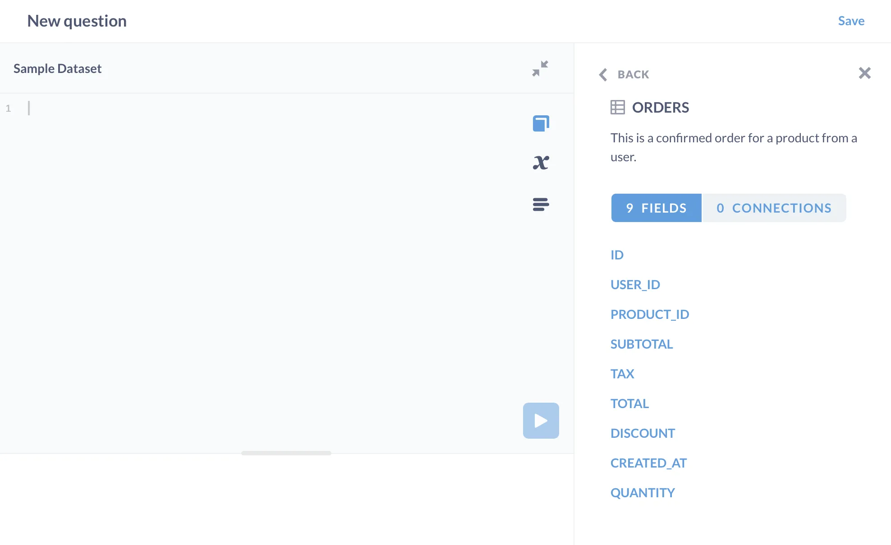
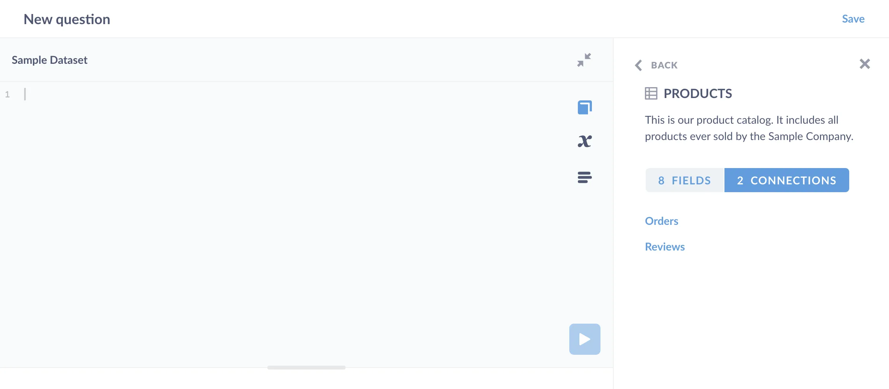

You have data in one table that you want to combine with data from another table. To do that, you'll need to use a `JOIN` to tell your database how the rows from one table relate to the rows in the other table. (Note that joins only work with relational databases.)

For a background on joins, check out [Joins in Metabase](/learn/metabase-basics/querying-and-dashboards/questions/joins-in-metabase), which walks through how to create joins using the query builder---no code necessary. Note that the term "join" is somewhat misleading, as you're not connecting the tables. You're taking the rows from two (or more) different tables and returning a _new_ set of rows that combines columns in both tables.

This article shows how to create joins using SQL, and you can follow along in Metabase by clicking on **+ New**, choosing **SQL Query**, and selecting **Raw data** > **Sample database**.

## Example join using the Sample Database

Let's say we want to ask a question that returns rows with columns from multiple tables. For example, we want to know the order date, ID, and total, but also include some info about the product ordered. Here's the table we want to produce:

```plaintext
| Order date | Order ID | Product Title       | Product Category | Product Rating | Order total |
|------------|----------|---------------------|------------------|----------------|-------------|
| 12/25/2016 | 448      | Rustic Paper Wallet | Gizmo            | 4.6            | 30.86326113 |
| ...        | ...      | ...                 | ...              | ...            | ...         |
```

Now let's take a look at the tables in our Sample Database. We'll find that we can get the necessary columns from two tables, the `orders` table:

```plaintext
| ID  | Person | Product ID | Subtotal    | Tax  | Total       | Discount | Created At | Quantity | Person       | Product ID             |
|-----|--------|------------|-------------|------|-------------|----------|------------|----------|--------------|------------------------|
| 1   | 1      | 14         | 37.64814539 | 2.07 | 39.71814539 |          | 2/11/2019  | 2        | Hudson Borer | Awesome Concrete Shoes |
| ... | ...    | ...        | ...         | ...  | ...         | ...      | ...        | ...      | ...          | ...                    |
```

and the `Products` table:

```plaintext
| ID  | Ean           | Title               | Category | Vendor                       | Price       | Rating | Created At |
|-----|---------------|---------------------|----------|------------------------------|-------------|--------|------------|
| 1   | 1018947080336 | Rustic Paper Wallet | Gizmo    | Swaniawski, Casper and Hilll | 29.46326113 | 4.6    | 7/19/2017  |
| ... | ...           | ...                 | ...      | ...                          | ...         | ...    | ...        |
```

Note that in the **SQL Editor**, you can view info about the tables and fields in your database by clicking on the **book icon** to open up the data reference sidebar. Much of the work of learning how to join tables is getting to know the tables you're working with and how they relate to each other.



We'll need to grab columns from both of these tables to produce our target results, and we'll do that using a join.

### The query

Here's the answer up front:

```sql
SELECT
  o.created_at AS "order date",
  o.id AS "order id",
  p.title AS "product title",
  p.category AS "product category",
  p.rating AS "product rating",
  o.total AS "order total"
FROM
-- joining orders to products
  orders AS o
  JOIN products AS p ON o.product_id = p.id
```

Note that the comment (the line starting with `--`) isn't necessary. It's just there to point out the key part of the code: the join statement.

This query tells the database that the rows in the `Orders` table can be combined with the rows in the `Products` table by "lining up" the foreign keys in the `Orders` table to the entity keys (also called the primary keys) of the `Products` table. We've also aliased each table (`orders AS o` and `products AS p`), so you can tell in the `SELECT` statement which table each field comes from (`o.created_at` comes from the `orders` table, and so on).

By entity key, we mean a column in a table that contains each row's unique identifier. In the `Orders` table, each row is an order with an ID. The same is true of products in the `Products` table: each row is a product with an ID. By foreign key, we mean a column that references the entity key in another table. In this case, the `Orders` table contains a `product_id`, which refers to a specific row in the `Products` table. If we check the `Products` table in the **Data Reference sidebar**, we'll see that it has two connections, one to the `Orders` table, and one to the `reviews` table.



We could get the same results by combining every row in `Products` with every row in `Orders` and then filtering with a `WHERE` clause like this:

```sql
SELECT
  o.created_at as "order date",
  o.id as "order id",
  p.title as "product title",
  p.category as "product category",
  p.rating as "product rating",
  o.total as "order total"

-- a join using a WHERE clause to "line up" the entity and foreign keys
FROM
  orders AS o,
  products AS p
WHERE
  o.product_id = p.id
```

This query says: combine every row from the `Orders` table with every row from the `Products` table, then filter the results to include only the rows where the `product_id` in the `Orders` table matches the `id` in the `Products` table. We recommend that you use the first form (with `ON`) to avoid confusion: `ON` _always_ introduces the condition for a join, while `WHERE` is used for all kinds of filtering. For more, check out [Best practices for writing SQL queries][sql-best-practices].

Let's dial in on that join statement:

```sql
FROM
-- joining orders to products
  orders AS o
  JOIN products AS p ON o.product_id = p.id
```

When you join tables, you use the `ON` keyword to specify which field in Table A (`Orders`) corresponds to Table B (`Products`), so the database understands how to "line up" the data. `o.product_id = p.id` is an expression that resolves to true or false; the database will only return rows where the expression is true.

## Joining multiple tables

You can chain multiple joins by listing each join type and its condition. Here's a join that includes fields from the `people` table:

```sql
SELECT
  *
FROM
  orders AS o
  JOIN products AS p ON o.product_id = p.id
  JOIN people AS u ON o.user_id = u.id
```

You'll need to do a lot of horizontal scrolling here, as this query will yield many columns (all columns from each table, in fact). And you'll see duplicate information row to row. For example, the results will repeat the customer address for each order the customer has placed.

```plaintext
| ID  | USER_ID | PRODUCT_ID | SUBTOTAL    | TAX | TOTAL       | DISCOUNT | CREATED_AT       | QUANTITY | ID  | EAN           | TITLE               | CATEGORY | VENDOR                       | PRICE       | RATING | CREATED_AT      | ID  | ADDRESS                 | EMAIL                  | PASSWORD                             | NAME         | CITY    | LONGITUDE  | STATE | SOURCE | BIRTH_DATE | ZIP   | LATITUDE | CREATED_AT    |
|-----|---------|------------|-------------|-----|-------------|----------|------------------|----------|-----|---------------|---------------------|----------|------------------------------|-------------|--------|-----------------|-----|-------------------------|------------------------|--------------------------------------|--------------|---------|------------|-------|--------|------------|-------|----------|---------------|
| 448 | 61      | 1          | 29.46326113 | 1.4 | 30.86326113 |          | 12/25/2016 22:19 | 2        | 1   | 1018947080336 | Rustic Paper Wallet | Gizmo    | Swaniawski, Casper and Hilll | 29.46326113 | 4.6    | 7/19/2017 19:44 | 61  | 7100 Hudson Chapel Road | labadie.lina@gmail.com | 2da78e08-2bf7-41b8-a737-1acd815fb99c | Lina Labadie | Catawba | -81.017265 | NC    | Google | 3/28/1984  | 28609 | 35.69917 | 6/5/2016 4:03 |
| ... | ...     | ...        | ...         | ... | ...         | ...      | ...              | ...      | ... | ...           | ...                 | ...      | ...                          | ...         | ...    | ...             | ... | ...                     | ...                    | ...                                  | ...          | ...     | ...        | ...   | ...    | ...        | ...   | ...      | ...           |
```

In the query above, you can cut down on the number of columns returned by replacing the `*` in the `SELECT` statement to specify only the columns you need.

## Joins on multiple conditions

You can include multiple true/false expressions in the `ON` statement to restrict results. These true/false expressions are known as **predicates**. We've already been using predicates to join the tables above, like `o.user_id = u.id`.

Let's say we want to know:

- the average price for orders,
- by product category,
- that sold at full price.

We'll need to calculate the unit price using data from the `Orders` table, and grab the product category and listed price from the `Products` table. Here's our query:

```sql
SELECT
  p.category AS "Product category",
  AVG(p.price) AS "Average price",
  COUNT(*) AS "Count of full price orders"
FROM
  orders AS o
  -- first predicate
  JOIN products AS p ON o.product_id = p.id
  -- second predicate: calculate the unit price
  -- and see if it corresponds to the product's listed price.
  AND o.subtotal / o.quantity = p.price
WHERE
  -- guard against divide-by-zero scenarios
  o.quantity > 0
GROUP BY
  p.category
ORDER BY
  COUNT(*) DESC
```

Which gives us:

```plaintext
|Product category|Average price|Count of full price orders|
|----------------|-------------|--------------------------|
|Widget          |54.96699655  |168                       |
|Gizmo           |51.49700878  |137                       |
|Gadget          |54.87034242  |136                       |
|Doohickey       |51.69197973  |123                       |
```

## Different types of joins

The particular type of join we've been using throughout this article is known as an **inner join**. There are other ways you can join tables; see our article on [SQL join types][sql-join-types].

[sql-best-practices]: /learn/grow-your-data-skills/learn-sql/working-with-sql/sql-best-practices
[sql-join-types]: /learn/grow-your-data-skills/learn-sql/working-with-sql/sql-join-types
