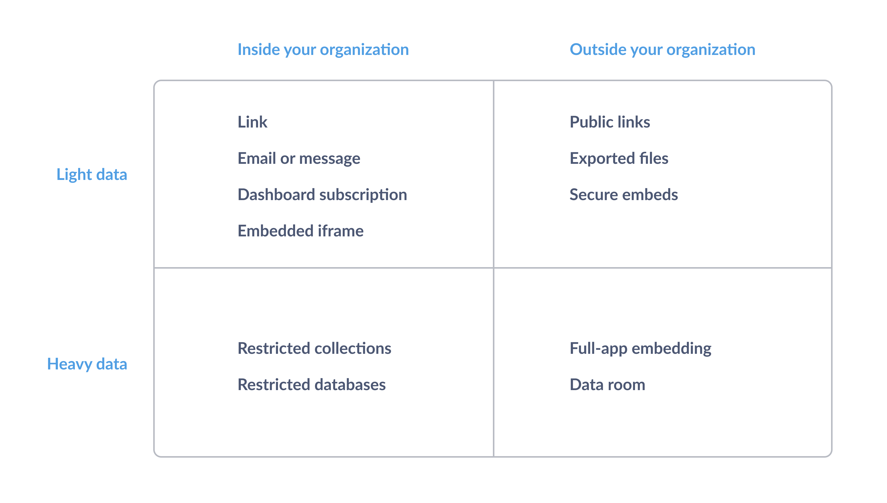
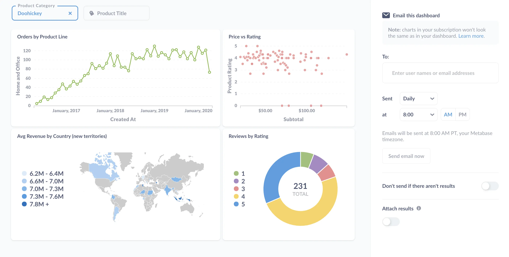
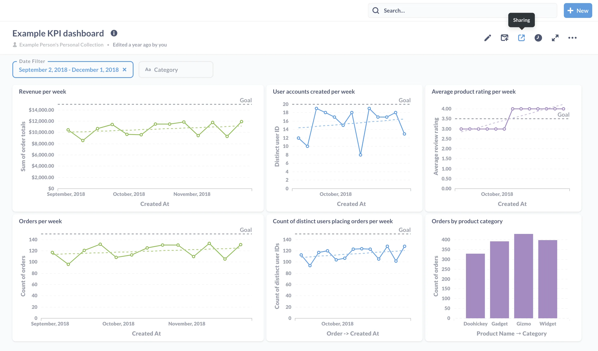

You've got data, and you'd like (or are required) to share it. Whether that data is a single question or a full [data room](#data-room) with access to multiple databases, we'll walk through the different ways you can share data with Metabase.

## Whom are you sharing your data with?

To determine how to share the data, there are fundamentally two questions you need to ask:

- _whom_ you're sharing the data with
- and how _heavy_ that data is.

Whom you're sharing data with breaks down into two realms: inside your organization, and outside your organization. Data weight in this context refers to how much data you're sharing: are you sharing a single question, or do you need to share a collection, which could include a curated set of questions and dashboards? For more privileged access, you may need to share entire tables or databases.

We'll walk through options for all cases, but here's an overview (figure 1).



## Inside the organization

Sharing with team members who have access to Metabase is as simple as messaging or emailing someone a link to a saved question, dashboard, or collection.

### Lightweight data inside the org

You have a lot of options for sharing data internally.

#### Link

The simplest (and most frequently overlooked) option is that you can just copy the URL of a saved question from the browser bar and send it to a colleague. For question #123, the URL would look something like:

```url
https://www.website-name.com/question/123
```

You can also throw together a dashboard with a set of questions and send them a link to that. The dashboard doesn't need to be persistent, i.e., something you'd look at regularly. It can be just a one-off report capturing the data around an incident or a particularly successful campaign.

#### Export and send

You can email or message someone a link, but you can also export the results of a question to CSV, XLSX, or JSON, then email those files, or upload them to a shared drive.

#### Dashboard subscriptions

For an automated approach, you can also set up a [dashboard subscription](/docs/latest/dashboards/subscriptions) via email or Slack.



You can send scheduled emails or Slack messages that include all of the questions on a dashboard (minus the text cards). You can email a dashboard subscription to any Metabase user or to any email address, so even folks who don't have accounts on your Metabase can receive the data---they just won't be able to click on a chart in their email to view it in Metabase.

#### Embedded iframe

If you want more control, you can situate your questions and dashboards in a narrative context by [embedding them](/docs/latest/embedding/start) in a web page. This could be in a blog, company wiki, or your web application.

For non-sensitive data, you can use a [public embed](/docs/latest/embedding/public-links#public-embeds). Metabase will provide you with HTML code for an iframe (an inline frame element) that you can just drop in your site, or anywhere else that renders HTML.

If all you really need to do is just add some narration, you can even skip the embed. You could use [text cards on a dashboard][markdown-cards] (which support Markdown) to frame the questions on your dashboard in a narrative context.

### Heavyweight data inside the org

If sharing all your data would be too big a load, you have lots of options sharing different slices of it.

#### Selectively grant access to collections

Here's where we get into permissions. You can create questions and dashboards and organize them in collections. You can organize your collections by department, data, or project, and [set permissions on those collections][collection-permissions].

Note that collections and permissions can also come in handy once people fill up your Metabase with questions and dashboards. See our guide to [keeping your analytics organized][same-page].

#### Selectively grant access to tables and databases

If you need to restrict access to tables or even entire databases, you can also [set permissions on databases][data-permissions].

## Outside the organization

When you need to share data outside of your organization, the game changes. And how you share may depend on how far outside the organization people are. Are they contractors? Customers? Investors? Auditors?

### Lightweight data outside the org

For sharing lightweight data outside of your organization, you once again have a few options.

#### Public link

If the person lacks an account on your Metabase, and if the data isn't sensitive, you can send a [public link to a question or dashboard][embedding-charts-dashboards]. From a dashboard, you'll click on the **Sharing icon** (arrow pointing up and to the right) to get your public link.



The public link would look something like:

```url
https://www.website-name.com/public/dashboard/07f68133-46e0-4bb5-97b5-88d65581dfcz
```

Public links are visible to anyone who has the unique link. Viewers of public links will also be able to update the question's filters (if any), so you can't depend on filters to conceal data. You can disable a public link at any time. If you want to share that item again, Metabase will generate a different link to share (any previously generated links will remain invalid).

#### Exported files

You can export data to CSV, XLSX and JSON file formats, and email those files to people or share the files on a drive.

#### Secure embeds

For more sensitive data, or if you want to lock a parameter to filter the results, you'll need to use a [secure embed](/docs/latest/embedding/static-embedding). In that case, you'd need to give your viewers access to the web app where you're embedding the chart or dashboard (not your Metabase), so that you can sign the token they'll need to view it with the parameters you've set. Learn more about [embedding charts and dashboards][embedding-charts-dashboards] with the open source edition of Metabase.

### Heavyweight data outside the org

For more sensitive, customer-specific data, or for large amounts of data, you have a couple of options for sharing outside of your organization.

#### Interactive embedding

For a more curated experience that still gives people the freedom to analyze the data on their own, you can embed the entire Metabase instance in your app, which allows you to set up [multi-tenant, self-service analytics][multi-tenant] to share data with customers or vendors in your web app. When combined with [data sandboxing](/docs/latest/permissions/data-sandboxes), you can create custom access to both [rows][sandboxing-rows] and [columns][sandboxing-columns] of your tables, which allows people to explore the data via the [drill-through menu](/learn/metabase-basics/querying-and-dashboards/questions/drill-through) without being able to see any data they shouldn't (like the records of another customer, for example).

#### Data room

If we're talking about fundraising, acquisition, getting audited, or litigation, data sharing can be _invasive_. If you're looking to raise funding, you can present a curated set of dashboards that tell a tidy story, but these potential investors will also want to slice the data to vet your story from different angles. And the best way to share that kind of data is via a data room.

A data room is a virtual space created to provide privileged, read-only access to a significant amount of data. This data room could include all your data, or a bounded set of data with fairly low-level access. You can include [interactive dashboards][custom-destinations] to give a custom tour of the data, but the idea with a data room is that people with access to it should be able to perform their own analysis.

To create a data room with Metabase, you have essentially two options: create a group in your existing Metabase, or set up a new Metabase instance.

The first option is simply to [create a new group](/docs/latest/people-and-groups/managing) in your existing Metabase, and [give that group access](/docs/latest/permissions/introduction) to the requested datasets---and only those datasets---as well as any relevant collections of dashboards and questions for that data. Effectively, that group's permissions define the "dimensions" of that data room.

The second option entails setting up a new, standalone Metabase instance and connecting it to the relevant databases. Metabase is [trivial to set up][installation], so it's not much more work than creating a group. Once it's up, you'll need to recreate any collections, dashboards, and questions that you'd want to include for your audience, in addition to giving the people you want to share the data with access to the raw tables. If you already have these collections and dashboards in your "mothership" Metabase instance, you could use the [serialization feature][serialization] to dump the application data relevant to the data room, and load those items into the data room instance.

[collection-permissions]: /learn/permissions/collection-permissions
[custom-destinations]: /learn/metabase-basics/querying-and-dashboards/dashboards/custom-destinations
[data-permissions]: /learn/permissions/data-permissions
[embedding-charts-dashboards]: /learn/embedding/embedding-charts-and-dashboards
[installation]: /docs/latest/installation-and-operation/installing-metabase
[markdown-cards]: /learn/metabase-basics/querying-and-dashboards/dashboards/markdown
[multi-tenant]: /learn/embedding/multi-tenant-self-service-analytics
[same-page]: /learn/metabase-basics/administration/administration-and-operation/same-page
[sandboxing-columns]: /learn/permissions/data-sandboxing-column-permissions
[sandboxing-rows]: /learn/permissions/data-sandboxing-row-permissions
[serialization]: /learn/administration/serialization
