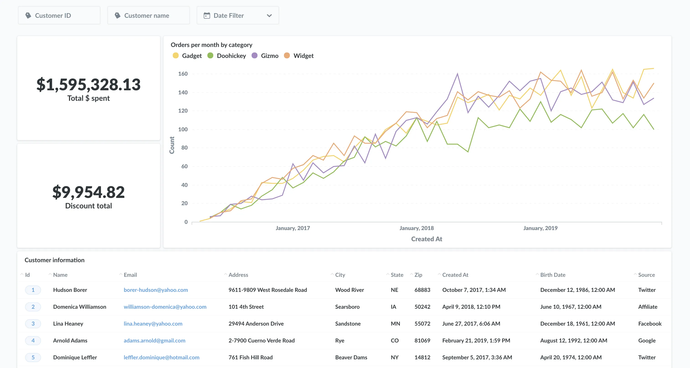
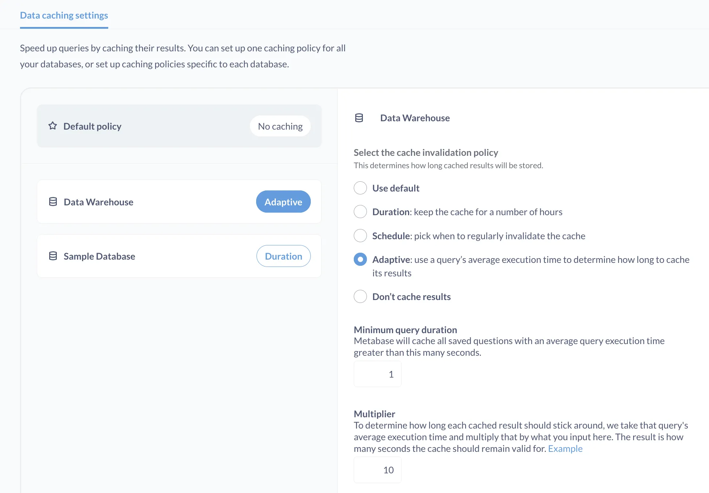

When it comes to dashboard performance, there are essentially four ways to get dashboards to load faster:

- [Ask for less data](#ask-for-less-data).
- [Cache answers to questions](#cache-answers-to-questions).
- [Organize data to anticipate common questions](#organize-data-to-anticipate-common-questions).
- Ask efficient questions.



What follows is some general guidance for how to get your dashboards to load faster. The bulk of this guidance will focus on that third bullet, or how you can organize data to anticipate the most common questions that data will be used to answer.

The usual caveats about premature optimization being the root of all evil apply. Our advice assumes that you have been exploring your data for some time, and are deriving material benefits from the insight that data yields. Only then should you be asking, "How do I get this dashboard to load faster?"

## Ask for less data

This point is almost too obvious that it often goes overlooked, but it should be the first place to start. Do you actually need the data you're querying? And even if you do need all that data, how often do you need it?

You can save a lot of time simply by restricting the data you query, such as by including adding a [default filter on a dashboard][filters]. Be especially mindful of data spanning time and space: do you really need to look at the last quarter's worth of data every day? Or do you really need every transaction for every country?

And even if you _do_ need to know that information, do you need it every day? Could you relocate that question to another dashboard that's typically only reviewed weekly or monthly?

We should be open to all our data when we're exploring our datasets, but once we settle on the kinds of decisions our organization needs to make---and the data we need to inform those decisions---we should be ruthless about excluding data that does not significantly improve our analysis.

## Cache answers to questions

You don't need to wait for data if it's already loaded. Admins can set up Metabase to [cache query results][caching], which will store answers to questions. If you have a set of dashboards that everyone runs when they open up their computers first thing in the morning, run that dashboard ahead of time, and the questions in that dashboard will use the saved results for subsequent runs to load in seconds. People will have the option to refresh the data, but typically this is unnecessary, as most often people will only need to review data from the previous day and before.

Admins can configure caching rules in the **Performance** tab of the **Admin Panel**. You can choose to keep the cache for a number of hours, use a set schedule to invalidate the cache, or use a query’s average execution time to determine how long to cache its results.



On [Pro and Enterprise plans](/pricing/) you can also set caching policies specific to individual dashboards and questions.

You can use Metabase's [usage analytics][metabase-analytics] to determine when people typically run various questions, then create a script using [Metabase's API](/docs/latest/api) to programmatically run these questions (thereby caching their results) ahead of time. That way, when people log in and navigate to their dashboards, the results load in seconds. Even without taking that extra "pre-warming" step, when your first person loads that slow query, it'll be cached for the rest of your folks.

## Organize data to anticipate common questions

The next best thing you can do is organize your data in such a way that it anticipates the questions that will be asked, which will make it easier for your database to retrieve that data.

- [Index frequently queried columns](#index-frequently-queried-columns).
- [Replicate your database](#replicate-your-database).
- [Denormalize data](#denormalize-data).
- [Materialize views: create new tables to store query results](#materialize-views-create-new-tables-to-store-query-results).
- [Aggregate data ahead of time with summary tables](#aggregate-data-ahead-of-time-with-summary-tables).
- [Pull data out of JSON and slot its keys into columns](#pull-data-out-of-json-and-slot-its-keys-into-columns).
- [Consider a database specific to analytics](#consider-a-database-optimized-for-analytics).

All but that last section below assumes you are using a traditional relational database like PostgreSQL or MySQL. That last section is about moving to a completely different type of database tuned specifically to handle analytics, and should be your last resort, especially for startups.

### Index frequently queried columns

Adding indexes to your database can significantly improve query performance. But just as it wouldn't make sense to index everything in a book, indexes do incur some overhead, so they should be used strategically.

How to use indexes strategically? Find your most queried tables, and the most commonly queried columns in those tables. You could consult your individual database to get this metadata. For example, PostgreSQL offers metadata on query numbers and performance via its [pg_stat_statements](https://www.postgresql.org/docs/current/pgstatstatements.html) module.

Remember to do the simple work of asking your Metabase users which questions and dashboards are important to them, and if they're experiencing any "slowness" as well. Fields that most often require indexing are either time-based or id-based---think timestamps on event data, or IDs on categorical data.

Alternatively, on [Pro and Enterprise plans](/pricing/), you can use Metabase's [usage analytics][metabase-analytics], which makes it easy to see who is running which queries, how often, and how long those queries took to return records.

Once you've identified the tables and columns you'd like to index, consult your database's documentation to learn how to set up indexes (for example, here's [indexing in PostgreSQL][postgres-indexing]).

Indexes are easy to set up (and take down). Here's the basic format for a `CREATE INDEX` statement:

```sql
CREATE INDEX index_name ON table_name (column_name)
```

For example:

```sql
CREATE INDEX orders_id_index ON orders (id)
```

Experiment with indexing to see how you can improve query performance. If your users are commonly using multiple filters on a single table, investigate using compound indexes.

### Replicate your database

If you are using a database for handling both operations (e.g., app transactions like placing orders, updating profile information, etc.) as well as for analytics (e.g., for queries that power Metabase dashboards), consider creating a replica of that production database for use as an analytics-only database. Connect Metabase to that replica, update the replica each night, and let your analysts query away. Analysts' long-running queries won't interfere with the day-to-day operations of your production database, and vice versa.

Outside of making your dashboards faster, keeping a replica database for data analytics is a good practice to follow to avoid potentially long-running analytical queries impacting your production environment.

### Denormalize data

In some cases, it might make sense to [denormalize][denormalization] some of your tables (i.e., to combine multiple tables into a larger table with more columns). You'll end up storing some redundant data (such as including user information each time the user places an order), but analysts won't have to join multiple tables to get the data they need to answer their questions.

### Materialize views: create new tables to store query results

With [materialized views][materialized-view], you'll keep your raw, denormalized data in their tables, and create new tables (typically during off hours) to store query results that combine data from multiple tables in a way that anticipates the questions analysts will ask.

For example, you might store order and product information in different tables. You could, once a night, create (or update) a materialized view that combines the most frequently queried columns from both of those tables, and connect that materialized view to your questions in Metabase. If you're using a database for both production and analytics, in addition to eliminating the joining process needed to combine that data, your queries won't have to compete with production reads and writes on those tables.

The difference between a materialized view and a [Common Table Expression](/glossary/cte) (CTE, sometimes called a view), is that the materialized view stores its results in the database (and therefore can be indexed). CTEs are essentially subqueries, and are computed each time. They may be cached, but they are not stored in the database.

Materialized views will, however, consume resources in your database, and you will have to update the view manually (`refresh materialized view [name]`).

### Aggregate data ahead of time with summary tables

The idea here is to use materialized views---or even a separate set of tables---to create [summary tables](https://mariadb.com/kb/en/data-warehousing-summary-tables/) that minimize computation. Say you have tables with a million rows, and you want to aggregate data in multiple columns. You can create a materialized view based on aggregations of one or more tables, which will perform the initial (time-consuming) computation. Rather than have a dashboard query and compute that raw data several times throughout a day, you could instead create questions that query that summary table to get the data computed the night before.

For example, you could have an orders table that contains all of the orders table, and an order summary table that updates nightly and stores rollups and other aggregated data, such as order totals per week, month, etc. If a person wants to view the individual orders used to compute that aggregate, you can use [custom destinations][custom-destinations] to link users to a question or dashboard that _does_ query the raw data.

### Pull data out of JSON and slot its keys into columns

We often see organizations storing JSON objects in a single column of a relational database like MySQL or PostgreSQL. Typically, these organizations are storing JSON payloads from event analytics software like [Segment][segment], or [Amplitude][amplitude].

Though some databases can index JSON (PostgreSQL can index JSON binaries, for example), you still have to grab the full JSON object each time, even if you're only interested in a single key-value pair in the object. Instead, consider extracting each field from these JSON objects and mapping those keys to columns in a table.

### Consider a database optimized for analytics

If you've done all of the above, and the length of your dashboard loading times are still interfering with your ability to make decisions in a timely manner, you should consider using a database that is structured specifically for fielding analytical queries. These databases are known as Online Analytics Processing (OLAP) databases (sometimes called data warehouses).

Traditional relational databases like PostgreSQL and MySQL are designed for transaction processing, and are categorized as Online Transaction Processing (OLTP) databases. These databases are better suited for use as operational databases, such as storing data for web or mobile applications. They are quite good at handling the following scenario: someone submits a thoughtful, germane, and not at all inflammatory comment to your website, your app fires a POST request to your backend, which routes the comment and metadata to your database for storage. OLTP databases can handle large volumes of concurrent transactions like comment posts, cart checkouts, profile bio updates, etc.

The main difference between OLAP and OLTP systems is that OLAP databases optimize analytical queries like sums, aggregates, and other analytical operations on large amounts of data, as well as bulk imports (via an [ETL](/glossary/etl)), whereas OLTP databases must balance large reads from the database with other transaction types: small inserts, updates, and deletes.

OLAPs typically use [columnar storage][columnar]. Whereas traditional (OLTP) relational databases store data by rows, databases that use columnar storage (unsurprisingly) store data by columns. This columnar storage strategy gives OLAP databases an advantage when reading data, as queries do not have to sift through irrelevant rows. Data in these databases is typically organized in [fact][fact-table] and [dimension][dimension-table] tables, with (often massive) fact tables housing events. Each event contains a list of attributes and foreign key references to dimension tables, which contain information about those events: who was involved, what happened, product information, and so on.

Metabase supports several popular data warehouses: [Google BigQuery][bigquery], [Amazon Redshift][redshift], [Snowflake][snowflake], and [Apache Druid][druid] (which specializes in real-time analytics). Metabase also supports [Presto][presto], which is a query engine that can be paired with a variety of different datastores, including [Amazon S3][amazon-s3].

As you start out using Metabase, don't worry too much about the underlying data store. But as your data grows, and adoption of [Metabase grows][metabase-at-scale], keep an eye out for indicators that you may want to investigate using a data warehouse. Redshift, for example, can query petabytes of data, and scale to querying historical data in Amazon S3. And Snowflake allows you to dynamically scale your compute resources as your organization grows.

## Further reading

For more tips on improving performance, check out our articles on [scaling Metabase](/learn/administration/metabase-at-scale) and [SQL query best practices](/learn/grow-your-data-skills/learn-sql/working-with-sql/sql-best-practices).

If you've improved dashboard performance at your organization, you can share your tips [on our forum](https://discourse.metabase.com/).

[amazon-s3]: https://aws.amazon.com/s3/
[amplitude]: https://amplitude.com/
[metabase-analytics]: /docs/latest/usage-and-performance-tools/usage-analytics
[bigquery]: https://cloud.google.com/bigquery
[caching]: /docs/latest/administration-guide/14-caching
[columnar]: https://en.wikipedia.org/wiki/Column-oriented_DBMS
[custom-destinations]: /learn/metabase-basics/querying-and-dashboards/dashboards/custom-destinations
[denormalization]: https://en.wikipedia.org/wiki/Denormalization
[dimension-table]: https://en.wikipedia.org/wiki/Dimension_(data_warehouse)#Dimension_table
[druid]: https://druid.apache.org/
[fact-table]: https://en.wikipedia.org/wiki/Fact_table
[filters]: /learn/dashboards/filters
[materialized-view]: https://en.wikipedia.org/wiki/Materialized_view
[metabase-at-scale]: /learn/administration/metabase-at-scale
[postgres-indexing]: https://www.postgresql.org/docs/12/indexes.html
[presto]: https://prestodb.io/
[redshift]: https://aws.amazon.com/redshift/
[segment]: https://segment.com/
[snowflake]: https://www.snowflake.com/
