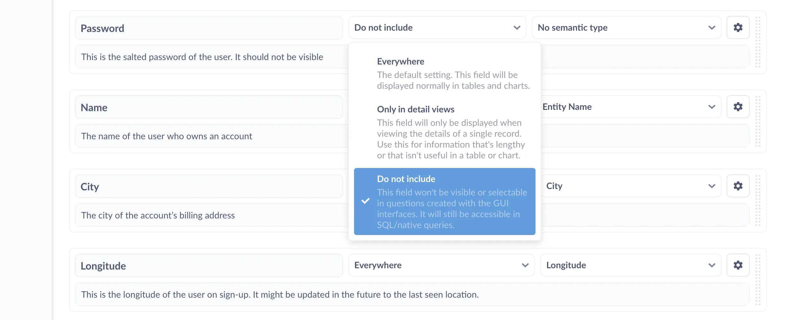

This article gives an overview of how to set up and scale self-service analytics. We'll stay at a high-level and link out to more detailed guides on individual features, and our focus here will be on the administration of Metabase, particularly of people in your organization. For operational scaling---the actual running of the Metabase application---check out [Metabase at scale][metabase-at-scale].

The goal with democratizing data in your organization is to give people the information they need to make better decisions. And the best way to do that is to give everyone access to as much data as you can, while ensuring that they can't see any data they're not supposed to see.

To that end, we recommend you organize your Metabase with the goal of simplifying permissions. You probably collect sensitive data for various reasons (payments, taxes, liability, and so on), but that data isn't relevant for business intelligence (though it's probably mixed in with data that _is_ relevant). The idea is to put hard boundaries in key places so you don't have to worry about who can see what, then set up lightweight systems---or even just conventions---that [keep the place tidy][same-page] as the number of people grows.

## 1. Create groups in Metabase

Metabase manages permissions using [groups][permissions-groups], which is more efficient and more manageable than setting permissions for each person. We recommend that you set up your Metabase so that the groups in your identity provider map to the same groups in Metabase. In general, your groups should map to departments in your organization, and possibly also to project or mission teams that cut across departments. That way, once the new person in Accounting starts, they'll log into Metabase and already have access to the same databases and collections that other people in Accounting have.

### Group managers

On [Pro and Enterprise plans](/pricing/), you can deputize [group managers](/docs/latest/people-and-groups/managing#group-managers) that can add and remove people from the group.

## 2. Assign permissions to those groups, including sandboxes

There are fundamentally two types of permissions in Metabase: [data permissions][permissions-data], which determine access to databases, and [collection permissions][permissions-collections], which determine access to items in Metabase like questions and dashboards. These permissions work at the level of tables or collections, but what if you need to restrict access to rows or columns?

### Hiding irrelevant or technical data for all users

If there are fields (or entire tables) that aren't very helpful or relevant, administrators can hide those in the **Data Model tab**. Note that SQL queries are _not_ affected by this setting---users with SQL editor access for a database can always access all tables and fields in that database.

Setting a field's visibility to `Do not include` will exclude the field from menus and tables in questions built with the Query Builder. The disadvantage of changing the field visibility at the data model level is that the action is global, so it's not very flexible. If, however, you want to _selectively_ grant access to rows or columns to different groups of people, you'll need to sandbox the data.

### Data sandboxing

[Data sandboxing](/docs/latest/permissions/data-sandboxes) is a feature available in our [Pro and Enterprise plans](/pricing/) that, when combined with single sign-on (SSO), lets you restrict access to rows or columns based on user attributes. You can add these attributes manually in Metabase, or via your authentication service. You can set up [row-level access][sandboxing-rows] keyed to a user attribute, or you can [restrict access to columns][sandboxing-columns] by creating custom views of tables that exclude certain fields. Note that sandboxing only applies to GUI questions, which brings us to:

### SQL editor access and sandboxes are mutually exclusive

An important thing you need to know about permissions is that groups with SQL access to a database can access _all_ data in the database. Even if a field is not visible in GUI menus or in the [data browser][data-browser], people with SQL access will still be able to query the tables (and all rows and columns) in the database. More specifically, they'll be able to query any data available to the user account in the database that you used to connect Metabase to that database. Which brings us to:

### SQL permissions

Metabase lacks table-level SQL permissions: you either grant a group SQL editor access to a database, or you don't. But since you can set SQL editor permissions at the database level, you can create two (or more) connections to the same database, each with different connection strings for different user accounts in that database. For example, you could set up:

- Connection 1 with access to the whole database
- Connection 2 with access to tables A, B, and C only

You can then grant most of your groups access to connection 2 (the less permissive one), and grant select users (like dedicated data analysts) access to connection 1 (the whole database). Metabase will treat these connections as if they were two separate databases, even though they are just two different access levels to the same database. From the perspective of each person, however, they'll only see one database (the one their group has access to).

### Application permissions

On [Pro and Enterprise plans](/pricing/), you can assign [application permissions](/docs/latest/permissions/application) to groups to give people access to administrative tools a la carte, without giving them access to data.

## 3. Set up SSO in your Metabase

While we hope Metabase will always have a special place in your heart, we know it's not the only piece of software you use. If your organization is starting to grow, chances are you're working with a single sign-on (SSO) identity provider like [Okta][okta], [Auth0][auth0], or [OneLogin][one-login] that lets people authenticate once and get access to all the apps your org uses. Metabase integrates with services that use the SAML and JWT standards, which will give you fine-grained control over access to data.

### Authentication options

There are currently four basic options for authentication in Metabase. In the open source edition, you have:

- [Google Sign-In][google-sign-in]
- [LDAP][ldap]

On [Pro and Enterprise](/pricing/), you also have:

- [SAML][saml]
- [JWT][jwt]

**SAML** is an open protocol for exchanging data between identity and service providers using XML. JWT is similar, though less formal---it's a token, not a protocol. Both standards are used by identity providers like Okta and Auth0 to create authentication services (essentially a global password manager for the people in your organization). With Okta, for example, can sign in to your identity provider once, then they'll be able to use all the services they have access to without having to constantly re-enter their login and password---or different logins and passwords. The identity provider (in this case Okta) will handle the handshakes with each service provider. To learn more, check out Auth0's [overview of SAML][saml-overview].

The big advantage with setting up SSO with SAML or JWT is that you can pass user attributes to Metabase, which allows you to sandbox data based on who the user is, limiting access to the rows and/or columns of a table.

## 4. Synchronize SSO and Metabase groups

Now that you've created groups, set permissions, and connected your SSO provider to Metabase, it's time to synchronize groups. Check out our documentation to learn how to [synchronize group membership with your identity provider][sync-groups-idp]. Note that you can also [synchronize groups using LDAP][sync-groups-ldap] (an option available for the free, open source edition of Metabase).

## 5. Tell people they can create a Metabase account just by logging in

At this point, you should have everything set up. People should be able to log in to Metabase and see everything they need to see, and no more.

## 6. Use the Usage Analytics collection to monitor how people are using your Metabase

Lastly, on [Pro and Enterprise plans](/pricing/), you can explore [Metabase usage analytics](/docs/latest/usage-and-performance-tools/usage-analytics) to verify what people are looking at and confirm that your permissions work as you expect. You can see which dashboards and questions people view, the contents of SQL queries they run, and what data they download. It's also a great way to see how your rollout is going, like how many new users are logging in over time, and how much stuff everyone's looking at.

Usage Analytics is also useful for checking the performance of your workhorse dashboards and questions. One of the issues with democratizing data is that people of all skill ranges will be asking questions, and that can sometimes lead to some less efficient queries. You can use Usage Analytics to find commonly viewed items that are running slowly, then check out our posts for tips on [making dashboards faster][dashboards-faster] and [best practices for writing SQL queries][sql-best-practices].

To learn more about usage analytics, check out our article on [how to keep tabs on your data][metabase-analytics].

## Further reading

- [Keeping your analytics organized][same-page].
- [Deliver self-service analytics to your customers][self-service-analytics].

[metabase-analytics]: /learn/permissions/keep-tabs-on-your-data
[auth0]: https://auth0.com/single-sign-on/
[dashboards-faster]: /learn/metabase-basics/administration/administration-and-operation/making-dashboards-faster
[data-browser]: /learn/metabase-basics/getting-started/data-browser
[google-sign-in]: /docs/latest/people-and-groups/google-sign-in
[jwt]: /docs/latest/people-and-groups/authenticating-with-jwt
[ldap]: /docs/latest/people-and-groups/ldap
[metabase-at-scale]: /learn/administration/metabase-at-scale
[okta]: https://www.okta.com/products/single-sign-on/
[one-login]: https://www.onelogin.com/product/sso
[permissions-collections]: /learn/permissions/collection-permissions
[permissions-data]: /learn/permissions/data-permissions
[permissions-groups]: /docs/latest/people-and-groups/managing#groups
[same-page]: /learn/metabase-basics/administration/administration-and-operation/same-page
[saml]: /docs/latest/people-and-groups/authenticating-with-saml
[saml-overview]: https://auth0.com/blog/how-saml-authentication-works/
[sandboxing-columns]: /learn/permissions/data-sandboxing-column-permissions
[sandboxing-rows]: /learn/permissions/data-sandboxing-row-permissions
[self-service-analytics]: /learn/embedding/multi-tenant-self-service-analytics
[sql-best-practices]: /learn/grow-your-data-skills/learn-sql/working-with-sql/sql-best-practices
[sync-groups-idp]: /docs/latest/people-and-groups/authenticating-with-saml#synchronizing-group-membership-with-your-idp
[sync-groups-ldap]: /docs/latest/people-and-groups/ldap
