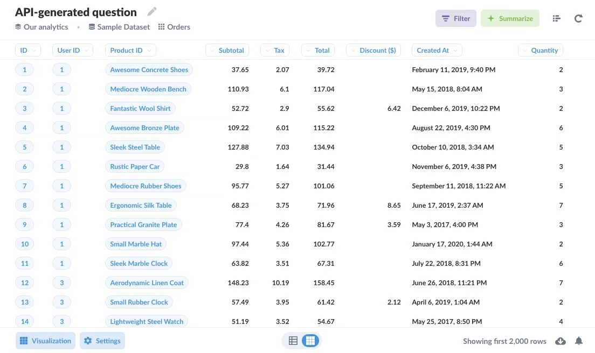
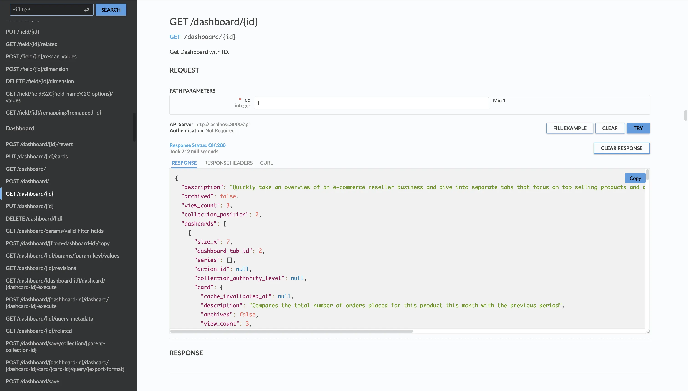
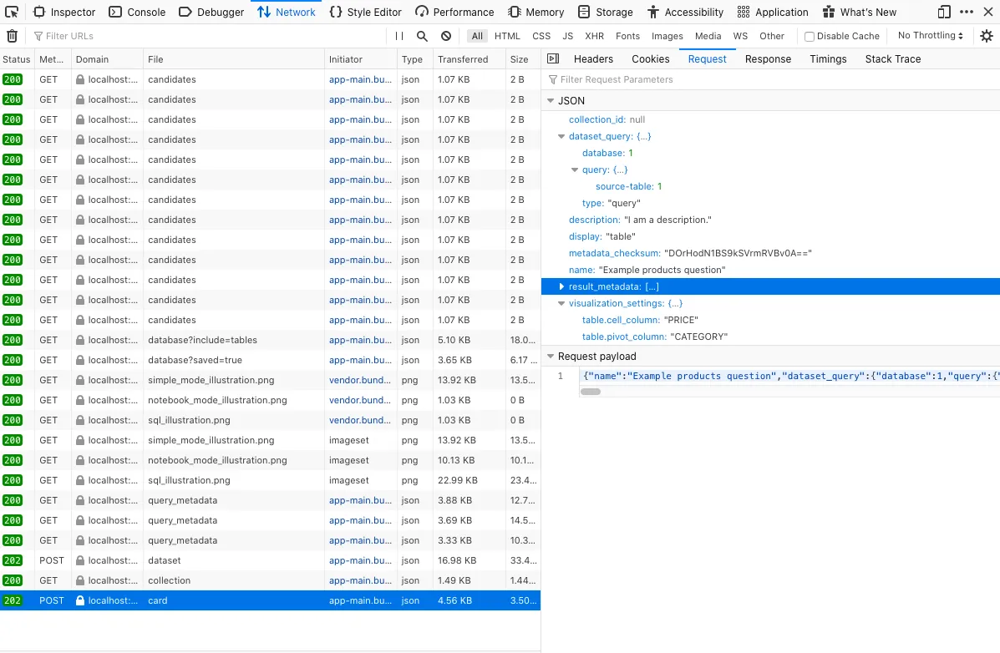
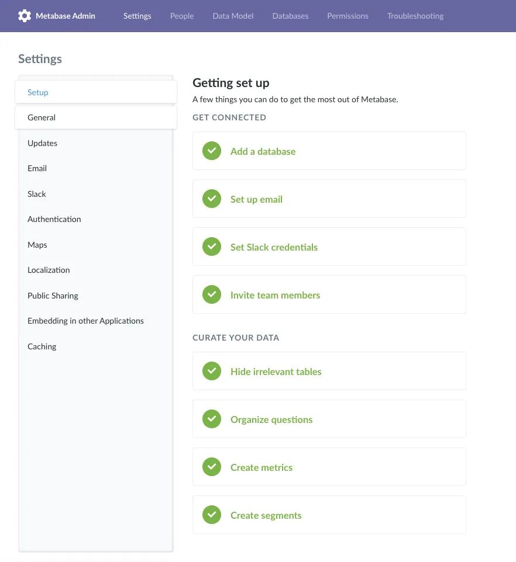
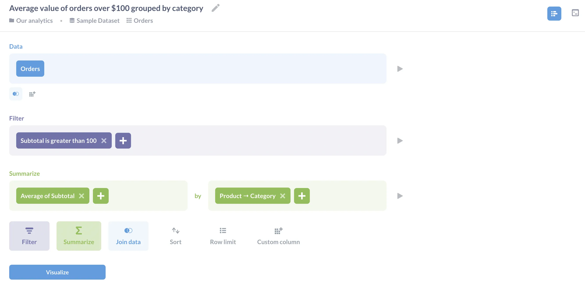
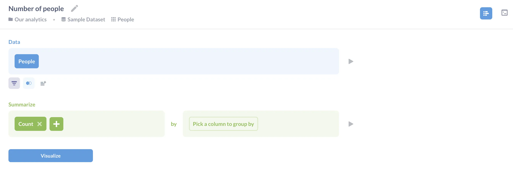

This article explains how to automate tasks using [Metabase's API][metabase-api]. We use that API ourselves to connect the front end and the back end, so you can script almost everything that Metabase can do.

## API reference

You can find Metabase API reference [in our docs](/docs/latest/api). You can also view live OpenAPI docs in your own running Metabase at `/api/docs`. So if your Metabase is at `https://www.your-metabase.com` you could access them at `https://www.your-metabase.com/api/docs`.

## Warning: the Metabase API can change

- **The API is subject to change**. We rarely change API endpoints, and almost never remove them, but if you write code that relies on the API, there’s a chance you might have to update your code in the future.
- **The API isn’t versioned**. So don’t expect to stay on a particular version of Metabase in order to use a “stable” API.

For API changes, check out the Developer guide's [API changelog](/docs/latest/developers-guide/api-changelog).

## Getting started with the Metabase API

To keep things simple, we'll use the venerable command line utility [curl][curl] for our API call examples; you could also consider a dedicated tool for developing API requests (like [Postman][postman]). To follow along, you can [spin up a fresh Metabase on localhost][metabase-jar] and play around.

## Create an API key

To use the API, create an [API key](/docs/latest/people-and-groups/api-keys).

## Example GET request

Here's an example API request that hits the [`/api/permissions/group`][api-permissions-group] endpoint, which returns the permission groups you have set up in your Metabase. Replace `YOUR_API_KEY` with your API key:

```bash
curl \
-H 'x-api-key: YOUR_API_KEY' \
-X GET 'http://localhost:3000/api/permissions/group'
```

The above request returns an array of JSON objects for the groups in your Metabase (formatted for readability):

```json
[
  {
    "id": 2,
    "name": "Administrators",
    "member_count": 2
  },
  {
    "id": 1,
    "name": "All Users",
    "member_count": 3
  }
]
```

## Example POST request

You can also use a file to store the JSON payload for a POST request. This makes it easy to have a pre-defined set of requests you want to make to the API.

```bash
curl -H @header_file.txt -d @payload.json http://localhost/api/card
```

Here's the `header_file.text` in the above command:

```txt
x-api-key: YOUR_API_KEY
```

Here's an example of a JSON file (the `@payload.json` in the command above) that creates a question:

```json
{
  "visualization_settings": {
    "table.pivot_column": "QUANTITY",
    "table.cell_column": "SUBTOTAL"
  },
  "description value": "A card generated by the API",
  "collection_position": null,
  "result_metadata": null,
  "metadata_checksum": null,
  "collection_id": null,
  "name": "API-generated question",
  "dataset_query": {
    "database": 1,
    "query": {
      "source-table": 2
    },
    "type": "query"
  },
  "display": "table"
}
```

That request generated the question:



## See Metabase's requests and responses

### Experiment in live API docs

You can view live OpenAPI docs, served via [RapiDoc](https://rapidocweb.com/), from your running Metabase at `/api/docs`. So if your Metabase is at `https://www.your-metabase.com` you could access them at `https://www.your-metabase.com/api/docs`.

In live docs, you can experiment with sending requests and see example responses:



### Use developer tools

If the auto-generated API docs are unclear, you can use the developer tools that ship with browsers like Firefox, Chrome, and Edge to view Metabase's requests and responses.



In the Metabase application, perform the action that you'd like to script, such as adding a user or creating a dashboard. Then use the developer tools in your browser to view the request Metabase made to the server when you performed that action.

## A few things you can do with the Metabase API

### Provision a Metabase instance

In addition to using [environment variables][metabase-env-vars], you can use the Metabase API to setup an instance of Metabase. Once you have installed Metabase using your [preferred method][metabase-start], and the Metabase server is up and running, you can create the first user (as an Admin) by posting to a special endpoint, [/api/setup][api-setup]. This `/api/setup` endpoint:

- Creates the first user as an Admin (superuser).
- Logs them in.
- Returns a session ID.

You can then configure settings using the [`/api/settings`][api-settings] endpoint, set up email using the [`/api/email`][api-email] endpoint, and use the [`/api/setup/admin_checklist`][api-setup-checklist] endpoint to verify your setup progress.



### Add a data source

You can add a new database using the [`POST /api/database/`][api-database-add] endpoint, and validate that database's connection details using the [`/api/setup/validate`][api-setup-validate] endpoint. Once you've connected the database to your Metabase instance, you can rescan the database and update the schema metadata. You can even add our trusty [Sample Database](/glossary/sample_database) as a new database to your instance with `POST /api/database/sample_database`.

Here's an example database creation call for a [Redshift][redshift] database.

```bash
curl -s -X POST \
    -H "Content-type: application/json" \
    -H 'x-api-key: YOUR_API_KEY' \
    http://localhost:3000/api/database \
    -d '{
        "engine": "redshift",
        "name": "Redshift",
        "details": {
            "host": "redshift.aws.com",
            "port": "5432",
            "db": "dev",
            "user": "root",
            "password": "password"
        }
    }'
```

### Set up users, groups, and permissions

You can use the [`/api/user`][api-user] endpoints to create, update, and disable users, or the [`/api/permissions`][api-permissions] endpoints to set up groups or [add users to them][api-permissions-add-users]. Here's an example curl command to create a user:

```bash
curl -s "http://localhost:3000/api/user" \
    -H 'Content-Type: application/json' \
    -H 'x-api-key: YOUR_API_KEY' \
    -d '{
    "first_name":"Basic",
    "last_name":"Person",
    "email":"basic@somewhere.com",
    "password":"Sup3rS3cure_:}"
}'
```

### Generate reports

In Metabase, "reports" are referred to as [dashboards][dashboards]. You can interact with dashboards using the [`/api/dashboard`][api-dashboards] endpoint. You can [create a new dashboard][dashboards-create] with [`POST /api/dashboard/`][api-dashboards-create], and [add a saved question to a dashboard][dashboards-add-question] with [`POST/api/dashboard/:id/cards`].

## Useful endpoints

The links in the Endpoint column below will take you to you to the first action available for that endpoint, which alphabetically is usually the DELETE action. You can scroll down in the API documentation to see the full list of actions and URLs for that endpoint, and view descriptions of each.

| Domain                     | Description                                                                                                                                                                            | Endpoint                              |
| -------------------------- | -------------------------------------------------------------------------------------------------------------------------------------------------------------------------------------- | ------------------------------------- |
| [Collections][collections] | Collections are a great way to organize your dashboards, saved questions, and pulses.                                                                                                  | [`/api/collection`][api-collections]  |
| [Dashboards][dashboards]   | Dashboards are reports that comprise a set of questions and text cards.                                                                                                                | [`/api/dashboard`][api-dashboards]    |
| [Databases][databases]     | Fetch databases, fields, schemas, primary (entity) keys, lists of tables, and more.                                                                                                    | [`/api/database`][api-database]       |
| [Email][email]             | Update emails settings and send test emails.                                                                                                                                           | [`/api/email`][api-email]             |
| [Embedding][embedding]     | Use signed JWTs to fetch info on embedded cards and dashboards.                                                                                                                        | [`/api/embed`][api-embed]             |
| [Permissions][permissions] | Metabase manages permissions to databases and collections with groups. Create permission groups, add and remove users to groups, retrieve a graph of all permissions groups, and more. | [`/api/permissions`][api-permissions] |
| Search                     | Search cards (questions), dashboards, collections and pulses for a substring.                                                                                                          | [`/api/search`][api-search]           |
| [Segments][segments]       | Segments are named sets of filters (like "Active Users"). Create and update segments, revert to previous versions, and more.                                                           | [`/api/segment`][api-segment]         |
| [Sessions][sessions]       | Reset passwords with tokens, login with Google Auth, send password reset emails, and more.                                                                                             | [`/api/sessions`][api-session]        |
| [Settings][settings]       | Create/update global application settings.                                                                                                                                             | [`/api/setting`][api-settings]        |
| Queries                    | Use the API to execute queries and return their results in a specified format.                                                                                                         | [`/api/dataset`][api-dataset]         |
| [Questions][questions]     | Questions (known as cards in the API) are queries and their visualized results.                                                                                                        | [`/api/card`][api-card]               |

There are some other cool endpoints to check out, like [`api/database/:virtual-db/metadata`][api-virtual-metadata], which is used to "fool" the frontend so that it can treat saved questions as if they were tables in a virtual database. This is how Metabase lets you use Saved Questions as if they were data sources.

The documentation contains [a complete list of API endpoints][metabase-api] along with documentation for each endpoint, so dig around and see what other cool endpoints you can find.

The endpoint reference is periodically updated with new versions of Metabase. You can also generate the reference by running:

```bash
java -jar metabase.jar api
```

## Running Custom Queries

Queries written with the [query builder](/docs/latest/questions/introduction) are saved in our custom JSON-based query language, MBQL.

To familiarize yourself with MBQL, we recommend using the Metabase application to create a question using the [query builder](/docs/latest/questions/introduction)), then use your browser's developer tools to see how Metabase formatted the request body with the query.

## Examples in Python, R, and JavaScript

Curl is a handy tool for exploring APIs, but if you're integrating Metabase into a large data ecosystem, you will probably use something else. To show how you can access the API with Python, R, and Node.js, let's create two questions. The first finds the average pre-tax value of orders over \$100 grouped by category. It is shared publicly---[this tutorial][embedding-tutorial] explains how to do that.



The second question counts the number of people in the database. It is _not_ shared: we have included it to show how to distinguish shared from unshared questions.



### Python

Our first example is written in Python. Like most data science programs it uses the [requests][requests] library to send HTTP requests and [Pandas][pandas] to manage tabular data, so we start by importing those libraries.

Let's ask Metabase which questions have public IDs, i.e., which ones have been shared so that we can invoke them remotely. When we ask for all cards, we get a list with some information about all of the questions; only the ones with a `public_uuid` field are callable:

```python
import requests
import pandas as pd
# Avoid committing your API KEY to the repository
headers = {'x-api-key': YOUR_API_KEY}
response = requests.get('http://localhost:3000/api/card',
                         headers=headers).json()
questions = [q for q in response if q['public_uuid']]
print(f'{len(questions)} public of {len(response)} questions')
```

In our case, the output tells us that there are two questions, but only one is public:

```text
1 public of 2 questions
```

Let's get some information about that public question and print its title:

```python
uuid = questions[0]['public_uuid']
response = requests.get(f'http://localhost:3000/api/public/card/{uuid}',
                        headers=headers)
print(f'First title: {response.json()["name"]}')
```

```text
First title: Average value of orders over $100 grouped by category
```

Finally, we can pull down data from the first question in the list. The `'data'` key in the JSON response has a lot of information; what we're most interested in are the values under the sub-key `'rows'`, which stores the result table in the usual list-of-lists form. Let's convert that to a Pandas dataframe and print it:

```python
response = requests.get(f'http://localhost:3000/api/public/card/{uuid}/query',
                        headers=headers)
rows = response.json()['data']['rows']
data = pd.DataFrame(rows, columns=['Category', 'Average'])
print('First data')
print(data)
```

```text
First data
    Category     Average
0  Doohickey  114.679742
1     Gadget  123.530916
2      Gizmo  120.897286
3     Widget  122.078721
```

### R with the Tidyverse

The R version of our example has the same structure as the Python version. Like most data scientists we use the [tidyverse][tidyverse] family of libraries, so let's load those along with [`httr`][httr] for managing HTTP requests, [`jsonlite`][jsonlite] for parsing JSON, and [`glue`][glue] for string formatting:

```r
library(tidyverse)
library(httr)
library(jsonlite)
library(glue)
```

We put our API key in the headers.

```r
headers <- add_headers('x-api-key' = YOUR_API_KEY)
```

We then get information about all of the questions and ask which ones are public:

```r
data <- GET('http://localhost:3000/api/card', headers) %>%
  content(as = 'text', encoding = 'UTF-8') %>%
  fromJSON()
num_questions <- data %>%
  nrow()
num_public <- data %>%
  pull(public_uuid) %>%
  discard(is.na) %>%
  length()
glue('{num_public} public of {num_questions} questions')
```

```text
1 public of 2 questions
```

Displaying the title of the first public card gives the same result as it did with Python, which is reassuring:

```r
uuid <- data %>%
  pull(public_uuid) %>%
  discard(is.na) %>%
  first()
data <- glue('http://localhost:3000/api/public/card/{uuid}') %>%
  GET(headers) %>%
  content(as = 'text', encoding = 'UTF-8') %>%
  fromJSON()
glue('First title: {data$name}')
```

```text
First title: Average value of orders over $100 grouped by category
```

And the data associated with that card is the same as well once we convert it to a tibble, though R's default display doesn't give us as many decimal places:

```r
data <- glue('http://localhost:3000/api/public/card/{uuid}/query') %>%
  GET(headers) %>%
  content(as = 'text', encoding = 'UTF-8') %>%
  fromJSON()
rows <- data$data$rows
colnames(rows) <- c('Category', 'Average')
rows <- rows %>% as_tibble()
rows$Average <- as.numeric(rows$Average)
glue('First data')
rows
```

```text
First data
# A tibble: 4 x 2
  Category  Average
  <chr>       <dbl>
1 Doohickey    115.
2 Gadget       124.
3 Gizmo        121.
4 Widget       122.
```

### JavaScript on Node.js

JavaScript is an increasingly popular language for server-side scripting, but unlike Python and R, JavaScript lacks a single predominant library for data tables. For large projects we are fond of [`data-forge`][data-forge], but for small examples we stick to [Dataframe-js]. We also use [`got`][js-got] for HTTP requests instead of the older [`request`][js-request] package, as the latter has now been deprecated. Finally, since we find `async`/`await` syntax a lot easier to read than promises or callbacks, we put all of our code in an `async` function that we then call immediately:

```js
const got = require("got");
const DataFrame = require("dataframe-js").DataFrame;

const main = async () => {
  // ...program goes here...
};

main();
```

Once again we start by authenticating ourselves:

```js
headers = { "x-api-key": YOUR_API_KEY };
```

We then ask for the complete list of questions and filter them to select the public ones:

```js
response = await got.get("http://localhost:3000/api/card", {
  responseType: "json",
  headers: headers,
});
// filter for public questions
questions = response.body.filter((q) => q.public_uuid);
console.log(`${questions.length} public of ${response.body.length} questions`);
```

```text
1 public of 2 questions
```

The first public card still has the title we've seen before:

```js
const uuid = questions[0].public_uuid;
response = await got.get(`http://localhost:3000/api/public/card/${uuid}`, {
  responseType: "json",
  headers: headers,
});
console.log(`First title: ${response.body.name}`);
```

```text
First title: Average value of orders over $100 grouped by category
```

When we pull down its data we get the same values, though the numbers are shown in yet another slightly different way:

```js
response = await got.get(
  `http://localhost:3000/api/public/card/${uuid}/query`,
  {
    responseType: "json",
    headers: headers,
  },
);
const rows = response.body.data.rows;
const df = new DataFrame(rows, ["Category", "Average"]);
df.show();
```

```text
| Category  | Average   |
------------------------
| Doohickey | 114.67... |
| Gadget    | 123.53... |
| Gizmo     | 120.89... |
| Widget    | 122.07... |
```

## Authenticate your requests with a session token

> You should instead use an [API KEY](/docs/latest/people-and-groups/api-keys). Including the info below just in case you need to use a session token for whatever reason.

You can also use a session token to authenticate your requests. To get a session token, submit a request to the [`/api/session`][api-session] endpoint with your username and password:

```bash
curl -X POST \
  -H "Content-Type: application/json" \
  -d '{"username": "person@metabase.com", "password": "fakepassword"}' \
  http://localhost:3000/api/session
```

If you're working with a remote server, you'll need replace `localhost:3000` with your server address. This request will return a JSON object with a key called `id` and the token as the key's value, e.g.:

```json
{ "id": "38f4939c-ad7f-4cbe-ae54-30946daf8593" }
```

You can then include that session token in the headers of your subsequent requests like this:

```json
"X-Metabase-Session": "38f4939c-ad7f-4cbe-ae54-30946daf8593"
```

Some things to note about sessions:

- _By default, sessions are good for 14 days_. You can configure this session duration by setting the environment variable [`MB_SESSION_AGE`][session-age] (value is in minutes).
- _You should cache credentials_ to reuse them until they expire, because logins are rate-limited for security.
- _Invalid and expired session tokens return a 401 (Unauthorized) status code._
- _Handle 401 status codes gracefully_. We recommend writing your code to fetch a new session token and automatically retry a request when the API returns a [401 status code][status-401].
- _Some endpoints require that the user be an admin, also known as a superuser_. Endpoints that require admin or superuser status (admin = superuser) generally say so in their documentation. They will return a [403 (Forbidden) status code][status-403] if the current user is not an admin.

In short: use an [API key](/docs/latest/people-and-groups/api-keys) instead.

## Have fun

If you have found this tutorial interesting, you can [spin up a local instance of Metabase][metabase-docker], experiment with the API, and have fun! If you get stuck, [check out our forum][metabase-discourse] to see if anyone's run into a similar issue, or post a new question.

[api-card]: /docs/latest/api#tag/apicard
[api-collections]: /docs/latest/api#tag/apicollection
[api-dashboards-create]: /docs/latest/api#tag/apidashboard
[api-dashboards]: /docs/latest/api#tag/apidashboard
[api-database-add]: /docs/latest/api#tag/apidatabase
[api-database]: /docs/latest/api/#tag/database
[api-dataset]: /docs/latest/api#tag/apidataset
[api-email]: /docs/latest/api#tag/apiemail
[api-embed]: /docs/latest/api#tag/apiembed
[api-permissions-add-users]: /docs/latest/api#tag/apipermissions
[api-permissions]: /docs/latest/api#tag/apipermissions
[api-search]: /docs/latest/api#tag/apisearch
[api-segment]: /docs/latest/api#tag/apisegment
[api-session]: /docs/latest/api#tag/apisession
[api-settings]: /docs/latest/api#tag/apisetting
[api-setup-checklist]: /docs/latest/api#tag/apisetup
[api-setup-validate]: /docs/latest/api#tag/apisetup
[api-setup]: /docs/latest/api#tag/apisetup
[api-permissions-group]: /docs/latest/api#tag/apipermissions
[api-user]: /docs/latest/api#tag/apiuser
[api-virtual-metadata]: /docs/latest/api#tag/apidatabase
[collections]: /docs/latest/permissions/collections
[curl]: https://curl.haxx.se/docs/
[dashboards-add-question]: /docs/latest/dashboards/introduction#adding-or-saving-questions-to-a-dashboard
[dashboards-create]: /docs/latest/dashboards/introduction#how-to-create-a-dashboard
[dashboards]: /docs/latest/dashboards/introduction
[data-forge]: https://www.data-forge-js.com/
[databases]: /docs/latest/administration-guide/01-managing-databases
[dataframe-js]: https://gmousse.gitbooks.io/dataframe-js/
[email]: /docs/latest/configuring-metabase/email
[embedding-tutorial]: /learn/developing-applications/advanced-metabase/embedding-charts-and-dashboards
[embedding]: /docs/latest/embedding/introduction
[glue]: https://cran.r-project.org/web/packages/glue/
[httr]: https://cran.r-project.org/web/packages/httr/
[js-got]: https://www.npmjs.com/package/got
[js-request]: https://www.npmjs.com/package/request
[jsonlite]: https://cran.r-project.org/web/packages/jsonlite/
[metabase-api]: /docs/latest/api
[metabase-discourse]: https://discourse.metabase.com/
[metabase-docker]: /docs/latest/installation-and-operation/running-metabase-on-docker
[metabase-env-vars]: /docs/latest/configuring-metabase/environment-variables
[metabase-jar]: /start/jar
[metabase-start]: /start/
[pandas]: https://pandas.pydata.org/
[permissions]: /docs/latest/administration-guide/05-setting-permissions
[postman]: https://www.postman.com/
[questions]: /docs/latest/questions/introduction
[redshift]: https://aws.amazon.com/redshift/
[requests]: https://pypi.org/project/requests/
[segments]: /docs/latest/data-modeling/segments#creating-a-segment
[session-age]: /docs/latest/configuring-metabase/environment-variables#max_session_age
[sessions]: /docs/latest/operations-guide/changing-session-expiration
[settings]: /docs/latest/administration-guide/08-configuration-settings
[status-401]: https://developer.mozilla.org/en-US/docs/Web/HTTP/Status/401
[status-403]: https://developer.mozilla.org/en-US/docs/Web/HTTP/Status/403
[tidyverse]: https://www.tidyverse.org/
