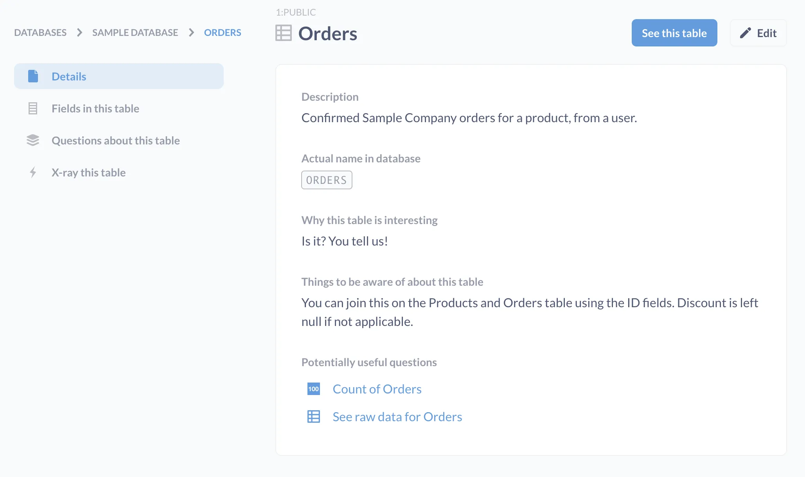
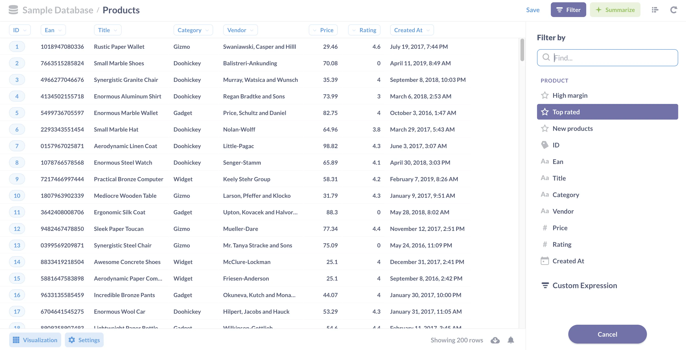
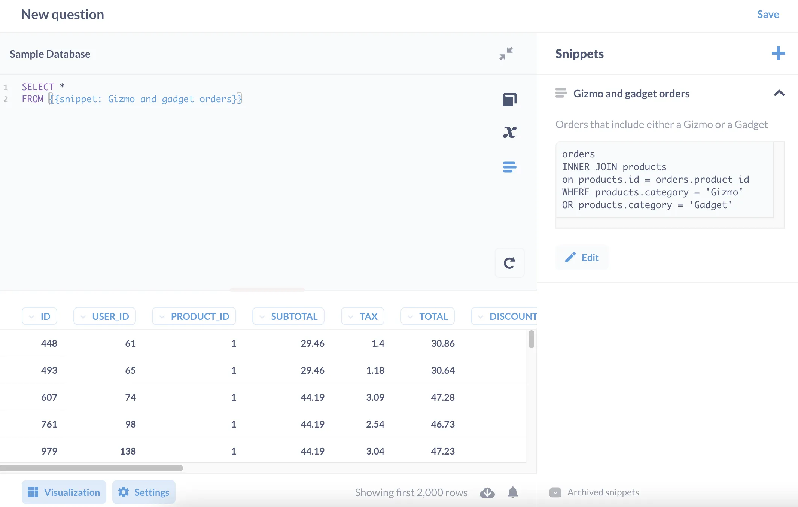

If you want to stay competitive, you need to give people in your organization access to the data they need to make better decisions. The cost of this democratization of data, however, is the inevitable flood of analysis — which can make it difficult to know which analyses you can trust.

It's important to understand that there is no cure to this problem. There will always be some level of analytical entropy to tame, but with the right tools and processes in place, you'll be able to keep the inevitable chaos in check.

## The problems with democratizing analytics

The core of these problems center on definitions: how exactly do we define business logic like revenue, lifetime value, churn, and so on? And by "definitions," we mean generally any quantifiable concept that's important to your organization. Not just _what_ is X, but how do we _calculate_ X? These are the terms by which you'll measure your organization, and the more specifically (and consistently) you define them, the better.

Here are some of the problems with definitions that we'll need to guard against:

### Where do people find specific definitions?

Once you start slicing your data to look at your organization from different angles, definitions will proliferate: revenue, churn rate, expected lifetime value, and so on. If we want to understand why our customers are churning, which definitions should we consult? Which _new_ definitions do we need to define? And (literally) where can I find these official definitions in Metabase?

### Conflicting definitions

By conflicting we mean: are we even talking about the same thing? Consider revenue, for example. For the Sales team, revenue could mean bookings, but the Accounting folks mean recognized revenue accrual, while the Marketing team is talking about lifetime revenue.

### Re-definitions, or which is the canonical definition?

What if we find multiple definitions for the same concept? How do we know which to trust? Are they all off the mark? Even if multiple groups agree that we should track week-over-week bookings, how those bookings are tallied could differ from query to query: one query could be accurate, another inaccurate and unvetted, created by an analyst who wasn't aware that the official query to calculate bookings already existed; or forgot to omit test data, or failed to account for discounts, or simply created a new query to slice bookings in a different way.

### Changing definitions

Calculations to monthly revenue will likely change as some revenue streams are sunsetted and other streams are added. If we have different departments using that same definition in multiple questions, models, and dashboards, how should we manage changes to definitions?

## Strategies to tame the chaos

With our problems identified, let's talk about how we can mitigate them. We'll divide this discussion into two categories: the [features](#features) Metabase provides, and the organizational [processes](#processes) we recommend you adopt.

## Features

Here are some tools that ship with Metabase that will help keep you organized. You're likely already aware of the questions, dashboards, and collections, but they're worth itemizing here to get a full picture of the toolkit.

### Models

[Models](/docs/latest/users-guide/models) allow you to codify those frequently-used concepts as a starting point for new questions that can be easily referenced again and again. Questions built via the query builder _and_ SQL questions can be converted to models, and they'll show up higher in search results to encourage their use across your organization. You can customize model metadata too, allowing you to specify column types so you can [drill-through](/learn/metabase-basics/querying-and-dashboards/questions/drill-through) even on SQL questions.

For example, you could write a question that pulls together and calculates info on "Active users" (however you define a person as "active"), and then convert that question to a model so people know where to go when they have questions about active users.

### Data reference and descriptions

Metabase provides places for you to include helpful text that contextualizes a particular item, whether that item is a database, table, model, question, dashboard, or whatever. You don't have to describe _everything_, but the more description you include, the less time people will spend figuring out "is this the right data?" and the better their analysis will be. Documenting exceptions with data is especially important (for example, whether a table includes test data or employee accounts or other exceptions that analysts should be aware of).

For "official" databases, dashboards, models, and questions, you should require owners to maintain their documentation. And don't get lazy with your titles; you can do a lot with a few extra words. Compare "Customer orders" with something like: "OFFICIAL: Rolling 7-day average daily orders - North America".

For more about the reference tooling in Metabase, check out [Exploring data with Metabase's data browser][metabase-data-browser].

### Events and timelines

[Events](/docs/latest/users-guide/events-and-timelines) allow teams to capture context, and make that context available when people view their data. So for example you could add an event to mark the start of a sale, or email campaign, or new release. That way, people can see what effect those events have on the data (if any). You can also ward off all those questions around why numbers went up or down in April or whatever.

You can organize these events into timelines, which are associated with collections, so teams can group events into coherent timelines. Different timelines can group different sets of events that impact your business: lunar cycles, meteorological phenomena, occult rituals, and so on.

### Segments and Metrics

Administrators can define official filters (or sets of filters) known as [Segments](/docs/latest/data-modeling/segments-and-metrics) that can be used in Metabase's query builder. For example, you could officially define what an "active user" is via a Segment. "Active Users" would then appear in the **Filter sidebar**, so anyone can filter their queries by Active Users to see what kind of products those specific users buy, how long items sit in their carts, and so on.

Similarly, [Metrics](/docs/latest/data-modeling/segments-and-metrics) codify calculations. For example, Admins can set up an official Metric for "Average Order Total" so that everyone knows (and can use) the official calculation of that Metric, which includes tax but omits applied discounts.

Both Segments and Metrics are versioned. To learn more, check out [Segments and Metrics][segments-and-metrics].

### Snippets

[Snippets](/docs/latest/questions/native-editor/snippets) are the SQL counterpart to GUI-based Segments and Metrics. You can use them to capture and replicate bite-sized SQL code. These snippets could capture Segments, Metrics, complicated joins, or any other bit of SQL that you might want to reuse in many queries.

The idea with Segments, Metrics, and snippets is to codify definitions and make them easy to change as you refine your definitions over time. When you update a snippet, each question that employs that snippet benefits from the updated definition in a consistent way. To learn more, check out [Snippets: reuse and share SQL code](/learn/metabase-basics/querying-and-dashboards/sql-in-metabase/snippets).

### Collections

Collections group questions, models, and dashboards (and other collections). Additionally, you can pin the most important items to the top of your collection, especially the root collection Our Analytics, for those pinned dashboards to show up on the home page. To learn more, check out [Working with collection permissions](/learn/permissions/collection-permissions).

#### Official Collections



The [Official Collections](/docs/latest/exploration-and-organization/collections#official-collections) feature lets you designate specific collections as important. When an administrator marks a collection as official, it gets a badge and will appear near the top of your search results, making it easy for users to find it.

### Verified items



Administrators can [verify](/docs/latest/exploration-and-organization/content-verification) questions and models to signal they've taken a look at and approved them. These verified items are identified by a checkmark next to their name, so users can easily identify which questions their admins have deemed trustworthy.

If you want to learn more about verification features, check out our post on [building trust](/blog/official-collections-and-verification).

## Processes

Knowing what tools can do is half the battle; the other half is knowing when and how to use them.

### Create collections for each department

For each department, create a collection and make it editable by only a small group of people. This group should curate that collection, and only pin questions, models, and dashboards they have vetted, decorated with useful descriptions, and actively maintain.

### Snippets folders



[Snippets folders](/docs/latest/enterprise-guide/sql-snippets) let you organize folders by department, assign owners to those folders, and take advantage of folder permissions.

### Adopt a naming convention

Set a standard naming convention across your dashboards, collections, models, and questions so that it's obvious which items are official. How you define that convention is less important than having a convention at all. When in doubt: even a simple prefix like "Certified" or "Official" (e.g., "OFFICIAL: Email opens per 1000 users") can help people sift through search results and know which items have been vetted.

### Designate collections for experimentation and works in progress

Create designated places for people to store works in progress (sometimes called scratch or playground collections). People can and should use personal collections for experimentation, but it's also important to have public places where people can share their work with others to get feedback on their analysis in progress.

Anyone can duplicate the official questions and dashboards, but you should encourage people to save those items to their personal collections, or to a collection designated for experimentation. If one of the dashboards in these areas takes off, you can relocate it to the relevant "official" collection. You can [set permissions](/learn/permissions/collection-permissions) on these official collections so that everyone can view them, but only a select few can edit them - ensuring that everything in that collection is correct and actively maintained.

### Have a policy on when to archive items

For these ephemeral items, set clear expectations for when people should archive them so that these playgrounds don't fill with clutter. If you're managing your department's collections, and only pinning vetted items, clutter becomes less of an issue, but keeping the scratch collections relatively fresh will improve search results.

And don't stress about archiving, since you can resurrect items at any time.

## Other ideas for taming chaos?

If you have any tips to share, or ideas for changes or improvements to Metabase, let us know on [our forum][discourse].

[discourse]: https://discourse.metabase.com/
[metabase-data-browser]: /learn/metabase-basics/getting-started/data-browser
[segments-and-metrics]: /docs/latest/administration-guide/07-segments-and-metrics
