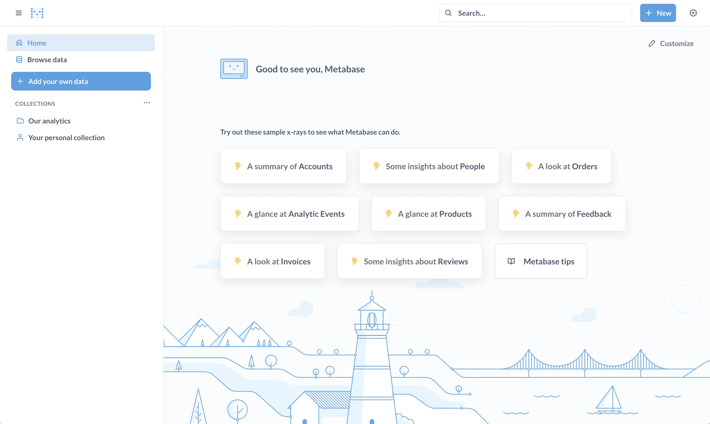
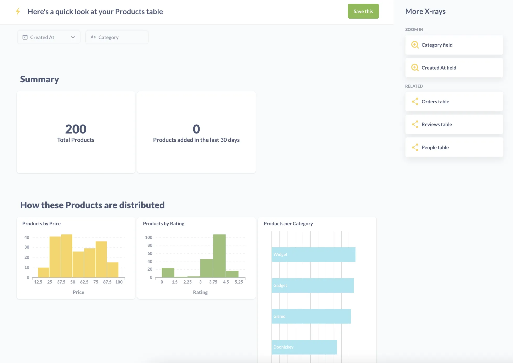
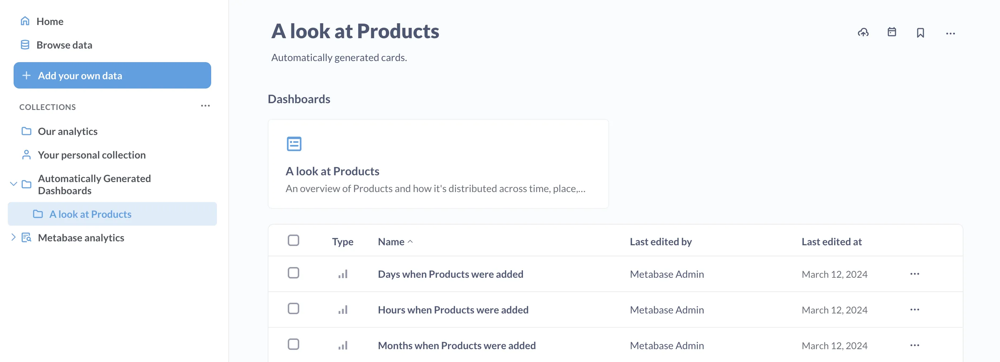
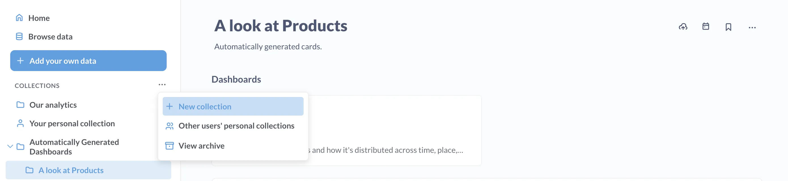

## Metabase serialization



Many customers on [Pro and Enterprise plans](/pricing/) use Metabase in a multi-tenant environment that requires uploading a predefined set of [questions](/docs/latest/questions/start) or [dashboards](/docs/latest/dashboards/start), either to set up a new Metabase instance, or a new database connection.

This article will cover how to:

1. Create a default set of questions and dashboards.
2. Export those dashboards.
3. Re-import those dashboards to a new instance.

Specifically, we'll use the `export` and `import` commands in Metabase's [serialization feature][serialization] to perform steps two and three, plus a little bit of manual curation of the exported files.

We'll use [Docker][metabase-on-docker] to run our source and target Metabases, and use [PostgresSQL][configuring-postgres] for their [application databases](/glossary/application-database). We don't recommend using the default [H2][configuring-h2] database for production.

While this tutorial uses the Metabase `export` and `import` commands, you can also [serialize Metabase application data via the API](/docs/latest/installation-and-operation/serialization#serialization-via-the-api).

## The plan

We'll create a source Metabase, create a dashboard, export that dashboard, and import that dashboard into a new Metabase (our target). Here's the plan:

1. [Create a dedicated network called metanet](#step-1---create-a-dedicated-network).
2. [Spin up two Metabases: source and target](#step-2---spin-up-two-metabases-source-and-target).
3. [Create dashboards and collections in the source Metabase](#step-3---create-dashboards-and-collections-in-the-source-metabase)
4. [Export the data from the source Metabase](#step-4---export-from-source-metabase).
5. [Import the source export into the target Metabase](#step-5---import-into-target-metabase).
6. [Verify that our dashboard and collection is loaded in the target Metabase](#step-6---verify-dashboard-and-collection-in-target-metabase).

## Prerequisites

You'll need to have [Docker][docker] installed on your machine.

## Step 1 - Create a dedicated network

To create a dedicated network called "metanet", run the following command from your terminal of choice:

```bash
docker network create metanet
```

You can confirm the network was created with:

```bash
docker network ls
```

The network will have a local scope and a bridge driver.

## Step 2 - Spin up two Metabases: source and target

Spin up two Metabases called `metabase-source` and `metabase-target` (though you can name these environments whatever you like). Note that we use `--rm -d` when creating these Docker containers so they both get removed when you stop them and run in the background. Feel free to change those flags to modify that behavior.

### Source Metabase

Create the Postgres database:

```bash
docker run --rm -d --name postgres \
    -p 5433:5432 \
    -e POSTGRES_USER=metabase \
    -e POSTGRES_PASSWORD=knockknock \
    --network metanet \
    postgres:12
```

Create our source Metabase, and connect it to Postgres database we just created:

```bash
docker run --rm -d --name metabase-source \
    -p 5001:3000 \
    -e MB_DB_TYPE=postgres \
    -e MB_DB_DBNAME=metabase \
    -e MB_DB_PORT=5432 \
    -e MB_DB_USER=metabase \
    -e MB_DB_PASS=knockknock \
    -e MB_DB_HOST=postgres \
    --network metanet \
    metabase/metabase-enterprise:{{site.latest_enterprise}}
```

You can check the container's logs to view the container's progress:

```bash
docker logs metabase-source
```

Once you see the line that contains "Metabase initialization COMPLETE", you can open a browser to `http://localhost:5001` to view your Metabase instance.

### Target Metabase

Setting up a target Metabase is similar. On our metanet network, we'll set up a Postgres database to serve as our application database, then spin up another Metabase in another Docker container.

Note the changes to:

- ports for both Postgres (5434) and the Metabase server (5002)
- Instance names: `postgres-target` and `metabase-target`

Application database:

```bash
docker run --rm -d --name postgres-target \
    -p 5434:5432 \
    -e POSTGRES_USER=metabase \
    -e POSTGRES_PASSWORD=knockknock \
    --network metanet postgres:12
```

Metabase instance:

```bash
docker run --rm -d --name metabase-target \
    -p 5002:3000 \
    -e MB_DB_TYPE=postgres \
    -e MB_DB_DBNAME=metabase \
    -e MB_DB_PORT=5432 \
    -e MB_DB_USER=metabase \
    -e MB_DB_PASS=knockknock \
    -e MB_DB_HOST=postgres-target \
    --network metanet \
    metabase/metabase-enterprise:{{site.latest_enterprise}}
```

After our Metabase instances complete their initialization (patience, this could take a minute or two), we should now have two Metabases up and running:

- metabase-source at `http://localhost:5001`
- metabase-target at `http://localhost:5002`

### Add users to our source Metabase

Let's add one Admin account, and two basic users to our metabase-source instance.

You can [add users to your Metabase manually][metabase-setup] (i.e., in the Metabase application), but here's a quick bash script that creates an Admin user (the initial user) and two basic users:

You'll need to have [jq](https://jqlang.github.io/jq/) installed to handle the JSON in this script.

```bash
#!/bin/sh

ADMIN_EMAIL=${MB_ADMIN_EMAIL:-admin@metabase.local}
ADMIN_PASSWORD=${MB_ADMIN_PASSWORD:-Metapass123}

METABASE_HOST=${MB_HOSTNAME}
METABASE_PORT=${MB_PORT:-3000}

echo "⌚︎ Waiting for Metabase to start"
while (! curl -s -m 5 http://${METABASE_HOST}:${METABASE_PORT}/api/session/properties -o /dev/null); do sleep 5; done

echo "😎 Creating admin user"

SETUP_TOKEN=$(curl -s -m 5 -X GET \
    -H "Content-Type: application/json" \
    http://${METABASE_HOST}:${METABASE_PORT}/api/session/properties \
    | jq -r '.["setup-token"]'
)

MB_TOKEN=$(curl -s -X POST \
    -H "Content-type: application/json" \
    http://${METABASE_HOST}:${METABASE_PORT}/api/setup \
    -d '{
    "token": "'${SETUP_TOKEN}'",
    "user": {
        "email": "'${ADMIN_EMAIL}'",
        "first_name": "Metabase",
        "last_name": "Admin",
        "password": "'${ADMIN_PASSWORD}'"
    },
    "prefs": {
        "allow_tracking": false,
        "site_name": "Metawhat"
    }
}' | jq -r '.id')


echo -e "\n👥 Creating some basic users: "
curl -s "http://${METABASE_HOST}:${METABASE_PORT}/api/user" \
    -H 'Content-Type: application/json' \
    -H "X-Metabase-Session: ${MB_TOKEN}" \
    -d '{"first_name":"Basic","last_name":"User","email":"basic@somewhere.com","login_attributes":{"region_filter":"WA"},"password":"'${ADMIN_PASSWORD}'"}'

curl -s "http://${METABASE_HOST}:${METABASE_PORT}/api/user" \
    -H 'Content-Type: application/json' \
    -H "X-Metabase-Session: ${MB_TOKEN}" \
    -d '{"first_name":"Basic 2","last_name":"User","email":"basic2@somewhere.com","login_attributes":{"region_filter":"CA"},"password":"'${ADMIN_PASSWORD}'"}'

echo -e "\n👥 Basic users created!"
```

Save the above code as `create_users.sh`, and make it executable:

```bash
chmod +x create_users.sh
```

Then run:

```bash
MB_HOSTNAME=localhost MB_PORT=5001 ./create_users.sh
```

With your metabase-source instance up, and your users created, open up `http://localhost:5001` and sign in as the admin user you created. The user ID is `admin@metabase.local` and the password is `Metapass123`.

You should see a fresh instance of Metabase.



Once you log in, [activate your license key][metabase-activation].

## Step 3 - Create dashboards and collections in the source Metabase

We'll need some application data to export, so let's create some dashboards using the [Sample Database](/glossary/sample_database) included with Metabase. Or rather, let's let Metabase create some dashboards for us!

In the `Try These X-Rays Based On Your Data` section, click on the card with a **yellow lightning bolt** that says something like `A look at Products`. Metabase will generate a set of questions for you that you can save as a dashboard.



Click on the **Save this** button, and Metabase will save the dashboard and its questions in a [collection][collections] titled something like `A look at Products`.

This collection will be saved to a parent collection titled `Automatically Generated Dashboards`. You can find this collection by clicking on the Metabase logo in the upper left of the navigation bar to return to the home screen. From the home page, in the **Our Analytics** section, click on the `Automatically Generated Dashboards` section. From there you should see the collection `A look at your Products table`.



Next, create a new collection. You can call it whatever you like; we'll use the exciting name `Default collection`, and save it to the **Our Analytics** collection.



Then we'll move the `A look at Products` collection to our newly created `Default collection`. On the `A look at Products` collection page, click on the ellipses **...** and select **Move**.

## Step 4 - Export from source Metabase

Here's where we actually start using Metabase's [serialization](/docs/latest/installation-and-operation/serialization) feature.

With our `metabase-source` instance set up with some questions, now it's time to export this data and import it into our `metabase-target`. That way we don't have to manually recreate our Default Collection in the target Metabase.

Let's first create a directory in our `/tmp` directory called `metabase_data` to store our export:

```bash
cd /tmp
mkdir metabase_data
```

Next, we'll run the export command.

```bash
docker run --rm --name metabase-export \
    --network metanet \
    -e MB_DB_CONNECTION_URI="postgres://postgres:5432/metabase?user=metabase&password=knockknock" \
    -v "/tmp/metabase_data:/target" \
    metabase/metabase-enterprise:{{site.latest_enterprise}} "export /target"
```

This command creates a temporary metabase instance called `metabase-export`. This temporary Metabase will connect to the Postgres application database for our source Metabase, and export its application data.

If all goes well, after a few seconds you should see some output, followed by a message in your terminal that says `serialization.cmd :: Export to '/target' complete! 🚛💨 📦`

To verify the export, `cd` into your directory: `/tmp/metabase_data`. You should see something like two directories and three YAML files:

- [`collections/`](#collections)
- [`databases/`](#databases)
- [`settings.yaml`](#settings)

### Settings

The settings file contains a number of options that you can configure when setting up a new instance. It'll look something like:

```yaml
aggregated-query-row-limit: null
application-colors: null
application-favicon-url: null
application-font: null
application-font-files: null
application-logo-url: null
application-name: null
available-fonts: null
available-locales: null
available-timezones: null
breakout-bins-num: null
custom-formatting: null
custom-geojson: null
custom-geojson-enabled: null
default-maps-enabled: null
enable-embedding: null
enable-nested-queries: null
enable-sandboxes?: null
enable-whitelabeling?: null
enable-xrays: null
hide-embed-branding?: null
humanization-strategy: null
landing-page: null
loading-message: null
native-query-autocomplete-match-style: null
persisted-models-enabled: null
report-timezone: null
report-timezone-long: null
report-timezone-short: null
search-typeahead-enabled: null
show-homepage-data: null
show-homepage-pin-message: null
show-homepage-xrays: null
show-lighthouse-illustration: null
show-metabot: null
show-static-embed-terms: null
site-locale: null
site-name: Metawhat
source-address-header: null
start-of-week: null
subscription-allowed-domains: null
unaggregated-query-row-limit: null
uploads-database-id: null
uploads-enabled: null
uploads-schema-name: null
```

### Databases

This directory contains all of [metadata](/glossary/metadata) settings for your connected databases. In this case, we only have the Sample Database included with Metabase.

### Collections

In the collections directory are the collections, dashboards, and questions we set up. The `eDuYBjvKEwhFg6QxtBziP_default_collection` directory has sub-collections and other items. Each item is prefixed with a code to avoid naming collisions.

Here's a look at a collection yaml file:

```yaml
name: Default collection
description: null
entity_id: qmJu_4D1gviNjHUCcn978
slug: default_collection
created_at: "2024-03-12T15:01:45.955848Z"
archived: false
type: null
parent_id: null
personal_owner_id: null
namespace: null
authority_level: null
serdes/meta:
  - id: qmJu_4D1gviNjHUCcn978
    label: default_collection
    model: Collection
```

Here's a peek at an example question (called a card) titled `Products per category`:

```yaml
ame: Products per Category
description: null
entity_id: bnghENFKtgeKRMfU3sF7y
created_at: "2024-03-12T14:59:01.795343Z"
creator_id: admin@metabase.local
display: row
archived: false
collection_id: JI0l2T_O-_EhdAxk2pdin
collection_preview: true
collection_position: null
query_type: query
dataset: false
cache_ttl: null
database_id: Sample Database
table_id:
  - Sample Database
  - PUBLIC
  - PRODUCTS
enable_embedding: false
embedding_params: null
made_public_by_id: null
public_uuid: null
parameters: []
parameter_mappings: []
dataset_query:
  database: Sample Database
  query:
    aggregation:
      - - count
    breakout:
      - - field
        - - Sample Database
          - PUBLIC
          - PRODUCTS
          - CATEGORY
        - null
    source-table:
      - Sample Database
      - PUBLIC
      - PRODUCTS
  type: query
result_metadata: null
visualization_settings:
  column_settings: null
  graph.colors:
    - "#EF8C8C"
  graph.dimensions:
    - CATEGORY
  graph.metrics:
    - count
  graph.series_labels:
    - null
serdes/meta:
  - id: bnghENFKtgeKRMfU3sF7y
    label: products_per_category
    model: Card
initially_published_at: null
metabase_version: v1.49.0
type: question
```

## Step 5 - Import into target Metabase

You'll need at least one admin account loaded into our target Metabase in order to upload a export. You can login via the app to create that user, or use the script we used above: just remember to change the `MB_PORT` to `5002`, since that's the port we assigned to our target Metabase. For example, `cd` into the directory where you saved your create_users.sh script, and run:

```bash
MB_HOSTNAME=localhost MB_PORT=5002 ./create_users.sh
```

We can upload all of these settings into the target Metabase, but let's assume we only want to import our default collection.

Let's copy our `/tmp/metabase_data` directory so we can keep the original contents and make changes to the copy.

```bash
cp -r /tmp/metabase_data /tmp/serialize_import
```

Since every Metabase instance includes the Sample Database, and we didn't make any changes to the metadata, let's delete the `databases` directory. Run:

```sh
rm -r /tmp/serialize_import/databases
```

To verify the changes, you can run `diff` to see the changes between the original serialized_data directory, and the serialized_load directory you'll use to import into the target Metabase:

```bash
cd /tmp
diff -r metabase_data serialize_import
```

And you should see the following:

```bash
Only in metabase_data: databases
```

Before you import data into your target Metabase, you'll need to [activate your license][metabase-activation].

Now, with our `/tmp/serialize_import` directory set, we can run the import command to import the metadata into our target Metabase.

```bash
docker run --rm --name metabase-export \
    --network metanet \
    -e MB_DB_CONNECTION_URI="postgres://postgres-target:5432/metabase?user=metabase&password=knockknock" \
    -v "/tmp/serialize_import:/target" \
    metabase/metabase-enterprise:{{site.latest_enterprise}} "import /target"
```

## Step 6 - Verify dashboard and collection in target Metabase

Now, if you log in to the target Metabase at `http://localhost:5002`, you should see our `Default collection` ready to go, containing our `A look at your Products table` collection.

And that's it: you've preloaded a fresh instance of Metabase with a collection containing a dashboard full of questions!

## Serialization limitations

Just note that serialization dumps do not contain certain data:

- Permission settings
- User accounts or settings
- [Alerts](/docs/latest/questions/alerts) on saved questions
- Personal collections or their contents

## Serialization via the API

You can also import and export Metabase application data via the API. See [Serializing Metabase via the API](/docs/latest/installation-and-operation/serialization#serialization-via-the-api). Exporting and importing via ther API can be useful for instances on Metabase Cloud (where you don't have access to the environment).

## Other use cases for serialization

Using the serialization feature to export questions and dashboards opens up some cool possibilities, including:

- _Adding version control to questions and dashboards_. You can check in the downloaded metadata to a repository, and manage changes to that data via version control software like git.
- _Setting up a staging environment for Metabase_. You can play around with a staging environment until you're happy with the changes, then export the metadata, and upload it to a production environment.

Play around with the serialization feature, and let us know how you're using it on our [on our forum][discourse].

[collections]: /docs/latest/administration-guide/06-collections
[configuring-h2]: /docs/latest/installation-and-operation/configuring-application-database
[configuring-postgres]: /docs/latest/installation-and-operation/configuring-application-database
[discourse]: https://discourse.metabase.com/
[docker]: https://docs.docker.com/get-docker/
[metabase-activation]: /docs/latest/enterprise-guide/activating-the-enterprise-edition
[metabase-on-docker]: /docs/latest/installation-and-operation/running-metabase-on-docker
[metabase-setup]: /docs/latest/setting-up-metabase
[serialization]: /docs/latest/enterprise-guide/serialization
