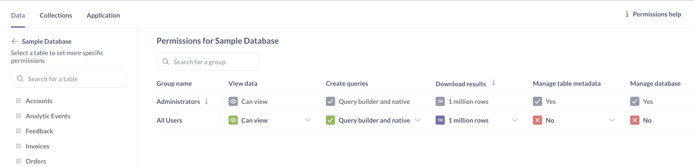
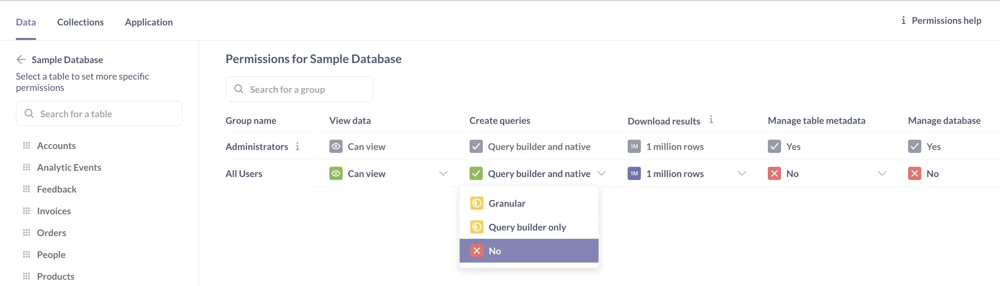
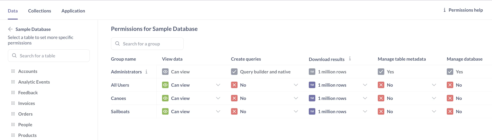
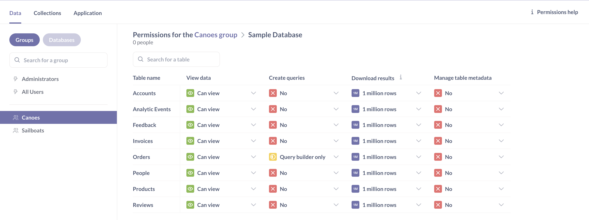
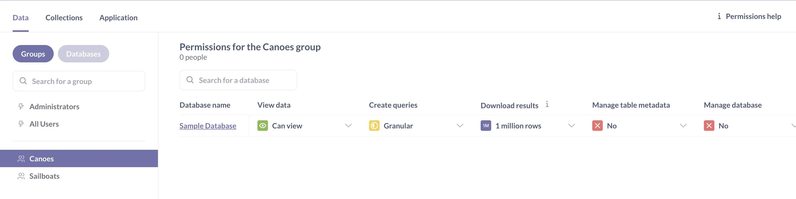
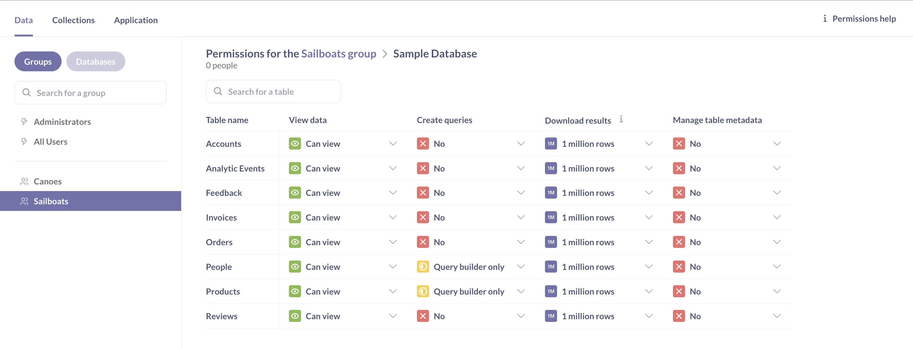

Data permissions specify how different [groups of people](/docs/latest/people-and-groups/managing#groups) can interact with tables and databases.

For each database, schema, and table you can specify:

- Who can see the results of questions;
- Who can create new questions (and how);
- Who can download results;
- Who can edit metadata.

In this article, we'll walk through an example of how to give people permission to view results of questions and create new questions based on the tables from the [Sample Database](/glossary/sample_database).

## Introducing data permissions

Let's start by navigating to **Admin** > **Permissions**, and selecting **Databases** > **Sample Database**. This will take us to the data permissions page at the database level. If you want to configure permissions for each _table_ in the Sample Database, you can click on the table name at the left.

[Data permissions must be configured for groups](./strategy#how-to-approach-permissions). Metabase comes with two default groups: Administrators and All Users. We'll create two new sample groups called Canoes and Sailboats, and set up data permissions to:

- Adjust the default permission settings for All Users: by default all users won't be able to create new questions
- Give the Canoes group permission to create questions in the query builder based on the `Orders` table only.
- Give the Sailboats group permission to create questions in the query builder based on the `People` and `Products` tables only.

## Configuring query permissions for the All Users group

First, we'll confirm that the **Create queries** permissions to the database for All Users, because Metabase grants the _most permissive_ level of access across all the groups that someone belongs to.

You can’t remove anyone from the All Users group, so if you give All Users **Query builder and native** permissions to the Sample Database, then that'll always be the most permissive setting for everyone who uses your Metabase, regardless of any other group that you put people in.

1. Go to **Admin** > **Permissions** > **Database** > **Sample Database**.
2. Click on the dropdown menu at the **All Users** row and **Create queries** column.
3. Confirm it's set to **No** (or set it to "No").
4. Click **Save changes** in the banner that appears at the top.

Selecting **No** for All Users to the Sample Database will:

- Prevent All Users from seeing any data from the Sample Database in the [data browser](/learn/metabase-basics/getting-started/data-browser).

- Prevent All Users from creating questions (both using query builder and SQL) from data from the Sample Database.

## Configuring view data permissions for the All Users group

The All Users group has the **View data** set to "Can view" permissions on the Sample Database. "Can view" means that All Users will be able to _view the results_ for the questions and dashboard in collections that match the [collection permissions](./collection-permissions) for your All Users group. If you revoked the query permissions, All Users won't be able to see the underlying data.

We'll keep these persmissions as is.

## Creating user groups

Let's create two new groups, and call them Canoes and Sailboats.

1. Go to **Admin** > **People**.
2. Select the **Groups tab**.
3. Click **Create a group** and name it "Canoes".

Repeat to create a group "Sailboats".
For more details, see [Creating groups](/docs/latest/people-and-groups/managing#groups).

## Reviewing default data permissions

Go to **Admin** > **Permissions** > **Databases** and select the **Sample Database** to see our new groups:

New groups default to **No** permissions to create queries because All Users have **No** permissions. This lets us selectively add permissions to each group.

For the Canoes and Sailboats groups, we want to:

- Prevent people in Canoes and Sailboats from viewing any Sample Database tables in the [data browser](/learn/metabase-basics/getting-started/find-data#browse-databases-and-tables).

- Prevent people in Canoes and Sailboats from using the query builder to create questions on top of Sample Database tables.

- Continue to allow people in Canoes and Sailboats to view the results of questions that are built on tables from the Sample Database, as long as these questions are saved in collections that match a given group's [collection permissions](./collection-permissions).

## Configuring query permissions for user groups

To give the Canoes group permission to create questions in the query builder based on `Orders` table only:

1. Go to **Admin** > **Permissions** > **Groups**.
2. Select the **Canoes** group.
3. Click **Sample Database**.
4. At the **Orders** row in the **Create queries** column, select **Query builder only** from the dropdown menu.
5. Click **Save Changes**.
6. In the modal that appears, review the effects of your permission changes: the Canoes group will have granular query creation permissions for Sample Database. Click **Change** to confirm.

You'll notice that you can only select **Query builder only** permissions on a table, but not **Query builder and native**. If you want to allow people to create native queries (for example, in SQL), you'll need to specify it on database level, not at the table level. Metabase doesn't parse your SQL so it won't know which tables are used in a query, and so it can't restrict access to specific tables.

If you go back to the Sample Database permissions for the Canoes group, you'll be taken to the data permissions page at the group level. From there, you'll see that Metabase auto-populates the yellow **Granular** permission under the **Create queries** column for the Sample Database. The **Granular** permission indicates that the Canoes group now has access to some, but not all of the tables in the Sample Database.

Let's configure another set of data permissions for the Sailboats groups to give Sailboats **Query builder only** permissions to the `People` and `Products` tables in the Sample Database:

Here's what our current data permissions do:

**View data** for a table:

| Group \ Table | All Users                             | Canoes                                | Sailboats                             |
| ------------- | ------------------------------------- | ------------------------------------- | ------------------------------------- |
| **Orders**    |  |  |  |
| **People**    |  |  |  |
| **Product**   |  |  |  |

**Create queries** in the query builder based on a table:

| Table \ Group | All Users                         | Canoes                                | Sailboats                             |
| ------------- | --------------------------------- | ------------------------------------- | ------------------------------------- |
| **Orders**    |  |  |      |
| **People**    |  |      |  |
| **Product**   |  |      |  |

## Configuring permissions for a user in multiple groups

Suppose Mr. Captain belongs to both the Canoes and Sailboats groups.

He has three sets of **Create queries** is permissions that are being applied from three different groups:

- **No** query permission permissions to the Sample Database from the All Users group.
- **Query builder only** permissions to the `Orders` table from the Canoes group.
- **Query builder only** permissions to the `People` and `Products` tables from the Sailboats group.

Since Metabase applies the most permissive settings across all groups, Mr. Captain will have "Create queries: Query builder only" permissions to the `Orders`, `People`, and `Products` tables. "Query builder only" permissions to these three tables means that Mr. Captain will be able to:

- See `Orders`, `People`, and `Products` tables in the **Data browser**
- Create questions in the query builder using any combination of `Orders`, `People`, or `Products`.
- Drill down and manipulate other people's query builder questions that use `Orders`, `People`, or `Products`, as long those questions are saved in collections that match his [collection permissions](/learn/permissions/collection-permissions).

Mr. Captain doesn't belong to any groups with Create queries permissions to the `Reviews` table or the Sample Database, which will:

- Prevent him from creating questions using the `Reviews` table.
- Prevent him from interacting with the native query editor at all (e.g., viewing, editing, or writing SQL queries).

Since Mr. Captain is also part of the All Users group with **Can view** permissions to the Sample Database, he'll still be able to view the results of questions that are built using the `Reviews` table or the native query editor, as long as he has the right collection permissions.

## More data permission options

- [Downloading results](/docs/latest/permissions/data#download-results-permissions)\*.
- [Block](/docs/latest/permissions/data#blocked-view-data-permission)\*.
- Managing the data model\*. See [Editing metadata](/docs/latest/administration-guide/03-metadata-editing).
- Managing the database\*. See [managing databases](/docs/latest/administration-guide/01-managing-databases) (though only admins can delete databases).

_\* Only available on [Pro and Enterprise plans](/pricing/)._

## Further reading

- [Data permissions documentation](/docs/latest/administration-guide/data-permissions)
- [Collection permissions tutorial](/learn/permissions/collection-permissions)
- [Collection permissions documentation](/docs/latest/administration-guide/06-collections)
- [Troubleshooting permissions](/docs/latest/troubleshooting-guide/permissions)
- [Data sandboxing](/docs/latest/enterprise-guide/data-sandboxes)
