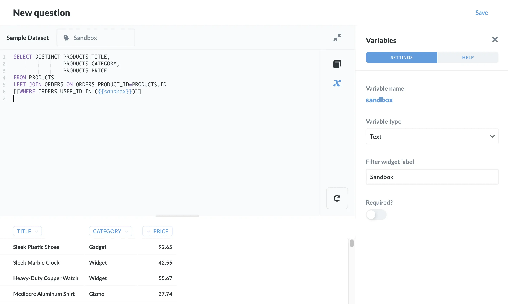
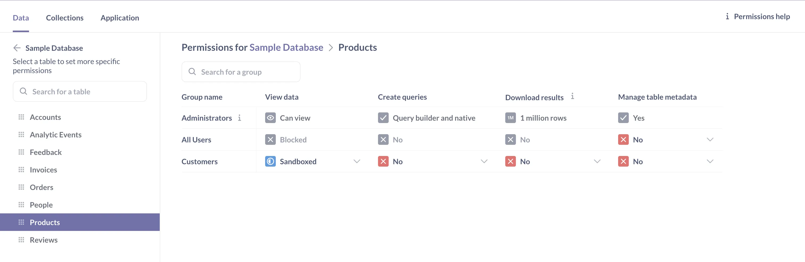
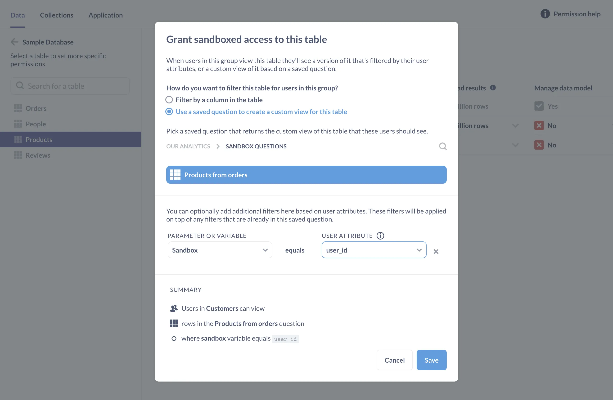
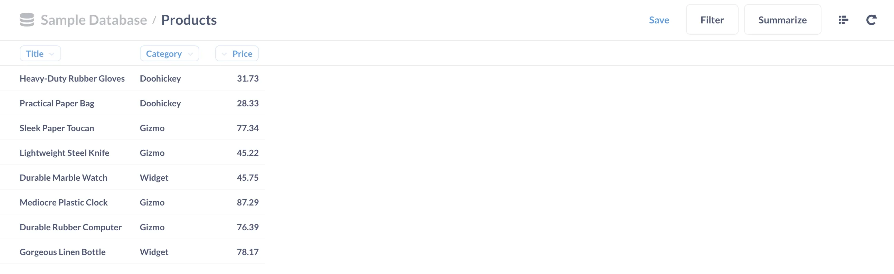

Sandboxing is available on [Pro and Enterprise plans](/pricing/) as a way to specify what data people can access based on who they are. Our article on [row permissions](/learn/permissions/data-sandboxing-row-permissions) covered how to create a [basic sandbox](/docs/latest/permissions/data-sandboxes#types-of-data-sandboxes) that restricts rows based on a person's user attribute. As an example, we created a user, Ms. Brown, and gave her access to rows in the `People` and `Orders` tables that matched her `user_id` attribute.

In this article, we'll walk through how to create a [custom sandbox](/docs/latest/permissions/data-sandboxes#types-of-data-sandboxes) for the `Products` table to limit the rows _and columns_ Ms. Brown can view. In this case, we want Ms. Brown to:

- Only see products she's placed an order for in the `Products` table.
- Only see the `Title`, `Category`, and `Price` columns (and not any of the other columns).

## The plan

We're going to:

1. Create a collection that only admins can access.

2. Create a new SQL query. The `Products` table doesn't include information about users. So to limit Ms. Brown's access to the `Products` table, we'll need to find out which products Ms. Brown ordered. We'll write a SQL query that combines data from the `Products` table with data from the `Orders` table. In combining these tables, we'll create a new tabular result that only includes the columns we want.

3. Sandbox the `Product` table by displaying our query's results instead of the original table for Ms. Brown.

4. Confirm our sandbox by verifying what data Ms. Brown can see.

## Create a collection accessible only by admins

We'll want to create a collection to store the SQL query that we'll use to sandbox this table. Let's call it `Sandbox Questions` and set permissions on this collection so that only admins can curate its questions. This way non-admins won't be able to alter the question and change the "dimensions" of the sandbox, for example by including columns Ms. Brown shouldn't be able to see. See [Collection permissions](/learn/permissions/collection-permissions) to learn more about setting up permissions.

### Create a SQL query

From the top bar, click on **+ New** > **SQL query** to [ask a SQL question](/docs/latest/questions/native-editor/writing-sql). Select the [Sample Database](/glossary/sample_database) included with Metabase.

Here's the query we'll paste into the editor:

```sql
SELECT DISTINCT PRODUCTS.TITLE,
                PRODUCTS.CATEGORY,
                PRODUCTS.PRICE
FROM PRODUCTS
     LEFT JOIN ORDERS ON ORDERS.PRODUCT_ID=PRODUCTS.ID
[[WHERE ORDERS.USER_ID IN ({{sandbox}})]]
```

And here's what the query does:

- Returns a result with columns from the `Products` table: `Title`,`Category`, and `Price`.
- Checks that the products are distinct, i.e., only one row for each product.
- Optionally filters this list to only show products that were ordered by the sandboxed user.

The double square brackets `[[…]]` around the `WHERE` clause make the clause optional. The double curly braces `{{sandbox}}` define the variable. We'll use this `{{sandbox}}` variable when sandboxing this question.

Let's run the query, which gives this result:



Now let's save this question as `Products from Orders`, store it in the `Sandbox Questions` collection we created, and opt out of adding the question to a dashboard.

One point to reiterate here: we only selected columns from the `Products` table, as our query should only return columns from the table we want to sandbox.

## Sandboxing the Products table using our saved question

Now that we've created our `Products from Orders` question, it's time to sandbox the `Products` table. We'll set up the sandbox so that Metabase inserts the `user_id` attribute we gave Ms. Brown in the article on [row permissions](/learn/permissions/data-sandboxing-row-permissions) into the `{{sandbox}}` variable in our saved SQL question, `Products from Orders`.

We'll click on the **gears icon**, select **Admin settings**, and click on the **Permissions** tab. On the left, under **Databases**, we'll click on `Sample Database` and `Products`. Since Ms. Brown is a member of the Customers group, and Metabase [grants data permissions to groups](/learn/permissions/data-permissions), not individuals, we'll grant Customers sandboxed access to the `Products` table.



When Metabase pops up the **sandboxing modal**, in the "How do you want to filter this table for uses in this group?" section, we'll select the second filter option: "Use a saved question to create a custom view for this table."

We'll navigate to our admin-only `Sandbox Questions` collection and select our question, `Products from Orders`. For `PARAMETER OR VARIABLE`, we'll select the variable we included in our SQL query, `{{sandbox}}`. For the `USER ATTRIBUTE`, we'll select `user_id`.



Our summary now says:

- People in the Customers group
- Can view rows in the `Products from Orders` question
- Where the `sandbox` variable's value equals `user_id`

Let's click **Save** in the modal, then confirm our changes by clicking on **Save Changes** in the notice bar.

## Check settings as the sandboxed user

Let's see what our sandboxed `Products` table looks like from Ms. Brown's perspective. Open a private browser window, navigate to our Metabase, and sign in as Ms. Brown.

When we open up the `Products` table using the [data browser](/learn/metabase-basics/getting-started/data-browser), we can confirm that Ms. Brown can only see a list of the products she's ordered, and only the three columns we included in our saved `Products from Orders` question: `Title`, `Category`, and `Price`.



If Ms. Brown asks a question that queries the `Products` table, she'll still only see results based on the products she's ordered. If she has access to a question that includes columns outside of her sandbox, she'll see an error.

## Prefer a SQL question when sandboxing a table

While we _can_ use a query builder question to sandbox a table, we recommend using SQL questions instead. Behind the scenes, questions create SQL queries based off the [filters](/docs/latest/questions/query-builder/filters), [summaries](/docs/latest/questions/query-builder/summarizing-and-grouping), and [joins](/docs/latest/questions/query-builder/join) in our question. When we sandbox based on a GUI question, we may not realize the full extent of the information we're giving people access to.

Alternatively, we can use the query builder to create a question, and then take a look under the hood to see the SQL code Metabase will run. In the query builder, we can click the **View the SQL** button in the upper right corner to confirm that Metabase is including the correct tables and columns---and nothing else.

## Recap

When sandboxing with questions:

- [Use SQL questions](/docs/latest/permissions/data-sandboxes#creating-a-sql-question-for-metabase-to-display-in-an-custom-sandbox).
- Make sure your saved SQL question only returns columns from the table you intend to sandbox.
- Save sandboxing questions in an admin-only collection, preferably a collection dedicated to questions used for sandboxing.

## Further reading

- [Data sandboxing: row-level permissions](/learn/permissions/data-sandboxing-row-permissions)
- [Data sandboxing documentation](/docs/latest/enterprise-guide/data-sandboxes)
- [Permissions overview](/docs/latest/administration-guide/05-setting-permissions)
- [Guide to data permissions](/learn/permissions/data-permissions)
- [Working with collection permissions](/learn/permissions/collection-permissions)
- [Single sign on with SAML](/docs/latest/people-and-groups/authenticating-with-saml)
- [Brand your Metabase instance](/learn/embedding/brand)
