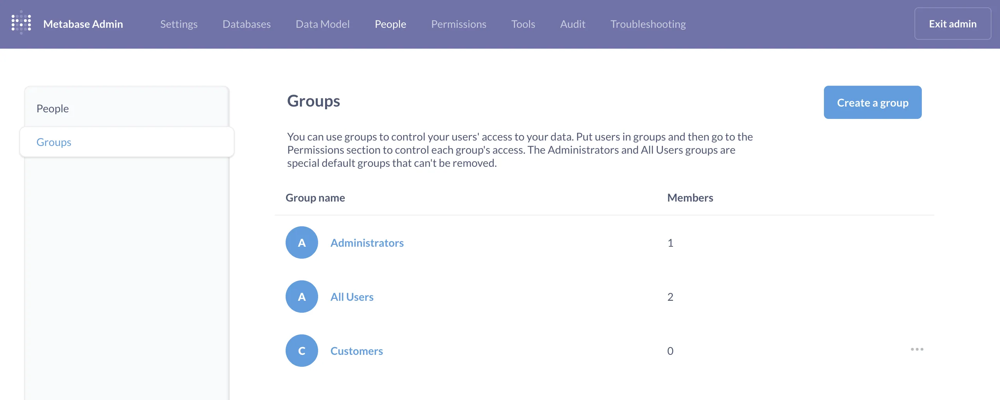
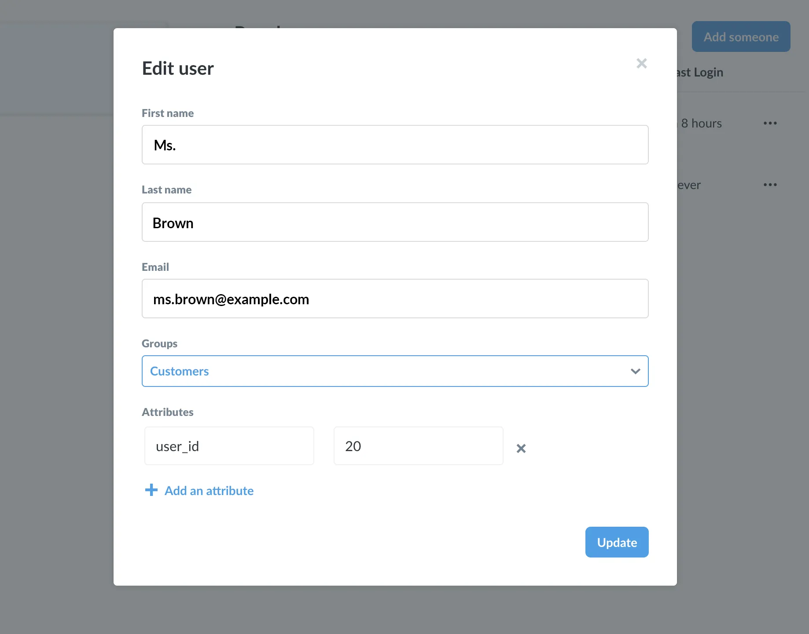
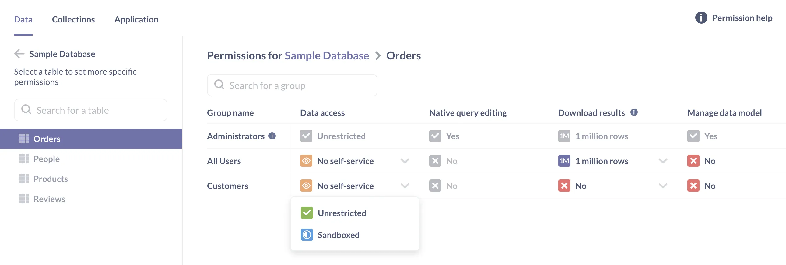
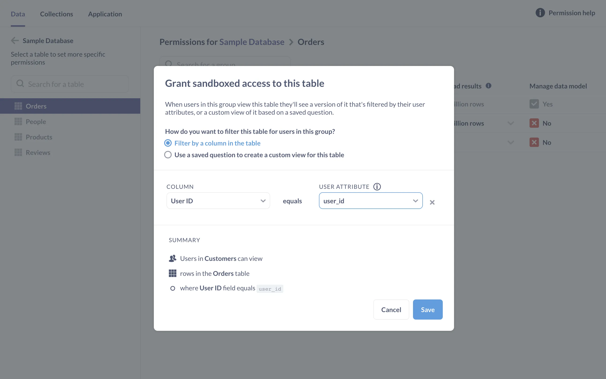
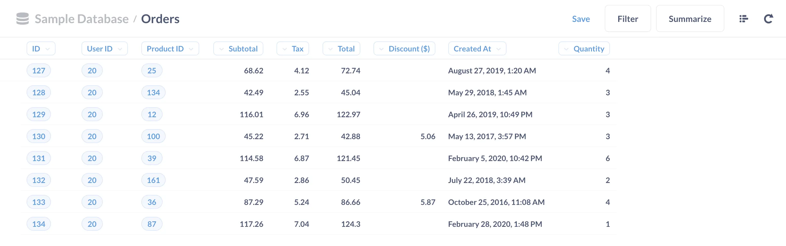

Metabase's [Pro and Enterprise](/pricing/) include [data sandboxes](/docs/latest/permissions/data-sandboxes), a feature that gives you granular control over the rows and columns that people can see and use in questions.

"Sandboxing" often refer to an isolated environment that's used to protect or isolate part of a system. Metabase uses the term sandboxing in a similar way, except in this case the isolated environment refers to a "data environment." When an admin grants a group sandboxed access to a table, they can only see the rows and columns included in that sandbox.

In this article, we'll walk through an example of setting up a [basic sandbox](/docs/latest/permissions/data-sandboxes#types-of-data-sandboxes) using the [Sample Database](/glossary/sample_database) included with Metabase. Basic sandboxes restrict access to rows; for column-level permissions, see [Custom data sandboxes](data-sandboxing-column-permissions).

## Before you sandbox

You should back up [your Metabase application data](/docs/latest/operations-guide/backing-up-metabase-application-data). In addition, you may want to check out our [guide to data permissions](/learn/permissions/data-permissions), [guide to collection permissions](/learn/permissions/collection-permissions), and our [permissions overview](/docs/latest/administration-guide/05-setting-permissions) to get a better sense of how sandboxing fits in with Metabase's permissions system.

## Our scenario

Our goal is to make sure a customer, Ms. Brown, is only able to see table rows related to her account.

## Creating a customer group

Metabase uses groups to organize permissions, so we'll first need to [create a group](/docs/latest/people-and-groups/managing#groups), which we'll call Customers. To do this, click on the **gears icon** in the navigation sidebar and select > **Admin settings** > **People** > **Groups**. Then choose **Create a Group**.

## Creating an account and adding an attribute

Before we can set sandboxed permissions to the Customers group, we need to [create an account](/docs/latest/people-and-groups/managing#creating-an-account) for Ms. Brown, and add an attribute to her account. From **Admin settings** > **People** tab, we'll click **Invite Someone**, fill out the names and email fields, and add her to the Customers group.

And here's the important part for sandboxing: we'll add an attribute to our new person, Ms. Brown, with a key of `user_id` and a value of `20`.

There's nothing magical about the `user_id` key: it's just a variable. We can add attributes with whatever key-value pairs we choose. What we want is to use a key that corresponds to a column, and a value that corresponds to row values, for the relevant table that we want to sandbox. The idea is that we'll link this attribute to a column in a table to determine which rows Ms. Brown can view.

We're setting this attribute up manually for the sake of this walkthrough, but we can use single sign-on services (SSO), like [SAML](/docs/latest/people-and-groups/authenticating-with-saml) to programmatically assign and synchronize attributes to users.

## Granting a group sandboxed access

Now that we have our group, and at least one member of that group with an attribute (Ms. Brown), we're ready to head over to the [data permissions page](/learn/permissions/data-permissions) to grant the Customers group sandboxed access to tables in the Sample Database.

In the lefthand sidebar, we'll click **Databases** and **Sample Database**. To grant the Customers group sandboxed View data access to the `Orders` table, all we need to do is click on the `Orders` table, navigate to the Customers row and in **View data** column, select **Sandboxed** from the dropdown menu.

The **sandboxing modal** will ask "How do you want to filter this table for users in this group?" and present two options:

- Filter by a column in the table.
- Use a saved question to create a custom view for this table.

For now, we'll leave the setting as **Filter by a column in the table**—using a saved question is a more advanced feature, and we discuss it [here](/learn/permissions/data-sandboxing-column-permissions).

For the column, we'll select the `User ID` column of the `Orders` table, and we'll connect that to the `user_id` attribute from the dropdown menu of attributes we've assigned to people.

Metabase will provide us with a summary of the changes we've made: "Users in Customers can view rows in the `Orders` table where `User ID` field equals `user_id`." Let's save our changes and repeat the process for the `People` table.

- Grant sandboxed access to the Customers group for the `People` table.
- Select the **Filter by a column** option.
- Select the `ID` column of the `People` table and connect that to the `user_id` attribute.
- Review the summary and click save.

Finally, we'll need to click the **Save Changes** button to confirm our changes.

## Check settings as Ms. Brown sees the world

Now let's test out our settings to confirm that our customer, Ms. Brown, can only see orders connected to her user ID. We'll open our Metabase instance in an incognito browser window and log in as Ms. Brown. When we navigate to the `Orders` table, Ms. Brown will only see the orders she placed (User ID 20).

By sandboxing the table, we can create a single question or dashboard, and rest assured that people with sandboxed access to that data will only be able to see the data associated with their account.

If we combine sandboxing with [interactive embedding](/docs/latest/embedding/interactive-embedding), we can embed these dashboards in our application, and use SSO to pass attributes to the embedded Metabase instance, allowing us to provide sandboxed access to the questions and dashboards embedded in our application. To learn more, see [How to embed Metabase in your app to deliver multi-tenant, self-service analytics](/learn/embedding/multi-tenant-self-service-analytics).

## Sandboxing limitations

- Sandboxing only works with SQL databases.
- A user can only have one sandbox per table, so only add users to a single group with sandboxed access to a table.
- If a group has SQL querying access to a database, sandboxing cannot prevent people in that group from viewing data in those tables.
- By extension, if people in that group have access to questions written in SQL, those questions are unaware of the sandboxing access, and will show people in that group all results, not just the results in that group's sandbox.

Learn more about the [limitations of data sandboxing](/docs/latest/permissions/data-sandboxes#limitations).

## Further reading

- [Data sandboxing reference](/docs/latest/enterprise-guide/data-sandboxes).
- [Custom sandboxes: limiting access to columns](data-sandboxing-column-permissions).
