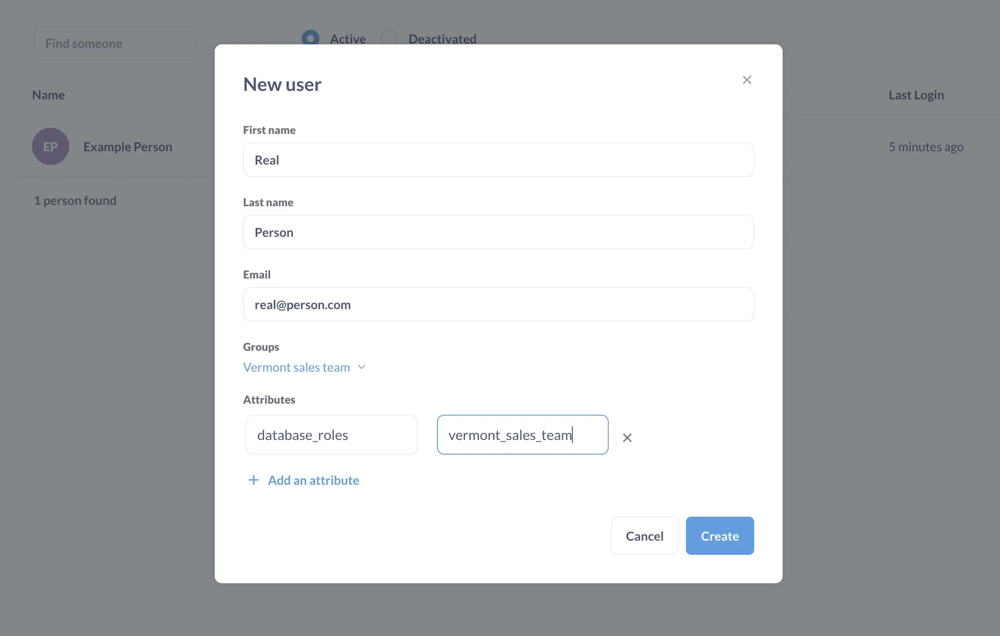
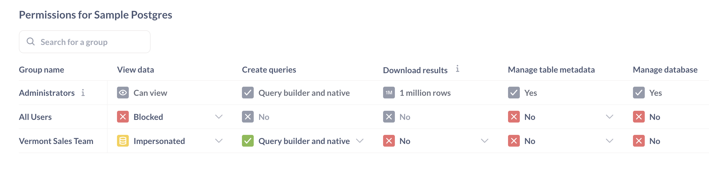
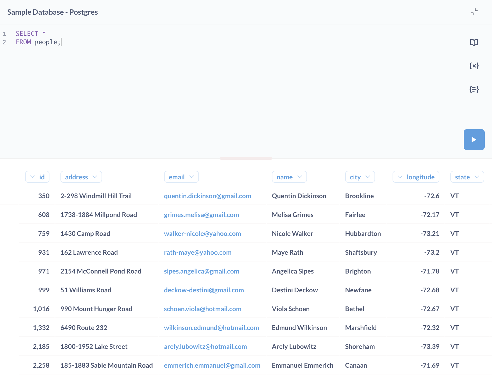

> Impersonation is a [Pro/Enterprise](/pricing/) feature, and is currently only available for PostgreSQL, Redshift, and Snowflake.

Impersonation is a permissions setting in Metabase that lets you manage permissions in your database. With impersonation, you can pass a user property all the way down to the database layer, which means that you can set a role right before your database executes the query.

## Impersonation vs sandboxing

### Impersonation sets permissions for questions written in both the SQL editor and the query builder

Impersonation operates at the database level. In a database engine, setting the role before the query runs can alter the results of the query, as the role defines the permissions that your database should use when it executes the statements.

### Sandboxing only sets permissions for query builder questions

Sandboxing operates at the Metabase level. Since Metabase can't parse SQL queries to find out what data people are allowed to view, sandboxing only applies to questions composed in the query builder (where Metabase can interpret the queries).

## Example use case for impersonation

Let's say we have a People table that includes rows of accounts from all 50 states of the United States.

Let's say you want your Vermont sales team to:

- Be able to ask questions using both the query builder and the native SQL editor.
- Only be able to view customer accounts in the People table who live in Vermont.

First, you'll set up permissions in your database by creating a role with a policy. Then in Metabase you'll set data access to that database to Impersonation, so when people run queries on that database, Metabase will use that role to limit what data they can see.

### Set up permissions in your database

Assuming you're using Postgres, with any SQL client (e.g., psql), log in to your database.

You'll create a role called `vermont_sales_team` and only allow that role to select rows in the `people` table where the value in the `state` column is `VT` (the abbreviation for Vermont).

```sql
CREATE ROLE vermont_sales_team;

GRANT
SELECT ON ALL TABLES IN SCHEMA PUBLIC TO vermont_sales_team;


CREATE POLICY vermont ON people
FOR
SELECT TO vermont_sales_team USING (state = 'VT');


ALTER TABLE people ENABLE ROW LEVEL SECURITY;
```

### Set up a group in Metabase

In Metabase, click on the **gear** icon and go to **Admin settings** > **People** > **Groups**. Click **Create a group**. Call it "Vermont sales team".

Add a person to that group (create a test user if you need to).

### Add an attribute to a person's account

In the **Admin settings**, go to **People** and find that person's account. Edit their account and click on **Add an attribute**.

Here you'll associate an attribute with a role: `database_role` with `vermont_sales_team`.



### Set the group's permissions to Impersonation

You'll need to restrict the default permissions for the All Users group, and then add Impersonation permissions for your new group.

1. Go to the **Admin settings** > **Permissions** > **[Your database]**

2. Restrict permissions for the **All users** group.

   People in multiple groups have the most permissive access granted to them among all their groups. Because every Metabase user is in the All Users group, we need to restrict the All Users group's permissions so that they don't override the Vermont sale's team's Impersonation permissions.

   Restrict the **All Users** permissions by setting:

   - **View data** to **Blocked**
   - **Create queries** to **No**.

3. For the "Vermont sales team" group, change **View data** permissions to "Impersonated".

   Metabase will ask you to pick the user attribute you want to pass to the DB, so choose the `database_role` attribute which we created earlier.

4. For "Vermont sales team" group, set **Create queries** to **Query builder and native**.

   These permissions will allow the "Vermont sales team" group to create both query builder questions and native SQL queries.

So the permissions setup for your database will look like this:



### Verify impersonated permissions are working

Log in as a person in the "Vermont sales team" group. Go to **Browse data** in the left nav and go to the **Sample database**. If you click on the **People** table, you should only be able to see people who live in Vermont.

The same permissions apply when someone in the "Vermont sales team" group writes a SQL question.

```sql
SELECT * FROM people;
```



The results should only include people from Vermont. Subscriptions and alerts should also have these permissions applied.
