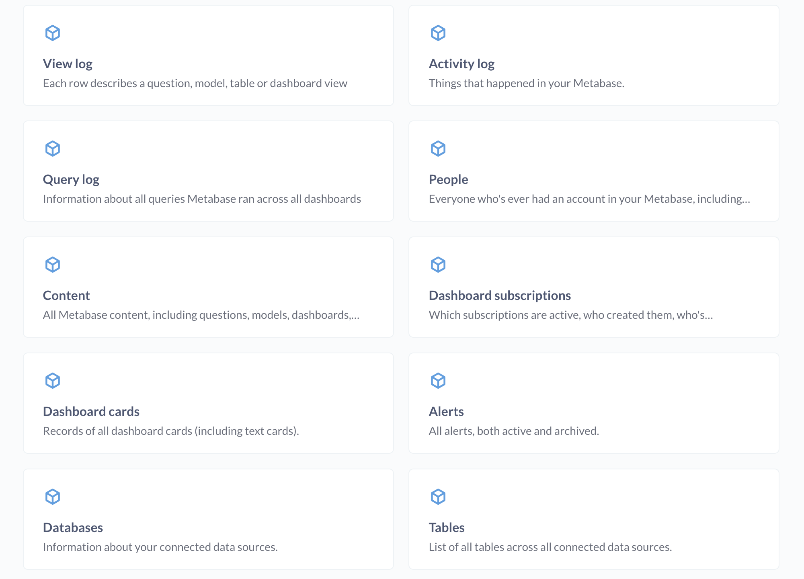
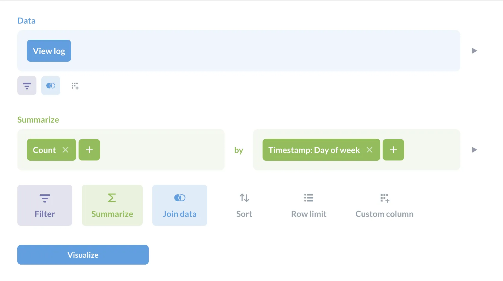
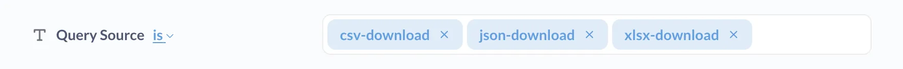
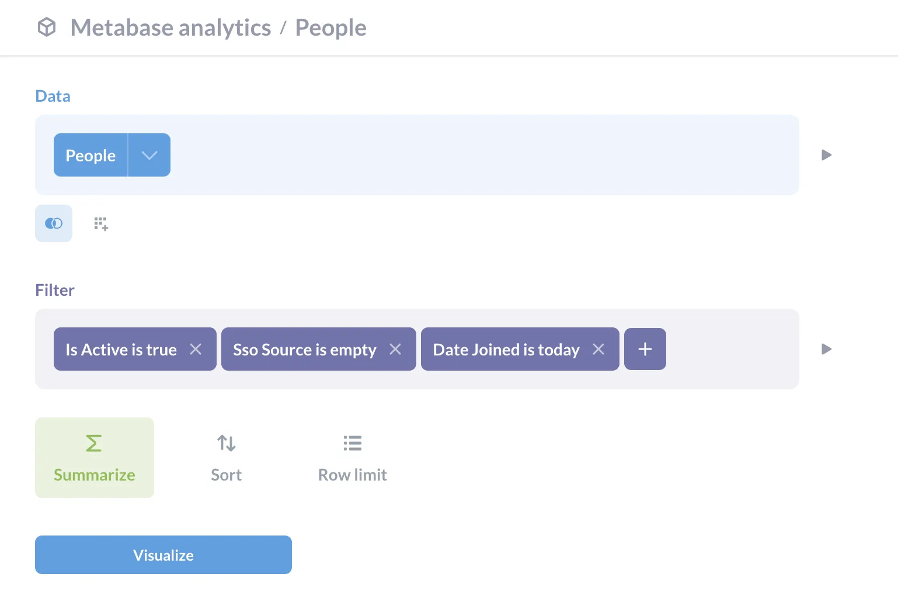

A proper _self-service_ analytics setup is the ideal analytics setup. If you configure your groups and permissions correctly ("correct" according to whatever your requirements are), you'll have a smoothly running analytics machine. But humans have an uncanny ingenuity for errors---even admins setting up these systems.

So this article is about how to set up tripwires around your analytics to pick up on unintended (or shady) behavior: someone's in a group they shouldn't be in; they saw or downloaded something they shouldn’t; downloaded a ton of data, or other "intriguing" activity that you should probably keep an eye on.

The following isn't intended to be best practice security advice. It's more an à la carte menu of things admins can do to make sure your data's working for you, not against you.

## Some things you can keep tabs on with usage analytics

[Pro](/product/pro) and [Enterprise](/product/enterprise) plans ship with usage analytics built in. The [Usage Analytics](/docs/latest/usage-and-performance-tools/usage-analytics) collection tracks all sorts of usage in your Metabase: user activity, logs of all queries, query execution time, dashboard activity, and more.

Here are some ways to put this usage data to use.

### New people in town

To see when someone joined or updated their account:

1. Go to the **Usage Analytics collection**.
2. Check out the **Activity log**.
3. You can filter by:
   - `user-invited` to see who's been invited to your Metabase, and
   - `user-joined` to see when people first logged in to your Metabase.
   - `user-update` to see when an account was changed.
   - `user-deactivated` to see when an account has been deactivated.

To learn more about the person, you can plug in the `User ID` into the **Person overview** dashboard.

If you want to see all the topics in the Activity log:

1. Click the `Topic` field
2. Select **Distribution**.
3. Click on the table view to see a more readable list of topics.

### Logins and content views

Know who's logging into your Metabase and when. For example, to see logins by day of week:

1. Go to the **Usage Analytics collection**.
2. Go to the **View log**
3. Summarize by count of rows.
4. Group by timestamp.

If you just want to see Saturday and Sunday, you can filter out days of the week by clicking on **Filter** > **Exclude...** > **Days of the week**, then selecting the days you want.

### Content that people have made public

You can see what’s been shared to make sure you’re not accidentally sharing stuff, like your accounts list or financial data.

To see what content's been made public, and by whom:

1. Go to the **Usage Analytics collection**.
2. Check out the **Content model**.
3. Filter the `Made public by user` column for `Not empty`.

The column will show the `User ID` for the person who made the item public.

### Check for data downloads

You can check to see if someone is exporting a list of accounts or contact details, or downloading a massive table.

1. Go to the **Usage Analytics collection**.
2. Head to the **Query log** model.
3. Filter on `Query source`.
4. Select all download types:
   - `csv-download`
   - `json-download`
   - `xlsx-download`

You’ll also be able to filter on the number of rows exported.

### Changes to settings

You can also check to see if anyone has made any changes to the settings for your Metabase:

1. Go to the **Usage Analytics collection**.
2. Go to the `Activity log` model.
3. Filter `Topic` for `settings-update`.
4. You can then filter on the `Details` column to target the setting change you're looking for.

## How to keep an eye on your Metabase

A couple of tips on how to be lazy about monitoring activity.

### Set up alerts

Alerts (and dashboard subscriptions) are great at getting data in front of people without making them go to Metabase — even if they're outside of your org.

You can set up alerts so Metabase [notifies you when something happens](/docs/latest/questions/alerts#results-alerts), or if values cross a certain threshold.

As a trivial example, let's say you want to get notified any time someone sets up an account in your Metabase without using SSO.

1. Go to the **Usage Analytics collection**.
2. Go to the `People` model.
3. Filter `Is Active` true, `Sso source` set to `is empty`, and `Date joined` for `today`.
4. Save the question (you could save it in Usage Analytics's custom reports sub-collection, for example.)

With the question saved, you can then set up an [alert](/docs/latest/questions/alerts) to email you any time this question returns results (that is, whenever someone creates an account using email and password).

### Delegate responsibility

With larger, more bureaucratized companies, you, the admin, may not know who is supposed to be in which group and why. But different groups can manage their own stuff.

To delegate responsibility, you can make people [group managers](/docs/latest/people-and-groups/managing#group-managers), so they can manage their respective groups, and you can give them permissions to view the Usage Analytics collection so they can keep tabs on their own groups.
