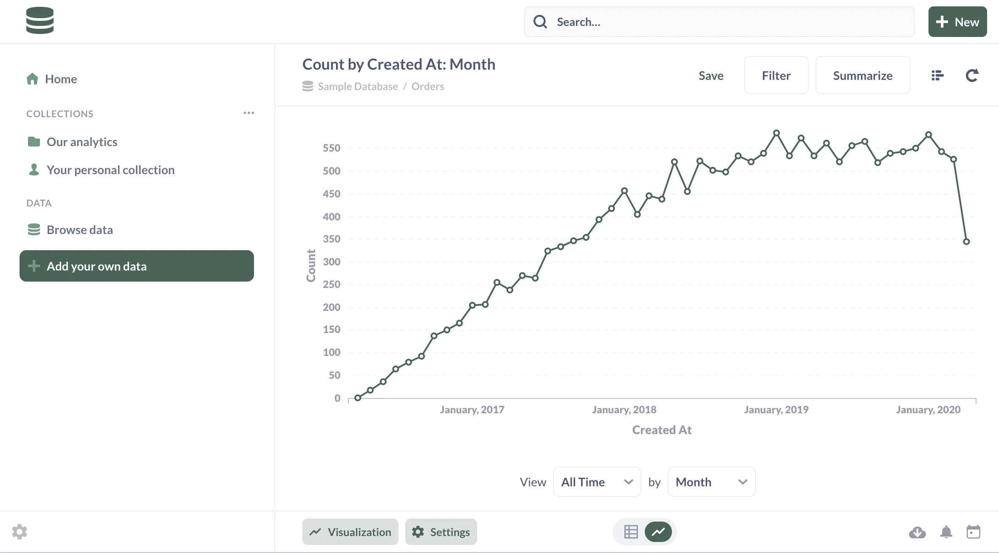
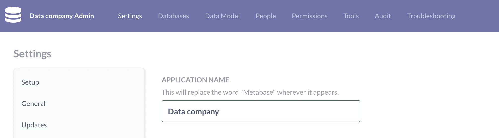
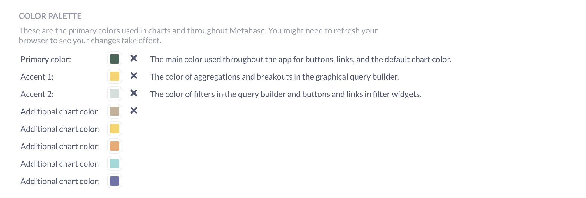
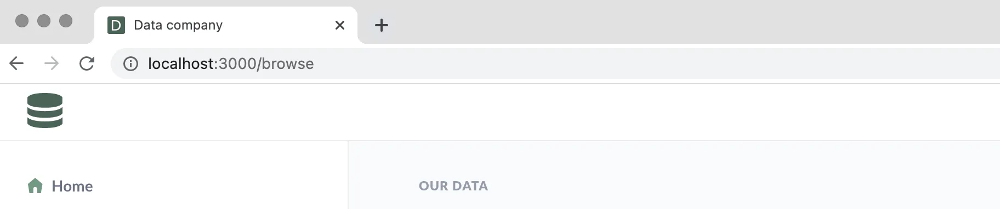
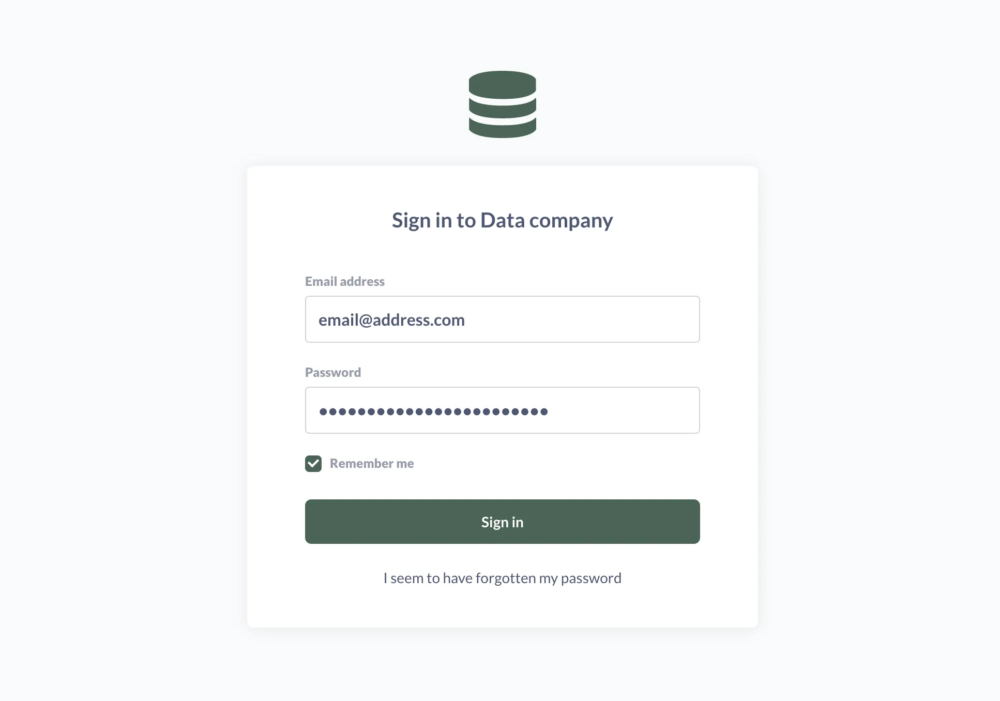





You can customize how Metabase looks and feels with its white labeling settings.

## White label settings

To start customizing Metabase's appearance, click on the **gear** icon, then go to **Admin settings** > **Settings** > **Appearance**.

## Application name

Use the **Application name** text box to enter the name of your company. (We used "Data company" as an example.) Your company name will be saved and distributed throughout the application. Anywhere the text "Metabase" appeared will now be replaced by your company's name.

## Font



Choose from a list of included fonts or upload your own font files.

## Color palette

You can change the application's default colors in the color palette section.

Click the color swatch you want to change. In the pop up, select a new color using your method of choice:

- Drag the color selectors along the color and opacity gradients
- Enter a hex number
- Enter an RGBA number
- Select a color swatch from the color palette provided

## Logo and favicon

You can upload a company logo to replace the Metabase logo throughout the app. With an icon link, you can personalize the favicon that appears in your browser's tab. Note that if you use a relative path, that path is not relative to the Metabase JAR, but to the webserver. So unless you are using a reverse-proxy, the path will be relative to the frontend resources available to the JAR.

If you change your application name, but not your favicon, the favicon will remain the Metabase logo, so make sure to set a favicon.

## Home page

You can set the home page to open to a specific view: a collection, or dashboard, question, or data reference page. For example, if you want to set the homepage to the Browse data page ("http://localhost:3000/browse"), enter "/browse" in the home page field.

## Sign-in page

Metabase will also reflect your changes on the sign-in page.

## Further reading

- [White labeling Metabase](/docs/latest/enterprise-guide/whitelabeling)
- [External facing analytics](/learn/embedding/embedding-overview)
- [Custom maps](/docs/latest/administration-guide/20-custom-maps)
