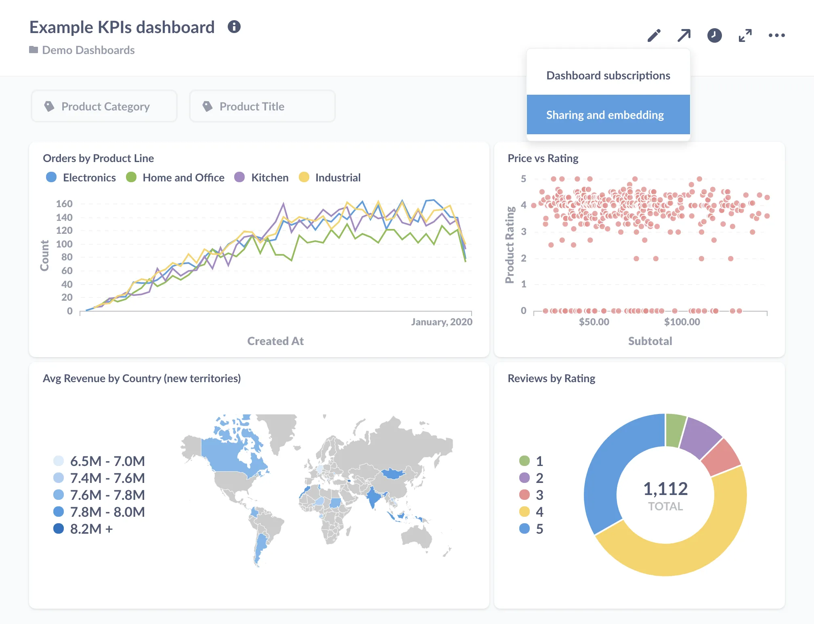
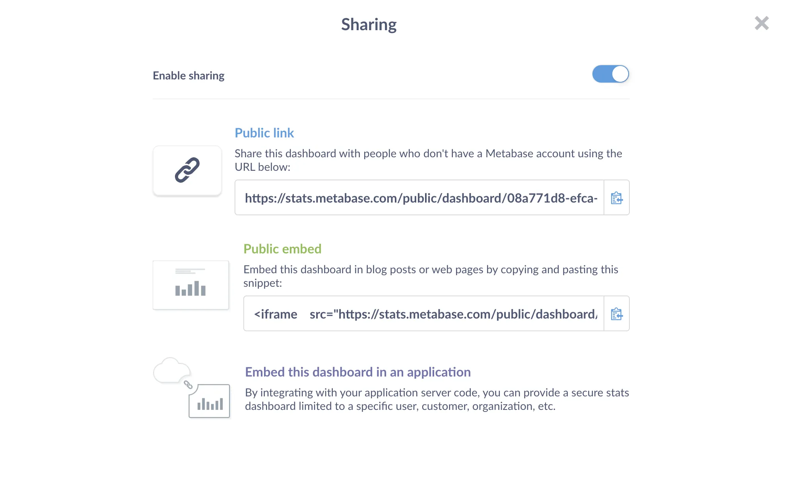
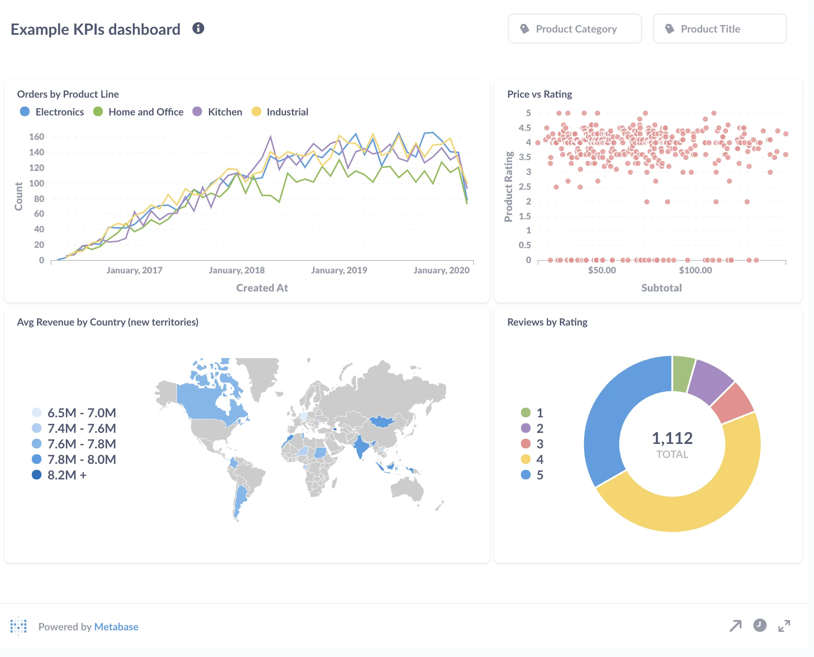
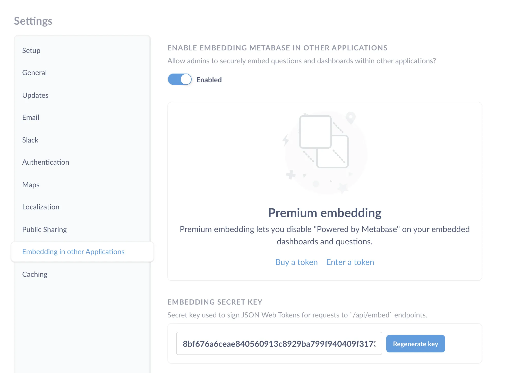
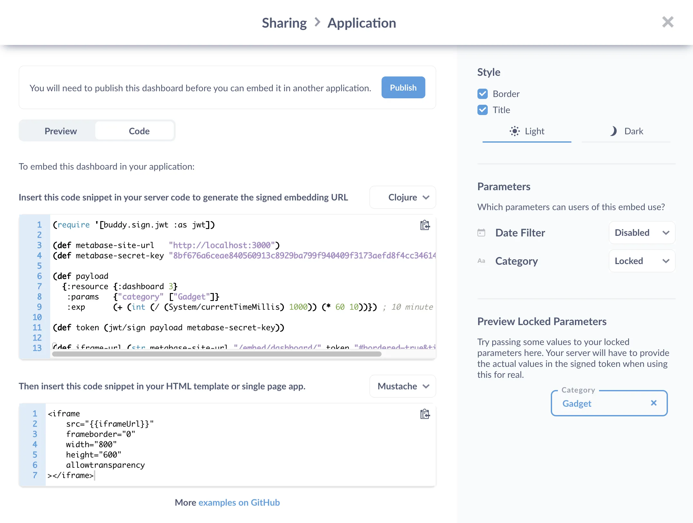
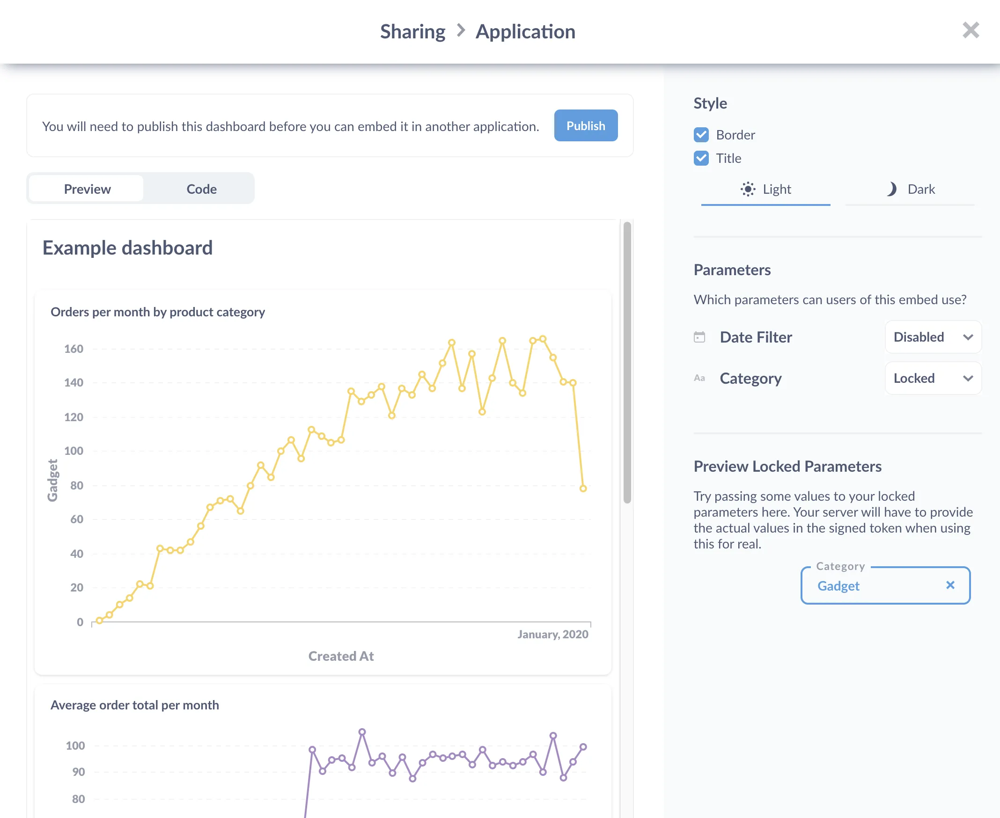



In this tutorial, we'll show you a few options for publishing Metabase charts and dashboards, from lowest to highest effort.

We'll start with no-code public links, work our way up to public embeds that only require a single code snippet, and finish with sample code for those of you who want to spin up your own web app.

If you'd like to see some examples of when and why you'd choose one kind of publishing over another, check out [A Metabase mystery](./external-sharing).

## Public links and embeds

For quick sharing of questions and dashboards, you can simply send a public link, or drop an iframe in your website (or in anything that renders HTML). This is a great way for sharing charts and dashboards on the fly.

## Sharing options

Let's say we want to share a dashboard. We'll click on the **Sharing** icon and select the **Sharing and embedding** option.



This will bring up our sharing options:



### Public links

A public link is the easiest way to share a dashboard. Public links aren't even embeds; they're just links to a single question or dashboard, though these public items are a little different than their original versions.



These public links will include a **Powered by Metabase footer**, which you can remove if you have a [Pro or Enterprise plan](/pricing/). The charts will also have their drill-through disabled, and we won't be able to [customize click behavior](/learn/metabase-basics/querying-and-dashboards/dashboards/custom-destinations) on a dashboard.

If we have a default filter value set, Metabase will apply that filter to the question or dashboard. People will be able to change the filter, so we can't rely on filters to restrict which data people can see. To lock (or hide) a filter, we'll need to use a [static embed](#enable-embedding-in-other-applications).

We can also format the URL to assign a value to a filter, or hide the filter altogether---though keep in mind that the recipient can simply edit the URL.

While these public links are hard to guess, anyone with that link could view our dashboard, so it's not the best solution for sharing sensitive data. Still, we can quickly share a public link to a dashboard (with a customer, for example), then disable it once they've seen it. If we share the dashboard again, Metabase will generate a new link (so we don't need to worry about access to the old link). If you accidentally share a link, you can disable it at any time; just toggle the sharing to off. Admins can view and disable all public links from the Admin panel.

### Public embeds

We can embed a question or dashboard in our website using an iframe. It's as simple as copying and pasting code from your Metabase and dropping it into the source code of a webpage. We can even use it with no-code website builders---anywhere we can drop in HTML. For example, you can embed a dashboard in a blog to help [tell a story with data](https://punctumbooks.pubpub.org/pub/visualization-book-usage-statistics-metabase/release/2), or simply [fill the whole page with a dashboard](https://data.color.com/v2/cardio.html).

Here's an iframe to display a dashboard:

```html
<iframe
  src="http://your-website.com/public/dashboard/f54f5ae5-39a4-4662-85d5-a02e78165279"
  frameborder="0"
  width="800"
  height="600"
  allowtransparency
></iframe>
```

An iframe creates another, nested browser window inside the current browser window. The iframe window points to its own URL, and presents the response from that address - in this case, the chart or dashboard we want to present. Like the public link, the chart will feature the **Powered by Metabase footer**.

We can adjust the width and height to suit our chart or dashboard. If we're embedding a dashboard and the iframe isn't wide enough to accommodate the dashboards layout, Metabase will stack the questions in the order they appear, from left to right, on the dashboard.

## Enable embedding in other applications

If we want to restrict who can see our chart or dashboard, or lock a filter, we need to use a static embed. This feature is separate from the public sharing options, and accessible only to admins. We'll also have to enable the `Embedding in other Applications` setting before it'll work. In the **Admin Panel**'s **Settings tab**, we'll click on `Embedding in other Applications` and toggle on `Enabled`.

Let's return to the dashboard we want to share. With embedding enabled, we get a secret key.



To set up a static embed, we need to insert some code on our server to sign JSON Web Tokens (JWT) for our users. Metabase will generate code for Clojure, Python, Ruby, and JavaScript (Node.js), but you should be able to translate that code for servers written in other languages as well.



Before we hit the **Publish button**, let's review some of our options.

### Hide or lock parameters to restrict what data is shown

If our question or dashboard has a filter, we can disable the filter, or lock parameters to set a fixed filter value.

Let's say we want to show someone a dashboard, but we only want to let them see orders in the `Gadget` category.



In our example, the parameters set the filter on the dashboard. Here we set the Category filter to `Gadget`.

Here's some example code for a server written in Clojure:

```clojure
(require '[buddy.sign.jwt :as jwt])

(def metabase-site-url   "MY-DOMAIN-HERE")
(def metabase-secret-key "SECRET-KEY-HERE")

(def payload
  {:resource {:dashboard 3}
   :params   {"category" ["Gadget"]}
   :exp      (+ (int (/ (System/currentTimeMillis) 1000)) (* 60 10))}) ; 10 minute expiration

(def token (jwt/sign payload metabase-secret-key))

(def iframe-url (str metabase-site-url "/embed/dashboard/" token "#bordered=true&titled=true"))
```

This code will use the secret key that Metabase gives us to sign the JWT token: our users will not---and _should_ not---see the secret key.

Here's how it will go down.

1. In Metabase, we publish the dashboard we want to embed in our application.
2. We insert the iframe into a page of our application.
3. We place the code to sign JSON Web Tokens in our server.
4. Our user logs into our application.
5. The user requests a page in our application with the embedded dashboard.
6. When the server handles the request for that page, it will sign the user's token and insert that token as the iframe's source URL.
7. When the page loads, the page requests the dashboard from our Metabase instance using the signed token.
8. The dashboard loads in an iframe in our application with the paramaters and expiration set by our application server.

If the token is not signed, or if it's altered in any way, the dashboard won't load.

In the `payload` map, we can specify when the signed JWT will expire (in the code above, the token expires after 10 minutes).

The `:params` field is where we can lock a parameter to set a default, fixed filter on your dashboard or question. For example, we could create a dashboard with a filter for a user ID, then---on our server---programmatically insert a user's ID as parameter. The signed token will lock the filter to that ID, so any user who sees that dashboard will only see data that's been filtered by their ID.

## Examples

We maintain embedding examples in several languages in [a public Git repository][embedding-repo]. The subsections below walk through a minimal example in Django (a popular Python web framework) and Shiny (the most popular web framework for R).

### An example using Django

Our minimal Django application contains just two files: an HTML template in `index.html` and a short Python program in `index.py`. The template is short and sweet:

```html
<!DOCTYPE html>
<html>
  <head>
    <title>{{ title }}</title>
  </head>
  <body>
    <h1>Embed {{ title }}</h1>
    <iframe
      src="{{iframeUrl}}"
      frameborder="1"
      width="800"
      height="600"
    ></iframe>
  </body>
</html>
```

It requires two values: the page title in `title` and the URL of the iframe containing the static embed in `iframeUrl`. The title is just a string, but as explained above, we need to do a bit of work to construct the URL. The program starts with some libraries and settings required by Django:

```python
# Required by Django
import os
from django.conf.urls import url
from django.http import HttpResponse
from django.template.loader import render_to_string

DEBUG = True
SECRET_KEY = '4l0ngs3cr3tstr1ngw3lln0ts0l0ngw41tn0w1tsl0ng3n0ugh'
ROOT_URLCONF = __name__
TEMPLATES = [{
    'BACKEND': 'django.template.backends.django.DjangoTemplates',
    'DIRS': [os.getcwd()]
}]
```

We then include a couple of libraries and define a couple of values for the embedding:

```python
# Required for Metabase embedding
import time
import jwt
METABASE_SITE_URL = 'http://localhost:3000'
METABASE_SECRET_KEY = '40e0106db5156325d600c37a5e077f44a49be1db9d02c96271e7bd67cc9529fa'
```

We need `time` to calculate the expiry time for our signed token and the [`jwt`][python-jwt] library to sign the token. `METABASE_SITE_URL` tells the program where to find our instance of Metabase---in this case we're running it locally---and `METABASE_SECRET_KEY` is the value generated by Metabase that we send back to it to prove we're allowed to access questions. We wouldn't put this in our source code in a production environment; instead, we would store it in an environment variable or a separate configuration file.

We must include three values in the token we send to Metabase. Since one of these is the token expiry time, which changes for each request, we put the code for constructing the token in the function that handles requests for pages. For example purposes we want question #1, and we'll ask that the token be valid from now until ten minutes in the future:

```python
# Handle requests for '/'.
def home(request):
    payload = {
        'resource': {'question': 1},
        'params': {},
        'exp': round(time.time()) + (60 * 10)
    }
    token = jwt.encode(payload, METABASE_SECRET_KEY, algorithm='HS256')
    iframeUrl = METABASE_SITE_URL + '/embed/question/' + token + '#bordered=true&titled=true'
    html = render_to_string('index.html', {
        'title': 'Embedding Metabase',
        'iframeUrl': iframeUrl
    })
    return HttpResponse(html)
```

We use the function `jwt.encode` from the `jwt` library to encrypt our token parameters using the secret key we got from metabase. (The parameter `algorithm='HS256'` tells `jwt.encode` which hashing algorithm to use---we must always use that one.) We then insert that encrypted token into a URL, render the HTML template, and return that to the application. Finally, our program ends by telling Django how to match incoming requests to rendering functions:

```python
urlpatterns = [
    url(r'^$', home, name='homepage')
]
```

If we run our application from the command line with:

```shell
$ django-admin runserver --pythonpath=. --settings=index
```

and then point our browser at `http://localhost:8000/`, the following things happen in order:

1. The browser sends an HTTP request for `/` (the root of the website) to the Django application that is listening on port 8000.

2. That application matches the URL in the request to the `home` function.

3. `home` generates a new token whose expiry time is 10 seconds in the future.

4. It then reads `index.html` and replaces `{{title}}` with "`Embedding Metabase`" and `{{iframeUrl}}` with the URL that includes the newly-generated token.

5. `home` then sends that HTML back to the browser.

6. As the browser is displaying that HTML it comes across the iframe. The `src` attribute in the `iframe` tag tells it to send a request to Metabase.

7. When Metabase gets a request whose URL starts with `/embed/question`, it extracts the rest of the path from the URL and decrypts it.

8. Since the URL was encoded with a secret key that Metabase generated, decryption is successful, which tells Metabase that the sender is allowed to view the question. The values embedded in the token tell Metabase which question is being asked for.

9. Metabase runs the question and produces the HTML that it would display in its own interface, then sends that HTML back to the browser that made the request.

10. The browser inserts that HTML into the iframe and shows it to the user.

### An example using Shiny

Our minimal Shiny example is a little bit simpler than the Django example shown above because Shiny requires less boilerplate. To start, we load the libraries for Shiny itself, managing web tokens, and gluing strings together:

```r
library(shiny)
library(jose)
library(glue)
```

We then define two values that specify where Metabase is running (we'll use a local instance) and the secret key that Metabase provided for authentication:

```r
METABASE_SITE_URL <- 'http://localhost:3000'
METABASE_SECRET_KEY <- '40e0106db5156325d600c37a5e077f44a49be1db9d02c96271e7bd67cc9529fa'
```

The user interface is based on a popular CSS framework called [Bootstrap][bootstrap] and has two elements: the level-1 heading containing the page's title and a `div` containing our iframe. The UI doesn't build the iframe itself; instead, it uses the `uiOutput` function to render something called `container`:

```r
ui <- bootstrapPage(
  h1('Page title'),
  uiOutput('container')
)
```

Where does `container` come from? In Shiny, the answer is, "The server." As shown below, `server` builds a JWT claim and encrypts it to construct the iframe's URL. It then calls `renderUI` to get the HTML content of the iframe and assigns that to `output$container`. When this assignment happens, Shiny automatically tells the UI that it needs to redraw the page:

```r
server <- function(input, output) {
  # Token expires 10 minutes in the future.
  expiry <- as.integer(unclass(Sys.time())) + (60 * 10)

  # Construct params in two steps so that JSON conversion knows it's a list.
  params <- list()
  names(params) <- character(0)

  # Create the JWT claim.
  claim <- jwt_claim(exp = expiry, resource = list(question = 1), params = params)

  # Encode token and use it to construct iframe URL.
  token <- jwt_encode_hmac(claim, secret = METABASE_SECRET_KEY)
  url <- glue("{METABASE_SITE_URL}/embed/question/{token}#bordered=true&titled=true")
  output$container <- renderUI(tags$iframe(width = "600", height = "600", src = url))
}
```

Let's go through the `server` function in more detail. First, we want our token to be good for ten minutes, so we get the current time as an integer and add 600 seconds:

```r
  expiry <- as.integer(unclass(Sys.time())) + (60 * 10)
```

We then use the `jwt_claim` function from the [`jose`][r-jose] library to construct the token. This function gets its name from the fact that we're claiming we're allowed to do something, and it takes any number of named parameters as inputs:

```r
  params <- list()
  names(params) <- character(0)
  claim <- jwt_claim(exp = expiry, resource = list(question = 1), params = list())
```

The first two lines of the code shown above are needed because `jose` relies on another library called `jsonlite` to turn structures into JSON strings, and by default that library turns an empty list into an empty array `[]` rather than an empty map `{}`. It's a small difference, but when Metabase decodes the structure, it requires `params` to be a map with keys. The fix is to give `params` an empty list of names so that `jsonlite` produces `{}` as required; to be sure this will work, make sure you have `jose` version 0.3 or later.

Once we have the claim we can encode it with `jwt_encode_hmac` and construct the iframe URL. `jwt_encode_hmac` uses the HS256 encoding algorithm by default, so we don't have to specify it explicitly:

```r
  token <- jwt_encode_hmac(claim, secret = METABASE_SECRET_KEY)
  url <- glue("{METABASE_SITE_URL}/embed/question/{token}#bordered=true&titled=true")
```

Finally, we use `renderUI` to get the HTML of the iframe and assign it to `output$container`, which automatically triggers an update of the browser page:

```r
  output$container <- renderUI(tags$iframe(width = "600", height = "600", src = url))
```

The last line of the file runs our application on port 8001:

```r
shinyApp(ui = ui, server = server, options = list(port = 8001))
```

If we run this program from the command line with `Rscript app.R` and point our browser at `http://localhost:8001`, we see our embedded question.

## Interactive embedding

If you want to unlock the full potential of Metabase when embedding, which would allow people to drill through the data, or send them to [custom destinations](/docs/latest/dashboards/interactive#custom-destinations) like other dashboards or external URLS, you'll need interactive embedding. To learn more, see [Deliver analytics to your customers](/learn/embedding/embedding-overview) and [Embed Metabase in your app to deliver multi-tenant, self-serving analytics](/learn/embedding/multi-tenant-self-service-analytics).

## Further reading

- [Embedding docs](/docs/latest/embedding/start)
- [Embedding reference apps][embedding-repo]
- [Embedding Metabase in other applications][embedding-in-other-apps]
- [The five stages of embedding grief][embedding-mistakes]

[bootstrap]: https://www.bootstrap-ui.com/
[embedding-in-other-apps]: /docs/latest/embedding/introduction
[embedding-mistakes]: /learn/grow-your-data-skills/analytics/embedding-mistakes
[embedding-repo]: https://github.com/metabase/embedding-reference-apps/
[python-jwt]: https://pyjwt.readthedocs.io/
[r-jose]: https://github.com/jeroen/jose/
