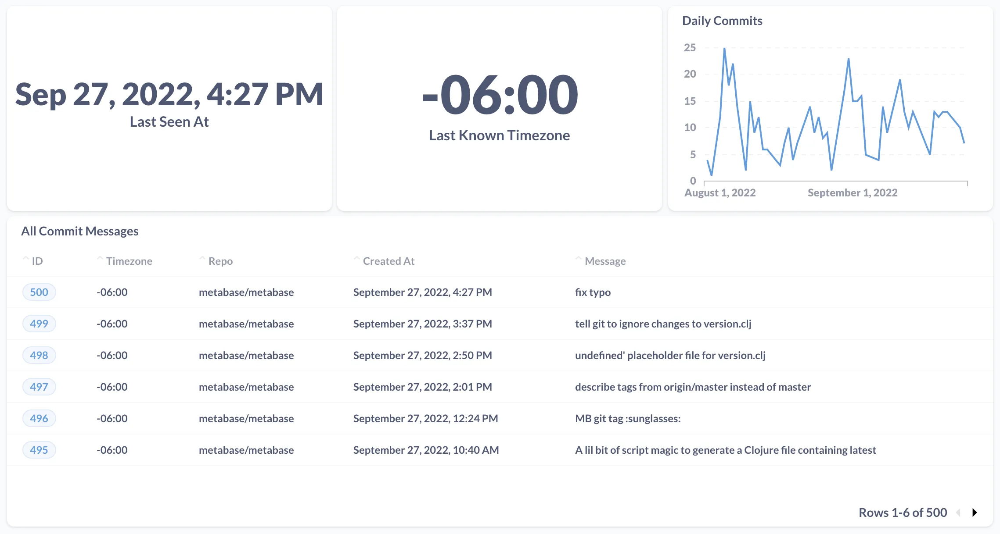
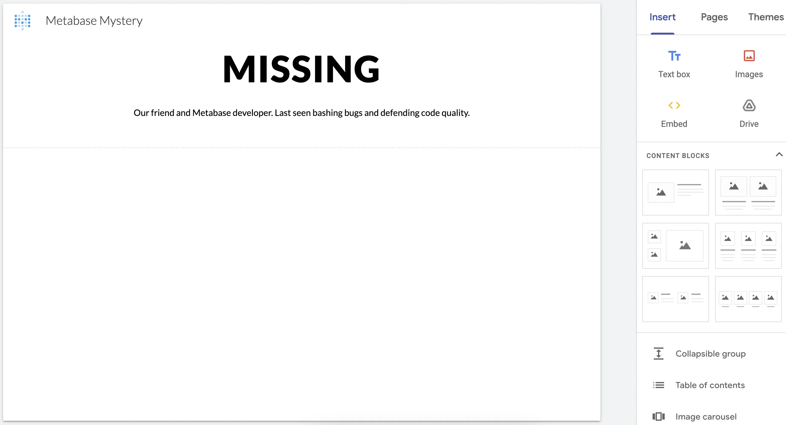
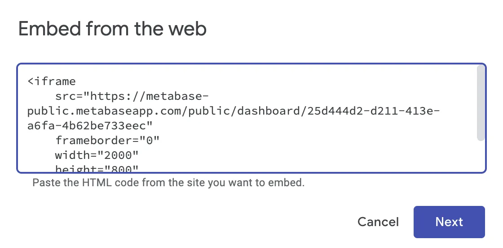
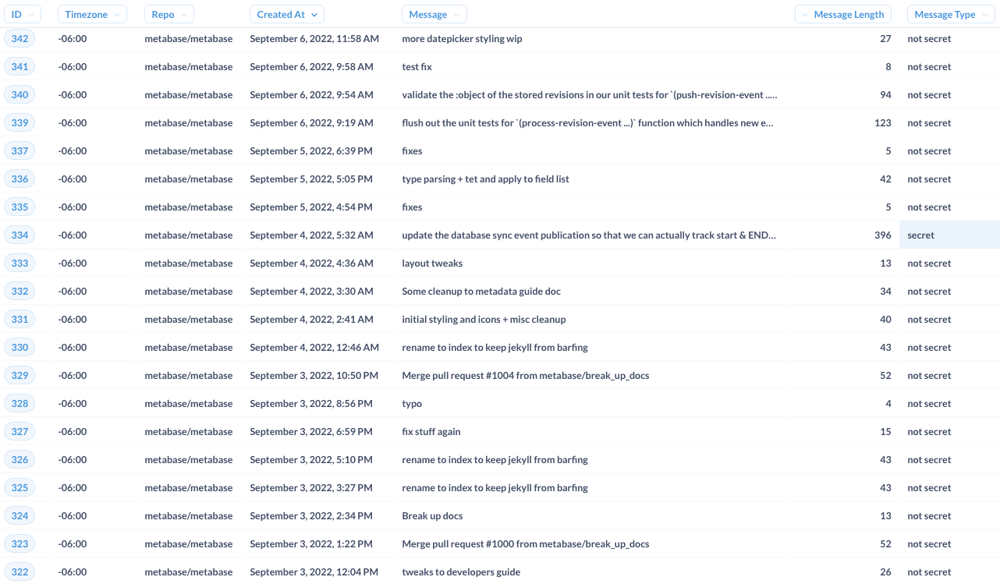
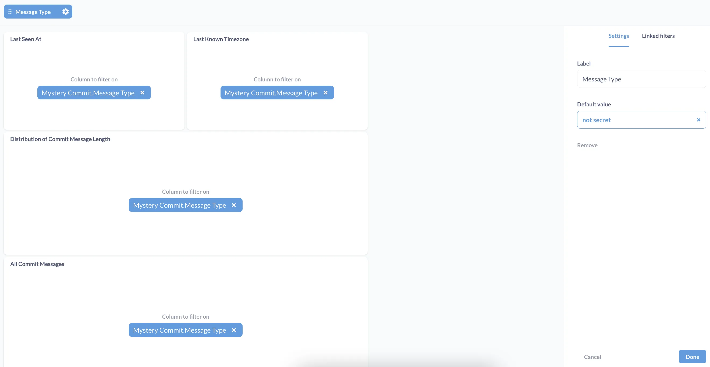
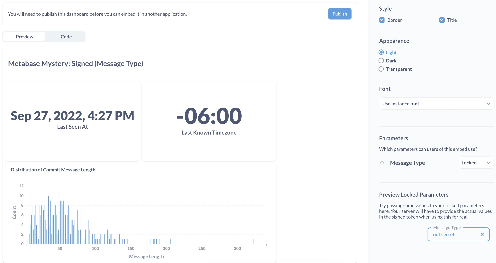
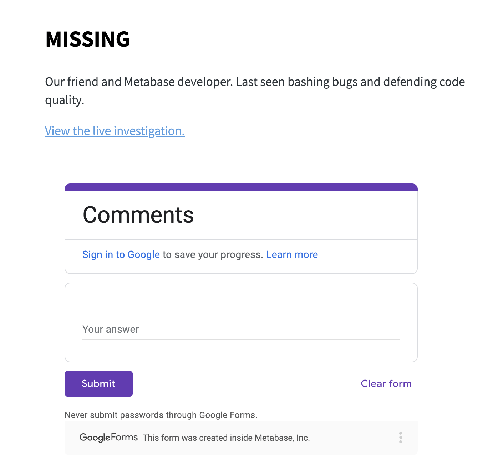
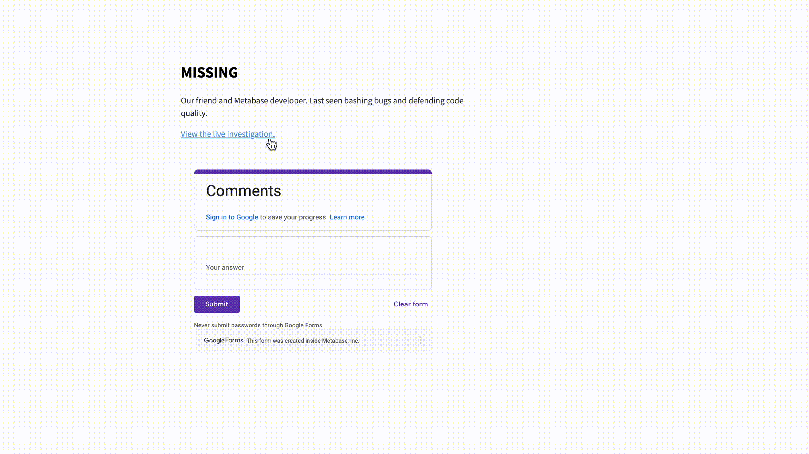



Let's say you're working on an interesting analysis in Metabase, and you need to share your work---first, for feedback, and later, as a finished product.

[Public links and embeds](/docs/latest/embedding/public-links), and [static embeds](/docs/latest/embedding/static-embedding) are all free, open-source ways for you to share Metabase artifacts (such as charts and dashboards, but [don’t limit yourself](/learn/metabase-basics/querying-and-dashboards/dashboards/markdown#one-last-pro-tip-for-gif-aficionados)) with people who don't have Metabase accounts or permission to access your raw data.

When choosing between these data sharing options, you'll want to consider:

- How quickly you need to share results
- How much context you want to add
- The level of security around your data

## Can you help us find the hidden message?

In this tutorial, we’ll explore a range of data sharing use cases from the perspective of a Data Analyst at Metabase. Our job is to investigate a mystery left behind by one of our teammates, who vanished just as they were about to solve Metabase’s oldest bug.

We got an anonymous tip that there might be a hidden message in our teammate's git commit messages, so we want to analyze the data for anything that stands out as odd or suspicious. Of course, we also want to share the investigation with our community (we are open-source, after all).

If you want to skip ahead to the fun parts:

- [Get the data](https://docs.google.com/spreadsheets/d/1dN4t7SycigAZRAb0ptuWqOSJifm7jhr8fgTiIjp43bw/edit#gid=0).
- [Clue 1](#clue-1).
- [Clue 2](#clue-2).
- [Clue 3](#clue-3).
- [The game is afoot](#the-game-is-afoot)!

## For internal use only

Before we share the results of our ongoing investigation publicly, we want to get some feedback from the team, and make sure that we’re not exposing any personal identifiable information (PII). The initial analysis (Fig. 1) lives in our internal Metabase instance---this version is going to be shared with our team only.



## Sharing a URL to a Metabase dashboard

Create a [create a public link](/docs/latest/embedding/public-links#create-a-public-link-for-a-dashboard) to our dashboard.

You can bookmark the public link to the [live investigation dashboard](https://metabase-public.metabaseapp.com/public/dashboard/25d444d2-d211-413e-a6fa-4b62be733eec). We decided to display the commit data in aggregate to make the analysis easier to read. We also set up [custom destinations](/docs/latest/dashboards/interactive#custom-destinations) so that people can view the full commit message(s) associated with each stat displayed on the dashboard. As we continue our investigation, we can publish our changes to display the latest analysis at the public link.

### Clue 1

During our exploratory data analysis, we looked at the distribution of git commit message length. One of the outliers (the message with the greatest length) contained the following message:

```txt
update the database sync event publication so that we can actually
track start & END as separate events but part of the same activity.
to do so we add a :tracking-hash to the events when they are published
which is meant to remain consistent throughout the sync, then we
implement our activity tracking code so that we can lookup an existing
activity item and update it based on the custom hash.
```

We're not sure why END is capitalized here. It might not mean anything, but we'll keep looking...

Next: [Clue 2](#clue-2).

## Adding a Metabase dashboard to a website

Next, we want to display our live investigation dashboard alongside a web form for comments, so that our community can go to a single place to contribute to the investigation. To do that, we'll set up a new website and add our dashboard and web form as embedded iframes.

The easiest way to set up a website is to use a free site builder. Here, we're using [Google Sites](https://workspace.google.com/intl/en_ca/products/sites/). If you don't use Google Workspace, you can try a tool like Squarespace or Webflow.



Next, we'll go back to the [sharing options](/docs/latest/embedding/public-links#public-embeds) on our Metabase dashboard, and copy the code under **Public embed**. We'll add an embed element to the Google Site and paste the code snippet there:



Then, we'll create a public Google form and save it in Google Drive. To add the form to our Google Site, we can scroll down the **Insert** menu (pictured in Fig. 2 above) and select **Form**.

Now, we have a [live investigation website](https://sites.google.com/metabase.com/metabase-mystery-public/home) that displays our Metabase dashboard along with a form for comments. Our community will be able to:

- Access the latest data and clues from the public embed of our Metabase dashboard.
- Contribute to the search using an embedded Google Form.

### Clue 2

Since we looked at the maximum outlier, it only made sense to look at the commits with a minimum message length as well. The shortest message is only three characters long, and it's capitalized again:

```txt
LAG
```

Next: [Clue 3](#clue-3).

## Restricting access to an embedded Metabase dashboard

This morning, someone attacked our Metabase public embed with thousands of requests for the nonexistent query parameter `filter=some_spooky_nonsense`. To protect the clues from getting into the wrong hands, we want to make sure that only verified users can get access to the rows with the clues.

We can add this additional layer of security by changing the public embed to a [static embed](/docs/latest/embedding/static-embedding). We want the static embed of our dashboard to display:

- No data for people who don't log in.
- Restricted data (everything except the clues) for people who log in.
- Secret data (the clues) for people who log in with a secret password.

Static embedding doesn't work with a site generator like Google Sites, because we need to run our own web server in order to generate the [signed token](/docs/latest/embedding/static-embedding#how-static-embedding-works) that secures our data. If you want to follow along with the rest of the static embedding tutorial, you'll need:

- Your own Metabase instance (and associated embedding secret key).
- A clone of the [embedding reference apps repo](https://github.com/metabase/embedding-reference-apps) (we'll be modifying the [Node example](https://github.com/metabase/embedding-reference-apps/tree/master/node)).
- A copy of the [`metabase-mystery` data](https://docs.google.com/spreadsheets/d/1dN4t7SycigAZRAb0ptuWqOSJifm7jhr8fgTiIjp43bw/edit#gid=0).

### Setting up a login page

First, we need some way to validate the identities of people trying to access our live investigation website. Usually, this is done with a login page powered by an authentication service (like Google sign-in), so that:

- On a successful login, our web server will send a query parameter like `user=verified` to a filter on our Metabase dashboard, which reveals the clues.
- On a failed login, the Metabase dashboard filter won't receive the correct parameter from the web server, keeping the clues hidden, and displaying the rest of the data.

To demonstrate the showing and hiding of data based on a login, we'll start with the simple auth flow defined in `login.pug` (which definitely proves you're both real and unsuspicious).

```pug
form(method="POST" action="/login")
    input(type="text" name="username" value="metabot")
    input(type="password" name="password" value="unverified")
    input(type="hidden" name="redirect" value=redirectUrl)
    p Can you be trusted?
    button(type="submit" class="primary") Yes
```

### Redirecting people to different URLs based on their login

To keep track of a person's login information, we'll modify the server code in `index.js` with a variable called `messageType`:

```javascript
function checkAuth(req, res, next) {
  const messageType = req.session.messageType;
  if (messageType) {
    return next();
  }
  req.session.redirectTo = req.path;
  return res.redirect("/login");
}
```

Then, we'll set up some logic to handle different types of logins. The value stored in `messageType` will be used to [filter the data](#restricting-data-with-a-locked-parameter) that's displayed at the [static embedding URL](#generating-a-static-embedding-url).

```javascript
if (username === "metabot" && password === "regularPassword") {
  // require a login to view the commit messages
  req.session.messageType = "not secret";
  res.redirect(req.session.redirectTo);
} else if (username === "metabot" && password === "secretPassword") {
  // require a login with the secret password to view the clues
  req.session.messageType = "secret";
  res.redirect(req.session.redirectTo);
} else {
  // allow people without logins to submit comments
  res.redirect("/");
}
```

### Generating a static embedding URL

Now, we can update the server code in `index.js` to dynamically generate the URL of the static embed for each person that logs in. These URLs are secure because they are signed with our embedding secret key. The server will also pass the value of `messageType` ("secret" or "not secret") to a filter on our Metabase dashboard in order to hide or show the clues in the data. We'll set up this filter in the next step.

```javascript
app.get("/signed_dashboard/:id", checkAuth, (req, res) => {
  const messageType = req.session.messageType;
  const unsignedToken = {
    resource: { dashboard: DASHBOARD_ID },
    params: { keep_secret: messageType },
    exp: Math.round(Date.now() / 1000) + 10 * 60, // 10 minute expiration
  };
  // sign the JWT token with our secret key
  const signedToken = jwt.sign(unsignedToken, MB_EMBEDDING_SECRET_KEY);
  // construct the URL of the iframe to be displayed
  const iframeUrl = `${MB_SITE_URL}/embed/dashboard/${signedToken}`;
  res.render("dashboard", { messageType: req.params.id, iframeUrl: iframeUrl });
});
```

### Restricting data with a locked parameter

To specify the rows of data that should be shown depending on a person's login, we'll go back to our git commit data and add a [custom column](/learn/metabase-basics/querying-and-dashboards/questions/custom-expressions) called **Message Type** that uses a [case expression](/docs/latest/questions/query-builder/expressions/case) to set the rows with the clues to "secret", and the rest of the data to "not secret".



Then, to make sure that we can restrict all of the data on our live investigation dashboard, we'll need create a **Message Type** column for _each_ of the questions on the dashboard.

Once the data is set up, we'll add a filter to our live investigation dashboard, and link the filter to all of the **Message Type** columns in each of our questions. We'll also put "not secret" under **Default value** to only show the non-clue rows by default.



Now, we can [enable static embedding](/docs/latest/embedding/static-embedding#making-a-question-or-dashboard-embeddable) on our dashboard and set up a [locked parameter](/docs/latest/embedding/static-embedding-parameters#restricting-data-in-a-static-embed-with-locked-parameters). The locked parameter will receive the `messageType` value of "secret" or "not secret" from the web server during the login flow (depending on the password that's used). This locked parameter will apply the value "secret" or "not secret" to the filter on our _original_ dashboard before the results get displayed at [static embedding URL](#generating-a-static-embedding-url).



### Viewing static embeds with different levels of access

Once we update `layout.pug` with the [frontend code for our static embed](/docs/latest/embedding/static-embedding#previewing-the-code-for-an-embed), we can run our server code to build a local site with a link to our live investigation dashboard and an embedded Google form for comments:



Clicking the link will prompt people to log in to see the data. The clues we've found so far are hidden by default:



To get access to the rows with the clues, people must provide the secret password:


If you don't have a valid login, you can request access through the form (or just participate in the mystery as an avid commenter):


### Clue 3

Another clue hidden in the distribution---this time, at the median message length:

```txt
fixes mobile password reSET and confirmation #869
```

## The game is afoot

We need more help from our data friends out there. So far, we've found the clues END, LAG, and SET. What was our teammate trying to tell us? [Get the data](https://docs.google.com/spreadsheets/d/1dN4t7SycigAZRAb0ptuWqOSJifm7jhr8fgTiIjp43bw/edit#gid=0) and play around to see if you can solve the mystery.

<details>
<summary>Click here for a hint.</summary>

Try calculating other summary stats using commit message length.

</details>

The solution isn't paywalled by a Metabase feature (that would make this mystery a little too spooky), but if you'd like to explore the dataset using Metabase, you can:

- upload the CSV file to a Google Sheet and [connect Metabase to Google Drive](/docs/latest/databases/connections/bigquery#connecting-metabase-to-google-drive-data-sources), or
- sync the CSV directly to a database or data warehouse connected to Metabase.

## Further reading

- [Guide to sharing data](/learn/metabase-basics/administration/administration-and-operation/guide-to-sharing-data)
- [Configuring permissions for different customer schemas](/learn/metabase-basics/administration/permissions/multi-tenant-permissions)
- [The five stages of embedding grief](/learn/grow-your-data-skills/analytics/embedding-mistakes)
