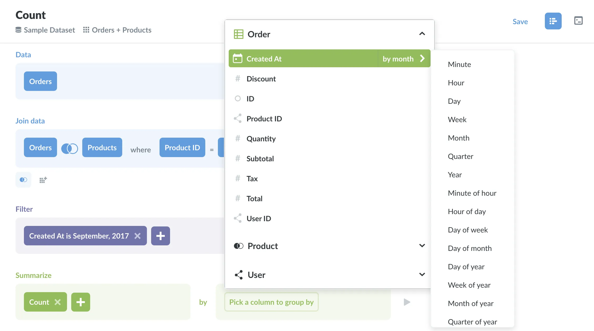
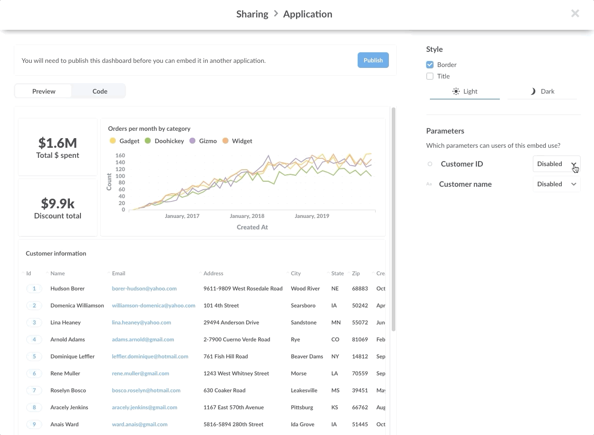
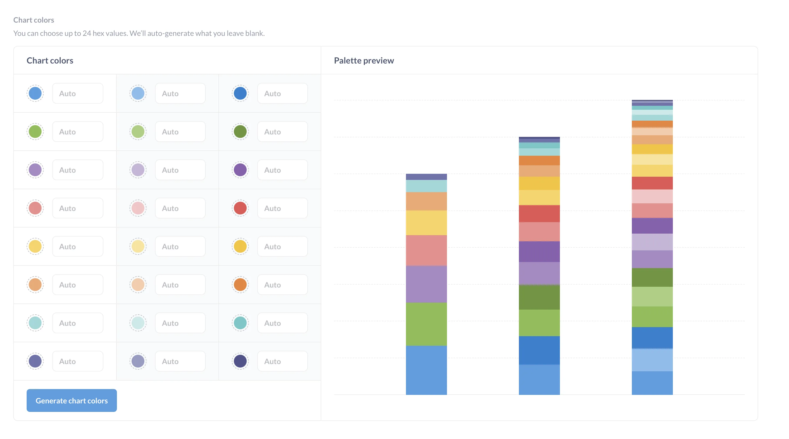
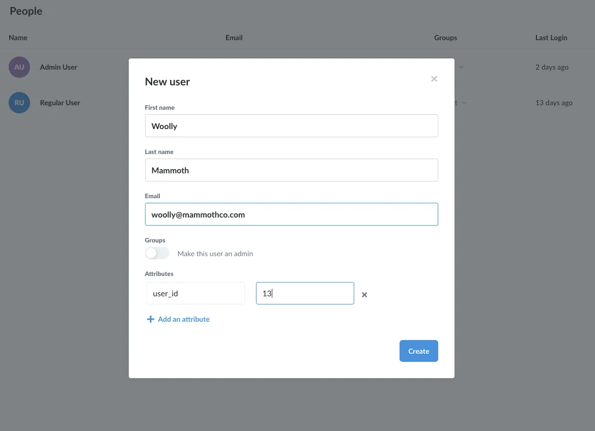
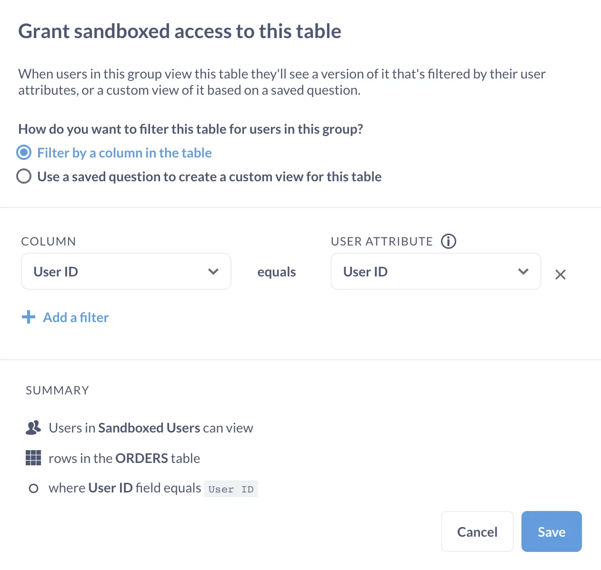



So, you're considering embedding Metabase in your application to deliver analytics to your customers. How would that work?

In this article, we'll:

- Start with the target experience for your customers that you'll deliver.
- Give a brief tour of the challenges to providing self-service reporting to multiple tenants.
- Talk through the relevant features Metabase offers, and how they work together to solve those problems.

## The target user experience

Let's start with what the finished analytics experience will look like from the perspective of your customers.

**The players:**

- Your company: Megafauna Analytics
- Customer 1: MammothCo
- Customer 2: RhinoCo

**The story:**

You're a B2B company, Megafauna Analytics, and you're using Metabase to provide reporting to your customers by embedding Metabase in your app at megafauna-analytics.com.

Here's an overview of the customer experience: Woolly from MammothCo logs into your app at megafauna-analytics.com, then navigates to the analytics page you've set up for MammothCo. There, Woolly is treated to a set of screens featuring polished dashboards and charts showing MammothCo orders, transactions, and other sandboxed data you've provided, all of which feature your---Megafauna's---brand colors.

More than just viewing static dashboards, Woolly can click on data plotted on the charts and [drill-through](/learn/metabase-basics/querying-and-dashboards/questions/drill-through). For example, he could zoom in on a particular week of transactions, or click on a bar in a chart to pull up a table listing the unaggregated rows that populate that bar.

Plus, with the Metabase's graphical query builders, Woolly can slice and dice his MammothCo data. He can use the editor's powerful querying abilities, as well as [custom expressions](/glossary/custom_expression) for more sophisticated queries, to find answers to questions your dashboards don't address---all without seeing any data from RhinoCo or other customers.

You could also customize what happens when people click on a chart on a dashboard by setting up a [custom destination](/docs/latest/dashboards/interactive#custom-destinations), like another dashboard, question, or URL. You can also set up a chart to [update a filter](/learn/dashboards/cross-filtering).

So that's the story. How do we get there?

## The challenges to creating multi-tenant, self-service analytics

By [multi-tenancy](https://en.wikipedia.org/wiki/Multitenancy), we mean a shared application instance where groups of people (groups like MammothCo or RhinoCo) enjoy access to different permissions, and therefore to different data. And by self-service, we mean that the application should [give people the ability to create their own reporting](/learn/grow-your-data-skills/analytics/embedding-mistakes), in addition to whatever reporting administrators provide.

Before we get into how Metabase delivers multi-tenant, self-service analytics, let's first identify the problems we'll need to solve. To give Woolly the experience outlined above, we need to:

- Embed Metabase in your application (megafauna-analytics.com) in a way that gives people access to a query builder and [drill-through](/learn/metabase-basics/querying-and-dashboards/questions/drill-through) functionality.
- Make the dashboards and charts match your (Megafauna's) brand colors.
- Tie a given user in megafauna-analytics.com to a user in your embedded Metabase instance.
- Limit the data the users can see to just the rows and columns they're allowed to view.

Let's look at how Metabase solves these problems.

## The four features necessary to set up multi-tenant, self-service reporting

We'll go through each feature in detail, but here they are at a glance:

- [Interactive embedding](#full-metabase-app-embedding): add drill-through to embedded charts and dashboards, curate collections, expose a query builder pre-filled with a dataset, or even expose the entire Metabase interface.
- [White labeling (branding)](#white-labeling-branding): make the Metabase charts and dashboards match the look and feel of your app.
- [Single sign-on (SSO)](#single-sign-on): enable your app and Metabase to agree on who their users are and what data they can see.
- [Data sandboxing](#data-sandboxing): let your users explore their data, without seeing anyone else's data.

### Full Metabase app embedding

Though our focus will be on [interactive embedding](#interactive-embedding), there are several ways to handle embedding Metabase in your app. And because "embedding" is such an overloaded term, it's worth going through the different ways you can use Metabase to embed charts and dashboards in your app.

Let's start with the open source options:

#### Metabase embedding options

**Public link embedding**

The dead simple option (and it may not even technically qualify as embedding). You put up a question or dashboard in a Metabase instance, send someone a link to it, and tell them not to share it.

**Public embed**

A [public embed](/docs/latest/embedding/public-links#public-embeds) is one step up, as the link is still public, but the chart is visible in your app via an embedded iframe.

**Static embed**

This looks the same as a public embed, but it's an iframe secured by a signed JSON Web Token (JWT). To set up static embedding, you'll need an iframe with a link to the question or dashboard on the front end, as well as server code on the back end to create the token. You can then sign tokens with a user ID, and do some cool things via parameterization.

For example, you can [create filters on dashboards](/docs/latest/users-guide/08-dashboard-filters) that can accept parameters, and filter that data in the dashboard based on those parameters. You could have a parameterized dashboard that accepts a user ID, so when that user logs in, the dashboard would only show users data restricted to their user ID. In other words, you can create a generic dashboard for user data that any user can access, but each individual will only see data relevant to them.

The big drawback with secure embedding is that people can't [drill through the data](/learn/metabase-basics/querying-and-dashboards/questions/drill-through) because Metabase doesn't know what data permissions the user has. Metabase may know that the user is `user_id: 13`, but there's no connection between that user 13 and a user account in Metabase (and therefore the groups and permissions the user has access to). To link accounts across your application and your Metabase instance, we'll need interactive embedding and single sign-on.

If you want to dive deeper on the options above, check out our [documentation on embedding](/docs/latest/administration-guide/13-embedding). For code examples, see our [embedding reference apps](https://github.com/metabase/embedding-reference-apps/blob/master/README.md) repository of apps using public and static embeds.

#### Interactive embedding

Interactive embedding, in combination with SSO and data sandboxing, is what makes the self-service reporting possible. Like the simpler embedding options above, you're still using an iframe to embed Metabase, only this time you can embed any Metabase screen you want, complete with full interactivity. Combined with SSO and data sandboxing, your embedded Metabase instance will know who Woolly is and what data he can view, which means Metabase can let Woolly drill-through his data without being able to see any data from RhinoCo users or other tenants.

And because you have the full Metabase app at your disposal, you can provide MammothCo users with collections, dashboards, and predefined questions, such as week over week transactions. You can also expose Metabase's query builder, which would allow customers like Woolly to create their own questions and dashboards (and [annotate them with Markdown](/learn/metabase-basics/querying-and-dashboards/dashboards/markdown)) based on their evolving needs for data.

See our [documentation on interactive embedding](/docs/latest/embedding/interactive-embedding) to learn more, or check out a [code example of interactive embedding](https://github.com/metabase/sso-examples/tree/master/app-embed-example).

### White labeling (branding)

Metabase's appearance customization features allow you to change the font, colors, logos, and more so that your embedded Metabase looks and feels like part of your application. You can set up to 24 colors, and either choose from a variety of preloaded fonts, or upload your own font. Check out our docs on [appearance customization](/docs/latest/configuring-metabase/appearance).

### Single sign-on

Single sign-on (SSO) lets you associate users in your app with users in Metabase. By using SSO, you avoid the awkward login screens where your charts should be. Without SSO, a user would log into your app, but would still have to log into your Metabase instance to view individual embedded dashboards and charts---a less-than-ideal user experience.

#### How SSO works with Metabase

Let's say you set up a MammothCo user in your app, megafauna-analytics.com, with `name: Woolly; user_id: 13`. To coordinate with your Metabase instance, you would then (manually or programmatically) [set up a user account](/docs/latest/administration-guide/04-managing-users) for Woolly in your Metabase app. Next, you need to associate Woolly's ID in your app, megafauna-analytics.com, with Woolly's account in your Metabase instance. To do that, you simply add an attribute to Woolly's account in Metabase to indicate that Woolly's `user_id` in your app is `13`.

With SSO set up, when Woolly logs into megafauna-analytics.com, a signed token is generated that attests to his identity and the attributes you've set for him in your Metabase instance. When Woolly navigates to pages with embedded Metabase charts or dashboards, Metabase can tell from the `user_id` attribute attached to the token that Woolly is user 13 and should only be able to see data you've made available to that user ID.

That's the basic idea, and there are several ways to set it up:

For internal analytics, companies usually use SAML, LDAP, or Google Sign-in. For external analytics, companies usually prefer (and we recommend) JWT SSO.

How you want to handle authentication is up to you, but you must set up SSO in order to coordinate permissions across your application and your Metabase instance. To learn more, see documentation on:

- [Authenticating with SAML](/docs/latest/people-and-groups/authenticating-with-saml)
- [JWT-based Authentication](/docs/latest/people-and-groups/authenticating-with-jwt)
- [Authenticating with Google Sign-In or LDAP](/docs/latest/administration-guide/10-single-sign-on)

### Data sandboxing

Now that your SSO is providing Metabase with details about your users, those attributes can be used to filter what each user sees, down to the columns and rows of specific tables. This is data sandboxing, and it's a powerful tool, so we'll only be able to give an overview of how it works.

For example, if your `orders` table contains all customer orders, you could filter that table based on a column, say `user_id`. You can assign an attribute, `user_id`, to your users in Metabase (and attach that attribute to their login tokens), so that when users log in and view `orders`, they'll only see data with rows that match their `user_id`.

If you need even more control, you can [create custom views of tables](/docs/latest/permissions/data-sandboxes) with saved questions. For example, let's say you don't want ANY users seeing a specific column in the `orders` table. In this case, you could create a custom view of that table with the relevant column omitted by asking and saving a question in Metabase.

To learn more about sandboxing, check out:

- [Data sandboxing: setting row-level permissions](/learn/permissions/data-sandboxing-row-permissions)
- [Advanced data sandboxing: limiting access to columns](/learn/permissions/data-sandboxing-column-permissions)

## Recap

We hope this article gave you a high-level understanding of how you could deliver self-service reporting with a multi-tenant Metabase instance embedded in your web app. Here's a quick summary with links to our documentation if you'd like to learn more about a particular topic.

- Put iframes in your application, and [embed the full Metabase application](/docs/latest/embedding/interactive-embedding).
- Use [white labeling](/docs/latest/enterprise-guide/whitelabeling) to brand your Metabase instance.
- Set up SSO with [SAML](/docs/latest/people-and-groups/authenticating-with-saml) or [JWT](/docs/latest/people-and-groups/authenticating-with-jwt) to link users in your app with your embedded Metabase instance, and attach user attributes to signed tokens.
- Use the attributes to [sandbox the data](/docs/latest/enterprise-guide/data-sandboxes) to ensure users can only see the data they have permissions to view.

Interactive embedding, as outlined above, is a great option for most companies, but it's not the only option for providing self-service reporting. See [how to use Metabase to deliver analytics to your customers](/learn/embedding/embedding-overview) for an overview of the different ways you can use Metabase---from a simple setup (no embedding necessary) to setups that offer staggering customizability---to find the approach that's right for your organization.
