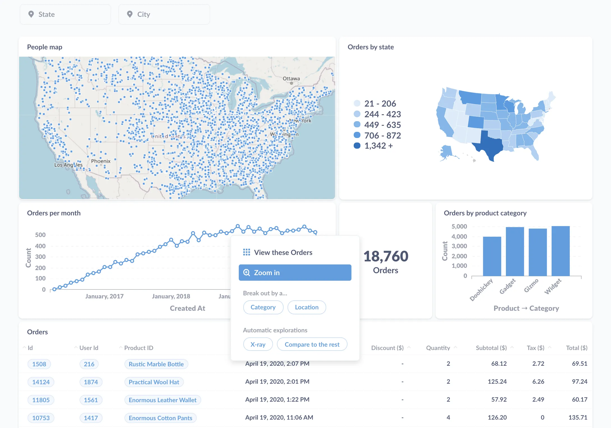
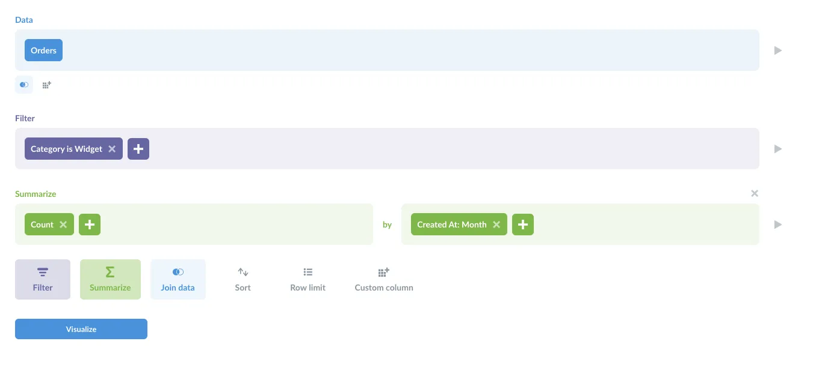
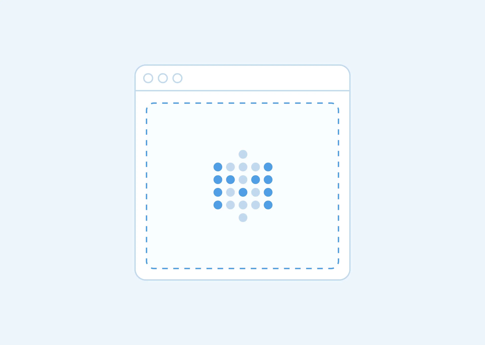
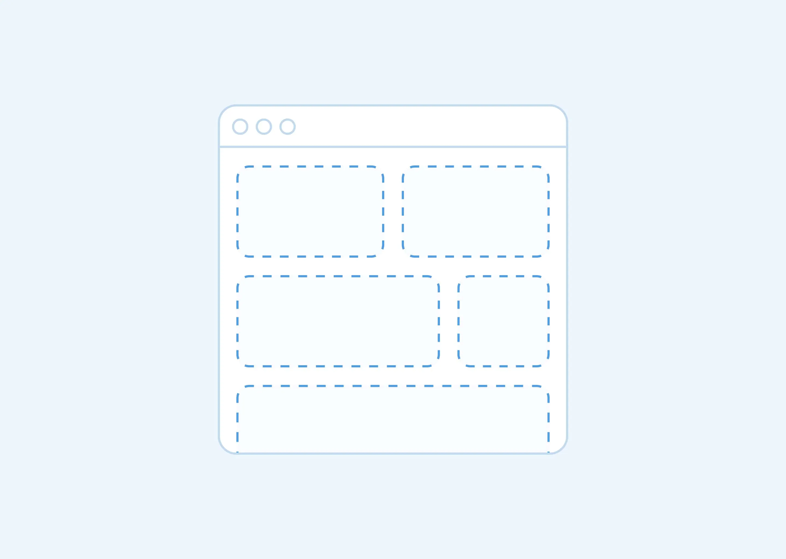
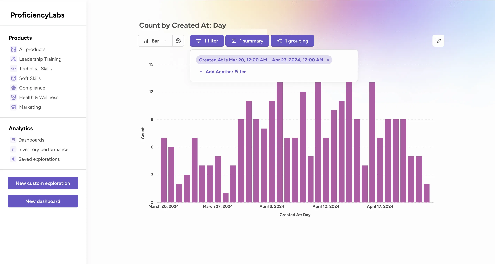
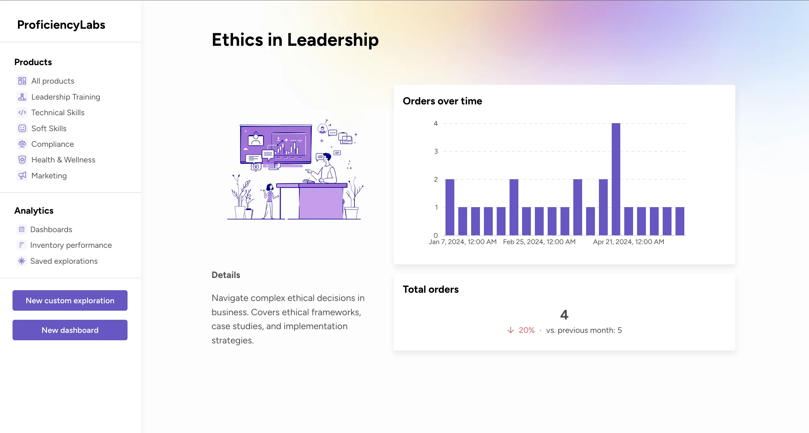



## The goal: delivering self-service analytics

First, let's make sure we have a clear goal in mind: delivering _self-service analytics_ to customers. By _analytics_, we're talking about giving your customers the right tools (e.g., charts and dashboards) and materials (the relevant data) to understand their data and make better decisions, and by _self-service_ we mean enabling your customers to analyze their own data---beyond pre-built charts and dashboards.

Some context: a lot of companies come to Metabase and say that they want to embed analytics in their application, asking if Metabase can do that. The answer is yes! [Embedding](/docs/latest/embedding/introduction) is one of the most popular ways to implement customer-facing analytics. But, it's not the only (or best) way to equip people with the tools and materials they need to do analytics.

If you want to build customer-facing _reports or data visualizations_ (without giving people the option to play with data on their own), check out [Publishing data visualizations to the web](/learn/metabase-basics/embedding/charts-and-dashboards).

## The bar for high quality external analytics

The way you implement self-service customer-facing analytics will depend on your customers' needs and your development resources, but fundamentally you'll want to ship a solution that:

- Gives customers the ability to analyze their own data.
- Restricts their analysis to only the data they're authorized to see.
- Provides a great user experience.

We'll cover a range of strategies for implementation, from low effort with big payoffs, to high effort with staggering customizability.

In general, we recommend the simplest option that'll meet your customers' analytics needs. Once you've gotten some adoption and feedback from your customers, you can then escalate the level of effort to move the needle on the user experience.

## Strategies for delivering customer-facing analytics with Metabase

The strategies below are ranked from low effort (1) to high (5):

1. [Standalone Metabase linked from your app](#1-standalone-metabase-linked-from-your-app) (start here)
2. [Embed the entire Metabase in an iframe](#2-embed-the-entire-metabase-in-an-iframe)
3. [Customize your analytics with Metabase React components](#3-customize-your-analytics-with-metabase-react-components)
4. [Fork the Metabase source code](#4-fork-the-metabase-source-code)
5. [Roll your own analytics platform](#5-roll-your-own-analytics-platform)

## 1. Standalone Metabase linked from your app

In this strategy, Metabase sits _alongside_ your application; you don't embed it in your app. You set up your Metabase with single sign-on (SSO) to give customers direct access to your Metabase, [data sandboxing](/docs/latest/permissions/data-sandboxes) to customize data access for each person, and [white labeling](/learn/embedding/brand) (branding) to make Metabase feel cohesive with the rest of your product. Then you just add the link to the standalone Metabase within your app.

Here's what to expect from the process: you stand up an instance of Metabase, add your logo and brand colors, and hook up your databases. You then sandbox the data so that customers only see what they are authorized to see, and authenticate people with SSO so that both your app and your Metabase can coordinate permissions.

With your branded standalone Metabase set up, all you need to do is put links in your app to your Metabase, and your customers will have beautiful, on-brand dashboards and charts that they can explore themselves with Metabase’s easy-to-use query builders and drill-throughs. You can also set up [custom destinations](/docs/latest/dashboards/interactive#custom-destinations), to send people to other dashboards, questions, or even custom URLs. Your customers get great UX out of the box, and can do their own analysis on top of whatever stock dashboards you've set up for them — no embedding required.

The advantages of this approach are speed of setup and deployment, and also (and perhaps more importantly) that you don't have to anticipate the kinds of questions your customers will ask of their data. Metabase comes with a graphical query builder tool to help people find, filter, and aggregate data on their own. You can still create stock dashboards to provide a starting point, or an editorial take on the data, but the point is you don't _have_ to.

Additionally, choosing to stand up a Metabase app as a "sidecar" to your app derisks the project. If you find that Metabase doesn't fit your needs, you won't have wasted any time figuring out how to work it into your app.

**Advantages**

- Quick to set up.
- Really powerful analytics primitives for your users.

**Tradeoffs**

- Your customers will need to leave your app to view charts and dashboards.
- Limited customizability: You're just using Metabase's UI and functionality.

## 2. Embed the entire Metabase in an iframe

[Interactive embedding](/docs/latest/embedding/interactive-embedding) is the most popular strategy among our customers. This type of embedding puts the entire Metabase app inside your app in an iframe, giving people access to analytics features such as the [action menu](/learn/metabase-basics/querying-and-dashboards/questions/drill-through) for drill-downs and the query builder for self-service data access.

The amount of effort you put into interactive embedding can vary widely, depending on how extensive of an experience you want to build. You can specify a set of screens for customers to navigate through, and you can link those screens or dashboards together. If your set of screens is small and straightforward, it may not be that much more work than a sidecar implementation. But since you are in control of your app, you can (with more effort) create a potentially much richer experience for your customers.

**Advantages**

- Your customers can explore their own data.
- You can customize the user experience by setting up specific navigation pathways between any Metabase screens, charts, or dashboards.

**Tradeoffs**

- It's more work: you'll need to design the pages that house the embedded Metabase screens.
- You can only embed the full application, and can't pick and choose what to include and what to leave out (e.g. you can't disable the query. builder)
- Metabase offers a fixed number of [appearance settings](/docs/latest/configuring-metabase/appearance), so there may be some aesthetic variance between the design of your app and the embedded Metabase components.

## 3. Customize your analytics with Metabase React components

With the [Embedded analytics SDK](/docs/latest/embedding/sdk/introduction), you can embed individual Metabase components with React (like standalone charts, dashboards, the query builder, and more). You can manage access and interactivity per component, and you have advanced customization for seamless styling.

The effort here is similar to interactive embedding; you can put more effort in to customize more of the experience, but you don't need to. And once you have the components set up in your app, it should "just work".

**Advantages**

- You can pick and choose which components to embed.
- You're in complete control over the appearance of your customer-facing analytics.

**Tradeoffs**

- Only available for React apps (for now!).
- Can require more web dev effort if you really want to customize your analytics.

## 4. Fork the Metabase source code

Metabase Pro and Enterprise editions are [source available](/blog/Opening-Metabase-Enterprise), so you can review the code or fork it and do whatever you want with it. Chart design? Grid system conflicts with your grid? You'll have access to the CSS, the graphing primitives---the full source code.

You may go this route if you really want to dial in the design of your embedded Metabase app to create a seamless experience. And even if you never take this route, it's nice to know you have that runway available to change the design or add functionality if you ever have an analytics challenge that the stock Metabase doesn't address.

**Advantages**

- Granular control over the user experience for seamless integration with your app.
- Ability to add functionality to dashboards, charts, and more.
- Full control over the design of Metabase and its charts.

**Tradeoffs**

- You have to maintain a fork; as new Metabase versions come out, you'll have to integrate those changes into your fork.
- It's a lot of work. A lot _less_ work that rolling your own analytics platform, but significantly more than interactive embedding or SDK.

### 5. Roll your own analytics platform

Too many companies take on the work of building their own analytics software, often for reasons that are unclear. These companies spend a lot of time and money (on the order of millions to tens of millions of dollars) to build sub-par tools that Metabase outclasses out of the box, when they could be applying those resources to their core business and development.

With that said, there are legitimate reasons for building your own analytics platform. In this scenario, you likely already have a third-party analytics solution in place, but it's falling short of meeting your needs. You know exactly what you need to build (and why you need to build it), and have the engineering resources to commit to the project. For example, you might have a permissions problem that you need to solve that Metabase (or another offering) can't account for that is more than a simple matter of adding functionality and submitting a pull request. Just make sure the problems you intend to solve by writing your own platform are mission critical, and that existing offerings lack the features to handle them.

**Advantages**

- Full control over the experience, without having to maintain a fork.
- Handle use cases other solutions (like Metabase) cannot solve for.

**Tradeoffs**

- Most expensive option, with murky return on investment.

## Which option is right for your organization?

Most companies choose interactive embedding (embedding their entire Metabase in an iframe), as they want the extra customizability to provide a more curated set of screens for their customers. But interactive embedding isn't the only option for delivering analytics with Metabase. It might not be the best place to begin, especially if you're a startup trying to make the most out of limited resources. In that case, consider having a standalone Metabase---it's the fastest way to deliver value to your customers. You can always transition to an embedded solution as you iterate, but in the meantime you'll already be giving your customers data they can work with, and you'll develop a much better understanding of the analytics they need.

For larger companies, forking the source code might make sense. It's more of an investment, but you'll be able to deliver a much more cost-effective solution than if you were to take on building an analytics platform from scratch.

And, of course, if you're not up for maintaining a fork, Metabase accepts pull requests! Take advantage of Metabase's built-in feature set, [submit a PR](https://github.com/metabase/metabase/pulls) for that last bit of functionality you need to complete your analytics offering, and you'll have the custom solution you need at a fraction of the cost it would take to build your own platform, all while improving Metabase for everyone.

## Further reading

- [Multi-tenant self-service analytics](/learn/embedding/multi-tenant-self-service-analytics)
- [Guide to sharing data](/learn/metabase-basics/administration/administration-and-operation/guide-to-sharing-data)
- [The five stages of embedding grief](/learn/analytics/embedding-mistakes)
