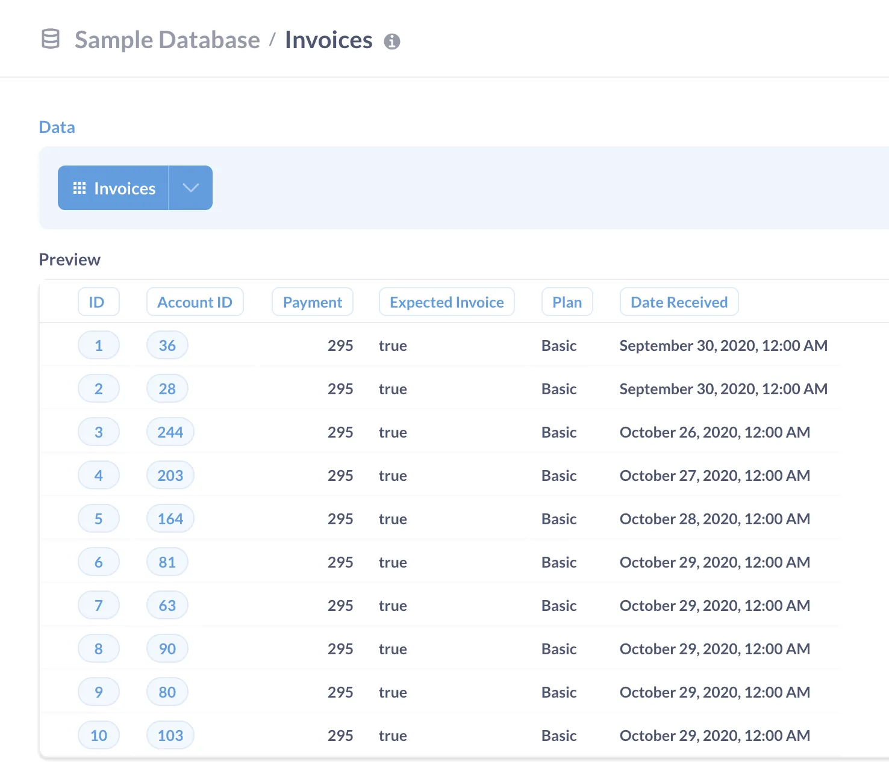
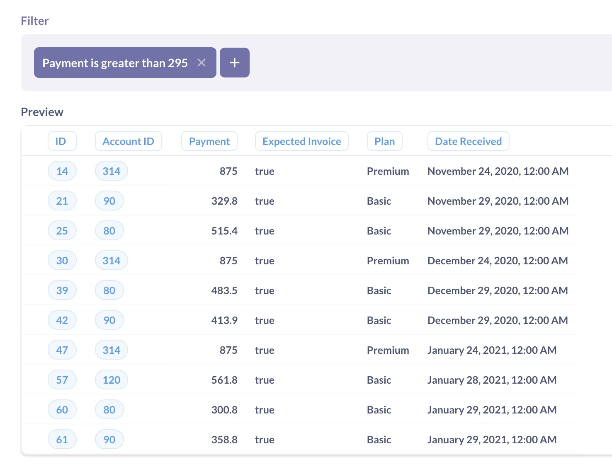
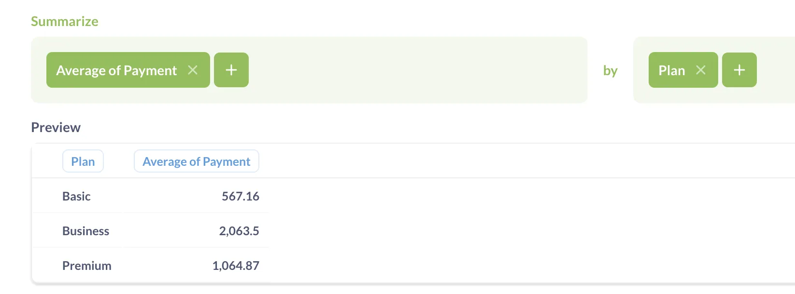
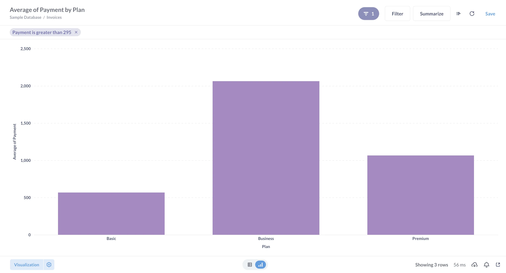
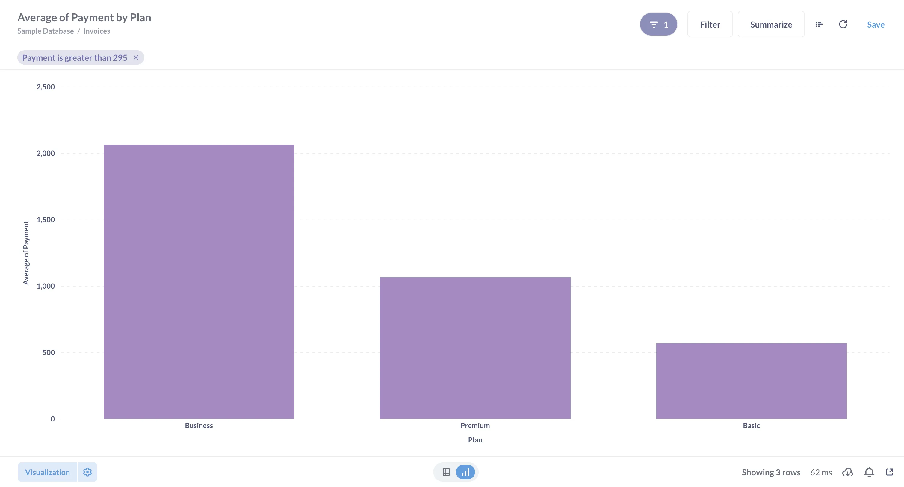
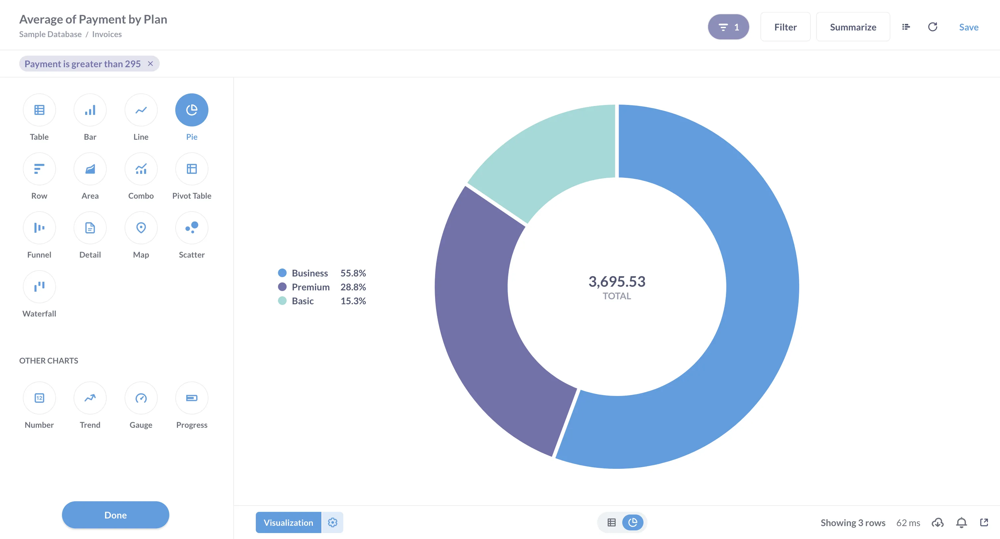
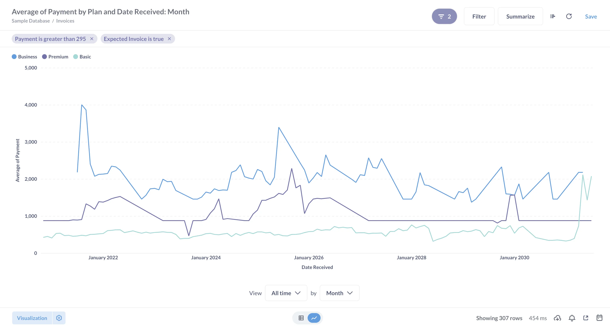
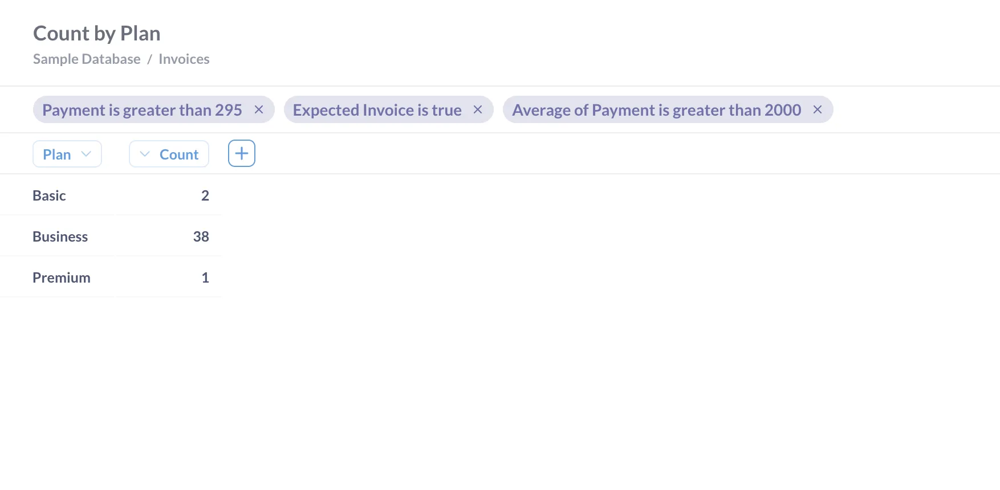



## Introduction

The **Query builder** is what we call Metabase's graphical query interface that lets you ask questions about your data without needing to know SQL (though you can always convert a GUI question to SQL). "Questions" in Metabase are what we call queries and their visualization.

You assemble your question from the basic building blocks:

- Filters
- Summaries
- Custom columns (e.g., adding a new column like `Total` that sums up `Subtotal` + `Tax`)
- Joins
- Sorts

You can combine the query builder blocks in different order, and have multiple blocks of the same type — for example filter, summarize, then filter the summarized results, join them with a different table, and add another summary. The next step of your query will use the result from the previous one.

At every stage of your question, you can preview results as a table or create a visualization, and you can switch between the query builder, the query's result as a chart, and the results as a table at any time.

## Create and visualize a basic question

In this tutorial, we'll only cover the basic querying operations — filter, summary, and sort. We'll be working with the Invoices table in the Sample Database that comes with every Metabase instance.

## 1. Select the data source

Start a new query builder question using table Invoices from the Sample Database as the source:

- Click on the "+ New" button
- Select "Question"
- In the data picker, switch to "Tables" tab, select the Sample Database and click on the Invoices table.

Once you select the Invoices table, Metabase will take you to the query builder with the Data, Filter, and Summary steps. The Data step will contain the link to the Invoices table.

## 2. Preview the data

Preview the table by clicking on the "Play" button to the right of the Data section.

You can preview results at each stage in the query builder.

In our case, the Invoices table looks like this:

## 3. Filter results

Most of the invoices in the table seem to have the amount of 295 — but not all. Let’s look at the outliers: filter the data to show just the invoices with `Payment` greater than 295.

1. In the purple "Filter" block, click on the "Add filter" button;

   If you don't have a Filter block already, click on the purple "Filter" icon below the Data block to add one.

2. Select the `Payment` column;
3. Change the type of filter to "Greater than", and enter 295;
4. Preview results by clicking on the "Play" button to the right of the filter block.

## 4. Summarize the filtered results

To see if there are any patterns in these large invoices, let's see how the average invoice amounts are distributed by plan.

1. In the green "Summarize" block, add an "Average" metric of `Payment` by the `Plan` column;

   Metabase might have already added a blank Summarize block for you, but if not, you can click on the green "Σ" icon below the Filter block to add it.

2. Preview results by clicking on the "Play" button to the right of the summarize block.

## 5. Visualize

Time to build your first chart!

- To view the results as a chart, click on the "Visualize" button at the bottom of the query builder.

That's it! Metabase will automatically create bar chart for you:

## 6. Sort your results

The bar chart would be easier to read if the results would be sorted from the biggest bar to the smallest. To reorder the bars, we can sort the reuslt of our query.

1. Go back to the query builder by clicking on the "Show editor" button in the top right corner;
2. Add a Sort block and sort by `Average of Payment`;
3. Click on the ↑ icon to change the sort order from ascending to descending;
4. Visualize.

The bars should be reordered by height:

## 7. Save

To revisit your chart later or share it with others, click on the "Save" button at the top right corner.

Metabase will ask you which collection you want to save your question in. [Collections](/docs/latest/exploration-and-organization/collections) in Metabse are like folders -- you can use them to organize your work.

## Change the visualization type

Metabase "magically" decides which type of visualization to use based on the results of your query — for example, if your result is a time series, Metabase will create a line chart with a date axis. For a chart like ours with summaries by a categorical column, Metabase will usually choose a bar chart.

Let's change the bar chart to a pie chart:

1. If you are in the query builder, enter the visualization view by clicking on the "Visualize" button;
2. Open visualization options by clicking on the "Visualization" button at the bottom left corner;
3. Select a pie chart.

> 💡 **Tip** : Metabase has a ton of chart options, but not every chart can work for every dataset (you wouldn't put a time series on a map). At the top of the visualization sidebar, Metabase shows you the visualization types that will work with the shape of your data. But charts you see in the "Other charts" block will probably not work.

## Refine results at each step

Right now you have a basic, three-step query: filter, summarize, and sort.

Let's say we wanted to see if there are any seasonal patterns in invoice amounts by plan, and we also wanted to restrict our investigation to only expected invoices.

Try the following:

- In the Filter step, add another filter for `Expected Invoice` to be `True`;
- In the Summarize step, add another column to group by: Date Received;
- In the Sort step, add a secondary sort by Date Received, ascending;
- Visualize.

It’ll look something like this:

Once we grouped by a date variable, Metabase switched to a line chart with a date axis and created a separate time series for each `Plan`.

## Add more steps

You can keep adding more steps to your query — more filters, more summaries, or even join a new table.

For example, we see on our line chart that there are times where the average payment has huge spikes. Let’s count these spikes per plan.

- Go back to the query builder by clicking on "Show editor" button in the top right corner.
- Add another Filter block after the Summarize block and filter for `Average of Payment` over 2000.
- Add another Summarize block after the second Filter block, and Count the rows by `Plan`.
- Visualize.
- Switch from the chart view to the raw table view by clicking on the table button at the bottom center of the screen.

Just by combining filters and summaries in the query builder, we created a nontrivial query: we counted, by plan, the months in which the average monthly payment on large, expected invoices was greater than 2000.
