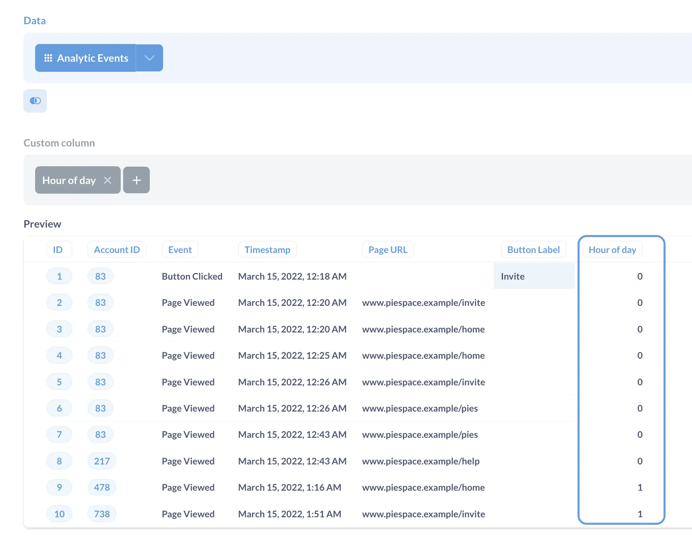
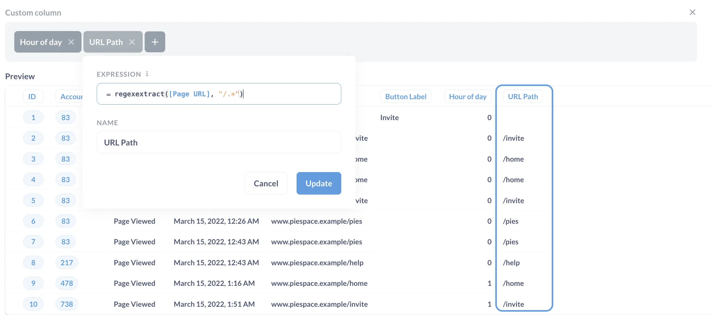
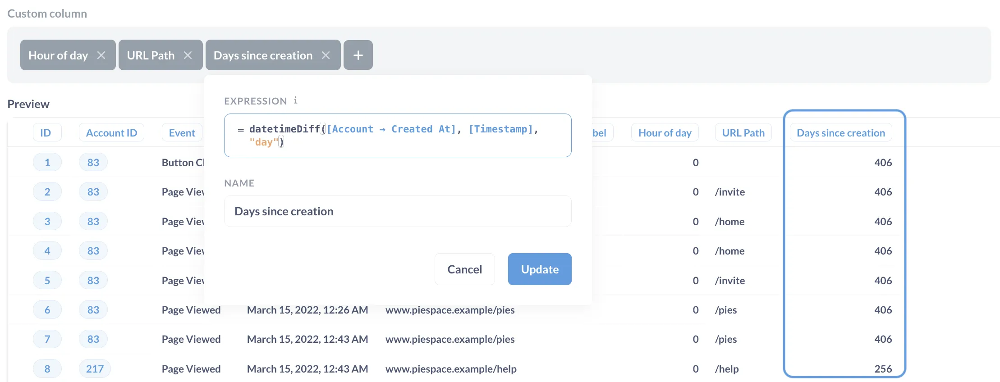
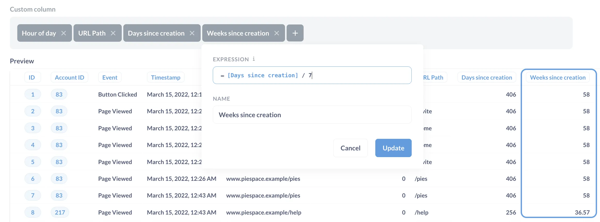
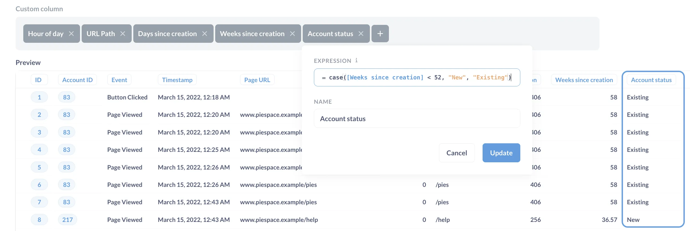
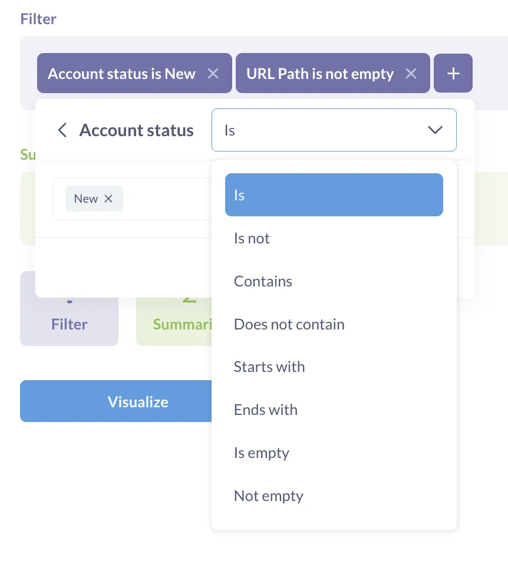
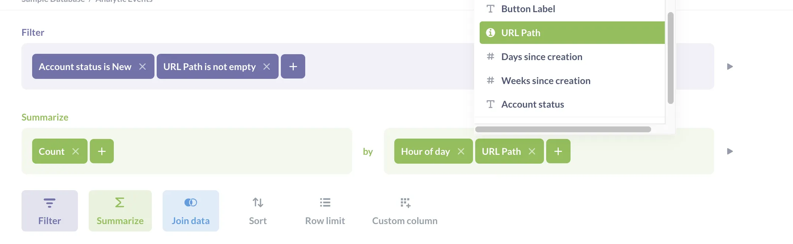
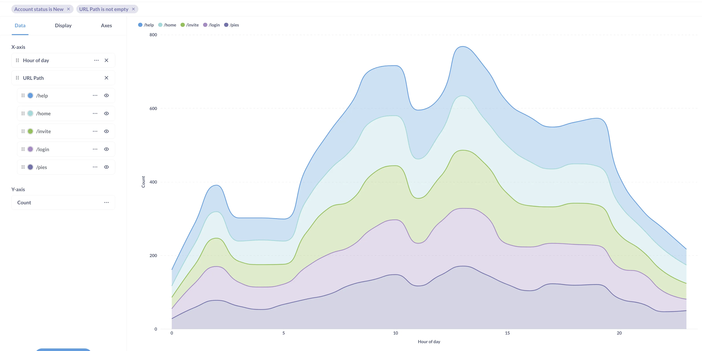



Metabase lets you create new fields on the fly using information from other columns. For example, you can:

- Add two columns
- Extract part of a date
- Define a new column based on logical conditions

Metabase calls these new derived columns "custom columns".

To create custom columns, you can use [custom expressions](/docs/latest/questions/query-builder/expressions), which are like formulas in spreadsheets, or functions in SQL. For example, you can use the [`substring`](/docs/latest/questions/query-builder/expressions/substring) function to extract a section of text, and use [`case`](/docs/latest/questions/query-builder/expressions/case) to define values based on a condition.

In this tutorial, we’ll walk through some of most common use cases for custom columns. We'll use the `Analytic Events` table from the Sample Database that contains event data for an imaginary product. We'll build custom column examples that can be helpful for product analytics.

## Add a custom column

Start a new query builder question based on the `Analytic Events` table.

To add a custom column, click on the grey button under the “Data” block.

You’ll see the Metabase expression editor. You can use shortcuts to combine or extract data from columns, or write your own expressions. Before you start, a few things to note:

- Use `[]` to refer to columns in the expression editor, like `[Timestamp]`, or `[Accounts → Timestamp]` for columns from joined tables. Fortunately, you won't need to type out the full column name (or the brackets) yourself because Metabase will offer you autocomplete options as you start typing.
- You can use operators like `OR`, `AND`, `<`, `=`, `!=` in custom expressions.
- There are database limitations on some custom expressions. Check out [our docs](/docs/latest/questions/query-builder/expressions-list#limitations) for the full list.

### Note for SQL experts

In SQL, column operations (like `Total + Tax` or `DateDiff(Created_At, Canceled_at, 'week')`) and aggregations (like `SUM(Total)` or `AVG(Quantity)` ) are both defined in the `SELECT` clause. In Metabase query builder, these are different query stages: operators and functions on columns are defined in custom column blocks, but aggregations over a column are defined in a separate Summarize block. You won’t be able to use aggregations like `Sum`, `Count` in custom columns, but you can define custom summaries in the Summarize block.

Check out our tutorial on [how to summarize data](/learn/metabase-basics/getting-started/summarize) to learn more.

## Extract and combine columns

You can extract parts of date or URL columns, and concatenate columns together.

For example, you might be interested in how event activity is distributed throughout the day: what are the hours when people are most active?

1. To add a custom column, click on the gray button under the “Data” block.

   You can add an expression, or extract or combine columns.

2. In the expression editor under **Shortcuts**, select **Extract columns**.

   **Extract** shortcuts work with URL columns or timestamp columns. For URL columns, you can choose to extract host, domain , or subdomain. For timestamp columns, you can extract parts of date or time.

3. Select the `Timestamp` column and extract `Hour of day`

   You'll see the custom expression editor with the expression `hour([Timestamp])` in it. All the shortcuts do is prefill the expression for you.

4. Click **Done** to save the custom column and close the editor.
5. Preview the results.



You'll see a new column `Hour of day` in the results that has 0 for timestamps between 12 AM and 1 AM, 1 for timestamps between 1AM and 2 AM and so on.

## Work with text

You can use custom columns to clean up, format, or manipulate text.

For example, the URLs in the Analytic events are of the form `www.piespace.example/<path>`. Because the domain is the same for every URL, it makes sense to just use the `path` part for analysis. But the **Extract URL** [shortcuts](#extract-and-combine-columns) can only extract host, domain, or subdomain. For the path, you'll need to write your own custom expression:

1. Create a new custom column by clicking on **+** in the **Custom column** block, and in the **Expression** field, enter the expression:

   ```mbql
   regexextract([Page URL], "/.*")
   ```

   `regexextract` uses a regular expression to grab the part of `Page URL` that starts with `/`. Read more about the `regexextract` expression [in our docs](/docs/latest/questions/query-builder/expressions/regexextract).

2. Name the column `URL Path` and click **Done**.
3. Preview the results.

   

Other helpful text functions: `replace`, `substring`, `concat`. See [String functions](/docs/latest/questions/query-builder/expressions-list#string-functions) for a complete list.

## Work with dates

You can use date custom expressions to find differences between two dates, add or subtract periods, or extract parts of a date.

For example, if you're interested in differences in behavior for new vs old visitors, you could create a column that contains how many days has passed between account creation and an event.

1. Create a new custom column by clicking on **+** in the **Custom column** block, and in the **Expression** field, enter the expression:

   ```mbql
   datetimeDiff([Account → Created At],[Timestamp], "day")
   ```

   The `Created At` column is in the `Account` table, not the `Analytic Events` table that is used as the source for the question. But because `Account` is connected to the `Analytic Events` table (through the Account ID column), Metabase can use the data from the `Account` column in questions about `Analytic Events`. You just need to specify that the columns comes from a different table using `→`.

   Read more about the `datetimeDiff` expression [in our docs](/docs/latest/questions/query-builder/expressions/datetimediff).

2. Save the column as `Days since creation` (we'll refer to this name later).
3. Preview the results.

   

Other helpful date functions: `datetimeAdd`, `convertTimezone`, `now`. See [Date functions](/docs/latest/questions/query-builder/expressions-list#date-functions) for a complete list.

## Do math

You can use custom expressions for usual math operations with both columns and with numbers: for example, you can add two columns together, multiply a column by 100, or `round` the value to an integer.

In the previous step, you computed the number of days between an analytic event and the account creation using the `datetimeDiff` expression. If you needed that number in weeks, you could just use the same `datetimeDiff` custom expression with the `"weeks"` period, but this way you'll only the number of full weeks. If you want to know that the account is 3.5 weeks old, you can divide the number of days by 7:

1. Create a new custom column by clicking on **+** in the **Custom column** block, and in the **Expression** field, enter the expression:

   ```mbql
   [Days since creation] / 7
   ```

   Here `[Days since creation]` is the name of the custom column you created on the previous step (you can refer to other custom columns when defining new ones).

2. Save the column as `Weeks since creation` and preview the results.

   

See [Math functions](/docs/latest/questions/query-builder/expressions-list#math-functions) for a complete list of math functions.

## Add if-then logic

In previous two steps, you computed how old (in weeks) the account is when an event occurs. Let's say you want to use this information to look at event for new vs existing accounts. For that, you'll need to bucket accounts into "New" or "Existing" first based on their age at the moment of event.
In Metabase, logical statements are defined using `case` statement (similar to `CASE` SQL but different from Spreadsheets, where the `IF` function is used for this purpose).

1. Create a new custom column by clicking on **+** in the **Custom column** block, and in the **Expression** field, enter the expression:

   ```mbql
   case([Weeks since creation] < 52, "New", "Existing")
   ```

   The new column that has `"New"` for events from accounts that are less than a year (52 weeks) old, and `"Existing"` otherwise.

   Read more about the `case` expression [in our docs](/docs/latest/questions/query-builder/expressions/case).

2. Save the column as `Account status` and preview the results.



Other useful logical functions: `coalesce`, `isnull`. See [Logical functions](/docs/latest/questions/query-builder/expressions-list#logical-functions) for a complete list of logical functions.

## Use custom columns to build queries and charts

Custom columns work just like table columns, so you can use them in filters, summaries, and to build charts.

For example, we can look th the distribution of different events throughout the day for new accounts.

1. Add a filter for new accounts and non-empty URL path

   You'll need to change the filter operation from the default "Contains".

   

2. Count the events for each URL path by the hour.

   The custom columns should just pop up in the **Group by** block.

   

3. Visualize

   When you click "Visualize" in the query builder, Metabase will automatically build a pivot table. To visualize the daily patterns data better, you can switch to a line or area chart.



By the way, the chart on the screenshot has some extra visualization settings turned on to make it look nicer. Experiment with the series setting in the Data tab (the three dots menu for each series in the Data tab) to see if you can make your chart look the same.

So what can we say about new account events? We se that all events follow similar patterns: most triggered in the morning and early afternoon with a dip during lunch. But the visits to `/help` page have an additional peak around 7 pm.

## Next steps

Custom expressions can be used for more than just new columns – you can use them to build complicated filters or summaries. Check out the expanded tutorial on [custom expressions](/learn/metabase-basics/querying-and-dashboards/questions/custom-expressions).
