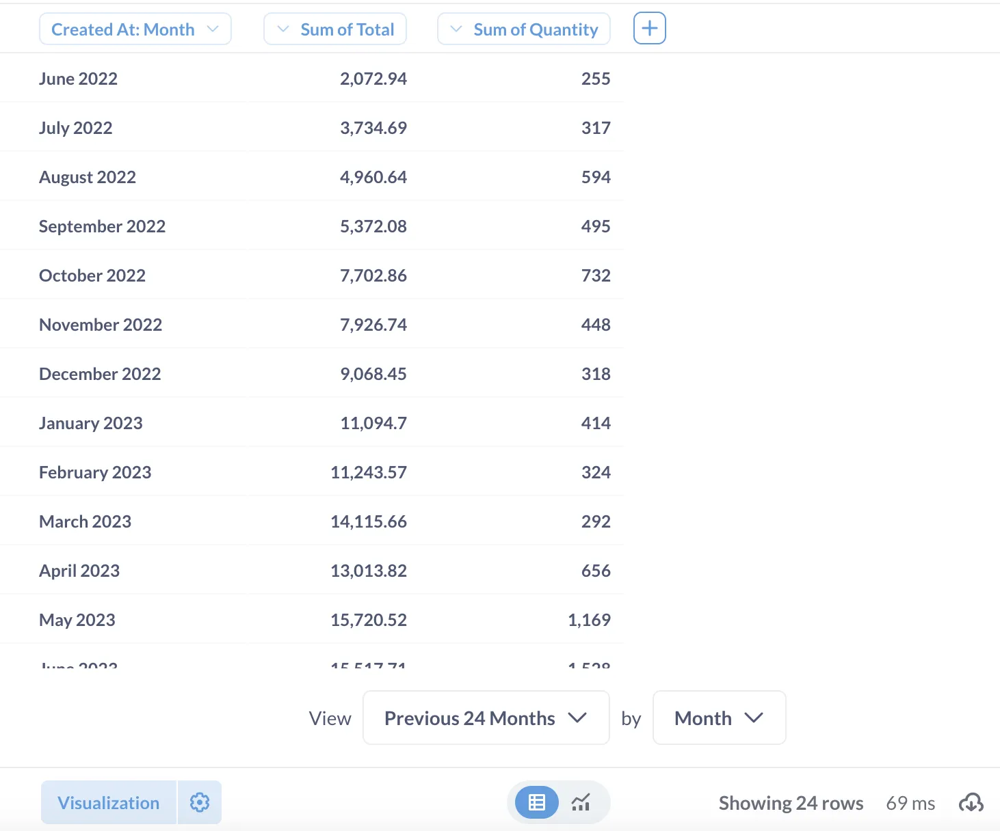
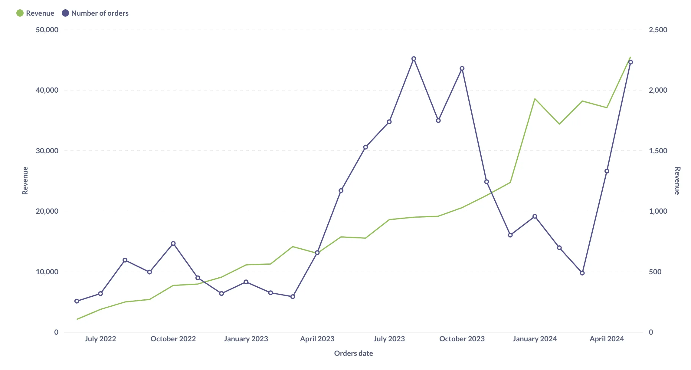
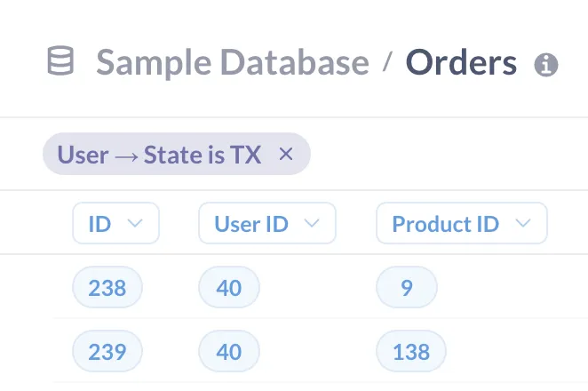

This tutorial will walk you through exploring questions and dashboards in the Examples collection included with every fresh Metabase installation.

You can find the Examples collection in the left navigation sidebar. If you need a refresher, check out the previous article on [how to find data in Metabase](/learn/getting-started/find-data).

We'll work with the **e-Commerce dashboard** pinned in the Examples collection.

## See and download results as a table

You can see and download the numbers behind every dashboard and chart.

1. **Go to the example e-Commerce dashboard in the Examples collection**

   You should see multiple tabs and cards with charts. For example **“Revenue and orders over time”** card shows the total revenue and order count for each month. The data shows an interesting seasonal pattern for orders, so let’s explore it further!

2. **Open the question “Revenue and orders over time”** by clicking on the chart title in the dashboard.

   From the question view, you can add summaries and filters, but first, let’s look at the raw results behind the question.

3. **See the results as a table** by clicking on the table icon under the chart.

   Each row represents a month, and there are two columns: one for total revenue and one for order count, corresponding to the two series that were displayed on the chart.

   

   You can switch back to visualization by clicking on the chart icon next to the table icon.

4. **Download results** by clicking on the arrow in the cloud icon in the bottom right of the screen.

   You can download the results as a spreadsheet or other formats.

Learn more about [table visualizations](/learn/visualization/table) and [exporting data](/docs/latest/questions/exporting-results).

## Change the visualization type

You can change a question's visualization without having to worry about changing the question's settings for other people (though you can overwrite a question if you need to).

For example, you can switch between showing time series as a bar chart or a line chart, or maybe you just really hate pie charts (not us – we love all our charts equally). And our pies are technically donuts.

Let's make “Revenue and orders over time” into a line chart.

1. **Open the question “Revenue and orders over time”** from the "Examples" collection.

2. **Open the visualization sidebar** by clicking on the "Visualization" icon in the bottom left of the chart.

   You'll see that this is currently a **Combo** chart: it combines bars and lines.

3. **Switch to a line chart** by clicking on "Line".

   Now both series – total orders per month and total revenue per month – will be represented by lines (notice the two axes):

   

## Drill down on records

On many charts in Metabase, you can get more information about any value on a chart simply by clicking on the data point that you're interested in.

1. **Open the example eCommerce dashboard and switch to “Demographics“ tab**.

   The “**Revenue by state”** chart shows the map of the United States and revenue for each state. Texas has the largest revenue (look for the region with the darkest color).

   Why is Texas so successful? We can dive deeper into the Texas numbers and look at the orders that contribute to the revenue.

2. **Look at all orders from Texas** on the “Revenue by state” chart:

   - Click on Texas (the region with the darkest color)
   - Select “See these orders” from the menu.

   You’ll see a table that shows all orders from Texans. From here, you could look for patterns in activity, for example, are specific products that sell more? Or are times of day or days of the week that have spikes in activity?

   You can continue drilling down into the data from this table view.

   Let’s look for all Texas orders _for a specific product._

3. **Find all records for a product with ID `1`**:

   - Click on a cell in the Product ID column that contains ID 1. You will summon the Action menu.
   - In the action menu, select "See this Product's orders"

   The table will now display just the orders from Texas for this specific product. You can see the exact filters applied to the data above the table:

   

   You could continue drilling through this data - for example, you could click on any user ID, and see just the orders for that user and that product. You can go all the way down to individual unaggregated records.

4. **Return to the original “Revenue by State” question** by clicking on “Started with Revenue by state” at the top left of your screen.

The drill through options that you get depend on the type of chart you're using and your data: for example, on time series charts you can select a time period to zoom in on it.

## Summary

You can explore data behind dashboards and questions on your own. For example, you can

- See and download results as a table.
- Change the visualization type.
- [Drill down on metrics](/learn/metabase-basics/querying-and-dashboards/questions/drill-through) to see individual records.

In the next tutorial, you'll learn how to ask more complicated questions about this data, like "What were the most popular products in Texas in June 2024?".
