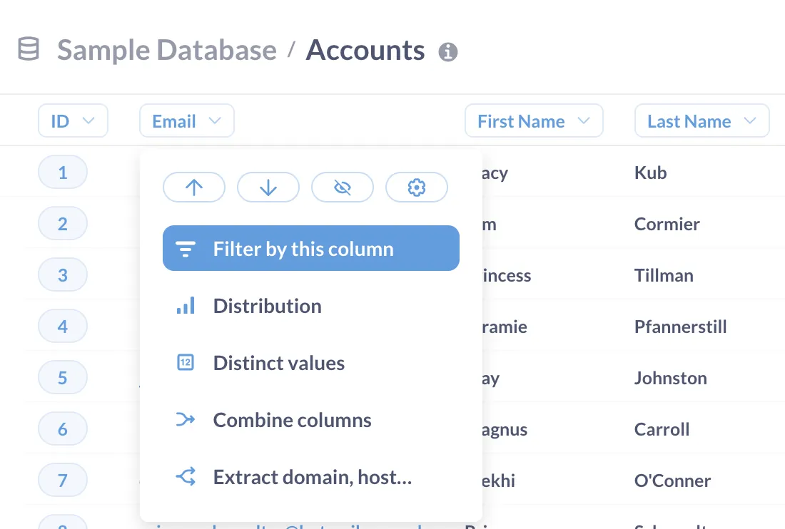
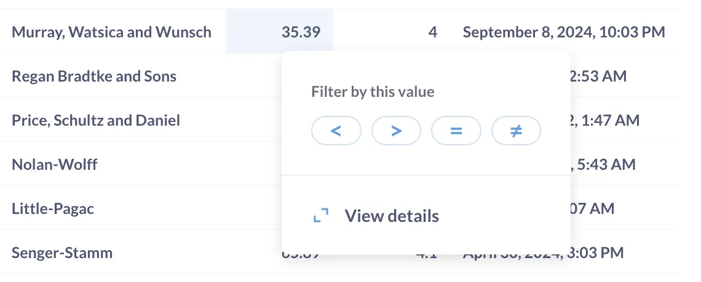
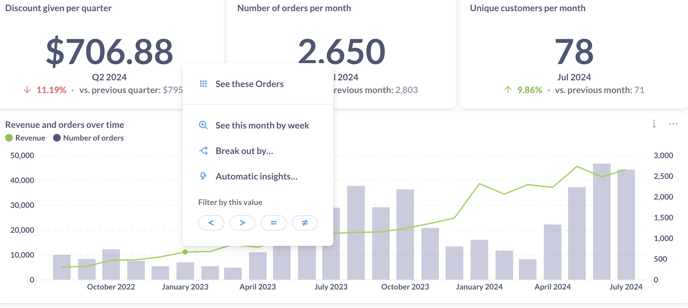
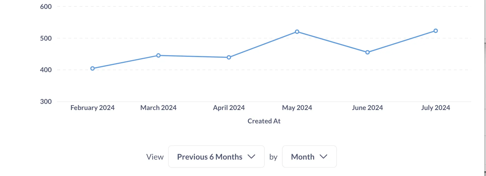
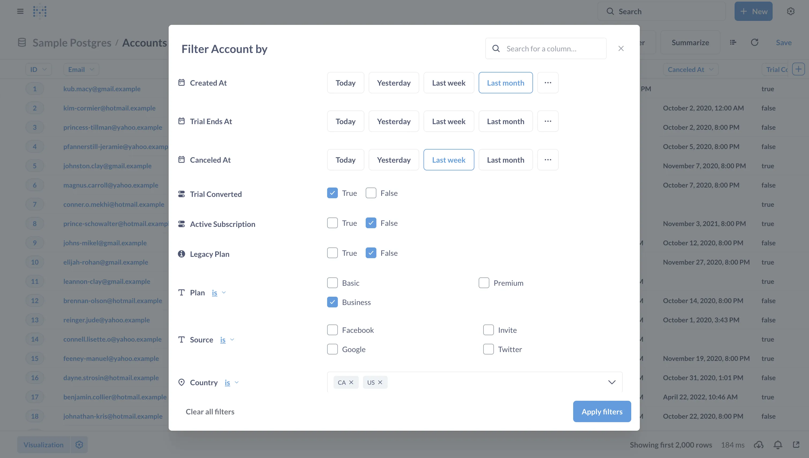
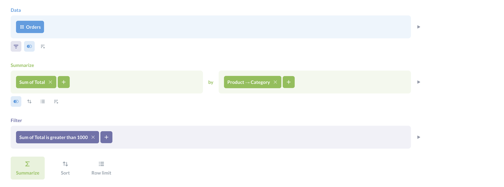
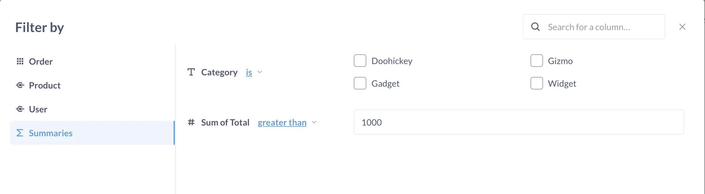
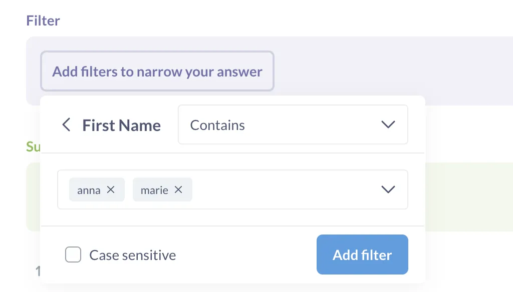
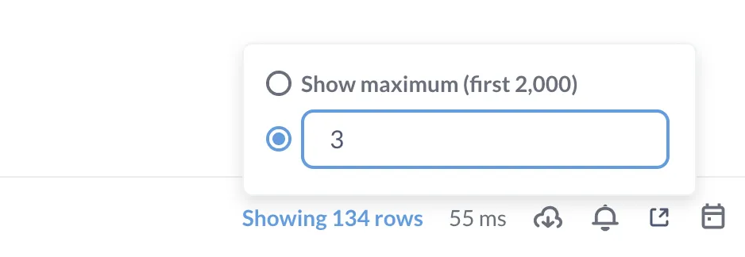



## Introduction

In Metabase, you can restrict the data you're seeing by using a filter, like "orders from the last month" or "customers from Canada". In this guide, you'll see all the ways to add filters to charts and tables in Metabase, and learn some filtering tips and tricks. If you want to learn how to work with dashboard filters, check out the [tutorial on Dashboard filters](/docs/latest/dashboards/filters) instead.

We assume that you already know how to [Ask a question in the query builder](/learn/metabase-basics/getting-started/ask-a-question).

## Filter by a column

- When viewing a table, you can click on the column header to filter by that column:

  

- In the query builder you can add a Filter block and select a column to filter on. Check out [Ask a question in the query builder](/learn/metabase-basics/getting-started/ask-a-question) for a tutorial on the query builder!

## Filter based on a data point

You can filter based on a data point with a single click:

- When viewing a table, click on a cell to filter the entire table based on that cell’s value

  

- When viewing a chart, click on a chart’s component - a data point, a bar, pie segment, etc — to filter the chart based on the data point’s values:

  

  To see this in action, go to the “E-commerce insights” dashboard in the Examples collection that comes with every new Metabase instance, and try clicking on different parts of the "Revenue and orders over time" chart.

## Filter a time series chart

On charts with a date breakout, you’ll have a widget at the bottom of the screen to restrict or expand the date range:



## Add multiple filters at once

When viewing a table or a chart, you add multiple filters at once by clicking on the “Filter” button at the top right:



This is helpful when you have large tables. If you add filters one by one, Metabase will send a query to your database every time you add another filter. If you add multiple filters at once, Metabase will only send one query.

Metabase will filter for records that satisfy all the filter conditions at once (in other words, it will combine filter using AND condition). If you want to combine filters using OR, you can use [Custom expressions](/docs/latest/questions/query-builder/expressions).

## Filter using custom expressions

If you want to build more complex filters that combine conditions on multiple fields like “all Widgets under $30 or all Gizmos under $50 sold on holiday weekends”, or search for text patterns like “All reviews containing ‘Metabase’ and ‘awesome’ in the same sentence”, you can use Metabase’s [Custom expressions](/docs/latest/questions/query-builder/expressions).

For example, you can add a filter like this:

```sql
([Category] = 'Widget' AND [Subtotal] < 30) OR ([Category] = 'Gizmo' AND [Subtotal] < 50)
```

Check out our [tutorial on custom expressions](/learn/metabase-basics/querying-and-dashboards/questions/custom-expressions) to learn more.

## Filtering tips

### Filter summarized data

Metabase allows you to filter your summaries. For example, if you computed a total revenue by product category, you can then filter for categories with total revenue greater than \$10000.

To filter a summary:

- In the query builder: add a Filter block after the Summarize block:

  

- When viewing a chart or a table: click on the “Filter” button and select “Summaries” from the left sidebar

  

### Filter for multiple values

Some filter types allow you to filter for multiple values at once. In dropdown filters, you can select multiple values by clicking on checkboxes. In text box filter like “Contains”, “Starts with”, you can press “,” (comma) after entering a value to add another value.



The logic of how Metabase combines values on the same filter depends on whether you add multiple values in a single filter, or use a separate filter for each value:

- A single filter `Name Contains: anna, marie` will search for records that contain “anna” **or** “marie”
- Two filters `Name Contains: anna` , `Name Contains: marie` will search for records that contain “anna” **and** “marie” at the same time.

You can get more control over how Metabase combines filters by using custom expressions.

### “Last period” date filters

Last or previous period filters will include dates up until the end of the previous _complete_ period. For example, if today is **Thursday, August 8, 2024,** and your Metabase [is configured to have Monday as the first day of the week](/docs/latest/configuring-metabase/localization#first-day-of-the-week), then the Last period filters behave like this:

| Filter          | Dates                                       |
| --------------- | ------------------------------------------- |
| Last year       | Jan 1, 2023 - Dec 31, 2023                  |
| Last 2 years    | Jan 1, 2022 - Dec 31, 2023                  |
| Last 4 quarters | Jul 1, 2023 – Jun 30, 2024                  |
| Last 12 months  | Aug 1, 2023 - July 31, 2024                 |
| Last 52 weeks   | Aug 7, 2023 (Monday) - Aug 4, 2024 (Sunday) |
| Last 365 days   | Aug 9, 2023 - Aug 7, 2024                   |

So you should select the period granularity based on what's the last complete period you want to be included. For example, if you wanted to include all _days_ from Aug 1, 2023 to Aug 7, 2024, you should select "Last 7 _days_" instead of "Last week".

Metabase shows you the date range included in your filter, so make sure to check that the date range matches what you expect!

#### "Include current period" in date filters

When using a “Last period” filter, you can choose to include current period. In this case, Metabase uses the filter determined by the Last Period, and adds another _full_ period that includes the current date. This might give date ranges that extend into the future.

If today is **Thursday, August 8, 2024,** and your week starts on Monday, then the Last period filters **with Include current period toggled on** behave like this:

| Filter                                   | Dates                                                     |
| ---------------------------------------- | --------------------------------------------------------- |
| Last year including current period       | Jan 1, 2023 - Dec 31, 2024                                |
| Last 2 years including current period    | Jan 1, 2022 - Dec 31, 2024                                |
| Last 4 quarters including current period | Jul 1, 2023 – Jun 30, 2024                                |
| Last 12 months including current period  | Aug 1, 2023 - Aug 31, 2024                                |
| Last 52 weeks including current period   | Aug 7, 2023 (Monday) - Aug 11, 2024 (Sunday)              |
| Last 365 days including current period   | Aug 9, 2023 - Aug 8, 2024 (Note that 2024 is a leap year) |

### Filter for text

For tips on filtering for text, check out our tutorial [Searching in tables](/learn/metabase-basics/querying-and-dashboards/questions/searching-tables).

### Filter type is controlled by field metadata

Once you’ve been using Metabase for a while, you might notice that there are different types of filters: there are dropdowns, search boxes, checkboxes, and others. The type of filter is determined by the field’s metadata. Learn more about [editing metadata and changing filter widgets](/docs/latest/data-modeling/metadata-editing#changing-the-filter-widget).

## Limit data

You can limit the data Metabase shows in a table or on a chart. For example, if you're counting orders by product category, you can tell Metabase to just show top 3 categories by number of orders instead of showing all of them.

This is different from filtering — filters look for records satisfying a condition, but limiting the results just shows a certain number of records regardless of their values.

Metabase automatically limits the results to 2000 data points when displaying a table or chart, but you can set a lower limit:

- In the query builder, add a row limit block by clicking on the gray "Row limit" button.

  You can add a row limit block anywhere in your query, but keep in mind that the next stages after the row limit block will work with data that's restricted by the row limit.

- While viewing a table or a chart, click on "Showing X rows" in the bottom right corner, edit the limit, and hit "Enter":

  

By default, Metabase will not let you display more than 2000 rows to avoid overloading your browser.
