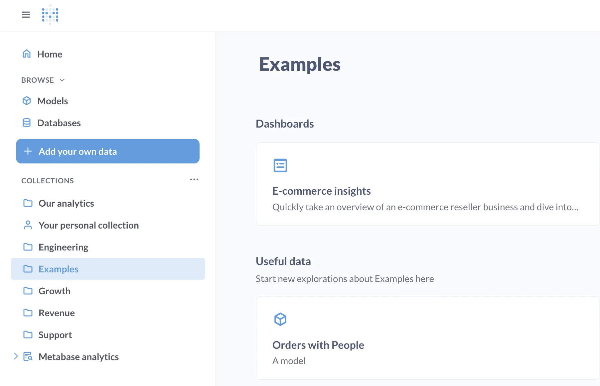
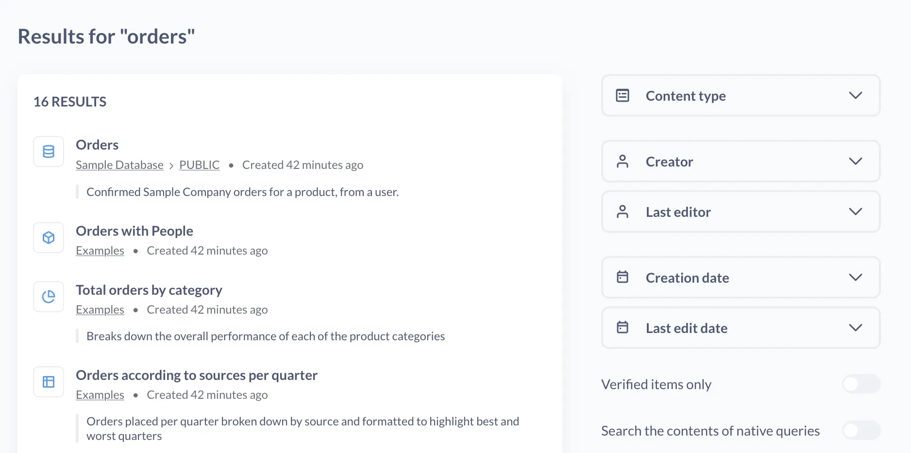
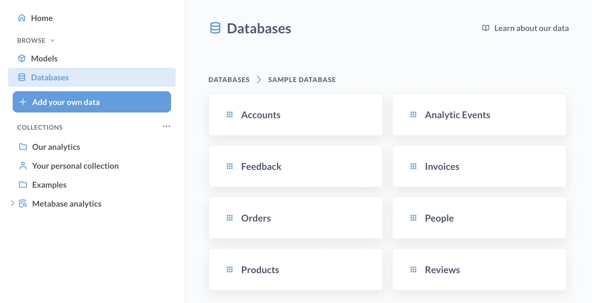



The easiest way to explore your data in Metabase is by looking at dashboards and charts that your teammates have already created.

This hands-on tutorial will walk you through all the different ways of finding things in Metabase. You can fire up your own Metabase and follow along – we’ll use the sample data that come with every new Metabase instance, and give you step by step instructions.

## Find questions and dashboards

### Collections

[Collections](/docs/latest/exploration-and-organization/collections) in Metabase are a lot like folders: they’re where Metabase keeps all your dashboards and charts. For example, your company might have a "Sales" collection and "Marketing" collection for reports from different teams.

Browsing collections is useful when you want to learn what’s out there in your Metabase and see what your teammates have already created. You can find collections in the left navigation sidebar.

Let's start by exploring the Examples collection.

1. **In the left navigation sidebar, find the Examples collection and click on it.** If you don’t have the sidebar open, click the ☰ icon in the top left.

   Inside the example collection, you’ll a long list of items in the collection (think: files in a folder), a pinned dashboard “E-commerce insights”, and a pinned model “Orders + People”.

   As you can imagine, collections with lots of items can get messy pretty quickly, so you can pin important items to find them quickly. You can also create subcollections to help organize things.

2. **Click on the pinned “E-commerce insights” dashboard.**

You’ll see some cards with charts that are organized in tabs. You’ll explore the data behind the charts on the dashboard in the next article, but for now, let’s look at other ways to find data in Metabase.

## Search

Search will look through names, descriptions, and metadata of your questions and dashboard.

It’s useful when you already have an idea of what you’re looking for, like “I want to see all orders per customer”. Let's find that information in our Metabase.

1. **Open the command palette** by pressing Cmd/Ctrl+k, or by clicking on “Search” on the top left of the screen.

   You’ll see the “Command palette” popping up. It’s a powerful tool that can do a lot (you can learn more about it [here](/docs/latest/exploration-and-organization/exploration#command-palette)), but for now we’ll just use it to search for things about “orders”.

2. **Type “orders” into the search bar.**

   You should see a list of results, like the “Orders” table from the Sample Database and a bunch of questions like “Number of orders per month” from the Examples collections.

   If your Metabase has a lot of stuff in it, you could end up with dozens or even hundreds of search results, so it might be helpful to narrow those down.

3. **Open advanced search** by clicking on _View and filter all results_ under the search bar.

   This will open a new page with search filters. There are filters by the content type (so you could tell Metabase to search just for questions or just for dashboards), creator (for example, so you could only search your own questions), and others.

4. **Restrict the search results to Content type → Model**.

   You should see a model “Orders with People”. Feel free to click on it and explore!

   If you’re wondering “wait, what’s a model?”, you’ll learn more about them later in this sequence. [Models](/docs/latest/data-modeling/models) are curated, pre-configured datasets that help answer common questions. For example, in your database, information about orders and information about people probably lives in different tables, but the "Orders with People" model brings together data about orders and people who made them, so you could figure out if the groundbreaking product "Awesome Concrete Shoes" is popular with teens using just a single dataset.

   Of course, if you just want to work with the raw data for Orders or People, Metabase lets you do just that.

## Find data sources

If you want to kick off your own data exploration directly from the source tables, you can browse all the tables (and models) that you have access to.

### Browse databases and tables

1. **In the left navigation sidebar, click on Browse → Databases.** If you don’t have the sidebar open, click the ☰ icon in the top left to open it.

   You’ll see a list of databases that you can query. You should see at least the Sample Database that’s included with every fresh Metabase instance, and any other databases that you have the permissions to query. Let’s take a look what’s in Sample Database.

2. **Find the Sample Database and click on it**.

   You’ll see a list of all tables in Sample Database. There are 8 tables that have example data about a fictional e-commerce app. This data powers the example dashboard that you saw in the [Examples collection](#collections).

3. **Click on any table (for example, Accounts) to see the data in the table**.

   From there, you can start exploring the data in the table. Try clicking on a cell and filtering the table, or using Filter and Summarize buttons in the top left.

   In the next articles, you'll learn more about exploring the tables you just found.

## Summary

There are a couple of ways to find data you’re looking for in Metabase:

- If you want to find some questions or dashboards that already exist, you can browse through collections to see what others have created, or search with the command palette (Ctrl/Cmd + k).
- If you want to see what raw data is available to you, you can browse models, databases and tables within them.

In the next tutorial, you'll learn how to explore the data that you just found.
