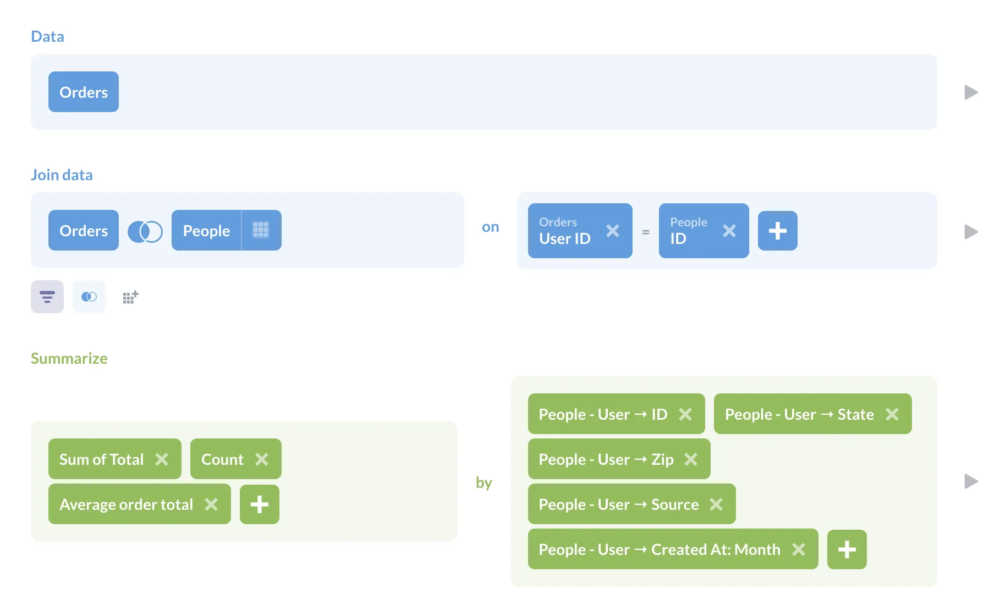
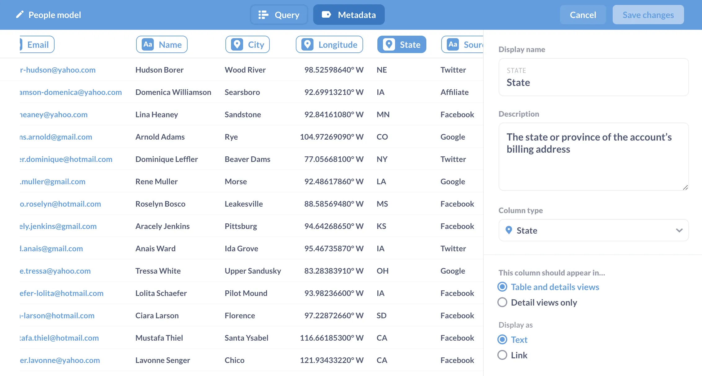
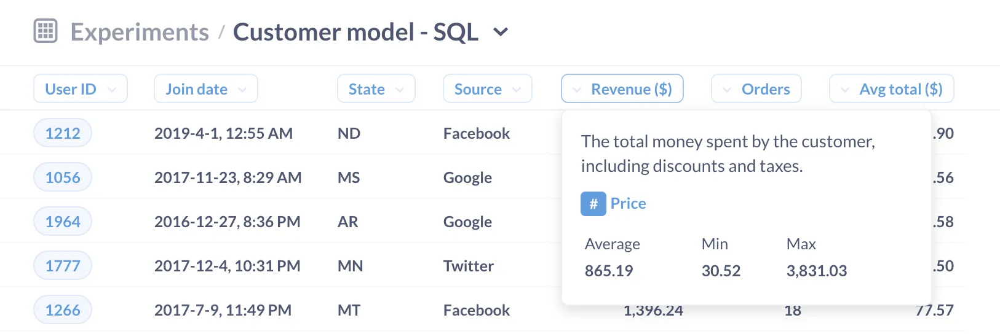
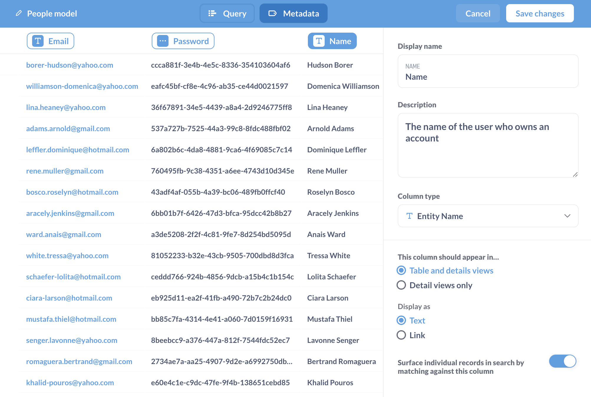
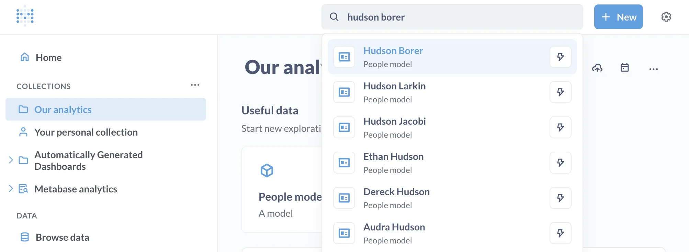



The most valuable thing you can do to make it easy for nontechnical people to ask questions about your data is to put your data into a shape that makes asking questions intuitive.

Data can often be messy, especially for startups. Or not even messy: it could be highly [normalized data][normal] optimized for transactions, not analysis. Which means you could have a database with data on customers spread out over a ton of tables, which makes it hard for people who aren't yet familiar with the database to find the information they're looking for (and that's assuming they even know how joins work).

## Models as building blocks

To make your data more intuitive for your teams, in Metabase you can create derived datasets, called **models**, that can pull together data from different tables. They are built on results of Metabase questions, and you can add custom, calculated columns, and annotate all columns with metadata so people can play around with the data in the query builder as a starting point.

If you're already a seasoned Metabaser, you know that you can build new questions from the [results of saved questions][saved-questions]. You can think of models as a special type of saved question, but that's selling them short.

## Why not run an ETL job to create a model in your database?

Metabase models and ETLs are not mutually exclusive. You can (and should) take advantage of both. And just to spell out why:

1. **Models put the tools to model data in the hands of people who know the business domain.** This is a big deal. Yes, a data engineer will know more about the plumbing in the data pipeline, but they won't necessarily know the problems a particular team is facing and how the parts of those problems should be defined (e.g., what qualifies as an active user?). The various teams in your org should be the ones defining your business, and they should be able to refine those definitions in response to changes in how the team works, new product offerings, market changes, whatever. With models, people won't have to go through the data team to add a new calculated column or update a definition. That and different teams will have different definitions: your sales team may have a different model for a customer than your marketing or success teams.

2. **Models are flexible**. You can create models on the fly, modify them, switch them out - they're basically just queries + descriptions. And they're a first class citizen in Metabase, so you can organize them into collections, link to them, and pick them as a starting point for a new question, or add them to dashboards. You can also archive them, or change them back into a saved question (though you'll lose your metadata). ETLs, by contrast are a lot more work, and are usually gated by someone who knows your data pipeline, who knows how to write the code, schedule the job, and so on. There are some great tools to help you write ETLs, but they're often a heavyweight solution for a problem that requires flexible solutions.

3. **Models are stepping stones for improving your database's performance**. After experimenting with models in Metabase, you can "promote" the most popular models to materialized views in your database. Materialize here means to write an ETL job to create and periodically update a table in the database that matches your model (has the same set of columns) so that the results don't need to be computed for the query each time you run it; the database can just fetch the results like it would from a table of raw data. Once you materialize the table in your database, you can either swap out the original query for the model in Metabase with a simple `SELECT * FROM materialized_model`, or just delete the model and treat the materialized table like you would any other table in your database. (Note that if you change a model's underlying query, you'll need to update the metadata for each column).

4. **Models can index individual records and make them available in Metabase's search.** You can [surface individual records in search](#models-can-surface-individual-records-in-search) so that you can lookup individual records, like customer names.

## A model example

When thinking about which columns to include in your models, it's best to start by listing the kinds of questions you expect people to ask, and then adding columns to the model that will help answer those questions. Let's say we want to model a customer. Typically, we might want to define something like an active customer, maybe someone who has visited our site at least once in the past month, or however we would want to define active customer. But just to keep it simple, we're going to define a model for a basic customer with the Sample Database included with Metabase. And we anticipate wanting to know a few things about our customers:

- Where they live, including state, and zip.
- Their source (how they found out about us).
- How much total money they've spent with us.
- How many orders they've placed.
- The average total per order.

In a real-life model, you'd probably have a lot more questions you'd want to answer, which would require many more columns to answer (like how old a customer is, how long they spent on the site, items added and removed from cart, or all the other data points you think your teams will want to ask questions about). The idea with models is to get all the boilerplate code that brings all this data together out of the way so people can just start playing around with the data they're actually interested in.

So here's our question, built using the query builder:



For our data, we selected the `Orders` table, joined it to the `People` table, summarized the sum of the order totals, counted the rows, and calculated the average order total using a custom expression: `= Sum([Total]) / Count`. Next we grouped by: `User_ID`, `People.Created_At`, `State`, `Zip`, and `Source`.

We save that question, click on the question title to bring up the question sidebar (you may have to refresh your browser), and click on the model icon (the three building blocks stacked in a triangle) to turn the question into a model.


## Adding metadata to a model is key

This is the model's superpower, and it's especially useful for models built with SQL queries, as Metabase doesn't know the column types returned by a SQL query.



Clicking on the model's name will bring up the model sidebar, which gives us the option to **Customize metadata**. Here we can give columns friendlier names, add descriptions to the columns (which will show up on hover), and tell Metabase what type of data the column contains.



If we were instead to use a _SQL query_ to create that same customer model (see [A model example](#a-model-example) above), Metabase wouldn't automatically be able to do its usual drill-though magic.

But we can restore the drill-through menu and all the other Metabase magic if we add some metadata to the model's columns (that is, to the fields returned by the model's definition, its query).

For example, if this was the query defining our model:

```sql
SELECT
    orders.user_id              AS id,
    people.created_at           AS join_date,
    people.state                AS state,
    people.source               AS source,
    Sum(orders.total)           AS total,
    Count(*)                    AS order_count,
    Sum(orders.total)/Count(*)  AS avg_total
FROM orders
LEFT JOIN people
   ON orders.user_id = people.id
GROUP  BY
    id,
    city,
    state,
    zip,
    source
```

Metabase wouldn't automatically know what kind of data type the `state` or `total` or any other column was. If, however, we manually set the type for each result column in the model's metadata, Metabase will then be able to present the drill-through menu on charts, as well as know which kind of filters it should use for that column (e.g., filters for numbers will have different options than for dates or categories).

## Models can surface individual records in search

Another neat metadata feature with models: you can opt to [index values from a model](/docs/latest/data-modeling/models#surface-individual-records-in-search-by-matching-against-this-column) so that they show up in Metabase's search results.

Here we're toggling on the option to **Surface individual records in search by matching against this column** (bottom right):



For example, you could index a column in a model with customer names so people can type in a customer like Hudson Borer and jump straight to the detail view for that customer.



By indexing records in a model, you can also X-ray them. See the [docs on models for more details](/docs/latest/data-modeling/models#surface-individual-records-in-search-by-matching-against-this-column).

## Skip the SQL variables

Here is a subtle point worth calling out. If you're used to creating "models" with saved questions and SQL variables (like [field filters](/glossary/field_filter)) so that people can take those questions and connect them to dashboard filters, models take a different approach here. Models don't work with variables, because they don't need to. Once you tell Metabase the model's column types, you can start a question from that model, save it, and be able to wire it up to a dashboard filter. There's no need to put a variable in your SQL code.

If you add a model to a dashboard, you'll notice that you can't map any of its columns to a dashboard filter, even after you've set the types for those filters. To get those same results with models, you can:

- Create a model without variables.
- Save a question based on the model.
- Add that question to the dashboard.
- Add a filter to the dashboard.
- Map the filter to the appropriate column on the question.

For more, see [dashboard filters][dashboard-filters].

## Further reading

- [Create and manage models][models].

[dashboard-filters]: /docs/latest/dashboards/filters
[models]: /docs/latest/users-guide/models
[normal]: /learn/grow-your-data-skills/data-fundamentals/normalization
[saved-questions]: /docs/latest/questions/native-editor/referencing-saved-questions-in-queries
