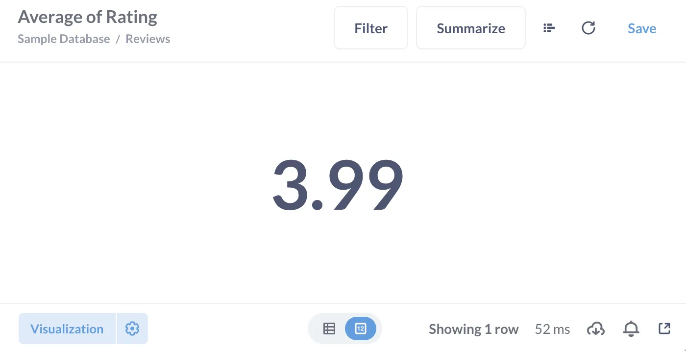
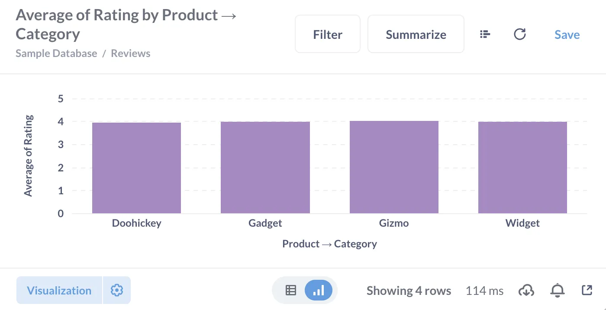
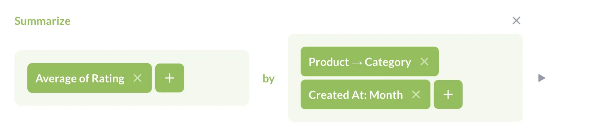
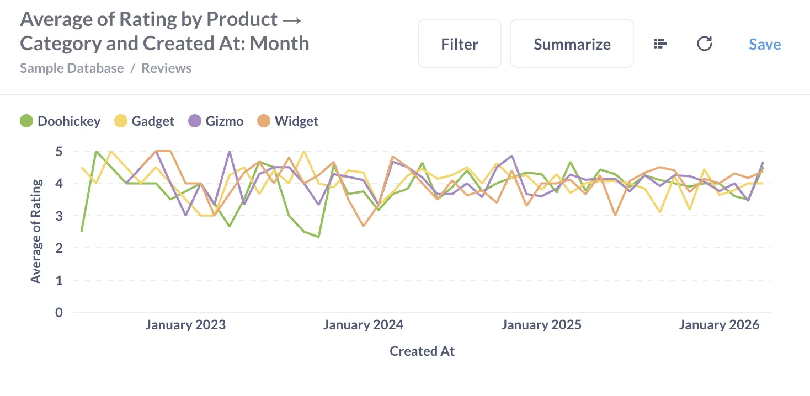
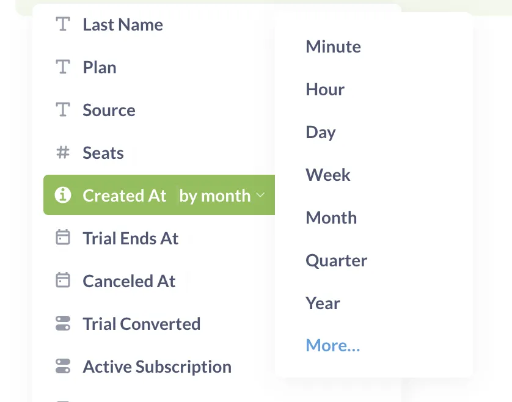
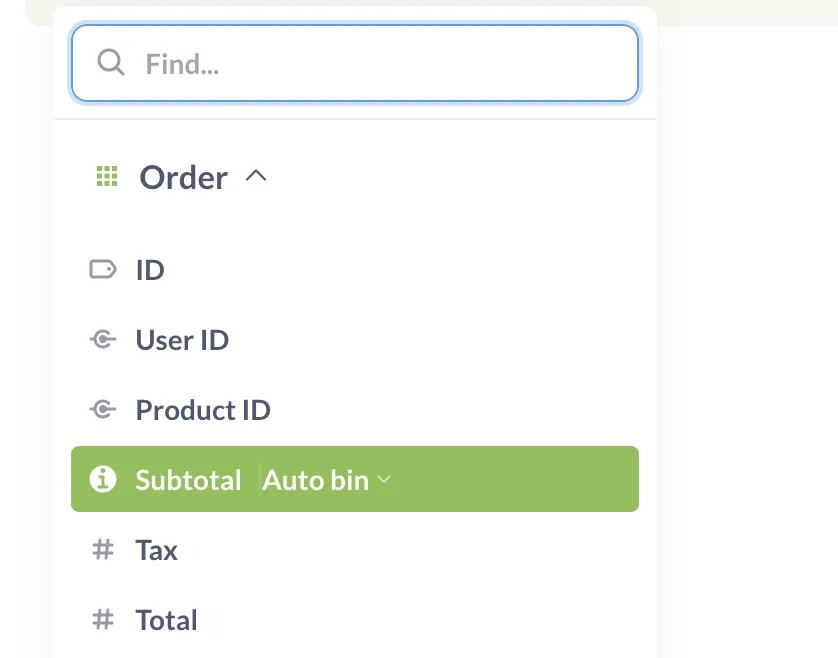
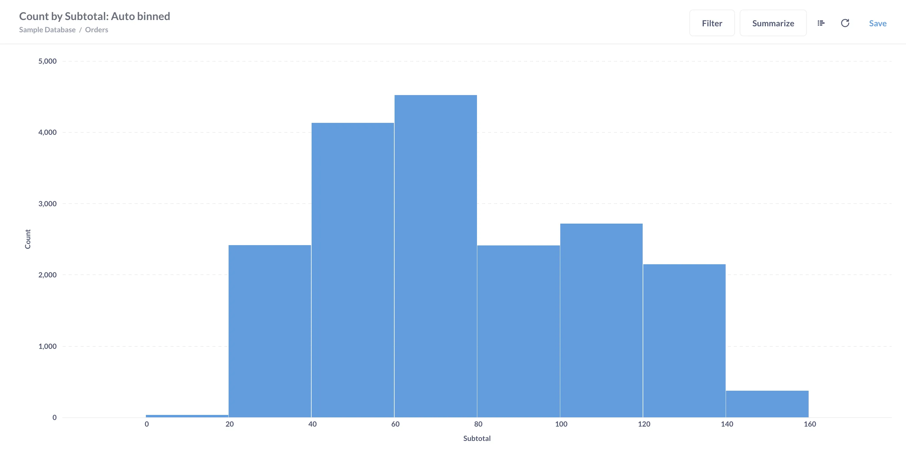
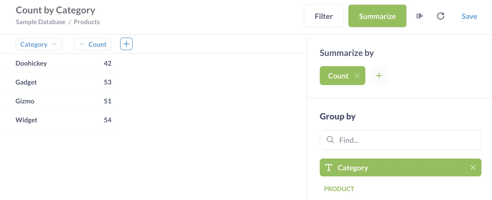



## Introduction

When we have a question like “how many people downloaded our app each day last week?”, we’re asking for a **summary** of the data. In this guide, you'll see all the ways to add summaries to charts and tables in Metabase, and learn some tips and tricks for using summaries in Metabase.

We assume that you already know how to [Ask a question in the query builder](/learn/metabase-basics/getting-started/ask-a-question).

## How to think about summaries

Summarizing means combining data from multiple records together and producing a single number, like “average of product ratings”. So you need to determine:

- the numerical **metric** that’s going to be used to combine value: for example, count, sum, or average
- the **column** whose values will be combined: for example, quantity, price, or rating
- (optionally) **breakouts** . They determine the groups that the data is _broken out_ (or _grouped_) **by**. For example, you can compute order quantity grouped/broken out by months, or product rating grouped/broken out by product categories, or both. Breakouts also often called **dimensions**.

The word “dimension” here is suggestive: for a line or a bar chart, the first breakout will serve as the X-axis.

For example, In Metabase you can find:

- Average of rating:




- Average of rating by product category:




- Average order total by product category for each month:




In all these cases, the metric is `Average`, the column is `Rating`, but adding breakouts creates different summaries and charts.

## Summarize by a column

When viewing a table, you can click on the column header to create a summary of the table by this column. The type of summaries you'll see will vary based on the column type. For example, you can find the average number of seats in the Accounts table in the Sample Database that comes with every new Metabase instance.


## Summarize a chart or a table

- When viewing a table or a chart, you can click on the "Summarize" button at the top right corner to add summaries to the table or chart.

  You can add metrics in the "Summarize by" block, change breakouts by clicking on column names in "Group by" block, and add more breakouts by clicking on the + button next to column names.

- In the query builder you can add a Summarize block and select metrics, columns, and breakouts. Check out [Ask a question in the query builder](/learn/metabase-basics/getting-started/ask-a-question) for a tutorial on the query builder!

## How to pick a chart for your summaries

When you click “visualize” on a question with summaries, Metabase will automatically select a chart that it believes is the most appropriate for your result. For example, if you group by a time series column, Metabase will create a line chart, and if you group by category — a bar chart. In most cases, the chart that Metabase picks will be the best option.

You can change the [chart type](/docs/latest/questions/visualizations/visualizing-results). Metabase charts have requirements on the number and the kind of breakouts you can use in summaries that feed into the chart:

| Chart type                             | Breakout requirements                        | Breakouts are used for..                                                            |
| -------------------------------------- | -------------------------------------------- | ----------------------------------------------------------------------------------- |
| Number, gauge, and progress charts     | Single number, no breakouts                  | N/A                                                                                 |
| Pie charts                             | 1 breakout                                   | Color of segments                                                                   |
| Waterfall and funnel charts            | 1 breakout                                   | X-axis                                                                              |
| Maps                                   | 1 breakout by a column with geographic data  | Location                                                                            |
| Trend charts                           | 1 breakout by a column with time series data | Time period for comparison                                                          |
| Line, bar, row, area, and combo charts | 1 or 2 breakouts                             | First breakout for the X-axis (or Y-axis for row charts), second breakout for color |
| Pivot tables                           | _at least_ 2 breakouts                       | Rows and columns                                                                    |
| Scatter plots                          | 1 to 3 breakouts                             | First breakout for the X-axis, second for color, and third for the bubble size      |

For example, you'll be able to change a pie chart to a bar chart, but not into a pivot table.

## Summarize with custom expressions

If you want to build summaries that use more complicated functions median or incorporate conditions like “Sum up totals for orders with tax”, you can use Metabase’s [Custom expressions](/docs/latest/questions/query-builder/expressions).

For example, you can add a summary like this:

```sql
SumIf([Subtotal], [Tax] > 0)
```

Check out our [tutorial on custom expressions](/learn/metabase-basics/querying-and-dashboards/questions/custom-expressions) to learn more.

## Summarizing tips

### Group by dates and times

You can group by date and time columns. Metabase will automatically select a granularity to group by: for example, for date columns, it will automatically group by months. You can change the graphylarity by clicking on the time period:



### Group by numeric variables

In Metabase, you can group by more than just categories or dates: you can also group by numeric variables, like `Price`. Metabase will bin the numerical variable for you, creating "categories" for grouping:



If you select "Count" as a metric when grouping by a numeric variable, you'll create a histogram (also known as the distribution chart) of this variable.



### Cumulative summaries

Metabase has two types of cumulative summaries: cumulative sum and count. For every record, they will return the sum or count of all values up to this record in the table.

These summaries work a bit differently from other summaries because the data they return depends on the order of the data in your table.

Let's say you have a table with values by month. Cumulative sum will be computed like this:

| Month    | Value | Cumulative sum |
| -------- | ----- | -------------- |
| July     | 5     | 5              |
| November | 4     | 5+4 = 9        |
| March    | 2     | 5 + 4 + 2 = 11 |

But if the months ordering is changed (while values remain the same), then the cumulative sum is changed as well:

| Month    | Value | Cumulative sum |
| -------- | ----- | -------------- |
| March    | 2     | 2              |
| July     | 5     | 2 + 5 = 7      |
| November | 4     | 2 + 5 + 4 = 11 |

### Distinct values

Metabase’s “Distinct values” summary returns the _number_ of distinct values in the column. If you want to see the distinct values themselves, you can create any summary with a breakout by that column instead.

For example, if you want to see all the distinct values for product categories, you can ask for the count of rows grouped by product category. This will give you a column with all the distinct category values, and a column with row counts for every category (you can [hide the count column](/docs/latest/questions/visualizations/table#rearranging-adding-and-removing-columns) from the results):



### Note for SQL experts

In SQL, you summarize by adding a function like `COUNT` into a `SELECT` statement — similarly to how you’d add a new column computed based on the values of other columns

In Metabase, these two operations are distinct: to add a new column, you can use a Custom column block, but to add an aggregation, you use a Summary block.
