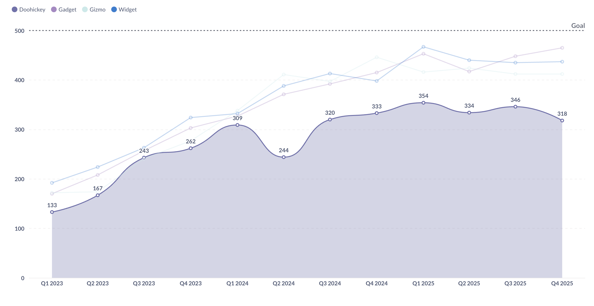
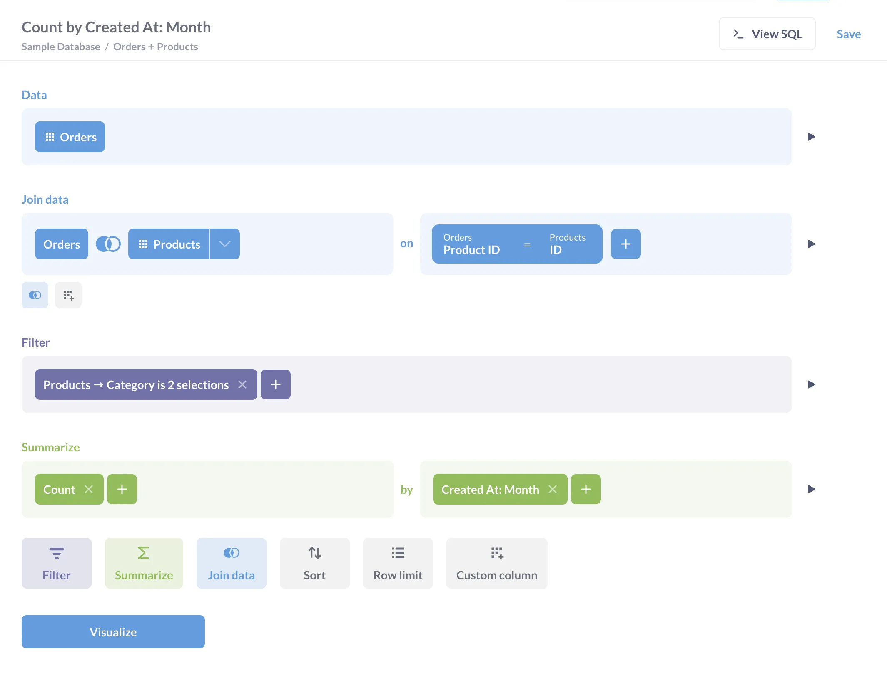
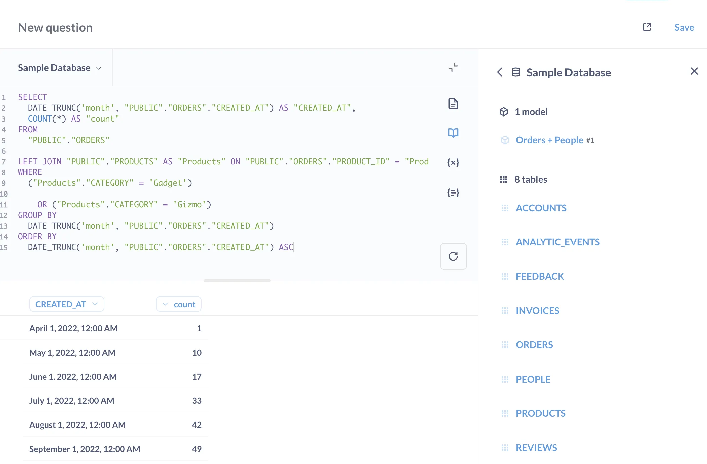
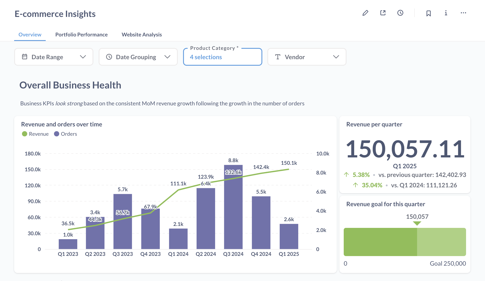
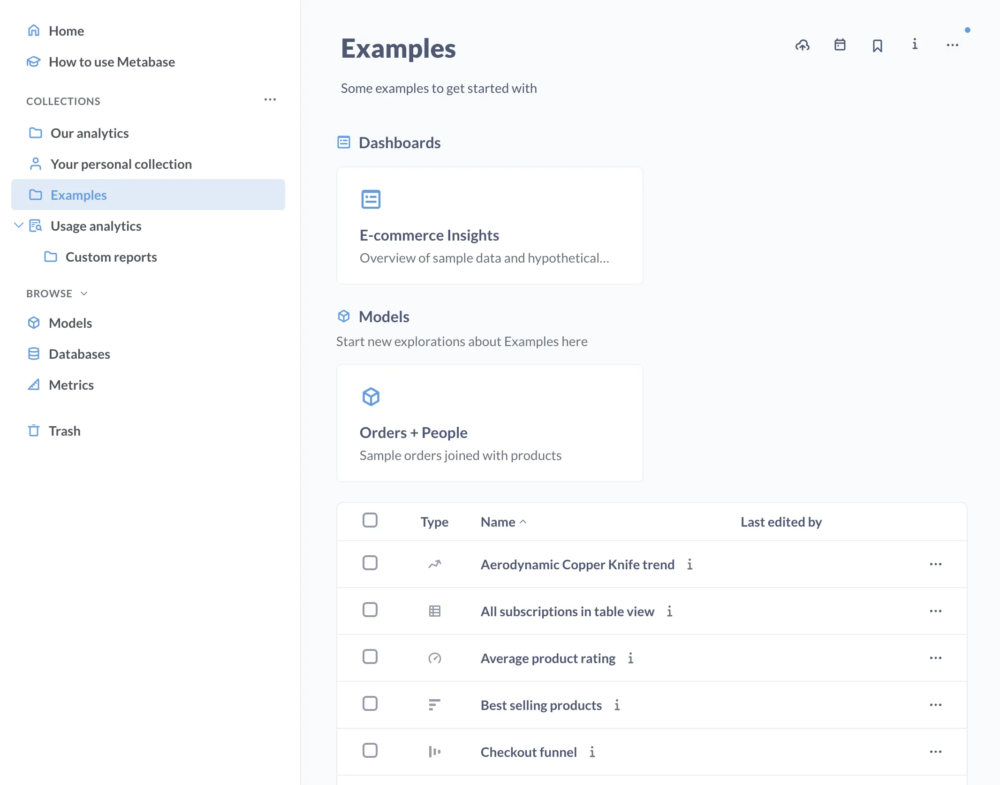
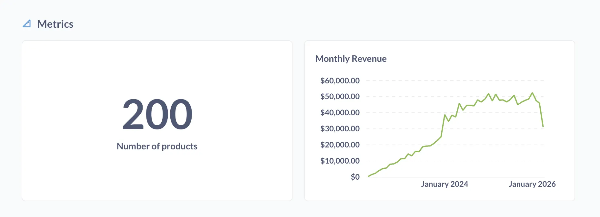

## Overview

Metabase is a "Business intelligence" (BI) platform that gives you a bunch of tools to understand and share your data. Companies typically use Metabase to give their teams an easy way to query data, or to embed Metabase in their application to let customers explore data on their own.

> Coming from another BI tool? Check out our [transition guides](/learn/cheat-sheets/transition-guides/).

You can use Metabase to:

- Query your database using either:
  - A [graphical query builder](#query-builder), or
  - The [native query editor](#native-query-editor)
- View results as tables or charts (which you can customize)
- Save results as [Questions](#questions) that can be added to:
  - [Dashboards](#dashboards)
  - [Collections](#collections)
- Add multiple questions to dashboards.
- Add dashboard filters that update all questions at once.
- Organize questions and dashboards into collections.
- Create [Models](#models) to curate datasets, making it easier for people to query commonly filtered or joined data.
- Create [Metrics](#metrics) to standardize how your team calculates important numbers.

## Core concepts

Metabase has a lot of tools, but here is the basic toolbox:

- [**Questions**](#questions) are saved queries with visualizations that you can add to dashboards or collections. Questions are the charts you can organize on dashboards.
- [**Dashboards**](#dashboards) group related questions (charts and other cards) that can be filtered and refreshed together.
- [**Collections**](#collections) are like folders to organize and manage permissions for your questions, dashboards, and other items.
- [**Models**](#models) are like views that curate data from your database.
- [**Metrics**](#metrics) define the official way to calculate important numbers for your team.

## Questions

Questions are saved queries plus their visualization (you can toggle between a table and a chart). If you're coming from [Tableau](/learn/cheat-sheets/transition-guides/tableau-to-metabase), Questions are like worksheets; if [Power BI](/learn/cheat-sheets/transition-guides/powerbi-to-metabase), they're like Reports.

You can also:

- [Set up alerts](/docs/latest/questions/alerts) on questions to get notified when your data meets certain conditions.
- [Export results](/docs/latest/questions/exporting-results) of questions to CSV, XLSX, or JSON (or PNG for charts).

There are two main ways to create questions: the query builder, and the native code editor:

### Query Builder

The query builder lets you create questions without knowing SQL. It provides a point-and-click interface where you can:

- Select the data you want to analyze.
- [Filter](/docs/latest/questions/query-builder/filters) to specific values or conditions.
- [Summarize and group data](/docs/latest/questions/query-builder/summarizing-and-grouping), sort, and add custom columns.
- [Join](/docs/latest/questions/query-builder/join), sort, and add custom columns.
- [Create visualizations](/docs/latest/questions/visualizations/visualizing-results) of your results.

Even SQL experts often use the query builder because:

- It's faster. You can drill through charts, group results, and iterate on a question just by clicking around.
- Metabase will pick a chart for you (which you can change and customize manually).
- The charts the query builder produces are interactive: you can [drill through charts](../querying-and-dashboards/questions/drill-through) to explore further (unlike charts built with the native code editor).
- You can hand off the question to people who don't know SQL.
- It's surprisingly powerful: see [Custom expressions](/docs/latest/questions/query-builder/expressions).

### Native query editor

If you know SQL (or your database's query language), you can also create questions with the native editor. You can:

- Write complex queries with reusable code saved as [snippets](/docs/latest/questions/native-editor/snippets).
- Use [parameters](/docs/latest/questions/native-editor/sql-parameters) to make your queries dynamic and reusable.
- Reference [models](/docs/latest/data-modeling/models) and [saved questions](/docs/latest/questions/native-editor/referencing-saved-questions-in-queries) in your SQL.
- Use database-specific functions.
- Do things that might not be possible in the query builder.

**There is one drawback compared to the query builder**: unlike the questions built with the query builder, people _won't_ be able to [drill through your charts](../querying-and-dashboards/questions/drill-through).

## Dashboards

Dashboards are a way to group and present related questions.

With dashboards, you can:

- [Arrange multiple questions](/docs/latest/dashboards/introduction) in a layout that makes sense.
- [Add filters](/docs/latest/dashboards/filters) that affect multiple questions at once.
- [Add text cards](/docs/latest/dashboards/introduction#adding-headings-or-descriptions-with-text-cards) to provide context and explanations.
- [Set up automatic refresh intervals](/docs/latest/dashboards/introduction#auto-refresh).
- [Make cards interactive](/docs/latest/dashboards/interactive).
- [Set up subscriptions](/docs/latest/dashboards/subscriptions) to automatically send dashboards via email, Slack, or a webhook.

## Collections

Collections work like folders. They're like the file system for Metabase. You can use collections to:

- Group related content together: questions, dashboards, models, and metrics. For example, to group all items for a specific team.
- Mark items as official (pro feature).
- Nest collections within other collections.
- Add [events and timelines](/docs/latest/exploration-and-organization/events-and-timelines) to track key dates and milestones.

## Models

[Models](/docs/latest/data-modeling/models) are your clean, curated datasets that help people get started on the right foot. They're like a well-organized spreadsheet that combines data from different places and adds helpful calculations. You can create models to:

- Combine and filter data from multiple tables.
- Include helpful calculations and cleaned-up fields.
- Provide clear descriptions and semantic types (like "Price").

For example, say you have an e-commerce database with separate tables for orders, people, and products. You could create a "Customer Orders" model that:

- Joins together frequently used columns from these different tables.
- Adds useful calculated fields like "Total Lifetime Value".
- Filters out test orders.
- Includes clear descriptions of what each field means.

Now anyone can use the model as a starting point for new questions, without having to wrangle the underlying data each time.

## Metrics

Instead of everyone calculating important numbers (like revenue, active users, etc.) in their own way, you can standardize these calculations as metrics.

With [metrics](/docs/latest/data-modeling/metrics), you can:

- Create a single source of truth for important calculations.
- Include these calculations in any question, dashboard, or collection.

For example, say you want to track your company's revenue. You could create a "Monthly Revenue" metric that:

- Grabs data from your `orders` table.
- Excludes canceled orders.
- Sums the total.
- Groups by month.

That way anyone can use the "Monthly Revenue" metric in their questions and dashboards, and you won't have to deal with different revenue numbers in different dashboards.

## One last tip

Press `cmd + k` (Mac) or `ctrl + k` (Windows/Linux) to bring up the command palette. You can use it to:

- Search across all your Metabase content.
- Jump to specific items (questions, dashboards) or pages (like Admin settings).
- Create new questions and dashboards.
- Access recent items.
- Find documentation.

Bon voyage!
