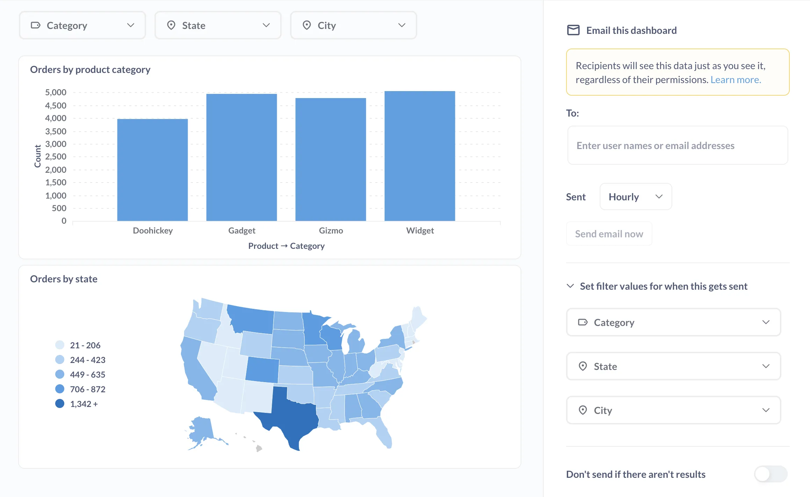
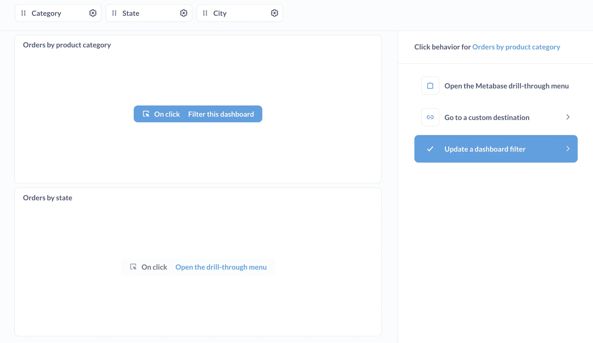
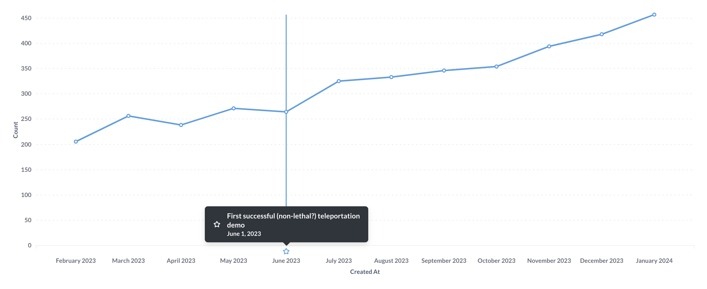
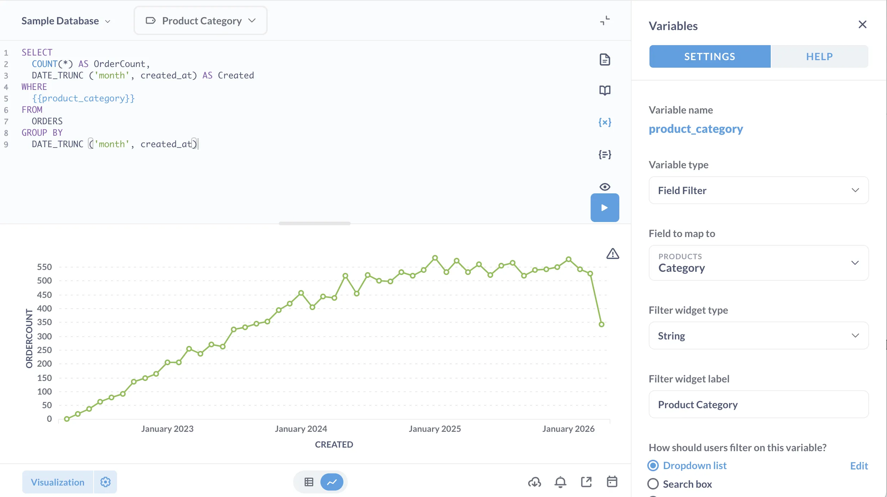
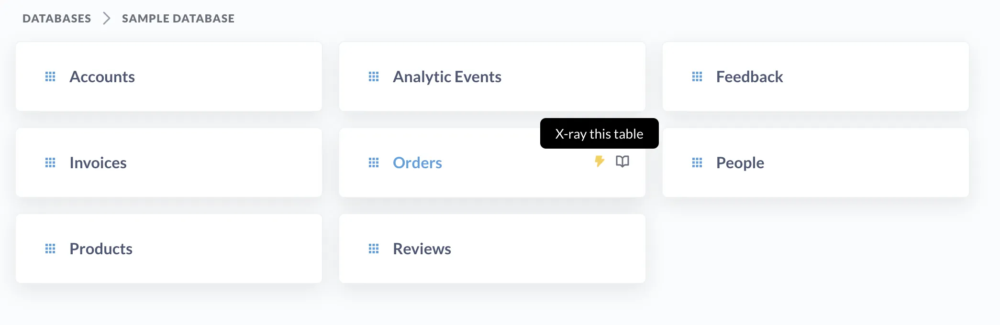
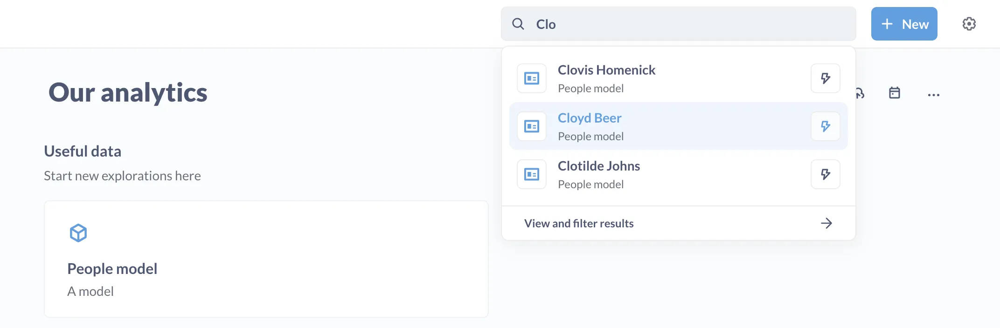
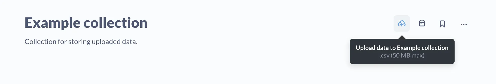

## Get notified when results cross a goal line

You can set up an [alert](/docs/latest/questions/alerts) on a question so that Metabase will send you an email or Slack message when the question returns results that cross a goal line. You can also send the results to a webhook.

## Share dashboard results via email and Slack

Set up a [dashboard subscription](/docs/latest/dashboards/subscriptions) to send the results of a dashboard via email or Slack. On [Pro](/product/pro) and [Enterprise](/product/enterprise) plans, you can filter results for different [groups](/docs/latest/people-and-groups/managing).

## Make data easier to query with models

You can create [models](/learn/data-modeling/models) to clean up messy raw data and make it easier for people to ask questions.

## Speed up loading times by caching results

You can store the results of questions so Metabase can return them much faster. Check out:

- [Caching questions](/docs/latest/configuring-metabase/caching)
- [Model persistence](/docs/latest/data-modeling/model-persistence)

## Customize what happens when people click on dashboard charts

Questions built with the query builder get the drill-through menu built into their charts. But you can change what happens when people click on dashboard cards. Customizing click behavior is especially useful for adding functionality to questions written in SQL. You can:

- Send people to a custom destination (like another dashboard, or to an external URL).
- Open up the drill-through menu.
- Update a value in a dashboard filter.

Check out [Interactive dashboards](/docs/latest/dashboards/interactive).

## Annotate charts with events and timelines

You can add [events on time series](/docs/latest/exploration-and-organization/events-and-timelines). You can use events to mark dates where something happened: an email campaign or outage or office party that got out of hand. You can group events into timelines to keep related events together. Events are useful for explaining spikes in the data, so you don't have to answer for the umpteenth time why sales went way up in April.

## SQL templates

Insert [variables into your SQL](/docs/latest/questions/native-editor/sql-parameters) and Metabase will create a filter widget for you. Also: check out [field filters](/learn/grow-your-data-skills/learn-sql/working-with-sql/field-filters) that create "smart" filters, with dropdown lists or date ranges.

You can also save bits of SQL to reuse in other queries. Check out [Snippets](/learn/grow-your-data-skills/learn-sql/working-with-sql/field-filters).

## X-ray models, tables, charts, and more

Visit a model or table, hit a button, receive charts. You can save these auto-generated charts as a dashboard, or just use any of the charts as starting points to find the answers you're looking for. Check out [X-rays](/docs/latest/exploration-and-organization/x-rays).

## Index models so you can search for individual records

When you're editing metadata for a column in a model, you'll see a toggle called **Surface individual records in search by matching against this column**. If you flip this toggle on, people will be able to search in Metabase for those records. If, for example, the field contains a list of customer names, you can index that column so that people can just search for customer names in the Metabase search bar. You can also [X-ray](/docs/latest/exploration-and-organization/x-rays).

Check out the docs for [indexing fields on a model](/docs/latest/data-modeling/models#surface-individual-records-in-search-by-matching-against-this-column).

## Upload CSVs for ad hoc exploration

Instead of tinkering with a spreadsheet, [upload a CSV](/docs/latest/databases/uploads) to Metabase and query the data with the query builder, the SQL editor, or even X-ray it.

## Export results and dashboards

You can [download the results of a question](/docs/latest/questions/exporting-results) as .json, .csv, .png, or .xlsx files, or export a dashboard as a PDF.

## And a bunch of other stuff

Metabase is designed to be simple and intuitive, but it has a lot of depth. Consider spending way too much time reading our [docs](/docs/latest/) and [Learn](/learn/) articles.
