This is the "what comes in the box when you install Metabase" article. Metabase has a _lot_ of tools in its toolkit (and we can't cover everything here), but even seasoned Metabasers will benefit from a tour of its feature set - especially since we [add major new features at a regular clip](/releases).

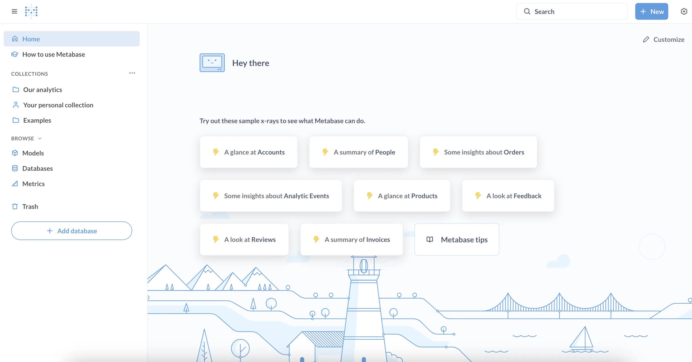



## What is Metabase?

Metabase is an open-source business intelligence tool that you can connect to [many popular databases](/data-sources/). Metabase lets you ask questions about your data, and displays answers in formats that make sense, whether that's a bar chart or a detailed table.

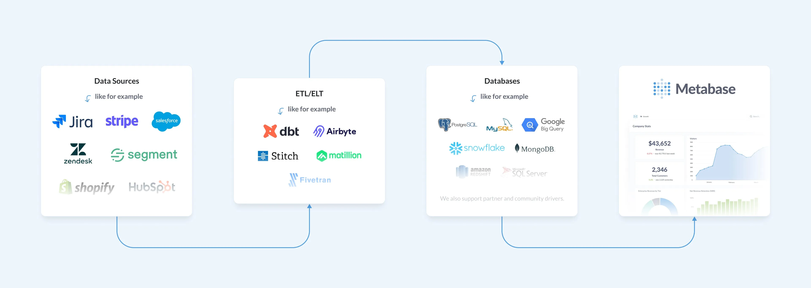

You can save your questions, and group questions into handsome dashboards. Metabase also makes it easy to share questions and dashboards with the rest of your team.

At a high level, we'll walk through the features that let you:

- [Query and visualize your data](#query-and-visualize-your-data)
- [Build interactive dashboards](#create-interactive-dashboards)
- [Share your results](#share-your-results)
- [Embed charts](#embed-questions-and-dashboards)
- [Find things and stay organized](#find-things-and-stay-organized)
- [Manage users](#manage-users)

## Query and visualize your data

### Connect a database

Metabase supports a [lot of different databases](/docs/latest/databases/connecting#connecting-to-supported-databases), and ships with a [Sample Database](/glossary/sample_database) for you to play around with. And once you've connected your data sources, Metabase gives you a lot of tools to explore them.

### Upload spreadsheets

You can [upload CSVs](/docs/latest/databases/uploads) to query and visualize in Metabase. This feature is handy for quick ad hoc analysis of spreadsheet data.

### Query builder

You can use Metabase's **query builder** to filter and summarize data.

With [custom expressions](/glossary/custom_expression), you can accomplish pretty much anything you'd be able to do with SQL: [join tables](/learn/metabase-basics/querying-and-dashboards/questions/joins-in-metabase), create custom columns, filter and group results, [compare time series](/learn/analytics/time-series-comparisons), and more. Plus, people who don't know SQL can duplicate your question and use it as a starting point for another question.

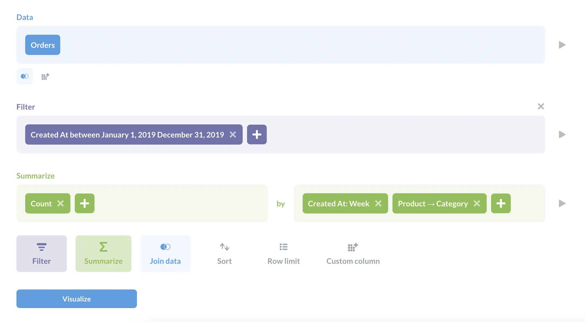

Query builder questions automatically get a drill-through menu applied to their visualizations, allowing people to click on a table or chart to [drill through the data](/learn/metabase-basics/querying-and-dashboards/questions/drill-through).

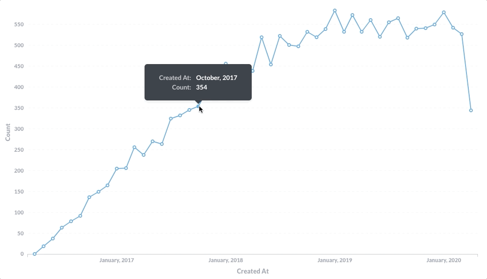

Questions asked with the query builder can start with a [model](/learn/getting-started/models), a raw table, or with the results of a saved question, and you can convert them to native SQL at any time.

### Native queries

Use the **native query editor** to compose questions in the database's native query languages (typically SQL for relational databases, but also other query languages for data sources like MongoDB). For questions written in SQL, you can use variables in your code to create [SQL templates](/docs/latest/questions/native-editor/sql-parameters), including [field filter](/glossary/field_filter) variables that can create smart dropdown filters.

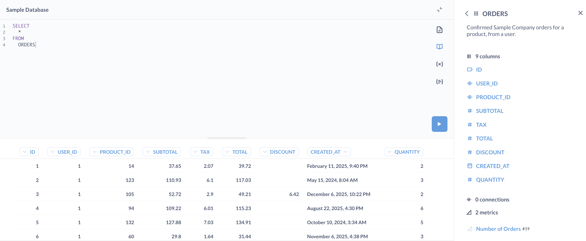

Like query builder questions, you can use the results of models or [saved questions](/learn/sql-questions/organizing-sql) as starting points for new questions, just as you would a table or view. For example, to reference question 123 like so:

```sql
WITH gizmo_orders AS {{#123}}
```

### Visualize results

When you ask a question, Metabase will guess at the most appropriate visualization type for the results, but you can select from eighteen different visualization options.

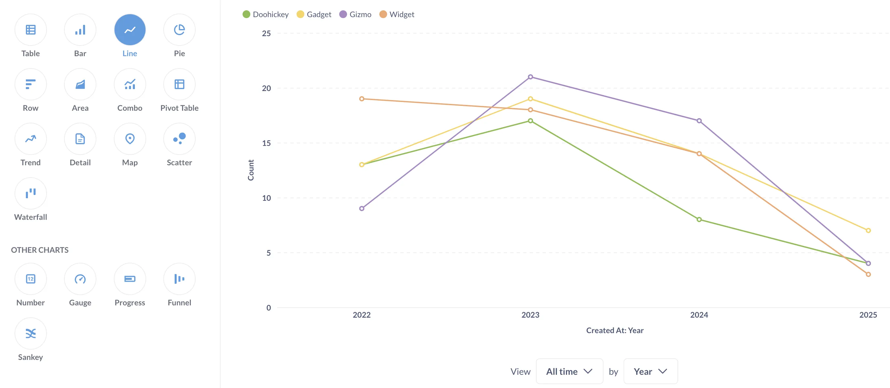

Additionally, each visualization type has their own set of options to customize. You can even [add custom maps](/docs/latest/questions/visualizations/map) to your Metabase instance.

## Create interactive dashboards

You can organize questions and models into a [dashboard with tabs](/docs/latest/dashboards/introduction#dashboard-tabs), and contextualize them with [Markdown](/learn/metabase-basics/querying-and-dashboards/dashboards/markdown) text cards, link cards, and iframe cards.

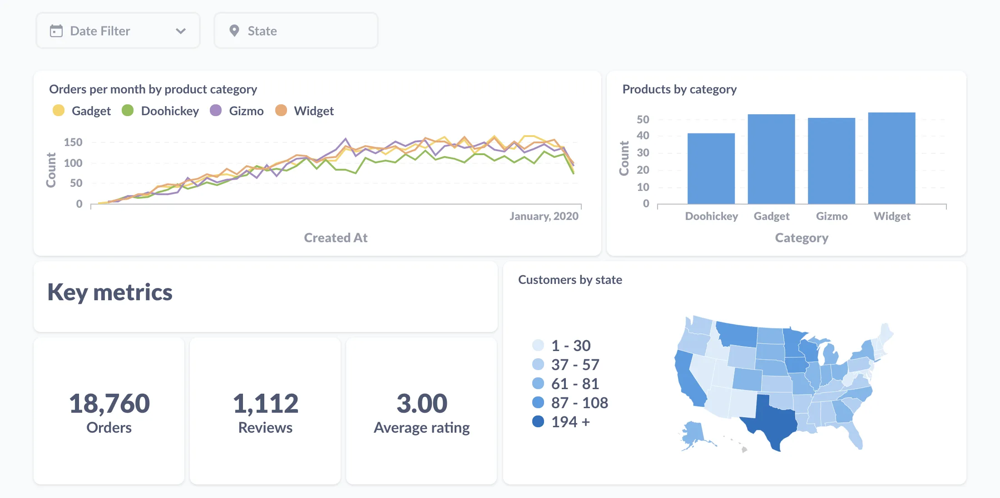

You can add filters to dashboards and connect them to fields on questions to narrow the results.

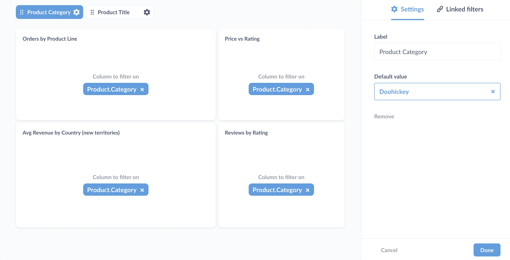

You can [link filters](/learn/metabase-basics/querying-and-dashboards/dashboards/linking-filters), create [custom destinations](/learn/metabase-basics/querying-and-dashboards/dashboards/custom-destinations) (to send people to another dashboard or external URL), or even have a chart [update a filter on click](/learn/dashboards/cross-filtering).

### Create, update, and delete records

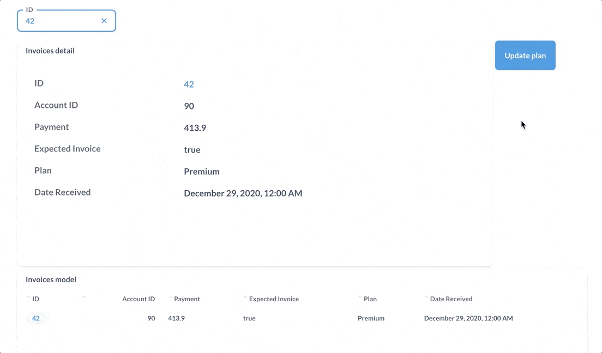

Write back to your databases with [actions](/docs/latest/actions/start). You can combine dashboards, models, and actions and other Metabase items to build basic CRUD apps.

## Model your data

### Table metadata

Metabase will try to guess how to display the various fields in your tables, but if you want more control, you can customize how Metabase handles each field, setting field visibility, type, formatting, and more.

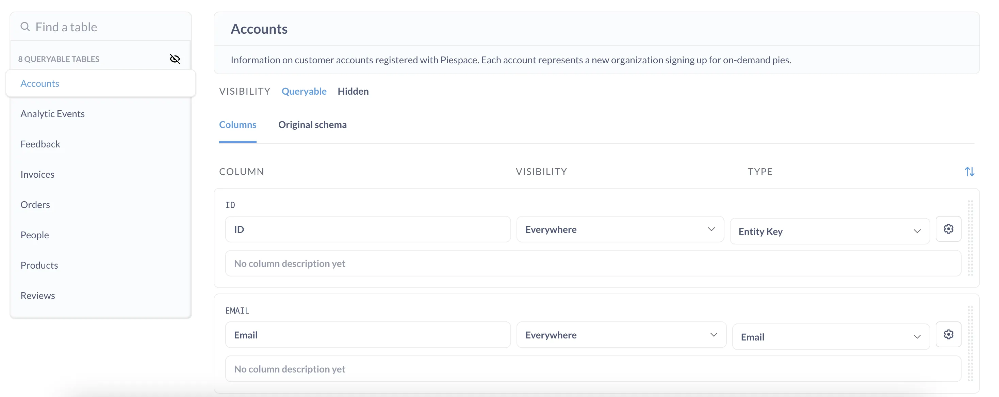

### Create models to use as starting data for new questions

[Models](/learn/getting-started/models) are built with questions from either the query builder or the SQL editor. You can use them to pull together data from multiple tables, with custom, calculated columns, and column descriptions and other metadata, to create great starting data for people to ask new questions. For example, you could build a model for "Active users", or "Priority orders", or however you want to model your business.

If you find that you're using the same saved question over and over as your starting data for new questions, you may want to convert that saved question to a model, which will let you add metadata like column descriptions and column types. You can also refer to models in SQL queries, just like we did above with saved questions.

### Use metrics to create reusable calculations

Create [metrics](/docs/latest/data-modeling/metrics) to define the official way to calculate important numbers for your team. Metrics are like pre-defined calculations: create your aggregations once, save them as metrics, and use them whenever you need to analyze your data.

For example, you may want to create a metric that calculates revenue, so people can refer to revenue in their own questions. That way you standardize how revenue is calculated (so you don’t end up with five different calculations for revenue).

You can do the same kind of standardization for SQL questions by codifying SQL code in [snippets](/learn/metabase-basics/querying-and-dashboards/sql-in-metabase/snippets), which on [Pro and Enterprise plans](/pricing/) you can organize with [folders and permissions](/docs/latest/permissions/snippets).

## Share your results

Once you've asked questions and built dashboards, it's time to share your analysis.

### Alerts

[Set up an alert](/docs/latest/questions/alerts) to notify people when the results meet a goal. You can send out alerts via email or Slack, or to a webhook.

### Dashboard subscriptions

To keep people posted on key metrics, you can set up [dashboard subscriptions](/docs/latest/dashboards/subscriptions) via email or Slack - even to people who lack an account in your Metabase.

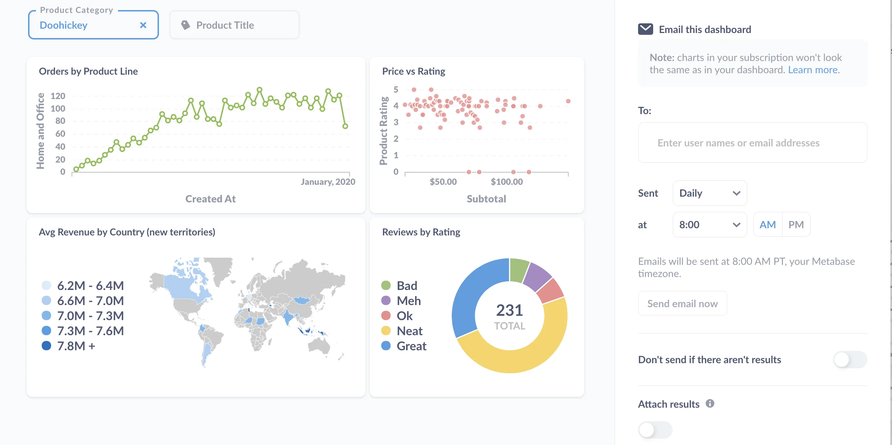

## Embed questions and dashboards

You can [embed charts and dashboards](/docs/latest/embedding/start) using iframes. On [Pro and Enterprise plans](/pricing/), you can even embed the full Metabase app, which allows you to do things like [deliver multi-tenant, self-service analytics](/learn/embedding/multi-tenant-self-service-analytics). Or, use the [Embedding SDK](/docs/latest/embedding/sdk/introduction) to embed individual Metabase components in React with full styling and interactivity control.

## Find things and stay organized

Things in this case being databases and their analysis: the questions, dashboards, and collections you and your teams create.

### Search

You know, to find things: data, metrics, segments, dashboards, models, and questions. You'll probably use the search bar the most often, but the catch here is that you need to know what to search for.

### Organize with collections

Collections organize questions, models, dashboards, and other collections. They work like folders on a file system, and you can [set permissions on collections](/learn/permissions/collection-permissions), giving some groups edit, view, or no access. Groups with edit access to a collection can pin the most important items to the collection - your "official" dashboards.

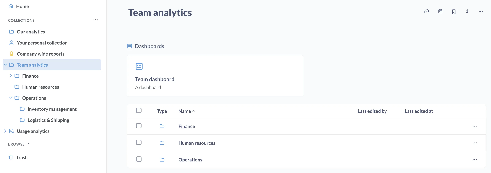

### Events and timelines

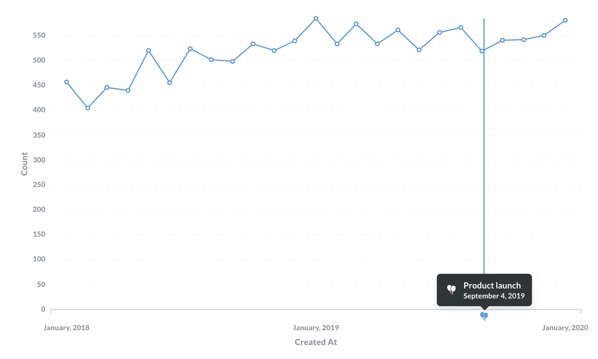

[Events and timelines](/docs/latest/users-guide/events-and-timelines) let you capture important dates and make that knowledge available when you need it (that is, when you're viewing a time series). You can organize events into timelines, and associate those timelines with collections.

### Browse data, models, and metrics

You can browse all the databases, models, and metrics available in your Metabase.

You can browse tables and their fields, see sample data, as well as a list of questions that query that data.

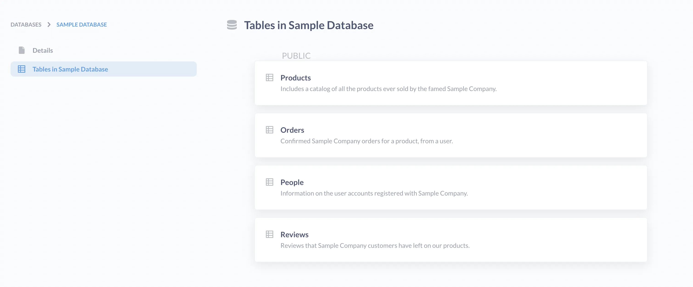

### X-rays

To give you a head start on asking questions, Metabase can [X-ray](/docs/latest/exploration-and-organization/x-rays) a table for you.

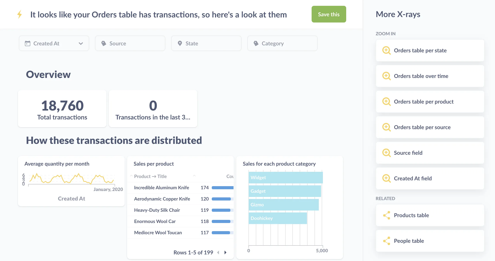

These X-rays will generate a bunch of questions that slice the table's records in different ways. You can save the X-ray as a dashboard, take out any questions that don't interest you, add new questions, or just use the X-ray to get a feel for the table.

## Manage users

Permissions, authentication, usage analytics: with great power comes great responsibility.

### Settings

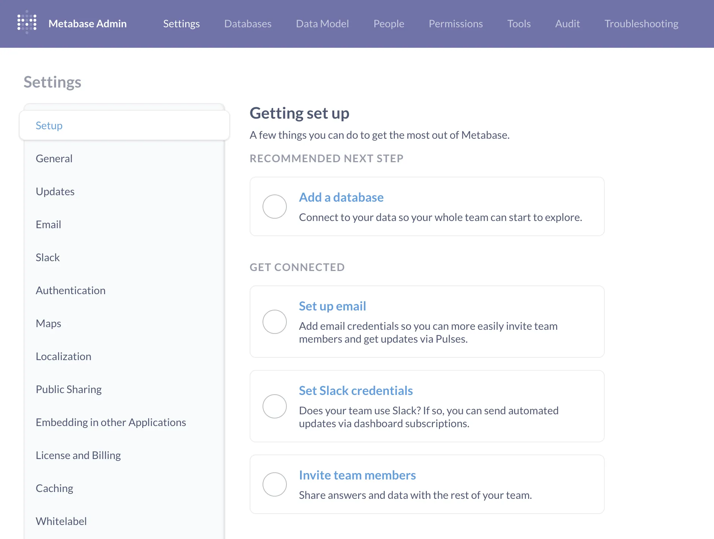

You can set up [email](/docs/latest/configuring-metabase/email) and [Slack](/docs/latest/configuring-metabase/slack) integrations, customize locale settings like language and currencies, and configure authentication with [Google Sign-In or LDAP](/docs/latest/administration-guide/10-single-sign-on), or on [Pro and Enterprise plans](/pricing/): [JWT](/docs/latest/people-and-groups/authenticating-with-jwt) or [SAML](/docs/latest/people-and-groups/authenticating-with-saml).

### Group permissions for data and collections

[Create groups](/docs/latest/people-and-groups/managing#groups) in Metabase, add people to those groups, and give the groups different levels of access to [databases](/learn/permissions/data-permissions) and [collections](/learn/permissions/collection-permissions).

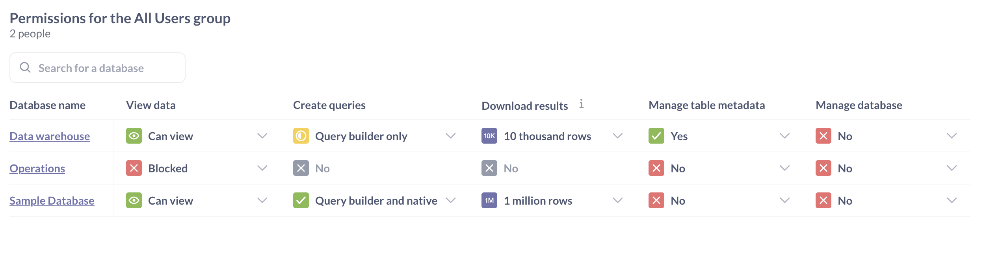

Some plans also include the ability to set application-level permissions: who can edit Metabase settings, view logs and debugging tools, and other application-level features.

#### Data sandboxing



If you need granular control over who can see what, check out the [data sandboxing](/docs/latest/permissions/data-sandboxes) feature to learn how you can restrict table access by [row](/learn/permissions/data-sandboxing-row-permissions) and by [column](/learn/permissions/data-sandboxing-column-permissions).

You can also set up row-level permissions for SQL queries with [connection impersonation](/docs/latest/permissions/impersonation).

### Usage analytics



If you need to see what everyone's looking at, check out [How to keep tabs on your data](/learn/permissions/keep-tabs-on-your-data).

## Submit a PR, or fork the source code

Metabase is open source, so if Metabase lacks a feature you need, you can always build it yourself. Check out our [releases](https://github.com/metabase/metabase/releases) to see the features we've added recently, and the [roadmap](/roadmap) for what we're working on next.

## Further reading

- Stay up to date on our [blog](/blog).
- Questions? See if they've been answered on [our forum](https://discourse.metabase.com/), or post a question yourself.
- [Beyond BI: other problems you can solve with Metabase](/learn/analytics/beyond-bi).
