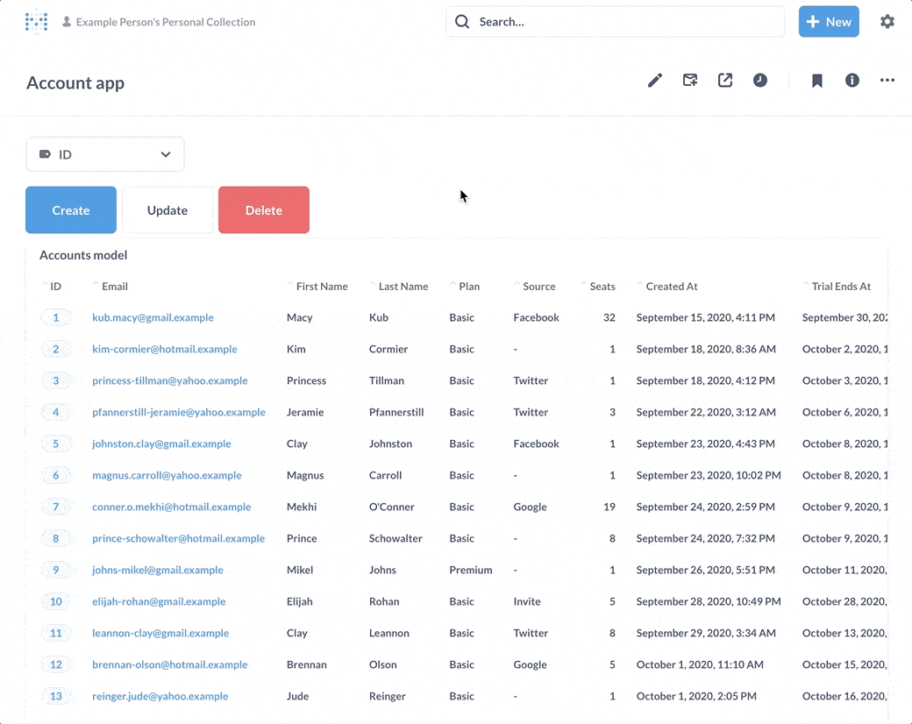
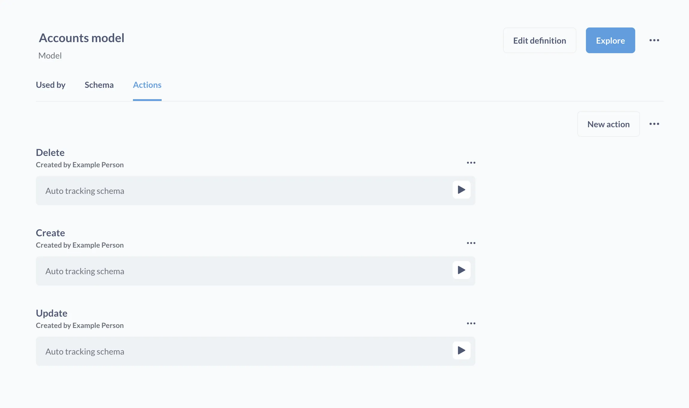
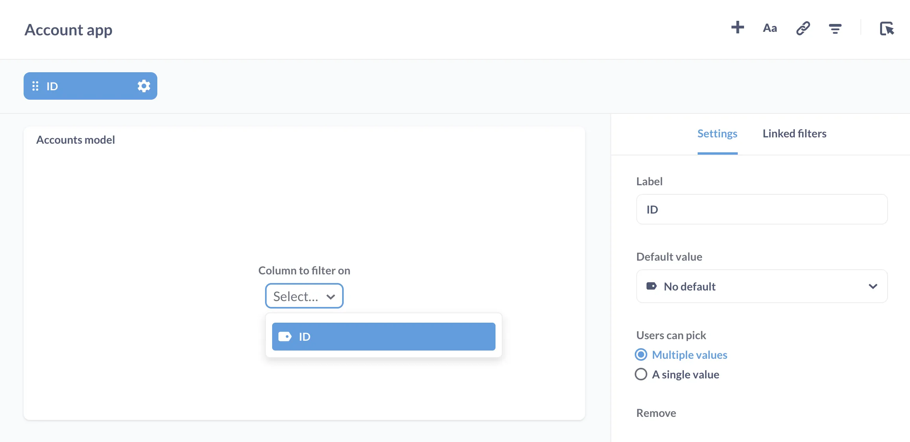
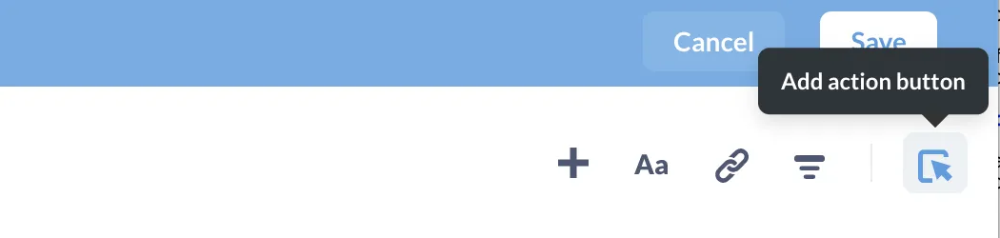
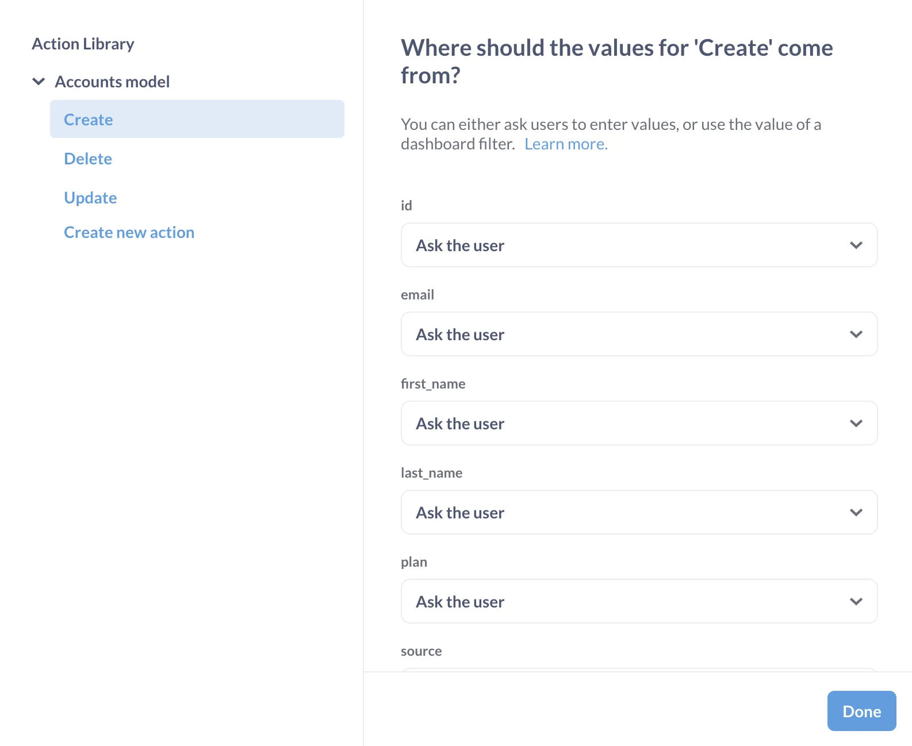
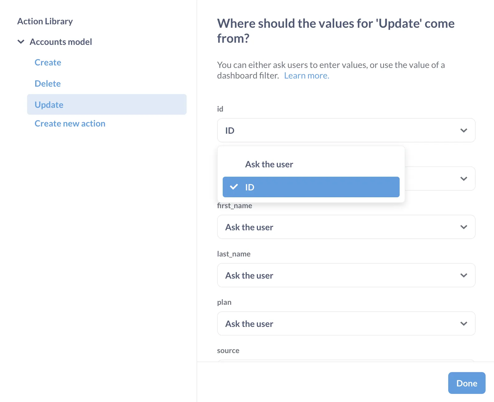

We'll walk through how to build a basic CRUD app in a dashboard. We'll build a little data app that displays account info from the Sample Database that allows you to Create, Read, Update, or Delete records (CRUD).

Here is our app in action:

There is a fair amount of setup here, but the actual work involved is _orders of magnitude_ less than having to code up a data app by hand.

## Create a model

We'll start by creating a model that is just a "wrapper" around a raw data table: in this case the Accounts table.

Go to **+ New** > **Model**. Select the **Notebook editor**, then **Raw Data** > **Sample Database** > **Accounts**.

Save the model as "Accounts model". We'll add this model as a table to our Accounts app as a way to browse through records.

## Create basic actions

Go the Accounts model you just created and click on the **Info** button in the upper right (it's the **i** in the circle icon), then click on **Model details**.

From the Accounts model detail page, click on the **Actions** tab. In the middle of the page, click on **Create basic actions**, and Metabase will generate Create, Update, and Delete actions for you.

If you don't see a tab for actions, that means that your administrators haven't [enabled model actions](/docs/latest/actions/introduction#enabling-actions-for-a-database) for your database. Right now, actions are only available for [some databases](/docs/latest/actions/introduction). Once you have access to a model in Metabase, you can also create a new custom action from the **+ New** menu, or from the model detail page.

For this walkthrough, though, we're just going to work with the [basic actions](/docs/latest/actions/basic) that Metabase can automatically generate for you: Create, Update, and Delete.

## Create a dashboard and add the Accounts model to it

Go to **+ New** > **Dashboard**. Call the dashboard "Account app". This dashboard will be where we'll add the:

- model
- filter widget, and
- the actions buttons that will write back to the database.

While in dashboard edit mode, click on the **+** button to add the "Accounts model" you created to the dashboard.

## Add a filter to the dashboard and connect the filter to the model card

Next, while still in dashboard edit mode, click on the **filter** icon and select **ID** filter.

Connect the filter to the dashboard card by selecting the **ID** field from the Model card's dropdown menu.

Click **Done** in the Filter settings sidebar.

If you get stuck here, check out [Dashboard filters](/docs/latest/dashboards/filters).

## Add the three basic actions to dashboard

Still in dashboard edit mode, click on the **Action** button icon to add an action (the button with the mouse pointer clicking on a box). Hover over the action button and click the **gear** icon.

We'll start by adding the Create action to the dashboard:

- Label the **Button text** "Create"
- Leave the **Button variant** set to primary
- Then **Pick an action** from the Action Library: look for the Accounts Model you created, and select the Create action.

Leave all of the fields set to "Ask the user".

## Change the Update and Delete actions to get values from the ID parameter set by the dashboard filter

Add the action buttons for Update and Delete (and pick different button colors, whichever you like).

Then, set up the Update and Delete actions to run using the ID from the ID filter on the dashboard.

If you've already added the action button to the dashboard, you can, while in dashboard mode, hover over the button you want to change, and click on the button's **gear** icon. To change where the button should get its values from, click on **Change action**.

Once all your buttons are added, feel free to arrange them however you like, then **Save** your changes.

## Kick the tires on your new CRUD app

Plug in an ID number into the ID filter, then click on the **Update** button. Change a value in one (or more) of the fields, then hit the **Update** button the bottom of the form to submit your changes. Note that the current Sample Database lacks serially generated IDs, so if you try to create a new record, you'll need to input an ID that's not already in use in the underlying accounts table.

At this point, you should have a working "app" that can create, read, update, and delete records in the accounts table.

Let us know what you kind of apps you build using actions. Cheers!

## Further reading

- [Intro to Actions](/docs/latest/actions/start)
- [Basic actions](/docs/latest/actions/basic)
- [Custom actions](/docs/latest/actions/custom)
- [Actions on dashboards](/docs/latest/dashboards/actions)
