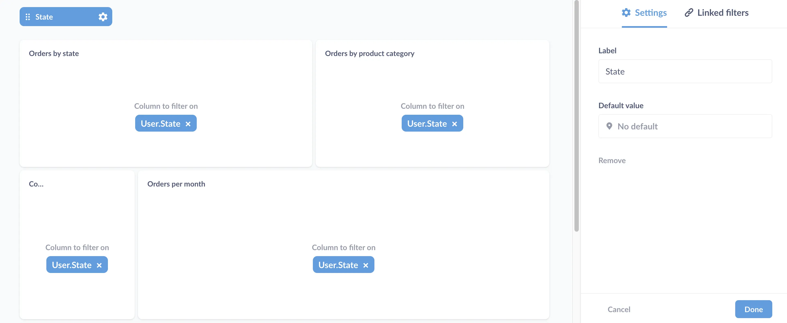
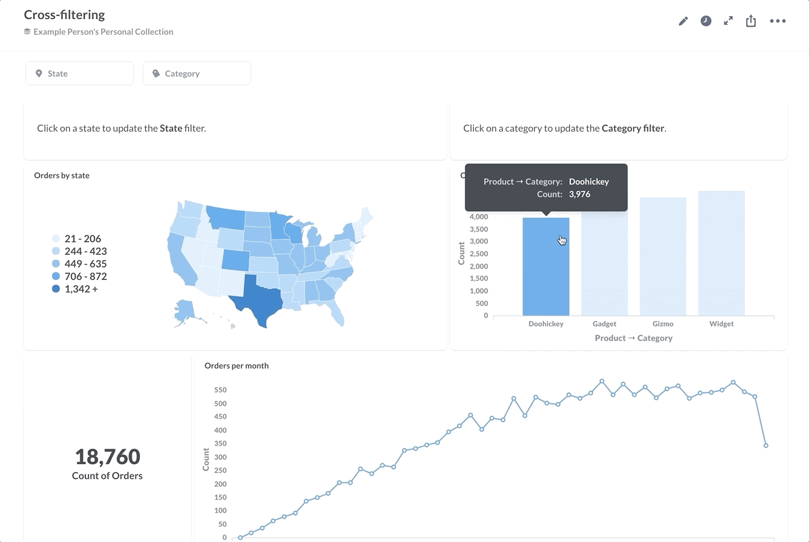
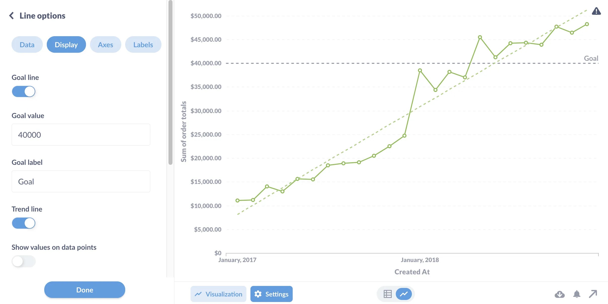
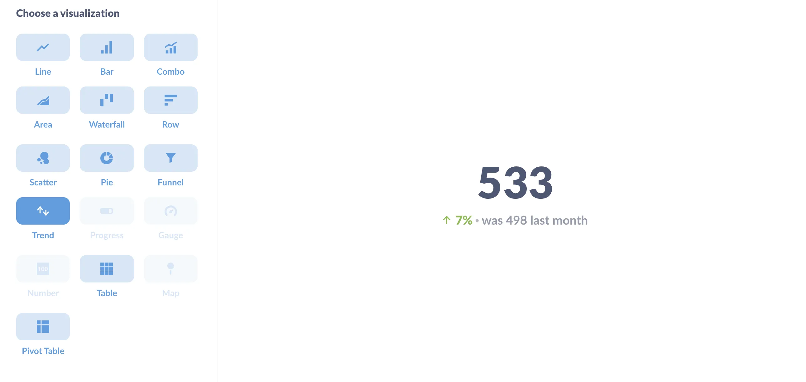
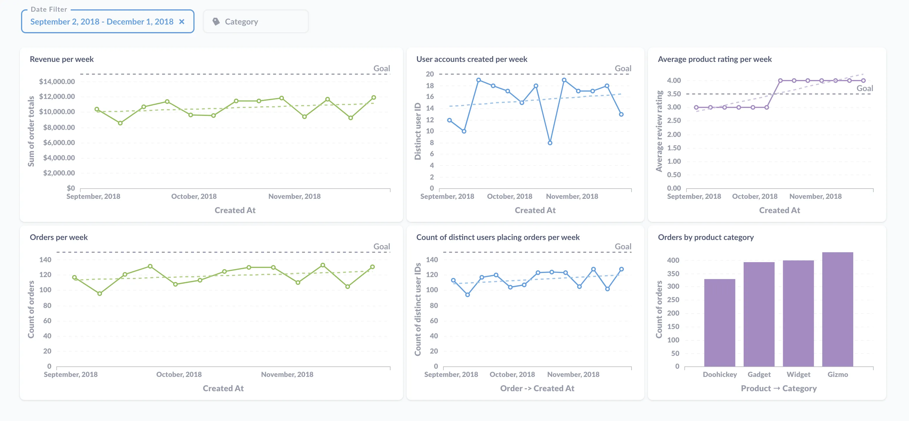

In Metabase, _dashboards_ are pages where you can organize charts and text cards in a grid. For the basics, check out our docs on [creating dashboards](/docs/latest/users-guide/07-dashboards). This article covers high-level concepts around what makes a great business intelligence dashboard, and includes some tactical advice around how to make the most of the tools Metabase provides.

## The purpose of BI dashboards

Business intelligence dashboards should help inform decisions. There are different kinds of dashboards---you'll often see them broken down into analytical, strategic, and operational dashboards---but the purpose of every dashboard should be to monitor your actions and their effects. Much like gauges on the dashboard of a car, they should give you feedback on the actions you take: if I step on the accelerator, how fast am I going now? The idea for a BI dashboard is to get feedback on whether you made the right call, or if there's an action you need to take, meaning the dashboard should capture a relationship between your team's actions and the effects of those actions. How is our pricing strategy performing? Did that campaign we launched bring new users? Of those new users, how many converted?

We'll get into the presentation of your dashboards - how the dashboard looks - but first you need to determine which questions your dashboard should answer.

## Which questions should your BI dashboard include?

### Define the decisions first, then gather the data to inform them

Tailor the questions you include to decisions your audience can _act_ on. For example, if you're building a BI dashboard for a team, talk to them about the decisions they need to make every day/week/month, and include questions that capture the actions they take, as well as the effects (or targets) of those actions. If the team has already defined the metrics or KPIs they're responsible for, then your job will be to help figure out the best way to represent those metrics on the dashboard.

### Does a similar dashboard already exist?

If you're asking these questions, chances are other people are too. Search your Metabase to check if questions and dashboards that address your needs already exist. If they do, and you see room for improvement, reach out to the maintainer to share your ideas so that you can create the best BI dashboard for your use case. If you find a similar dashboard that doesn't quite suit your needs, you can duplicate it and customize it to your use case (for details on how to duplicate a dashboard, see [how to create a dashboard](/docs/latest/dashboards/introduction#how-to-create-a-dashboard)).

### Tailor your dashboard to a cadence

Often the data you include in your dashboard will have a natural cadence (for instance, accounts may be settled daily, weekly, and so on). Another way to think about cadence is to determine how often people will consult the dashboard; that is, how often people will have to make or reevaluate the decisions the dashboard informs. Will people view this BI dashboard daily, or once a month during a planning meeting? Once you define that frequency, it helps people see relationships between the data if the questions you include are relevant, critical signals for the same time granularity. If you add a date filter to your dashboard, you can set a default time span for all the questions in the dashboard; but it's easier to compare charts if they're all showing data with the same time resolution, such as weekly or monthly.

### Prefer GUI questions to native queries

Where possible, compose questions using the [query builder](/glossary/query_builder) to get the benefits of the full drill-through menu to let people who don't know SQL use your questions as jumping off points for further exploration. The **Query Builder** lets you add [custom expressions](/docs/latest/questions/query-builder/expressions) and do [joins](/docs/latest/questions/query-builder/join), so you might find you don't need SQL like you thought you did. Alternatively, you could also write a query in SQL, save it as a question, then [use that saved question](/learn/sql-questions/organizing-sql) as the starting point for a GUI query, where you could filter, summarize, and group data---or even include [custom columns](/learn/metabase-basics/getting-started/custom-columns).

### Pay attention to context

Where will people view this dashboard? On a TV? At their desk? On a phone? Make sure you see the dashboard as it will be seen, and adjust accordingly. The major consideration here is whether the screen is fixed, as that fixed screen real estate limits the number of questions you can include. But outside a fixed-screen scenario, you can include as many questions as you want. You'll often see articles recommending to limit visualizations to some number. That's useful as general advice if you take it to mean you should be selective about what to include. The important part is to make sure those charts are legible, and it's better to have a dashboard that requires some scrolling than to omit relevant and critical signals.

### Tune your BI dashboard for speed

We wrote an article on how to [make dashboards faster](/learn/metabase-basics/administration/administration-and-operation/making-dashboards-faster), but it's worth reiterating here. The easiest way to make dashboards load faster is to ask for less data. Sometimes you really do need a lot of data, but if you're including historical data, how far back do you really have to go? And do you have to load it every time someone consults the dashboard, or can you leave it up to the viewer to broaden the date filter, or to dive down into a particular question? You can also [break up a dashboard into multiple dashboards](#create-and-link-multiple-dashboards) to reduce the number of items that need to load on a single one.

### Use precise titles and descriptions

You can significantly improve a dashboard just by touching up its documentation. For example, compare "Customer orders" to "Global L7 average daily count of customer orders." And fill out the descriptions to all questions on your dashboard. For larger dashboards, you can use text cards to title sections of your dashboards. Anticipate questions and add text cards that address those questions (e.g., explaining deviations in the data: outages, product releases, major sales or marketing campaigns, and so on). Consider including contact info and links to related questions, dashboards, and other relevant documents or websites.

## Adding filters and making interactive BI dashboards

### Add filters to your dashboard

[Adding filters on your dashboard](/docs/latest/users-guide/08-dashboard-filters) allows you to scope multiple charts to a particular time period, location, ID, or other category. People can click on an individual question to filter its results, but adding a filter at the dashboard level allows them to see relationships _between_ charts when they apply different values to the filter. And if you include a filter on your dashboard, try to make the filter applicable to most or all of the cards on the dashboard. That is, only include cards with fields that you can wire up to that filter.

If a selection in one filter should impact the options for another filter, then you should [link the filters](/learn/dashboards/linking-filters). That way, if the first filter is applied, the options for the second will be limited. For example, if you have both a state and city filter, filtering the dashboard for California should limit the city filter's options to cities in California.

If you want to get fancy, you can even set things up to make clicking on a chart filter the dashboard - see our article on [crossing-filtering](/learn/dashboards/cross-filtering).

You can also add filters to [dashboards with SQL questions](/learn/dashboards/filters), including using [field filters](/glossary/field_filter) to create smart dropdown menus.

### Create and link multiple dashboards

If your dashboard starts filling up with questions, consider breaking it up into multiple dashboards. You can customize click behavior on dashboard cards to [link to other dashboards, questions, or URLs](/learn/metabase-basics/querying-and-dashboards/dashboards/custom-destinations) (which incidentally is especially useful for SQL questions that don't benefit from the action menu). For example, if one of your cards is a trend, you could link that card to a dashboard that digs into the data around that metric. Breaking up dashboards into multiple dashboards can reduce loading times, as you can defer to the audience to determine if they want to know more (i.e., load more data). In addition to customizing click behavior, you can use text cards to incorporate links to related dashboards, questions, or other relevant sites.

## BI dashboard visualization best practices

Once you've gathered and documented your questions, it's time to arrange and fine-tune the BI dashboard for best use.

### Arrange items to communicate their relative importance

Which cards should go where and why? On the dashboard grid, importance degrades top to bottom, and either left to right or right to left, depending on your audience's primary language. I.e., you'll probably end up putting your most important cards at the top left. You can also emphasize importance with size. If you can, keep cards "above the fold"---that is, visible in a browser window on a laptop without making people scroll down, though not at the expense of shrinking cards to the point of illegibility.

Group cards that cover similar subject matter. You can use text cards as spacers, or as section titles or description and commentary.

### Look for opportunities to add more useful information

Metabase's visualizations take care of a lot of the best practices for information design and visual literacy---they do their best to make [Edward Tufte](https://en.wikipedia.org/wiki/Edward_Tufte) proud, communicating maximum info with minimal "ink." But even though Metabase charts come junk-free out of the box, you should review the visualization settings to see if you can add additional context. For example, there's a lot you can do with the a [bar chart](/learn/visualization/bar-charts). A simple goal line on a bar or line chart, or conditional formatting on a table, can provide meaningful answers to questions like: are these values good? Expected? On target?

For instance, instead of simply displaying a number, you could additionally show how it's gone up or down over time. Let's say you want to include the number of orders for the last week; instead of displaying that as a plain number, you could instead group it by a time dimension and set the visualization to a **trend line**. That way people will get to see the value in the context of the previous number---did the value improve or worsen?

You can also adjust the color of the trend arrow (green for good, red for bad), so numbers that you want to go down (like churn) and numbers that you'd like to go up (revenue) can both get green arrows.

### Pick the right visualizations for the job

In general the best advice is to avoid mistaking a good looking, colorful dashboard for one that's informative. A lot of BI articles (and we're guilty of this at times as well) will display dashboards that showcase multiple different visualizations types: bar charts, gauges, pie charts, scatter plots, and so on. We do this because 1) they look cool, and 2) our goal is to demonstrate what the product can do, which is different than the goal of getting feedback on your decisions. Often what you really need is just a mix of time series and tables.

The example KPI dashboard is nothing flashy, but it packs a lot of info. The dashboard groups and color-codes related cards (green for order data, blue for user data, purple for product data), gives viewers a sense for how our current weekly performance compares with the previous three months (so it doesn't need to load data for the entire year), includes trend lines and goals, and includes [cross-filtering](/learn/dashboards/cross-filtering), so viewers can click on a category in the bar chart to update the category filter.

Even with a humble table there are opportunities for polish: make sure the sorting and column order makes sense, button up the label headings, and apply conditional formatting to make it easier to read the data.

## What to do with your great new BI dashboard

Now that you have a handsome, informative BI dashboard, it's time to share it.

### Set up subscriptions to your dashboard

[Dashboard subscriptions](/docs/latest/dashboards/subscriptions) are the "push" in [the push and pull of analytics](/learn/analytics/push-and-pull). You can send the results of a dashboard via email or Slack.

### Pin the dashboard to a collection

When you're ready to signal to the rest of your team that you've got a really solid BI dashboard they should look at, add it to the relevant collection and pin it. To learn more, check out [keeping your analytics organized](/learn/metabase-basics/administration/administration-and-operation/same-page).

### Share your BI dashboard via a public link or embed

You can also share the dashboard via a public link, or in an iframe, which you can embed in your website or app. See our article on [Embedding charts and dashboards](/learn/embedding/embedding-charts-and-dashboards).
