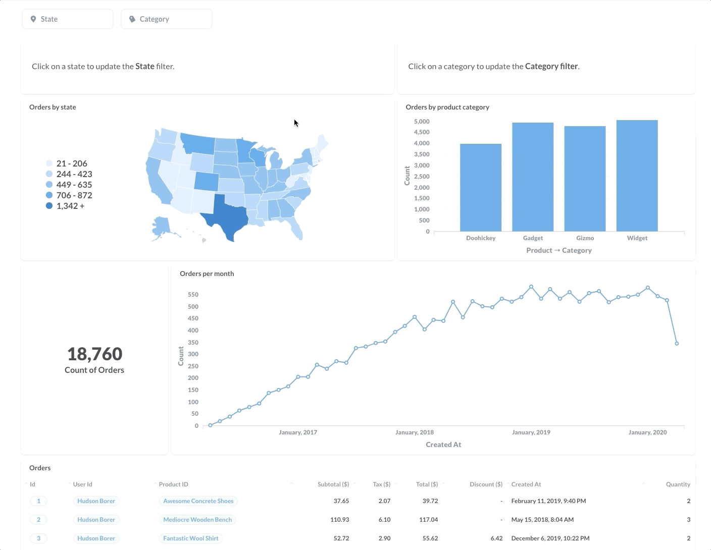
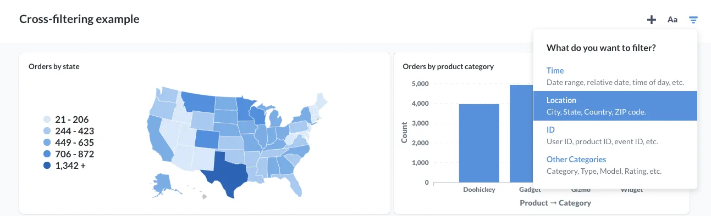
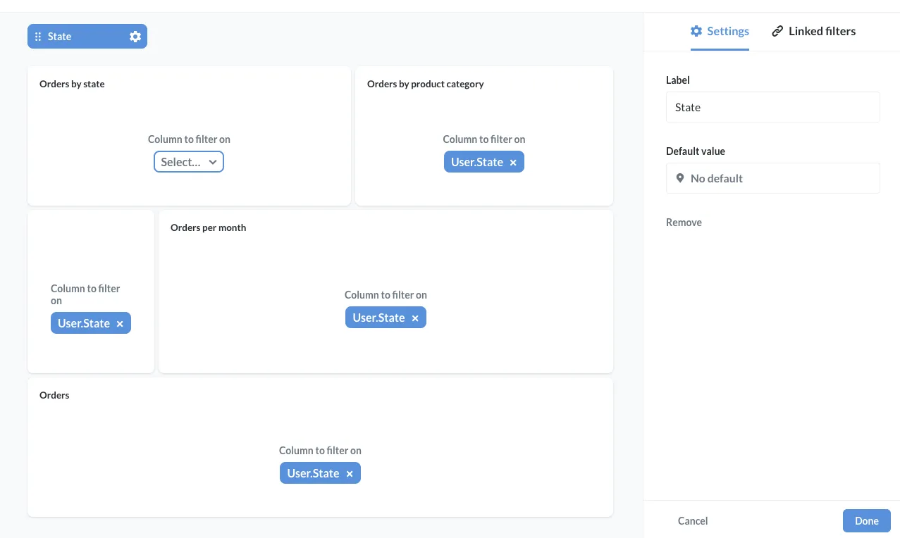
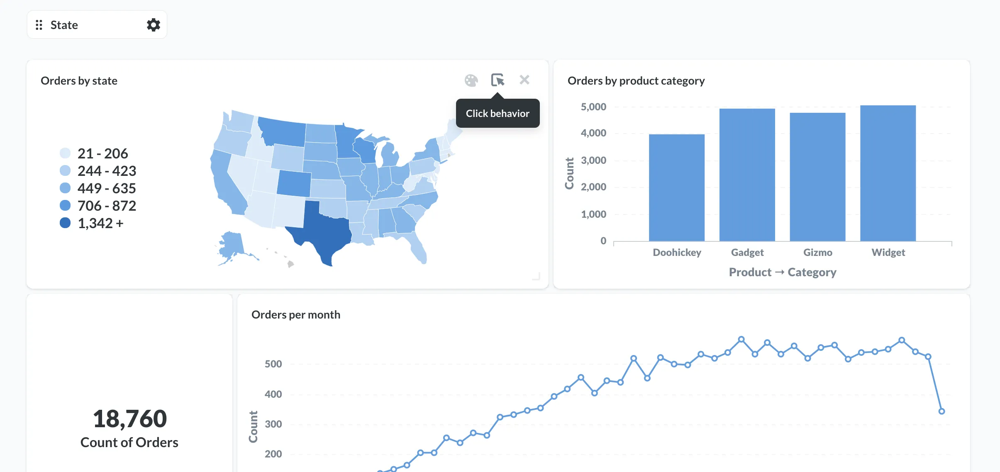
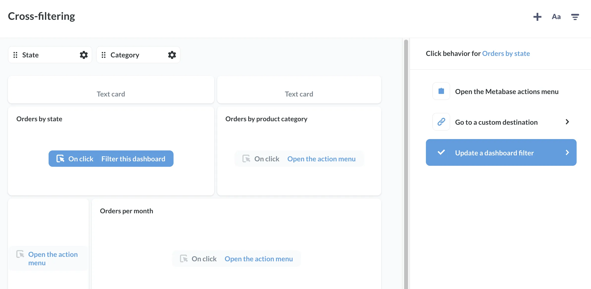
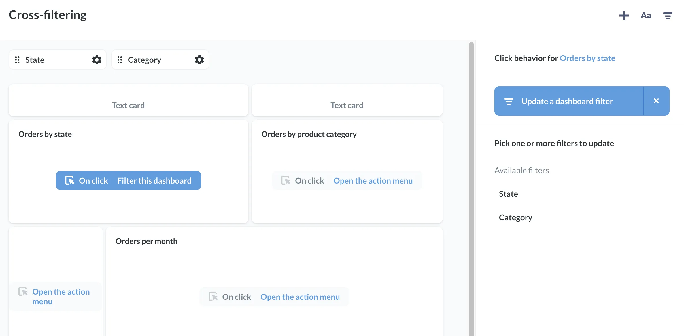
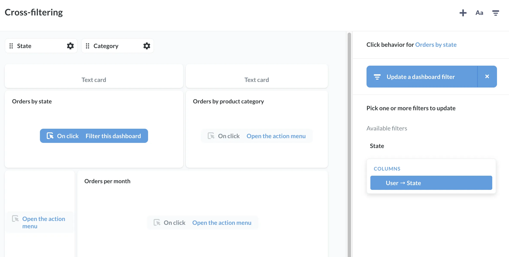
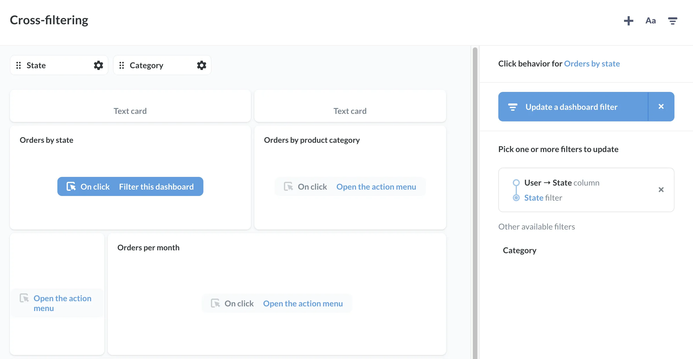
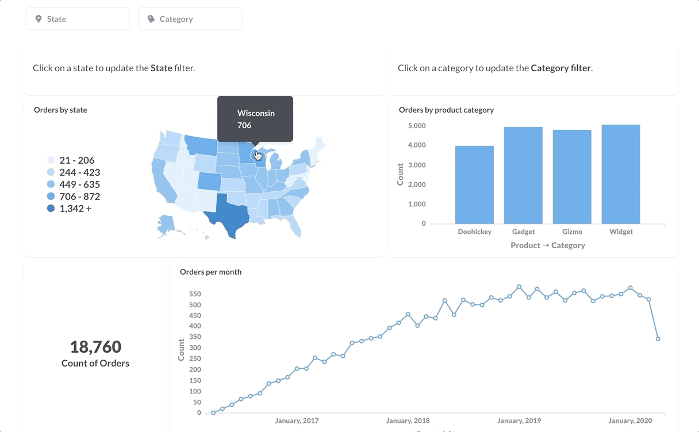
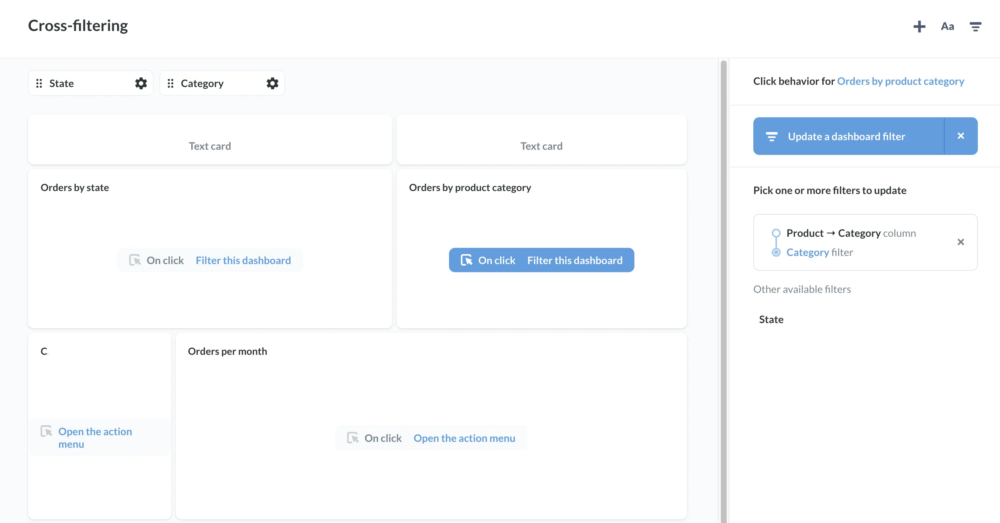

Metabase allows you to customize what happens when you click on a card in a dashboard. This article will walk through how to set up cards to update filter widgets on a dashboard---what we call **cross-filtering**.

Here's the dashboard we're going to wire up:

This cross-filtering dashboard shows information about orders in the [Sample Database](/glossary/sample_database) included with your Metabase installation.

Here's our goal: we want to set up this dashboard so that when people click on a state in the map, the dashboard's State filter updates and filters every other card _except_ the `Orders by State` card.

We also want to wire up the dashboard so that when people click on a category in the bar chart, the category filter updates, and all the cards _except_ the `Orders by Product Category` card update to filter orders by that category.

Here's the finished dashboard in action:

## Setting up the filters

We've already added questions related to orders to our dashboard, so we'll start by adding two filters: a State filter and a Category filter. The setup process for both filters is similar, so we'll focus on adding the State filter and you'll get the idea.

From the dashboard, we'll click on the **pencil icon** to enter dashboard editing mode. To add a state filter, we'll select the **filter icon** from the menu on the top right. For filter type, we'll select `Location`, and for kind, we'll select `State`. To learn more about setting up filters, see [Dashboard filters](/docs/latest/users-guide/08-dashboard-filters).

Next, we'll want to wire up every card to our state filter _except_ the card we want to use to update that filter: the `Orders by state` card. This way, we can click on different states, and the other cards will update to show orders from users in the clicked state.

To set up this cross-filtering, let's set every other card's `Column to filter on` to `User.State`.

Next, we'll want to set up the map of the United States to update the state filter on click. To do that, we'll need to change the click behavior for our `Orders by State` question. Hover over the `Orders by State` card and click on the **click behavior icon**:

Metabase will slide out a **click behavior sidebar** where we can define what happens when people click on the `Orders by State` card. Since we want the card to update the `State` filter, we'll select the `Update a dashboard filter` option.

Metabase will list the dashboard's available filters that we can update:

Since we want to update the `State` filter, we'll select the `State` filter, and pass the value of `User→State` to the filter.

With that, Metabase will give us a summary of the click behavior we just defined. In this case, we've set up the `Orders by State` card to update the `State` filter by passing the value `User-State` to the filter.

Let's save our changes, and try out the new click behavior:

If we click on Wisconsin, the dashboard will filter the other cards for orders by users from Wisconsin. If we click on Wisconsin again, the filter resets, and the other cards on the dashboard update to show all orders from all states.

So far so good. Now let's move on to set up the `Orders by Product Category` to update the dashboard's `Category` filter.

The process is more or less the same as above, so we won't walk through it step by step. All we need to do is:

- Add a `Category` filter to filter the dashboard by `Product→Category`.
- Wire up every card _except_ `Orders by Product Category` to the dashboard's category filter.
- Set the click behavior on `Orders by Product Category` to update the category filter by passing values from the `Product→Category` column.

The sidebar will show a summary of our configured click behavior:

Let's save our changes, and we're done. We have a dashboard that people can cross-filter by state or category simply by clicking on a chart:

In our example, we added [text cards](/glossary/text_card) to let people know they can click on a chart to filter the dashboard, but you might want to just let people discover this cross-filtering functionality on their own. And if they miss it, they can always update the filter widgets by manually plugging in the values.

Happy cross-filtering!

## Further Reading

For more about customizing click behavior, check out our docs on [custom destinations](/docs/latest/dashboards/interactive#custom-destinations), which covers how to set up dashboard cards to link to other dashboards, saved questions, and even external URLs, allowing you to create rich clickpaths through your data.

Here are some additional links that cover working with filters in Metabase:

- [Field Filters: create smart filter widgets for SQL questions](/learn/sql-questions/field-filters)
- [Adding filters to dashboards with SQL questions](/learn/dashboards/filters)
- [Create filter widgets for charts using SQL variables](/learn/sql-questions/sql-variables)
