Metabase provides some simple building blocks that let you customize what happens when someone clicks on a chart on your dashboard. You can combine these primitives to create paths through your reports, with dashboards updating subsequent dashboards, and even sending people to external sites.

For this article, we'll focus on one of the options for customizing click behavior: **Go to custom destination**. We'll walk through a scenario using Metabase's [Sample Database](/glossary/sample_database) to show you how custom destinations work, and show you some neat tricks to create interactive experiences.

We'll create two quick dashboards — an **Orders Overview** dashboard and a **Product Detail** dashboard. Here's the user experience we want to create: when someone views our Orders Overview dashboard, they should be able to click on a product and have Metabase take them to a Product Detail dashboard that updates based on which product the user clicked. Once people reach the Product Detail dashboard, Metabase should be able to send people to different external URLs based on which product category they click.

After that, we'll also walk through [another example using SQL questions](#custom-destinations-with-sql-questions) to show how custom destinations are a great way to add an interactive element to SQL questions on a dashboard.

If you already have your own dashboards to work with, you can [jump ahead](#customizing-click-behavior-orders-overview-dashboard) to where we get into customizing destinations.

## Creating Orders Overview and Product Details dashboards

Let's start by building our **Orders Overview** dashboard and adding two questions to it. We'll breeze through this part quickly — if you're looking for more detailed information, check out our documentation on [asking questions](/docs/latest/questions/introduction) and [creating dashboards](/docs/latest/dashboards/introduction):

Go ahead and create a new dashboard, name it Orders Overview, and save it in a location that makes sense.

We'll ask two questions about our orders:

1. **What does a table of our orders look like?**: Start by browsing the `Orders` table, and click save.
2. **How do orders break down by state?**: Pick the `Orders` table to start, and summarize by the `State` field under **User** in the sidebar. Since we're summarizing by state, Metabase generates a [region map](/docs/latest/questions/visualizations/map#region-maps) for us. Be sure to save this question too.

Next we can add those saved questions to our new dashboard. While looking at the blank dashboard, click the **pencil icon** to enter edit mode, and add saved questions by selecting the **+**. Once you've added those questions and saved your dashboard, the result should look something like:

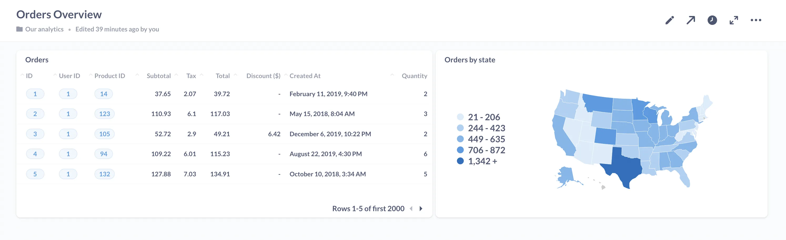

Next, we need to make our **Product Detail** dashboard, which we'll end up linking to Orders Overview. Product Detail will be a closer look at an individual item in our inventory, so we'll also wire up [dashboard filter](/docs/latest/users-guide/08-dashboard-filters) that lets us input an ID value depending on which product we want to examine.

Create this dashboard, name it Product Detail, and save it.

And let's ask two new questions that we'll add to this dashboard:

1. **What's the product name?**: Start from the `Products` table, click **Visualization**, and select **Number**, choosing `Title` in the **Field to show** dropdown. Save this question.
2. **How many orders include this product?**: Begin with the `Orders` table, and summarize by count of `Product ID` under the `Orders` list. Visualize this by **Number** too, selecting `Count` in the **Field to show** dropdown, and save the question.

Return to the Product Detail dashboard. In edit mode, add our new saved questions, and don't forget we need a dashboard filter too. To add one, click the **Add a filter** icon in the top right, and select **ID**. Select the appropriate column to filter on for each card — our product name card will filter on `Product.ID`, while our count of orders should filter on `Order.Product ID`. We set the visualizations for these questions as **Number** so that they'll operate like a variable text card, changing its text based on the value in the filter.

Here's what the dashboard filter setup will look like:

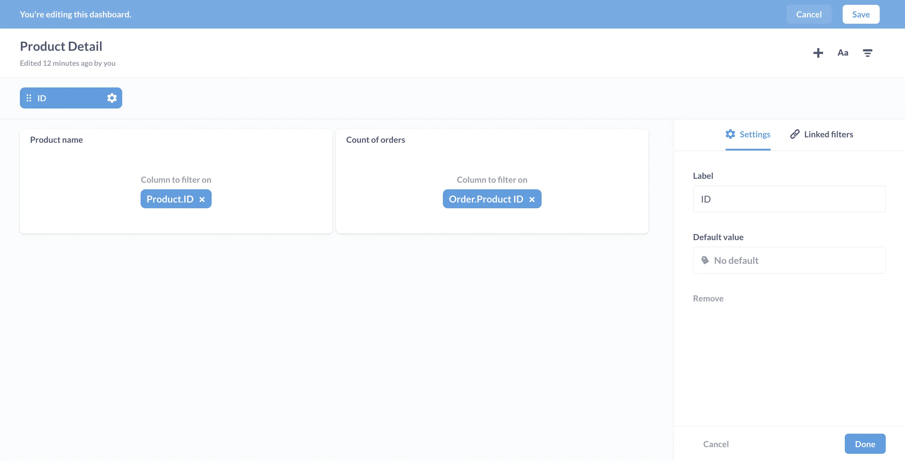

Click **Done** and save your dashboard.

Now we'll show how we can link to an external website. Just as an example, we'll use the [search results page](/search?query=interactive+dashboards) for Metabase docs, and search for the product the user clicked.

Here's the full click path:

**Orders Overview** dashboard → **Product Detail** dashboard → External site

This GIF shows the click path in action:

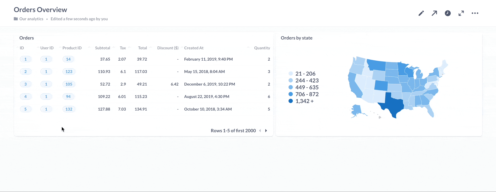

## Customizing click behavior: Orders Overview dashboard

Let's go back to the **Orders Overview** dashboard. We can add custom click behaviors to each question [card](/glossary/card) on this dashboard, but let's focus on just adding a custom destination to one card. Let's say we want to set up the `Orders` card (the card containing a table of orders), so that when someone clicks on the `Product ID` [column](/glossary/column), Metabase will send them to the Product Detail page, and plug in the filter on the Product Detail dashboard with the `Product ID` of the product the user clicked.

Starting from the Orders Overview page, we'll click on the **pencil icon** to enter dashboard editing mode. Next, we'll hover over the card that we want to customize. A menu will appear to the top right. Click on the **click behavior icon** menu (it's the icon with the mouse pointer on a card).

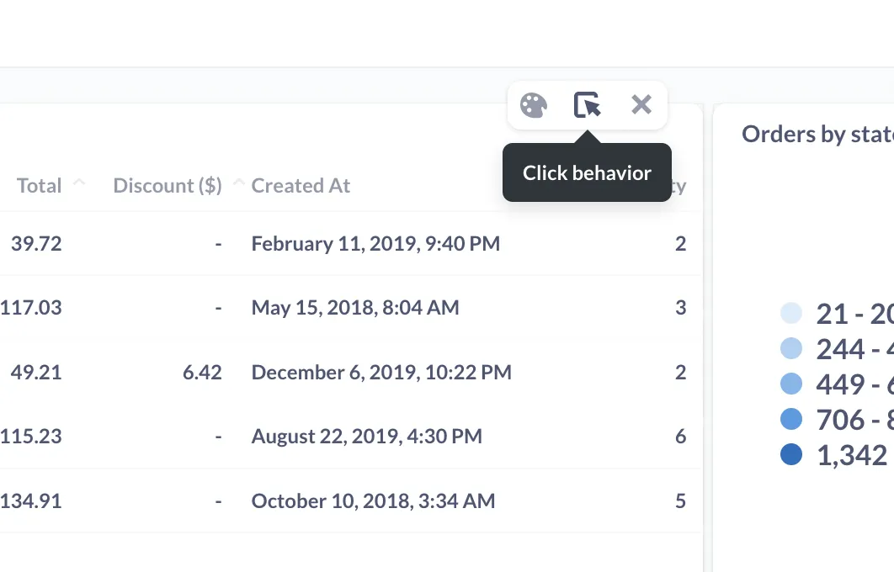

Metabase will slide out a sidebar for you to set up what happens when someone clicks on this table.

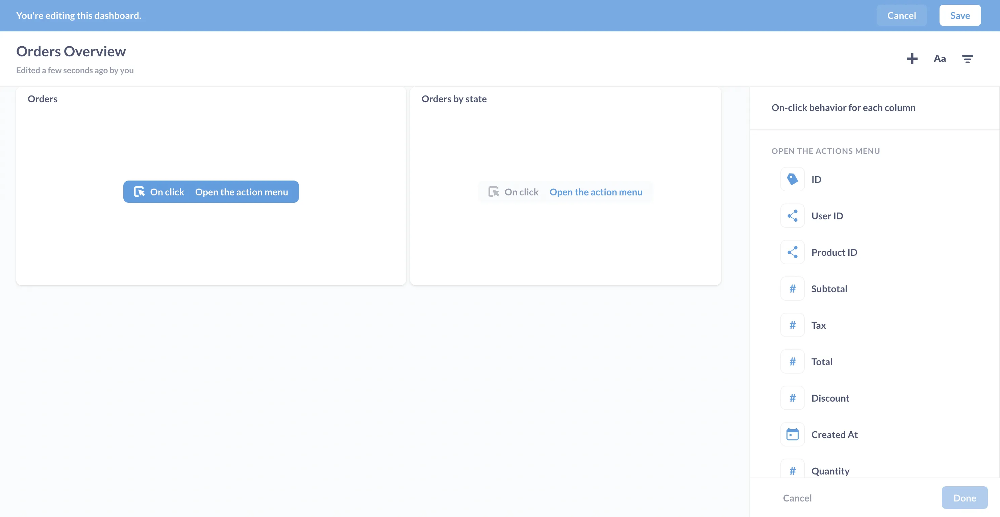

Let's get a lay of the land:

- Card grid: since we selected **Click behavior** for the Orders card, Metabase highlights its **On click** label in blue. We can select the on-click behavior on another card by clicking that card's label.
- Top right: the main editing menu, with options to add a question, text box, or filter.
- Right sidebar: options for customizing the on-click behavior for the current card.

Since we used the query builder to compose the Orders question, Metabase set the default click behavior to **Open the drill-through menu**, which allows people to [drill through the data](/learn/metabase-basics/querying-and-dashboards/questions/drill-through).

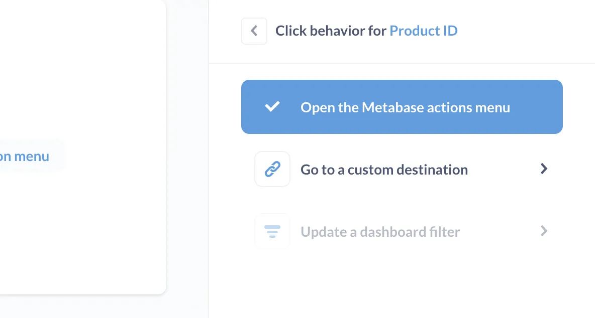

Let's change the click behavior to send people to our **Product Detail** dashboard.

Tables and custom destinations make a particularly great combo, because we can set different custom destinations for each column in a table. In this example, we'll just set up the click behavior for a single column. We're going to set a custom destination on the Orders question card so that when people click on a value in the `Product ID` column, Metabase will 1) send them to the Product Detail dashboard and 2) filter that dashboard by the clicked `Product ID`.

Our options are:

- Open the action menu (default for questions composed with the query-builder).
- Go to a custom destination.
- Update a dashboard filter.

We'll select **Go to a custom destination**.

Metabase will present three options for custom destinations:

- **Dashboard**
- **Saved question**
- **URL**

To send people to the **Product Detail** dashboard, we'll select the **Dashboard** option, and select our **Product Detail** dashboard.

Here's a checkpoint:

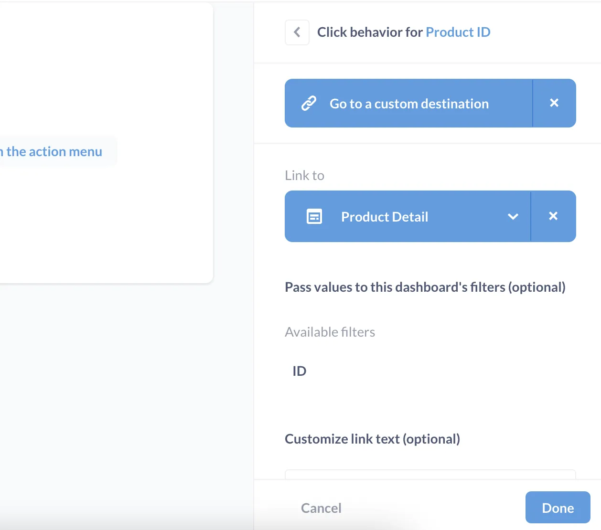

## Passing values to the destination

So far we have the `Product ID` column set to **Go to custom destination**, which we've set up to link to the **Product Detail** dashboard, but we're not quite done setting up this link. Next, we want to **Pass values to this dashboard's filters**. You'll notice a list of available filters at the dashboard. In this case, our **Product Detail** dashboard only one filter that we can pass values to: **ID**.

Click **ID**, and you'll notice that you can pass values from any of the columns in the table, not just the `Product ID` column. But in our case, we'll pass the value from the `Product ID` column.

Metabase will provide a summary:

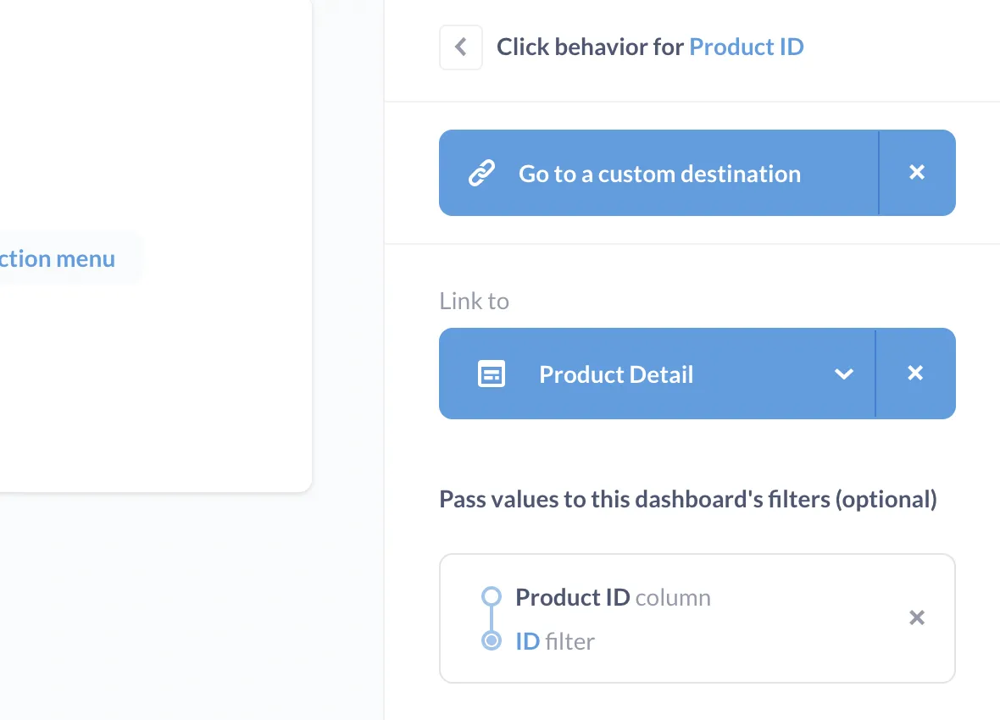

Here, Metabase is confirming that we've set up the click behavior for the `Product ID` column to:

- Go to a custom destination.
- Link to the **Product Detail** dashboard.
- Pass the value from the `Product ID` column to the `ID` filter on the **Product Detail** dashboard.

Let's try it out: From **Orders Overview**, we'll click on the `Product ID` column, and Metabase takes us to the **Product Detail** dashboard, with the value `14` plugged into the `ID` filter.

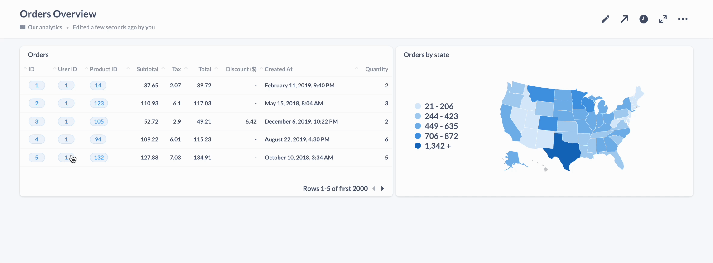

## Custom destination: URL

Next, we'll set up the **Product Detail** dashboard so that when people click on the **Product name** card, Metabase will send them to an external site, and parameterize the URL with the value from the card. We can send them to any external site, but for this example we'll send them to the search page for Metabase docs, just so you can see the parameterization in action (and because reading our documentation will make you a better person).

Here's that dashboard again:

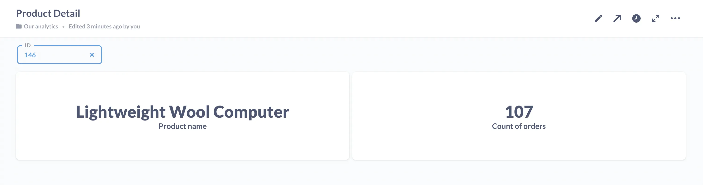

As before, we'll go to dashboard edit mode, hover over the **Product name** card, and select **Click behavior**.

We'll see the same menu we did earlier:

- Open the action menu.
- Go to a custom destination.
- Update a dashboard filter.

We'll select **Go to a custom destination** and **URL**. Next we'll enter our URL, and include [parameters](/glossary/parameter) by wrapping them in double braces, like so: {{parameter}}. In this case, we'll use `Title` as a parameter in the URL:

```url
https://www.metabase.com/search?query={{Title}}
```

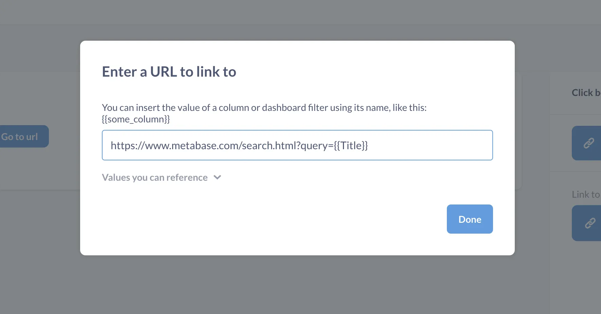

You can view the **Values you can reference** dropdown to see the full list of values you can use as parameters in your URL. You can use any (or all) of the values in the URL, including repeated use of the same value.

## Add navigation with text boxes

In addition to [adding context for your dashboards](/learn/metabase-basics/querying-and-dashboards/dashboards/markdown), you can use text cards to add helpful navigation links to your dashboards, like adding a text card that takes you back to our **Orders Overview** dashboard where we started. You can create a text card, center the text, and use Markdown to create a link to the **Orders Overview** dashboard, just a convenience for your readers to make it easy to browse through your click path. Here's what the dashboard would look like with that link:

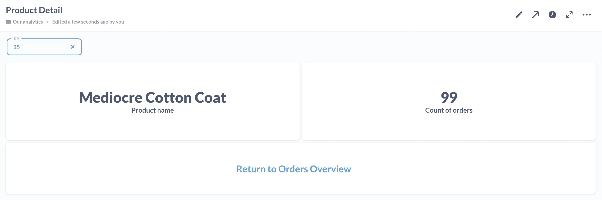

## Custom destinations with SQL questions

The example dashboards we used above only included questions asked with Metabase's [query builder](/glossary/query_builder), but you may also have [native queries](/glossary/native_query) that you'd like to make interactive on your dashboard.

Let's start by asking and adding a SQL question to our **Product Detail** dashboard, this time about product categories. After navigating to the native query builder, we'll input the following SQL question:

```sql
select CATEGORY
from PRODUCTS
where
    {{TITLE}} and
    {{ID}}
```

Metabase slides out a sidebar, where you'll see two variables: `TITLE` and `ID`. We want this question to show us the product category whenever we enter a value into the ID or Title fields. From the dropdown, set the **Variable type** for both to **Field filter**. Go ahead and map the `TITLE` variable to the `Product.Title` field, and map `ID` to `Product.ID`.

You can confirm that the question runs by adding an example ID to the field filter; here we're testing it with Product ID number 34, and running the query. Because our visualization is **Number**, we see the category (Gadget) for this product rendered as text below the question:

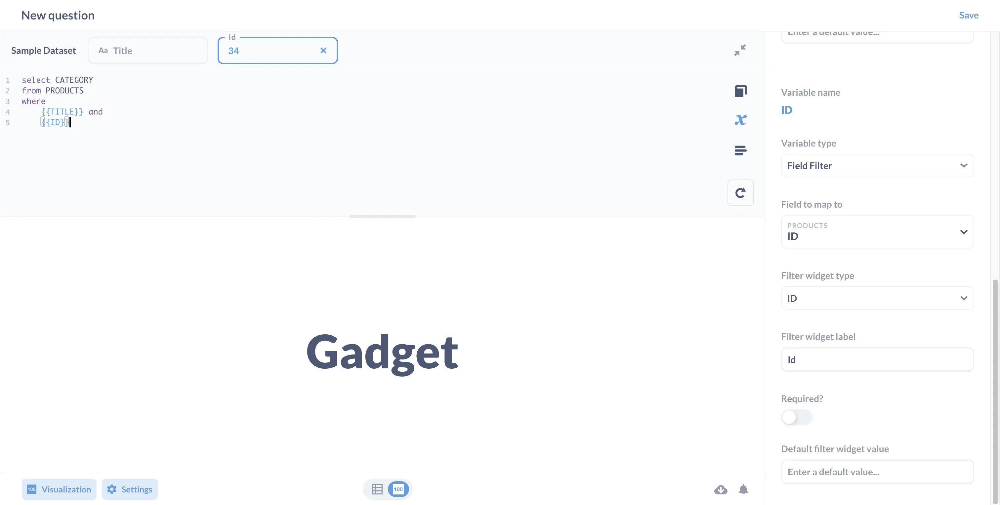

Now save the question and add it to our **Product Detail** dashboard. While in edit mode, make sure to link our existing dashboard filter to our new card, which should filter on the `ID` column of our new **Product category** card.

Next, select the **click behavior icon** on our new card, where you'll see a slightly different menu than we did earlier:

- Do nothing
- Go to a custom question
- Update a dashboard filter

The reason there is a "Do nothing" option is because we wrote the `Product category` question in SQL, and SQL questions don't include the **Action Menu**.

And here's where we show you a neat trick. If we return to the `Product category` question, we can use `concat` to create strings that update based on the filter's value.

```sql
select concat('Category is ', CATEGORY)
from PRODUCTS
where
    {{TITLE}} and
    {{ID}}
```

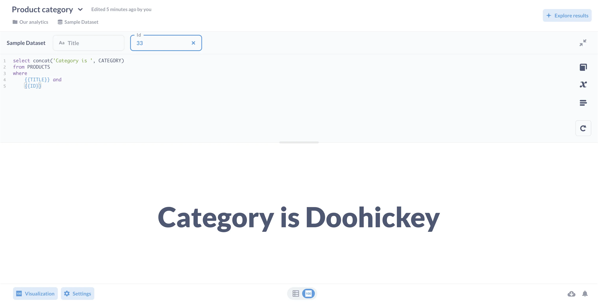

To finish off we could set the custom destination to be a specific parameterized URL like we did earlier, or link this card to another dashboard that contains stats about orders by their product categories.

## Recap

We've shown you how to set up simple click paths, and how to set up custom destinations for both native queries and those built with Metabase's query builder. But these examples only showed one click path. You can customize behavior for each question card on your dashboard! For example, you could create a State detail dashboard and customize click behavior on the map of the United States so that Metabase sends people to the State detail dashboard, filtered by the clicked state.

Questions built using Metabase's query builder will default to the action menu, which lets users [drill through the data](/learn/metabase-basics/querying-and-dashboards/questions/drill-through), but for SQL questions, we recommend customizing a destination (where it makes sense). Check our documentation for more on [interactive dashboards](/docs/latest/users-guide/interactive-dashboards).

You can also [pass user attributes into URLs or destination filters](/learn/metabase-basics/querying-and-dashboards/dashboards/markdown), allowing you to tailor experiences for specific users.

So get creative with setting up click paths through your data, and share any tricks you come up with on [our forum](https://discourse.metabase.com/t/programmatically-create-questions/12109).
