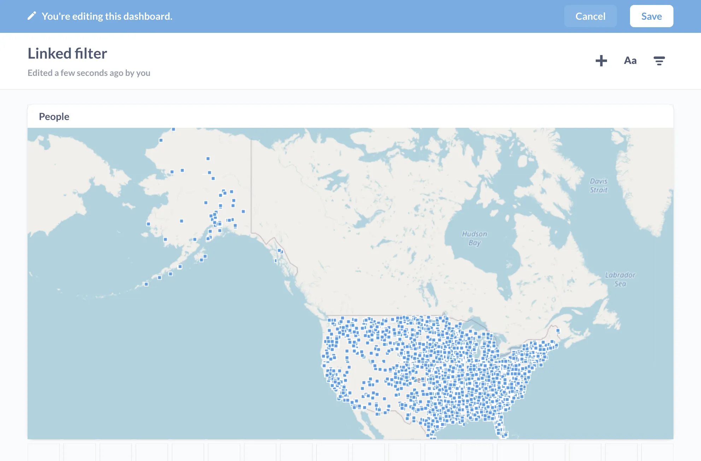
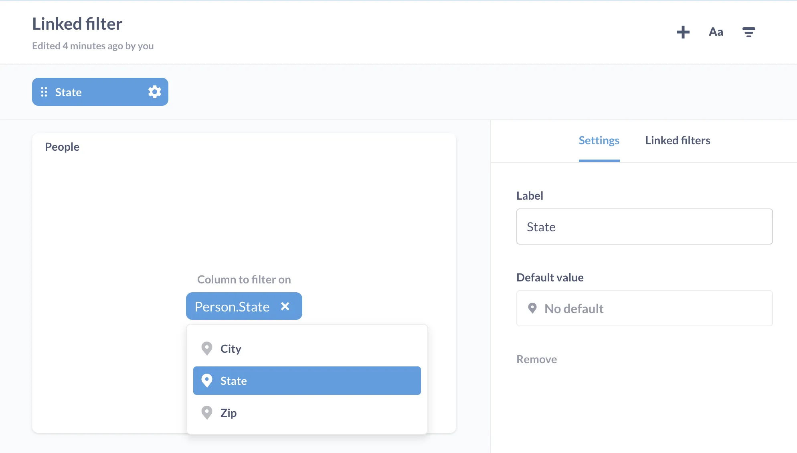
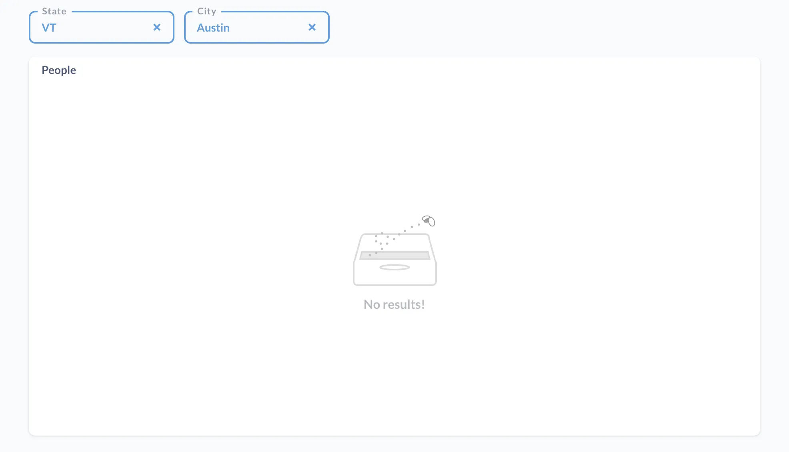
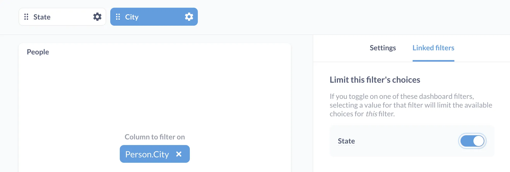
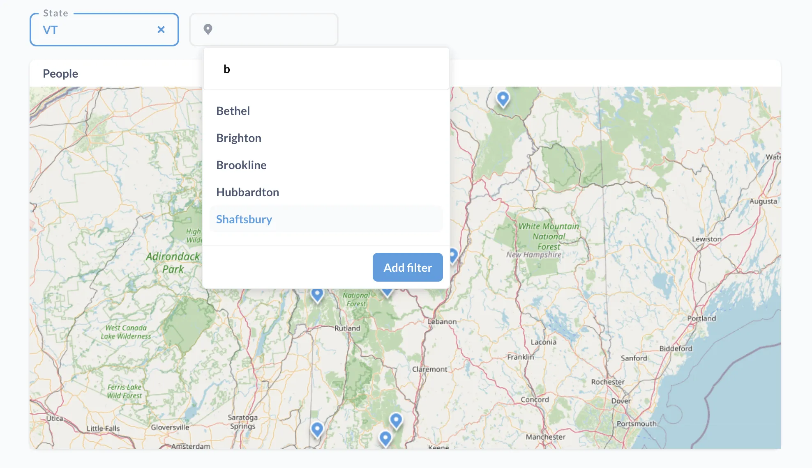
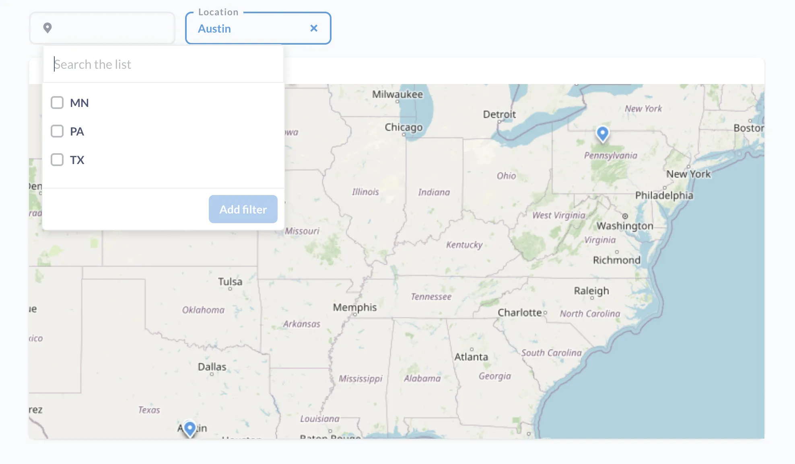

We'll start by setting up a simple dashboard with a single question. The goal here will be to set up a dashboard with two linked filters (sometimes called chained filters, or cascading filters.) Each filter limits its choices based on value(s) from the other filter.

In this case, linking State and City filters will:

- Display city values for the selected state, or
- Display the correct state(s) for the selected city (since the states can have cities with the same name).

## Prerequisites for linking dashboard filters

Before you attempt to link dashboard filters, there are some [limitations to be aware of](/docs/latest/dashboards/linked-filters#limitations-of-linked-filters).

## Setting up a dashboard with a single question

Let's begin our example using the [Sample Database](/glossary/sample_database) included with Metabase. For more detailed tutorials on asking questions and creating dashboards, check out the [Getting Started](/learn/metabase-basics/getting-started) track. We'll need a new dashboard before we go any further. If you aren't sure how to make one, our [documentation](/docs/latest/users-guide/07-dashboards) covers that.

Next, we'll ask a question. Click on **+ New** > **Question** > **Raw data** > **Sample database** > **People** and click **Visualize**. You should see a table that lists all of the customers in the people table. Next, click on the **Visualization** (bottom left) select the **Map** visualization. For the kind of map, select a [pin map](/docs/latest/questions/visualizations/map). If you get stuck, our [documentation](/docs/latest/questions/introduction) covers how to ask questions like these. Be sure to save your question and add it to the dashboard you just created.

## Adding a State filter

We'll need a [dashboard filter](/docs/latest/users-guide/08-dashboard-filters) that lets us see orders from different states depending on which value we select.

1. Click on the **pencil icon** to edit your dashboard.
2. To add a filter, click on the **filter icon**.
3. We want to add a **Location** filter.
4. For **What kind of filter?**, select **Dropdown**.
5. Next, we want to wire up the filter to the question card. On the question card, select `Person.State`.
6. Click **Done** to add the filter, and **Save** the dashboard.

Try out the filter to see if it works before moving on to add the next filter. Select a state from the filter: does the map change to filter for orders from that state? What about when you select multiple states?

## Adding a City filter

To link filters, we're going to need another filter, in this case a filter for cities. Following the same [steps outlined above](#adding-a-state-filter), we'll add another location dropdown filter, except this time we'll connect the filter to our card's `Person.City` field.

## Example of how unlinked filters can disappoint you

And here's where we'll run into an issue. Right now, the filters are independent of each other. So the State filter will let us pick a state, say Vermont, and the City filter will let us select any city - including cities outside of Vermont. Basically, this dashboard will let us set up nonsensical filter combinations, like filtering for the city of Austin in the state of Vermont, which is not how our universe is currently set up (politically). As expected, this combo of filters yields no results:

## Link filters to narrow choices

We can enforce logical filter combinations by linking the filters. For example, if someone selects Vermont in the State filter, the City filter should "know" to limit the options for cities to only those within the state of Vermont.

To link the two filters, we'll click on the **pencil icon** to return to dashboard edit mode. Since we want the City filter to react to a change in the State filter, we'll want to change the settings on the City filter. We'll click the **gears icon** on the `City` filter to bring up the settings sidebar for the `City` filter.

Here's the important part: in the sidebar, we'll click on the **Linked filters tab**, which presents us with options to limit this filter's choices, i.e., the City filter's choices. Metabase will list the available filters that we can link the City filter to. In this case, there's only one filter, the State filter, so we'll toggle that filter on to link the filter.

Let's save our changes, and try it out.

With the City filter linked to the State filter, when we plug in VT for the state filter, we'll see that the City filter now knows to only show cities in Vermont.

We can also link the State filter to the City filter to limit the choices available to the State filter based on the city filter's value. That way, if we plug in Austin in the city filter, the State filter will only show you states that contain cities named Austin.

## Further reading

- [Field Filters: create smart filter widgets for SQL questions](/learn/sql-questions/field-filters)
- [Adding filters to dashboards with SQL questions](/learn/dashboards/filters)
- [Create filter widgets for charts using SQL variables](/learn/sql-questions/sql-variables)
- [Dashboard Filters](/docs/latest/users-guide/08-dashboard-filters)
