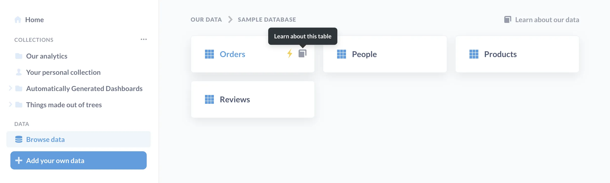
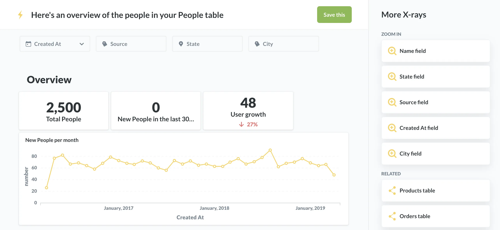
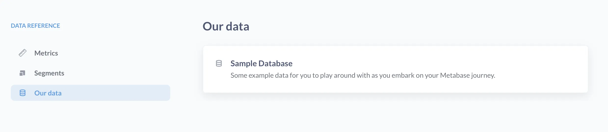
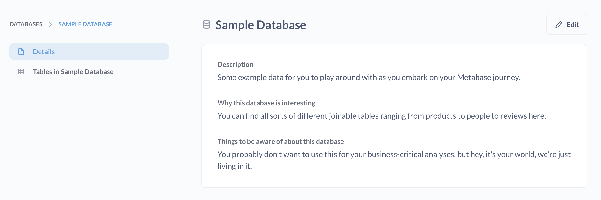
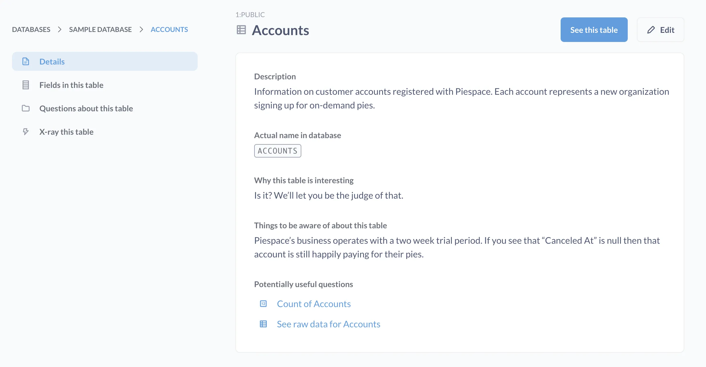
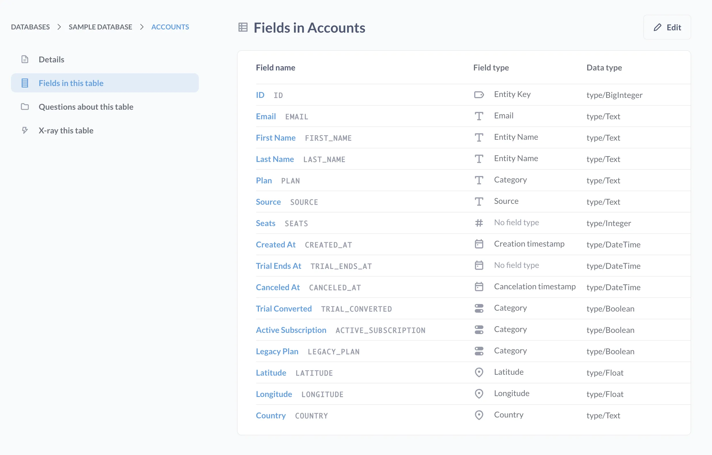

You can use the **Data Browser** to explore tables and fields in database's connected to your Metabase. Admins can also curate data, either by directly editing the data reference section, or in the admin settings.

## Browse Data

To explore all databases connected to your Metabase, click on **Browse Data** from the left navigation sidebar.

When you hover over tables, icons appear:

- The yellow **lightning icon** will create an [X-ray](/glossary/x_ray).
- The gray **book icon** will take you to the you to the table's [Data Reference page](#data-reference-pages).

To view the rows in the table, click on the table's name.

## Lightning bolts create X-rays

Metabase can [X-ray](/docs/latest/exploration-and-organization/x-rays) a table, which automagically generates a set of questions that you can save as a dashboard. Here's an X-ray that Metabase created for the `People` table.

## Data Reference pages

To visit the data reference section, click on **Browse data** in the left nav bar, select a database, then click on the **Learn more about our data**, or hover over a table and click on the **Book icon**.

Reference pages include table names and descriptions, as well as information about [segments](/glossary/segment) and [metrics](/glossary/metric). Segments are filters that you can easily reference in the query builder. Metrics are an easy way to refer to a computed number (for example, revenue).

Let's dive into a database. Once we click into our Sample Database, two tabs appear on the left side of the screen.

The **Details tab** contains metadata about this database. The tab features three sections that you can use to provide information about this dataset to your users:

- General description
- Why this database is interesting
- Things to be aware of about this database

Admins have the option to click on the **Edit** button in the upper right hand corner to update this information ([which they should](/learn/grow-your-data-skills/learn-sql/working-with-sql/sql-best-practices)).

The **Tables** tab displays the table names and descriptions. You can click on a table to view a **Details** tab, as well as view the **Fields in this table** tab. You can view a list of **Questions about this table** (provided you have [permission](/docs/latest/permissions/introduction) to view those questions), and have the option to create an X-ray of the table.

The Details tab suggests useful questions to ask the table at the bottom of the page.

Admins can edit field names and types in the **Fields in this table** tab.

## Access Metabase Admin

To access Metabase Admin, go to the navigation sidebar, click on the **gears** icon at the bottom, and select **Admin settings**.

In the Admin panel you can add, update, and remove databases, as well as edit [metadata](/docs/latest/data-modeling/metadata-editing) about your data.

## The Databases page

The **Databases** page in the **Admin Panel** displays connection information about your databases:

- The database type
- How Metabase is connected to your Metabase instance
- Sync settings

Metabase does a lightweight sync every hour to keep your in-app data current, but you can use this page to manually [sync your database](/docs/latest/databases/sync-scan#choose-when-metabase-syncs-and-scans), manage sync frequency, and with some databases, determine which schemas to sync.

## Editing metadata in Table Metadata

Picking clear names and adding descriptions will help people find the data they're looking for, and provide important context for analysis. Metabase can automatically try to create human-readable names of your tables and columns for you, but if Metabase misses the mark, you can always disable the [Friendly Table and Field Names](/docs/latest/configuring-metabase/settings#friendly-table-and-field-names) feature.

Admins can make changes to your metadata in Metabase, by clicking on the **gear** icon in the upper right and going to **Admin settings** > **Table metadata**. The Table metadata tab displays options to [edit metadata](/docs/latest/data-modeling/metadata-editing) for the database, tables, and columns. For example, you can edit a column's name, visibility, type, and description. You can also [remap foreign keys](/docs/latest/data-modeling/metadata-editing#remapping-column-values) to give human readable names to foreign key columns!

Some tips for making life easier for people:

- When column names are confusing, you can [change their names](/docs/latest/data-modeling/metadata-editing#column-name) or [add a description](/docs/latest/data-modeling/metadata-editing#column-description).
- You can [hide](/docs/latest/data-modeling/metadata-editing#column-visibility) unused columns to make tables easier to digest.
- You can pick your preferred [filter interface](/docs/latest/data-modeling/metadata-editing#changing-the-filter-widget) from three options (search box, list of values, or plain input box).

Perhaps the _most important_ piece of metadata you can change is the [field type](/docs/latest/data-modeling/field-types). There is a long list of [field types](/docs/latest/data-modeling/field-types) to choose from. Selecting the correct type for a column can connect information across multiple tables, and give context to Metabase so it can choose visualizations appropriate for your data. For example, once you've accurately identified latitude and longitude columns in your table, you will be able to use [map visualizations](/learn/visualization/maps).

## Further reading

- [Models](/learn/metabase-basics/getting-started/models)
