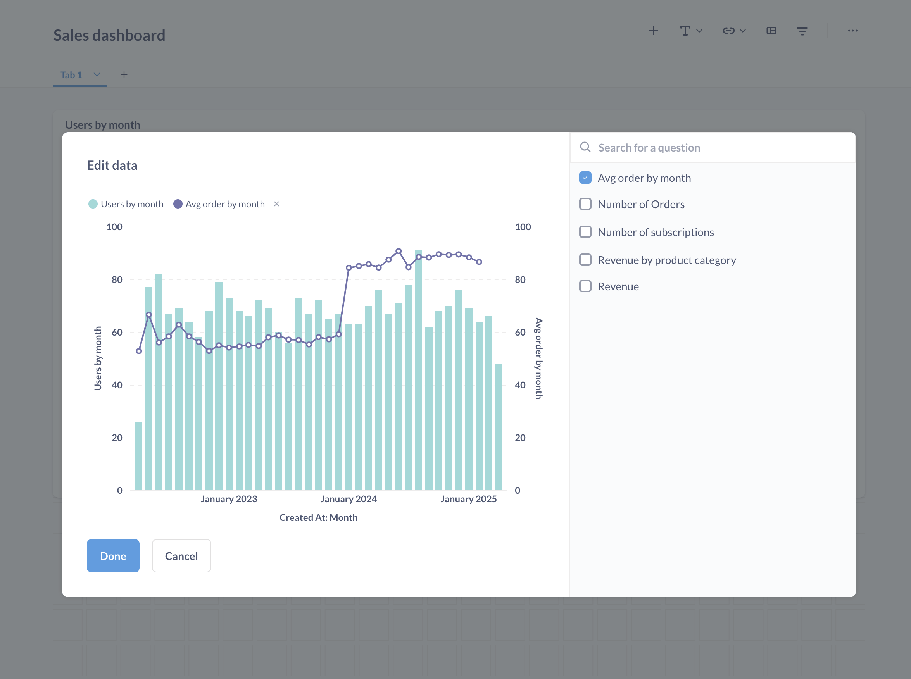

Let's talk about why we at Metabase don't allow people to join data from multiple databases (and give you a few ideas and workarounds if you absolutely have to do this).

## Why doesn't Metabase do cross-database joins?

Metabase isn't a storage engine or a query engine. Metabase connects to your database, sends queries to the database; then the database itself executes the queries, and Metabase pulls the results and visualizes them. Your data stays in your database, and all the processing happens inside your database.

Most databases are optimized to process queries on their own data efficiently, but they have no native way to communicate with other databases. To join data from two different databases, Metabase would need to pull data from multiple databases into its own memory or write it on disk, run the queries on that data. This _could_ work for small tables, but it wouldn't scale well (not to mention the downside that Metabase would need to store your data _outside_ of your database).

Imagine hundreds of people running queries that require joins from several databases, each with a ton of rows, putting all that data into memory of your Metabase, and running unoptimized queries against that joined data. That would get very slow (and very expensive).

Some other BI tools work around this problem by creating an intermediate layer between your database and BI to store data, which often means requiring large, complicated - and _pricey_ - deployments.

To keep Metabase light and simple, we haven't built that functionality directly into our product (yet! Never say never – check in on the [Metabase product roadmap](/roadmap) every now and then). But here are some ways you can set up your data to allow for queries involving multiple databases, while remaining performance-conscious and in control of your data.

## Best solution: use a data warehouse

([Or a data lake](/learn/grow-your-data-skills/data-landscape/data-mart-data-warehouse-data-lake). Or a data lakehouse. The world is your oyster.)

The gist is: you set up an [ETL](/learn/grow-your-data-skills/data-landscape/etl-landscape) (or ELT, or ELTL, you get the idea) process to regularly bring data from all the different databases and third-party systems that you're using, house that data it in a single place - a data warehouse - and use that data warehouse to support all your analytical needs.

The upsides are:

- All the data is already in one place, you don't need to send data over the network to and from another database.
- The architecture of modern data warehouses is optimized for analytical queries.
- You are in full control of your data.

Metabase can connect to all the most popular data warehouses like [Snowflake](/data-sources/snowflake), [Redshift](/data-sources/amazon-redshift), [BigQuery](/data-sources/bigquery), [Databricks](/data-sources/amazon-redshift) and others. Check out [Which data warehouse should I use?](/learn/grow-your-data-skills/data-landscape/which-data-warehouse).

To build a data warehouse, you'd need, at minimum, to set up the infrastructure, build a pipeline to copy the data, and model the data into shapes appropriate for analytics - a nontrivial upfront investment. But it creates a consistent, performant, and scalable environment to support your analytics, so it will pay off in the future.

If you can't invest in building a data warehouse just yet, there are some alternatives:

## Combine series on dashboard cards

If all you need to do is to combine two series on a single chart, and each series is built on a data from a single database, you can add both series to a dashboard card.

For example, say you want to show number of users by month, taken from your Users database, on the same charts and average payment amount by month from your Finance database together. All you need to do is add those series to a single dashboard card---no cross-database join needed.

See our docs for [combining saved questions](/docs/latest/dashboards/multiple-series#combining-two-saved-questions).



## PostgreSQL: use Foreign Data Wrappers

If you want to combine data from two Postgres databases (or a Postgres database and some other databases), and you don't want to build a data warehouse, you can use a [Foreign Data Wrapper (FDW)](https://wiki.postgresql.org/wiki/Foreign_data_wrappers). Foreign Data Wrappers allow your Postgres database to read data from remote data stores, including other databases.

To query one Postgres database from another you can use the [`postgres_fdw` extension](https://www.postgresql.org/docs/current/postgres-fdw.html) that's part of the official PostgreSQL distribution.

Let's assume we have:

1. A database `db1` with table `table1` in `public` schema,
2. A database `db2` with table `table2` in `public` schema

and we want to query data from `table1` and `table2` together.

We'll mirror the tables from `db2` into a schema in `db1`, so it'll be possible connect to `db1` (for example, with Metabase) and run queries to access data from `db2`.

1. In your database admin tool (not in Metabase), run this script on `db1`. Make sure to substitute your own names and passwords.

   ```sql
   ------ Run on DB1: ------

   -- Add the postgres_fdw extension
   CREATE EXTENSION postgres_fdw;

   -- Create a server object to represent the foreign database
   -- Specify the connection information for DB2 in OPTIONS
   -- In this script we're connecting to a database inside the same server and that's why we use 'localhost'
   CREATE SERVER db2_server
   FOREIGN DATA WRAPPER postgres_fdw
   OPTIONS (host 'localhost', dbname 'db2');

    -- Create a user mapping for the foreign server
    -- It maps the user accessing DB1 (for example, metabase_user) to a user accessing DB2 (your_db2_user)
    -- The user in DB1 will use that role to access the remote DB2 server
    CREATE USER MAPPING FOR metabase_user
        SERVER db2_server
        OPTIONS (user 'your_db2_user', password 'your_db2_password');

    -- Import public.table2 from DB2 into public schema of DB1.
    -- You can use other schemas or create a new schema specifically for the foreign tables
    IMPORT FOREIGN SCHEMA public
        LIMIT TO (table2)
        FROM SERVER db2_server INTO public;

    -- You should be able to query table2 from DB1 now
    SELECT * FROM table2;

   ```

   If you run into any problems, take a look at [the docs for postgres_fdw](https://www.postgresql.org/docs/current/postgres-fdw.html)

2. Connect Metabase to your PostgreSQL database `db1` (the one that you mirrored foreign tables _into_).

   Once the connection is established, you should see the foreign table `table2` show up in `db1` (along with `table1`) in "Browse data" in the Metabase nav sidebar.

3. Now that you can query both `table1` and `table2` from a connection to `db1`, you should be able to create queries joining data from `table1` and `table2` using either the query builder or SQL.

There are other foreign data wrappers - for example a FDW to query Oracle ot MySQL databases from Postgres - available as third-party tools, but if you decide to use third-party FDW, check that they're still being actively maintained. Check the [list of foreign data wrappers on the PostgreSQL wiki](https://wiki.postgresql.org/wiki/Foreign_data_wrappers).

## MySQL: create a view

MySQL provides a native way to query data from a different database on the same server using syntax like `database.schema.table.field`. But in Metabase, when you connect to one database (let's call it `db1`), Metabase won't know that another database `db2` exists on the same server, so you won't be able to run queries on `db1` that reference `db2`.

The workaround is to create a view mirroring data from `db2` inside `db1`. So let's say you have:

1. A database `db1` with table `table1`,
2. A database `db2` with table `table2`,

and you want to join data from `table1` and `table2`.

1. In your database admin tool (not in Metabase), create a view in `db1` that selects `table2` from `db2`:

   ```sql

   ------ Run on DB1: ------

   -- Create a view for db2.table2 inside db1.
   CREATE VIEW table2 AS
       SELECT * FROM db2.table2;
   ```

2. Connect Metabase to your MySQL database `db1` (the one where created a view).

   Once the connection is established, you should see the view `table2` show up in `db1` (along with `table1`) in "Browse data" in metabase navigation sidebar.

3. Now that you can access both `table1` and `table2` from a connection to `db1`, you should be able to create queries joining data from `table1` and `table2` using either the query builder or SQL.

## Snowflake: create a view

Just like MySQL, Snowflake provides a native way to query data from a different database using syntax like `database.schema.table`. But in Metabase, when you connect to one database (let's call it `db1`), Metabase won't know that another database `db2` exists , so you won't be able to run queries on `db1` that reference `db2`.

The workaround is to create a view mirroring data from `db2` inside `db1`. So let's say you have:

1. A database `db1` with table `table1` in `public` schema,
2. A database `db2` with table `table2` in `public` schema,

and you want to join data from `table1` and `table2`.

1. In your database admin tool (not in Metabase), create a view in `db1` that selects `table2` from `db2`:

   ```sql

   ------ Run on DB1: ------

   -- Create a view for db2.public.table2 inside db1.
   CREATE VIEW table2 AS
       SELECT * FROM db2.public.table2;
   ```

2. Connect Metabase to your Snowflake database `db1` (the one where created a view).

   Once the connection is established, you should see the view `table2` show up in `db1` (along with `table1`) in "Browse data" in metabase navigation sidebar.

3. Now that you can access both `table1` and `table2` from a connection to `db1`, you should be able to create queries joining data from `table1` and `table2` using either the query builder or SQL.

## Check your database functionality

If you're using a database other than PostgresSQL or MySQL, and you can't use a federated query engine or build a data warehouse, check with your specific database - it might already have the functionality you need to resolve your specific use case.

The idea: if your database has a way to read data from other databases, then you can use that functionality to get data from `db2` into `db1`, then connect your Metabase to `db1`, and have the data from `db2` show up in `db1` ready for querying (and joining).

For example, [BigQuery external tables](https://cloud.google.com/bigquery/docs/external-tables), or [Redshift federated queries](https://docs.aws.amazon.com/redshift/latest/dg/federated-overview.html) might work for some use cases. [Databricks](https://docs.databricks.com/aws/en/query-federation/) and [ClickHouse](https://clickhouse.com/docs/integrations/index) provide similar functionality as well.

## Use a federated query engine

The job of a federated query engine is to give you a single interface to query and analyze data from different data sources. You can connect your federated query engine to multiple databases, then connect your Metabase to the federated engine, and query all the data through it as if it was in a single database.

It's not going to be as fast as a dedicated data warehouse, because data warehouses can store data more efficiently and optimize queries, but it can be a good intermediate solution.

Metabase can connect to several popular federated query engines: [Presto](/data-sources/presto), [Trino and Starburst](/data-sources/starburst), and [Athena](/data-sources/amazon-athena).
